# 课程 P1：理解当代孤独感与沟通困境 🧠

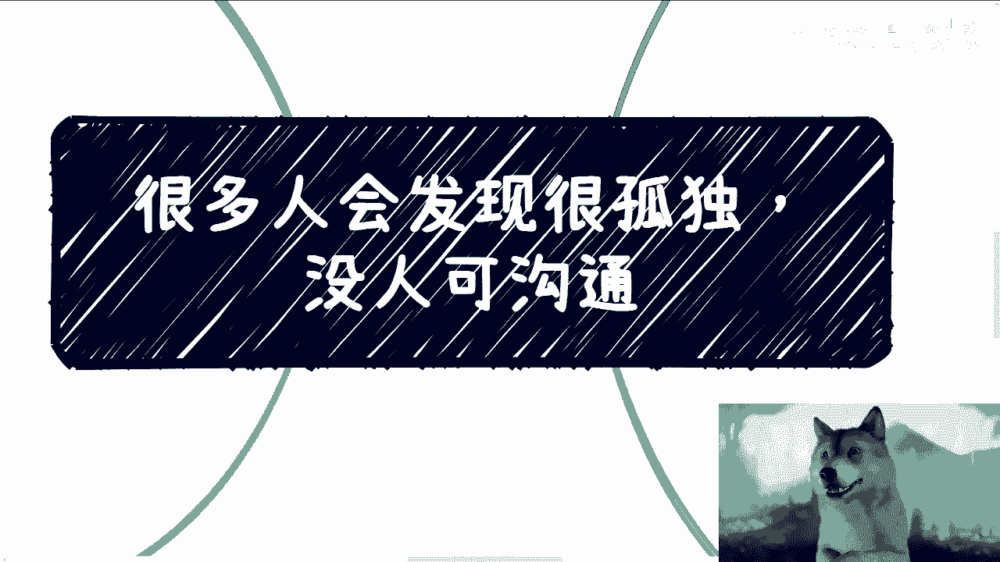

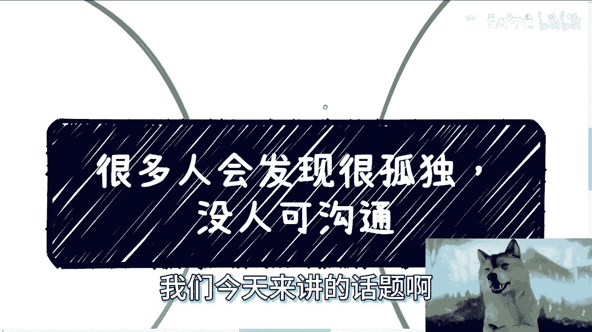

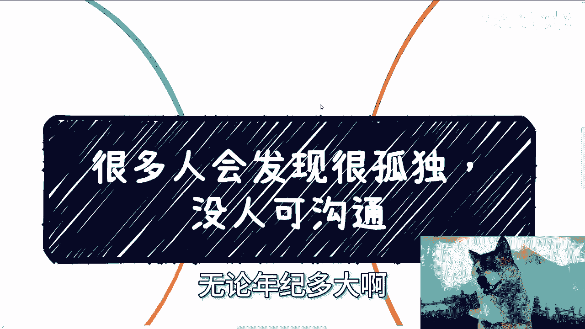

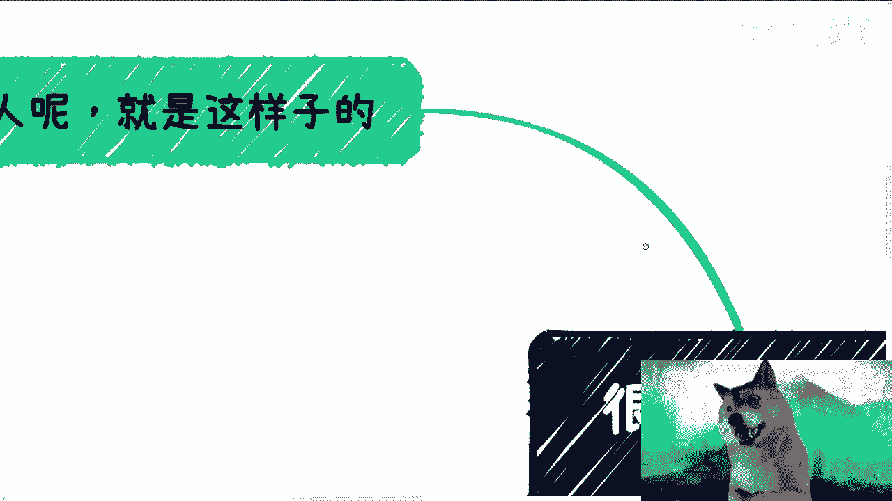

在本节课中，我们将探讨一个普遍存在的社会现象：许多人在当今社会感到孤独，缺乏真正有效的沟通对象。我们将分析其背后的原因，并审视与不同人群沟通时可能遇到的现实障碍。

## 概述：沟通便利时代的孤独悖论

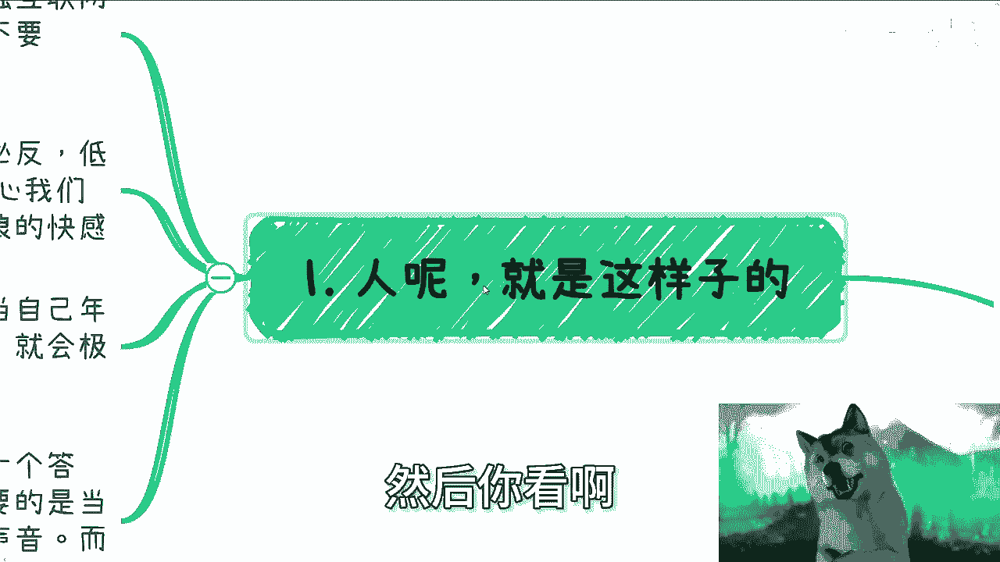

互联网的发展使沟通在形式上变得无比便捷。从早期的短信、电话粥到如今的微信，技术理应让人际连接更容易。

然而，现实情况是，许多人反而感到更加孤独，无人可以真正沟通。这种表面便利与实际隔阂的矛盾，构成了我们讨论的起点。

## 第一节：心理需求与“物极必反”的沟通困境

上一节我们提到了沟通便利与孤独感并存的悖论。本节中，我们来看看人类心理需求如何加剧了这一困境。

人是需要沟通的生物。但心理上容易“物极必反”。当被过度关心时，人可能感到烦躁，转而寻求网络冲浪的快感。

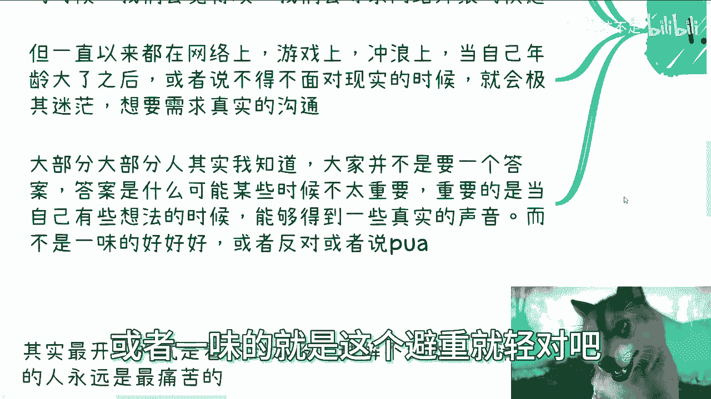

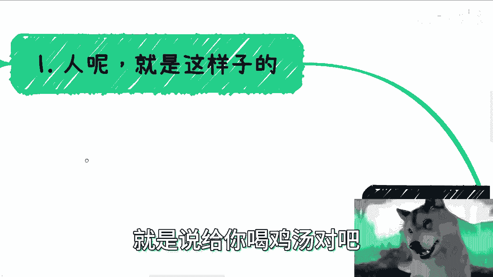

公式可以表示为：
**过度关注 → 心理排斥 → 转向虚拟世界**

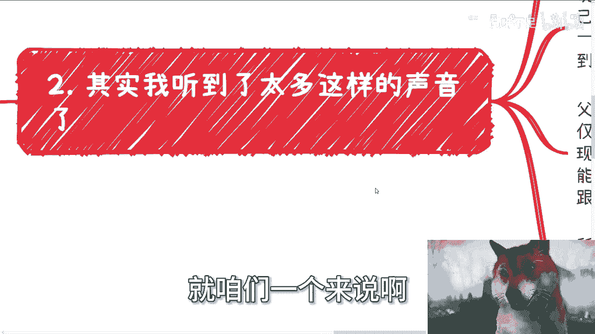

但长期沉浸在网络或游戏中，当必须面对现实时，人又会感到空虚和迷茫。此时，人们渴望的不是简单的答案，因为答案因人而异。人们真正渴望的是：针对自己的想法和声音，能获得**真实的讨论**与**真实的反馈**，而非一味的赞同、反对、说教或心灵鸡汤。

## 第二节：与不同人群沟通的现实障碍

理解了心理需求后，我们来看看在现实中，与不同人群沟通时面临的具体障碍。以下是几个主要的沟通场景分析。

### 1. 与父母沟通
与父母沟通本质上是困难的，更多是“调解”而非“沟通”。试图改变思维固化的人通常是徒劳的。

**核心逻辑**：`改变只能依靠自身实践与经验增长，无法通过他人说教实现。`

父母作为“过来人”，其经验仅适用于他们所处的时代与环境。如今时代已变，但父母难以紧跟时代变化。因此：
*   **对父母而言**：应放手让孩子尝试，而非用“考公、考研”等单一路径框死其选择。
*   **对子女而言**：不必试图说服或争吵。可以听取父母意见，但行为应跟随自己的内心与判断。避免在不知道自己想要什么时，成为父母意志的“傀儡”。

### 2. 与同学朋友沟通
与同龄人的沟通同样受限。话题往往局限于“卷大厂、卷考研、卷考公”，难以进行关于未来与出路的客观讨论。

酒肉朋友易得，但能交心、无私心、客观沟通的朋友少之又少。有经验并能提供指导的人更是罕见。

### 3. 与老师沟通
与老师的沟通可能更令人失望。当学生试图通过学生会等组织接触商业实践时，老师的反应常有两类：
1.  利用学生为自身谋取业绩。
2.  直接否定：“别搞这些，好好读书。”

这导致年轻人难以从教育者处获得对现实世界的有效指导。

## 第三节：时代背景下的无奈与清醒的痛苦

分析了沟通障碍后，我们需要将其置于更广阔的时代背景下理解。本节将探讨外部环境如何加深了个体的孤独与无力感。

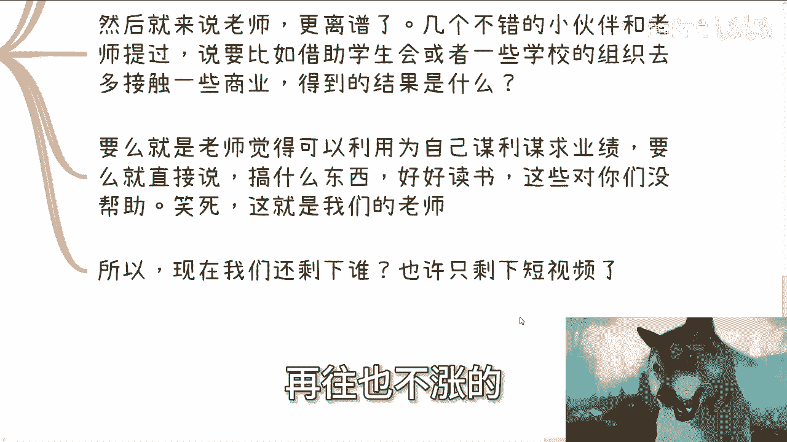

许多年轻人面临“红利消失”的困境：互联网、移动互联网、直播电商、跨境贸易、房地产等领域的红利均已消退。

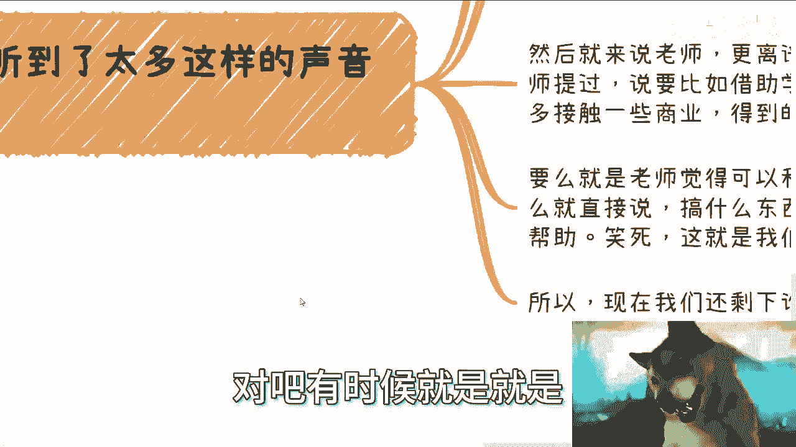

**现状描述**：`工资增长缓慢，物价持续上涨，机会窗口收窄。`

在这种情况下，“没心没肺”地跟随大流盲目内卷，或者选择躺平，反而可能减少痛苦。最痛苦的往往是那些**有想法、不想浪费青春、渴望进步、希望生活有意义**的年轻人。

他们不够强大，却需要在充斥噪音的环境中抗争。这些噪音常来自亲人或敬重的老师。他们渴望客观的讨论甚至辩论，却难以获得。因此，表面可能嘻嘻哈哈，内心却充满空虚与痛苦，处于“出淤泥而不染”但被周遭不断拉扯的挣扎中。

## 总结与核心观点

本节课我们一起探讨了当代人感到孤独与沟通无门的现象及其深层原因。

我们分析了在沟通便利时代反而更孤独的心理悖论，审视了与父母、同学、老师沟通时的现实障碍，并将此问题置于“红利消退”的时代背景中理解。最后，我们指出了“清醒者”在此环境下面临的特定痛苦。

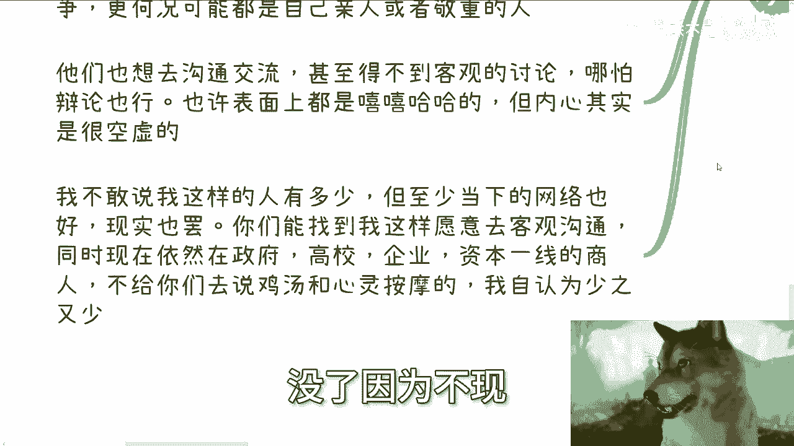

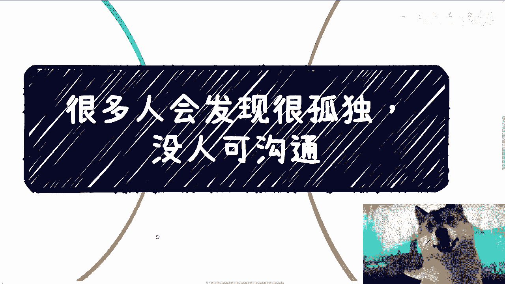

**核心结论**：在当下环境中，能找到一位身处一线（政府、高校、企业）、愿意进行客观沟通、不灌鸡汤的交流者非常困难。真正的改变只能依靠自己。选择与行动的责任，最终落在每个个体肩上。

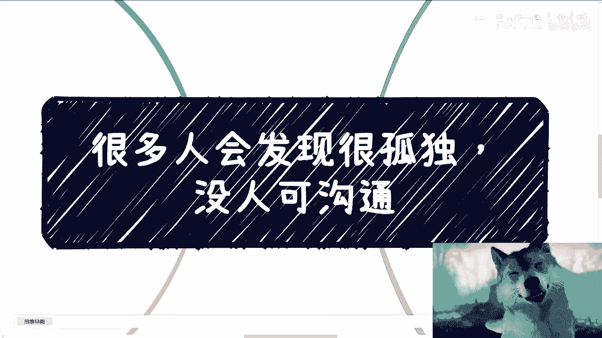

---
**课程来源**：赏味不足 - BV1eV411S7ef