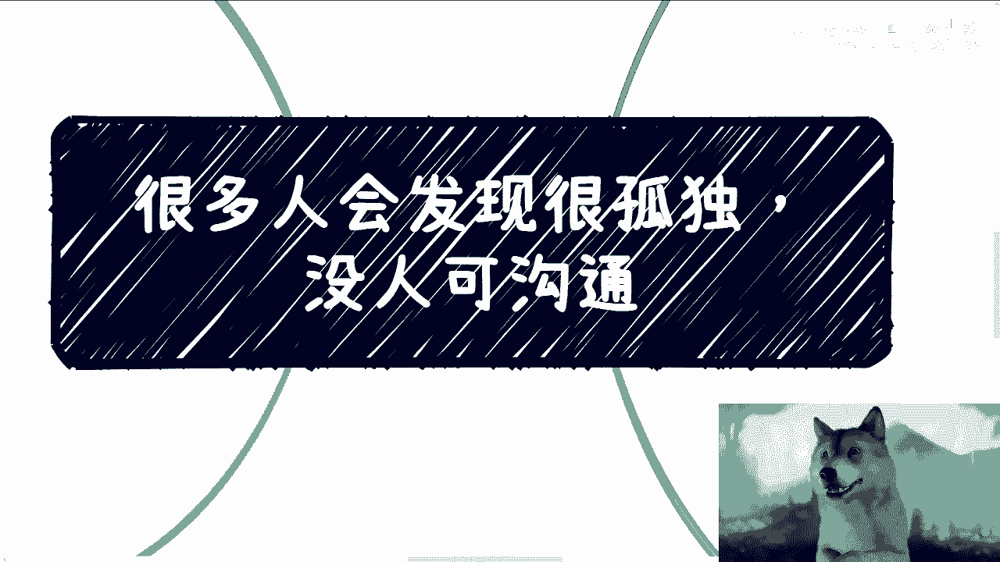
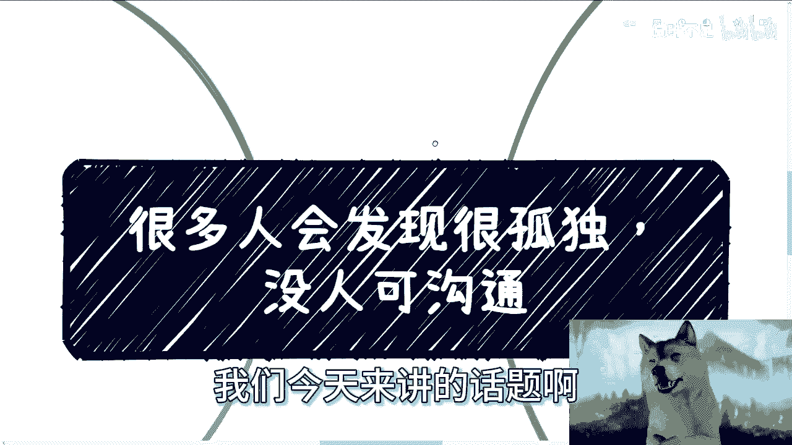
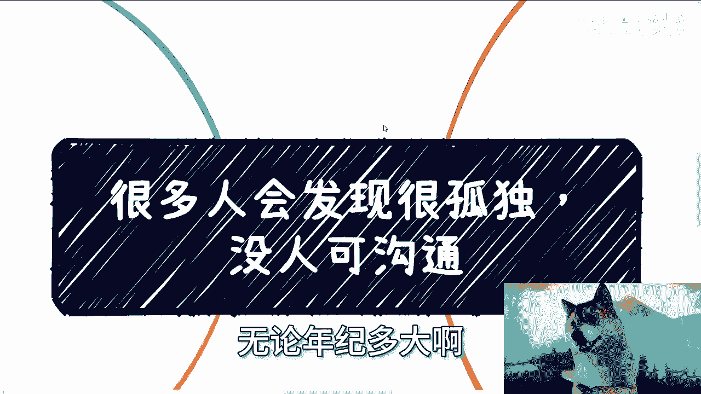
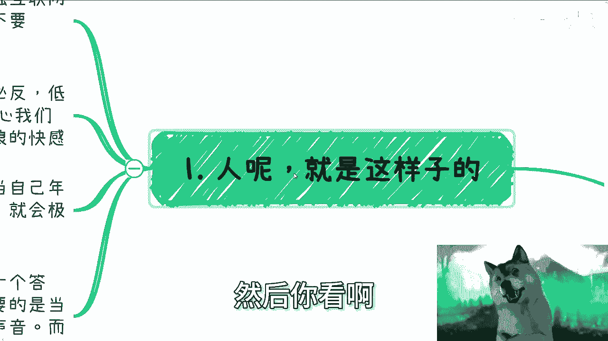
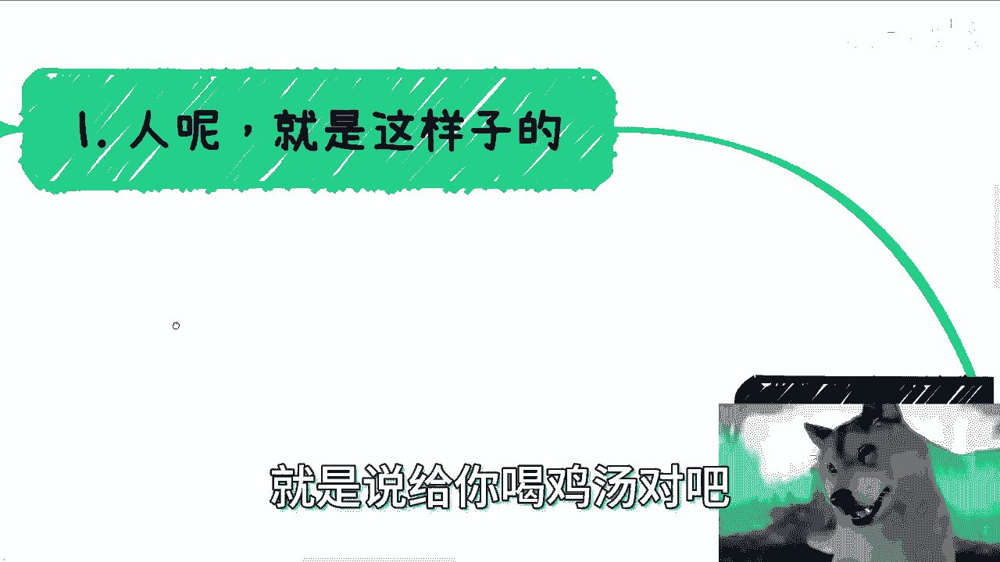
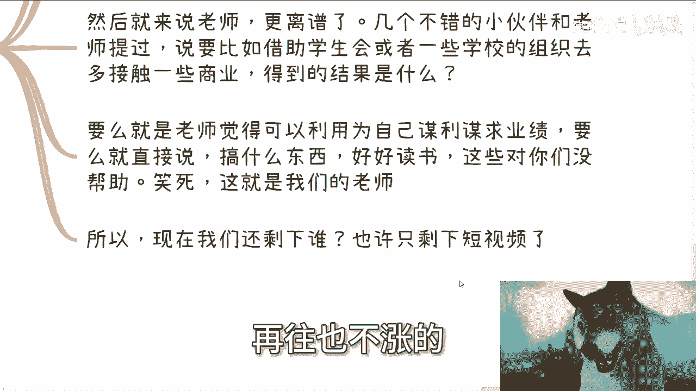
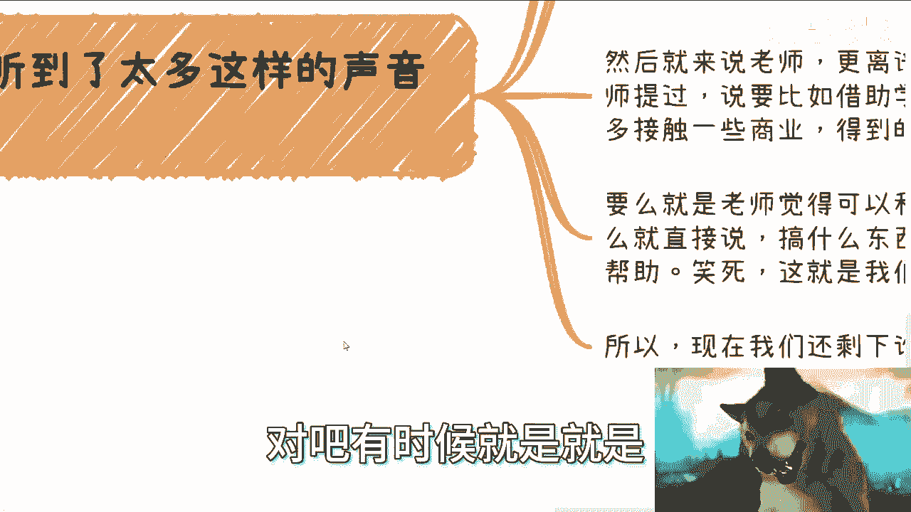
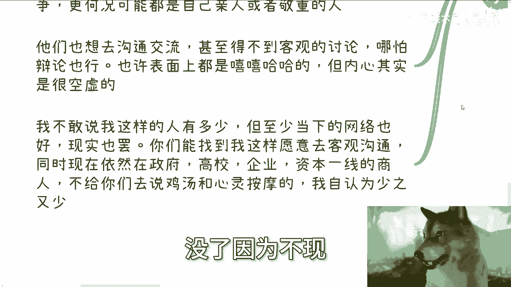
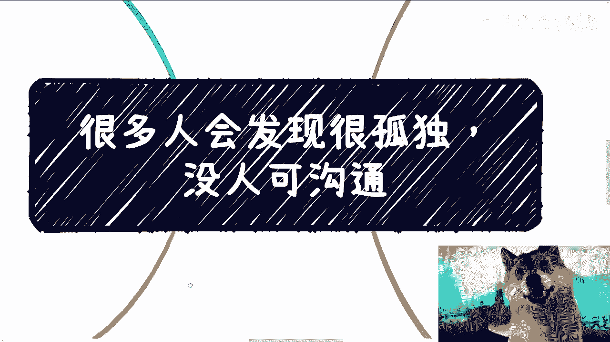

# 很多人会很孤独，没人可沟通 - P1 - 赏味不足 - BV1eV411S7ef

哦大家好，我们今天来讲的话题啊。

是我差不多我觉得到现在为止也蛮长时间吧，总结下来出来的一个点吧，就是我觉得现在大部分人吧无论年纪多大啊。

这个很多人呢其实会发现很孤独啊，没人可沟通。

那按照理来讲呢，很多人觉得吧就这个话怎么说呢，就是就我觉得这是这个事情吧，很多人心里都明白他能，但他不愿意去承认对吧，甚至就是说很多人觉得，现在互联网发展到现在这个样子。

其实大家沟通呢应该是相比以前更怎么说呢，更方便对吧，因为以前都是最早的时候，我记得我们当时什么发短信呃，煲电话粥对吧，然后哪里有微信啊，不存在微信的啊，然后你看啊。

我觉得人呢就是这样子的，就是说现在的这个年轻人啊，这个成长过程当中啊，要比我们当时呢要接触互联网多得多啊，呃我觉得虽然我也没比大家大多少啊啊啊，但的确呢这个成长环境还是不一样的啊，那么人的这个生物呢。

我觉得就是这种生物啊，它本身就是需要沟通的，而且呢在心理上呢就容易物极必反，有高情商呢叫物极必反，那低情商就是贱啊，有些人就是说你看啊，就很多人关心我们对吧，一直关心我们啊，我们可能就会觉得烦啊对啊。

对你们发现了对，我现在是狗啊，我现在是狗啊，就我们呢就会去寻求这个网络冲浪的快感对吧，但是一直呢你在网络上的游戏上呢，冲浪上呢就当你可能时间一长啊，或者说年龄大了之后啊。

或者说不得不去面对这种现实的时候呢，你就又会发现啊，我这个横空虚对吧，我就说哎这个放大我放大一点对吧，就是嗯就是我要不得不面对现实的时候，就会极其迷茫对吧，就像现在非常多人面对这个问题啊。

想要这个寻求我打错了，想要寻求真实的这个沟通啊，那么大部分大部分的人呢，其实我知道，就是大家呢也不是说就一定要一个答案，因为答案到底是什么，就算有个明确的答案，其实对大家也不是说特别重要。

因为毕竟每个人有每个人的需求，每个人这个以前所面临的问题也都不一样啊，那么重要的是呢，当我觉得重要的是，当大家有一些自己的想法的时候，就是当然大家有些自己的想法，自己不知道这个想法对不对对吧。

也不知道这个想法接下来到底怎么走，也不知道符不符合这个时代对吧，那么他希望就是说得到针对这个自己的想法，或者自己的一些声音啊，能够得到一些真实的讨论，得到一些真实的反馈。

而不是说一味的就是比如说有的人说好好好，或者一味的去反对，一味一味的就是给P给你PA，或者一味的就是这个避重就轻对吧。

就是说给你喝鸡汤，这不是大家想要的。

那从第二第三点呢，我可以跟大家说一下。

咱们一个来说，我们听到过有这么这些声音，比如说父母呢一味的说考公啊，走他们要走的路啊，铁饭碗，然后结婚生孩子，当然呢我就明确跟你们讲，沟通呢其实是沟通不了的，最多就是叫什么叫调解啊。

你沟通是不可能沟通的，这就跟我当时曾经试图去选择，跟那些思维固化的人去沟通，试图去改变他们，结果告诉我都是徒劳的对吧，那说白了因为为什么，因为人性人就是这么个生物，你所谓改变你只能靠自己改变。

你从来没有看到过说我改变，因为靠别人说来改变的不存在的，你一定是通过你的实践，通过你的这个经验的增长，你去改变的啊，无论年龄大小啊，所以说以前有这么个段子，就是你试图跟一个去沟通对吧。

只会把你拉到跟他一个水平线，然后用丰富的经验击败你，没有办法的呀，你无论跟谁沟通，一定都是这样子的啊，就是说父母说的话，其实大部分绝对都是对的，为什么，因为他们是我们以前老话叫什么叫过来人对吧。

但是这个过来人呢他有一个很大的问题是什么，就是这个所谓的正确和所谓的经验，也仅仅只是针对当时那个环境对吧，你当时也是针对当初他们所在的那个时代，但是你现在这个时代，这个环境已经远远不一样了啊。

但是同样的你父母年纪多大了，你指望他们能紧跟时代已经不可能了，我说句不好听的，你别说你们父母了，你就拿我现在身边的我的同龄人来讲，我我说实话到目前为止，我没有见过一个属性跟我一样的。

就是既能够跟政府企业，高校保持一线合作的，又能够在网上能够做这种自媒体，能够跟大家保持联络的有吗，没有一个都没有，我可以说对吧，那就说明什么，说明少之又少啊，啊我的接触面肯定是远远比你们多吧。

但是在我的可视范围内都没有一个，你们想想看对吧，所以说更何况你别说他们了，更何况现在年轻人能有几个人，跟得上时代的对吧，所以我觉得跟父母最好的一个方式呢，就是从父母的角度来讲。

就是我觉得你放手让孩子去尝试，不要上来你就框死就说啊，你要考研，你要考公对吧，的做别的东西我就不支持对吧，还要威胁你，对不对啊，那作为呃孩子来讲呢，我觉得不要去争吵对吧，不要去试图改变啊。

就是不要去试图说服啊，你可以接受他们的声音，但是呢你的行为，你跟着自己的内心跟判断去走对吧，你不要最终就是说啊呃呃呃，就是就是你自己还不知道你自己要做什么，然后你就成为了你父母的这个声音的傀儡对吧。

就是就像我说的，就是很多人做事情，他不是自己想做，他不知道他想做什么，但是他就先跟着别人做，那我告诉你们，你但凡成为你父母生的傀儡，这就是一代一代的悲剧，我跟你讲，这没有办法的，你为什么要把上一。

就是为什么要把，就是就是就是这个悲剧要延续下去呢，对不对，然后第三点是一样的，比如说我们身边的朋呃同学能沟通吗，不能因为你沟通就是我要去卷大厂，我要去卷考研，我要去卷考公，你怎么沟通啊对吧。

我相信这些这些东西，很多人是有这个呃这个感同身受的对吧，有亲身经历的大家，你觉得大家会客观的讨论问题吗，讨论未来讨论出路吗，不可能啊，就我现在面就是问下来的人，没有几个人跟我说，身边有人能讨论的有吗。

根本没有讨论，直接卷问就是卷对吧，然后你闺蜜朋友酒肉朋友那多容易啊，多多啊，但是真正交心的呢，真正能沟通的呢，我们称之为真正没有私心的，能够客观的跟你去沟通的都少之又少啊对吧，你更别说有经验的人了。

然后再来说老师，我跟你讲就更离谱了，几个不错的小伙伴跟老师提到过，说比如说啊借助学生会啊，或者一些学校的组织啊，去多助接触一些商业对吧，我跟你们讲，得到结果是什么，得到结果就是老师要么觉得啊。

能够利用这些学生为自己谋利，谋求所谓的业绩，要么就直接说你们别搞啊，搞什么玩意儿对吧，好好读书吧，这些对你们有帮助，我跟你们讲，笑死了，这就是我们的老师，你们不信你们去试试看，真的你们去试试看啊。

所以啊我觉得其实现在很多的人，你说我们还剩下谁呢对吧，我们还剩下谁呢，可能就真的只剩下短视频了，就只剩下网络了对吧，我再给你们讲个故事吧，就是之前我们碰到过非常多的9595后，零零后啊，就是赚快钱的。

我记得有一天下午我跟我朋友聊啊，我们就在讨论为什么现在这么多年轻人赚快钱，我们就在那边说，说着说着说着结论呢，就是也不能怪他们无奈，没办法，为什么，因为你放眼望去啊，互联网的红利也没有了啊。

移动互联网的红利也没有了啊，直播电商的红利也没有了，跨境贸易的那个红利也没有了，他房地产的红利也没有了，他就约等于什么红利都没赶上，那你让他们怎么办对吧，这就好像就是说哦你什么红利都没赶上。

但是好像工资嘛在往也不涨的。

物价在蹭蹭蹭往上涨的，那你让他能怎么办对吧，有时候就是就是事实就是这个样子啊。

那么所以说呢我们有时候会发现哦，就是那句话说的很没错，叫做所谓没心没肺，最开心啊，其实最开心的就是看不到太多，理解不到太多啊，清醒的人永远是最痛苦的，不要唱出来啊，我知道你们要唱出来的对吧。

那么你哎你索性的跟着大家一起卷无脑卷对吧，到最后你比如说卷的实在没办法了，两腿一蹬啊，你说躺平啊，没心没肺也就算了啊，当然我不是说躺平啊，因为躺平跟没心没心没肺不一样，因为有的人躺平他也痛苦的啊。

那么最怕的是什么呢，最怕的就是说其实你有想法啊，你年纪还很轻，你也不想浪费你的青春，不想浪费你的光阴，你也很想进步，很想让自己活得有意义，然而这样的人就是最痛苦的。

因为他们往往年轻的时候肯定是不够强大的啊，然后在当下这种时代，或者在在在在互联网发达的这种时代里面，他要不停的去跟身边的噪音去抗争，而且更何况这些噪音可能来自于自己的亲人，或者所谓敬重的那些老师对吧。

他们还要去沟通，还要去交流，甚至得不到客观的讨论，哪怕所谓的辩论battle都没有啊，所以说很多时候也许表面上是嘻嘻哈哈的，但是内心是非常的空虚或者非常的痛苦的，就是就是有种什么感觉呢。

有种就是说我很想去出淤泥而不染，但是身边都是淤泥啊，然后还不停的想把我拉下去，我很没有办法，但是我觉得这样是不对的，但是他们并不知道怎么样是对的，因为毕竟年纪还轻对吧，人都要一个成长的过程。

所以说啊我觉得真的，我不敢说我这样的人有多少，但是在当下的这种网络环境也好，经济环境也好，以及啊这个整个国家这个环境也好，现实当中也罢啊，我觉得你们能找到像我这样愿意去客观沟通的，同时。

现在依然还在政府高校企业资本一线的啊，做业务的这种商人啊，同时我也不会就是给你们带有私心的说，给你们去说鸡汤或者心理按摩的，我自认为是少之又少的，所以我会在所有跟我咨询的人，这个咨询的过程当中。

我会我会很有自信跟他们这么说，我说我可以很有自信的说，我说在以我们萍水相逢，没有见过面的情况下，面，就一次这种语音的沟通的情况下面，我相信像我这样跟你们说的，你们这辈子应该只会碰到我这样的一个人没了。

因为不现实。

因为真的就不现实啊。

唉所以嘛怎么说呢，选择都靠自己改变，都靠自己，所以大家也可以想想，好吧行，那就这么着吧，啊嗯有啥，反正你们整理好详细的好吧。

