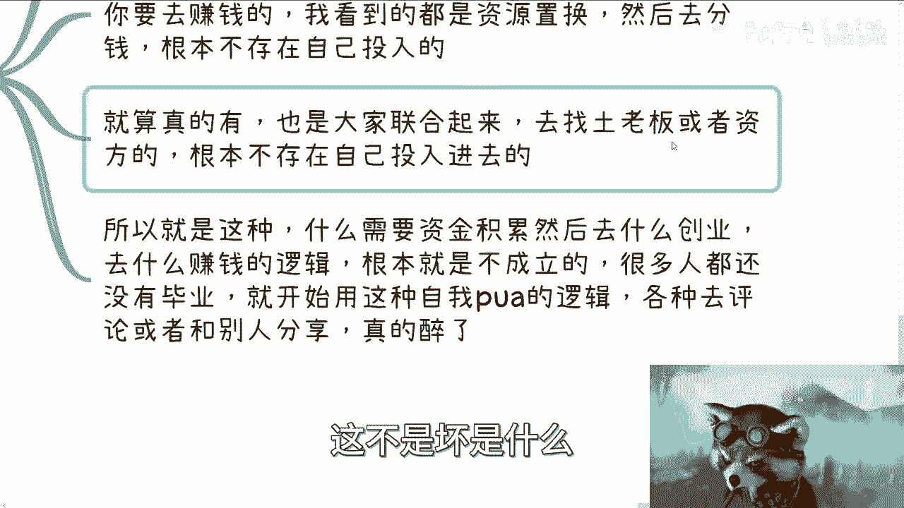

# 课程01：破除“先积累，后赚钱”的迷思 💡

在本节课中，我们将要学习如何识别并破除一个常见的职业发展迷思：“毕业后必须先工作积累若干年，赚到启动资金后才能去创业或赚大钱”。我们将分析这个观点的逻辑漏洞，并探讨赚钱的真实路径。

---

很多人认为，毕业后需要先工作积累几年，赚取足够的资金，然后才能去创业或赚取更多财富。这个观点听起来似乎合理，但我们需要仔细审视其背后的逻辑。

上一节我们介绍了本节课的核心议题，本节中我们来看看这个观点的第一个问题。

## 一、 观点溯源：被植入的思维枷锁

这个“先积累，后赚钱”的观点，本质上是**一种被外界植入的、未经事实检验的思维枷锁**。很多人并未亲眼见过他人通过这种方式成功，却自然而然地接受了它。

以下是这个观点不成立的两个核心原因：

1.  **缺乏事实依据**：大部分人并未亲眼见证“投入资金A，必然产出财富B”的成功案例。他们所设想的模式，往往更接近于高风险的投资或赌博（例如：`投入1，产出10`），而非稳健的商业行为。
2.  **资格门槛被忽视**：确实存在需要大量资金投入的赚钱项目（如尖端科技、大型活动承办）。但关键在于，普通人积累的少量资金（如几十万）根本达不到这类项目的入场门槛，也缺乏相应的资源和判断力去参与。

如果赚钱仅仅依赖于资金，而与个人的能力、资源和判断无关，那么理论上人人都能轻松致富，这显然与现实不符。

## 二、 逻辑辨析：赚钱与资金的真实关系

承接上文，既然这个观点站不住脚，那么赚钱与资金到底是什么关系？我们需要理清思路。

以下是关于资金与赚钱的三个关键辨析：

*   **积累的资金量杯水车薪**：对于普通人，工作几年积累的资金，通常只够支付生活开销或应对短期需求。指望用这点钱作为“创业资本”去搏取巨大回报，是不现实的。
*   **真正的赚钱往往不依赖自有资金**：在大多数可操作的商业场景中（无论是面向企业、政府还是个人消费者），成熟的模式往往是**资源置换、能力合作或利润分成**，而非自己先掏钱“赌”一个未来。启动资金常通过寻找合作伙伴或外部投资来解决。
*   **需要大量自有资金投入的领域凤毛麟角**：即便存在这样的领域（如某些特定投资、产品研发），也伴随着极高的专业壁垒和风险。盲目将辛苦积累的资金投入一个自己并不了解的“商业模式”，更像是一种试错或赌博，而非理性的赚钱计划。

因此，“必须有资金才能赚钱”这个因果关系并不普遍成立。将赚钱受阻归咎于“资金不足”，常常只是一个逃避主动探索的借口。

## 三、 行动指南：如何绕过“资金”陷阱

明白了问题所在，我们该如何行动？核心在于转变思维：从“等待积累”转向“主动探索”。

以下是你可以立即开始的行动方向：

1.  **聚焦“如何赚钱”，而非“有多少钱”**：你的首要任务是研究这个世界上的各种盈利模式，理解价值是如何被创造和交换的。
2.  **从赚“小钱”开始验证**：赚大钱很难，但赚小钱的机会无处不在。你可以通过**自媒体、知识付费、技能服务、信息差**等多种方式启动。关键是通过实践验证你的想法和执行力。
3.  **利用资源而非仅仅金钱**：你的时间、技能、知识、人脉都是可以变现的资源。思考如何用这些现有资源去交换价值，而不是等待一笔虚幻的“启动资金”。
4.  **用事实代替幻想**：任何商业想法都必须有闭环的商业模式和验证过程。不要停留在“如果有钱我就做XXX”的幻想中，而是去调研、去尝试、获取真实的市场反馈。

抱着“先积累资金”想法的人，其资金很可能在未来不明智的投资中被消耗掉，而非增值。

## 四、 警惕思维病毒与保持清醒

最后，我们需要警惕这种思维像病毒一样传播，并学会保持独立判断。

许多人并非故意使坏，但在未经验证的情况下传播这类观点，会无形中**PUA**自己和他人，让人在错误的道路上越走越远。尊重每个人的职业选择，但决策应建立在亲身调研和实践的基础上，而非未经审视的流行观点。

对于不认同的观点，最好的方式是忽略它，并将精力专注于可执行、可验证的行动上。

---

本节课中我们一起学习了“先积累，后赚钱”这一迷思的荒谬性。我们分析了其逻辑漏洞，明确了赚钱与资金并无必然的先后因果关系，并指出了**真正的障碍往往是缺乏探索的主动性、清晰的商业模式和利用现有资源的能力**。请记住，**赚钱的核心是发现价值并促成交换，这通常始于行动，而非积蓄**。