# 很多人好奇-身边那些有-一丢丢财富的人都在干嘛---P1---赏味不足---BV1mU411U7oB

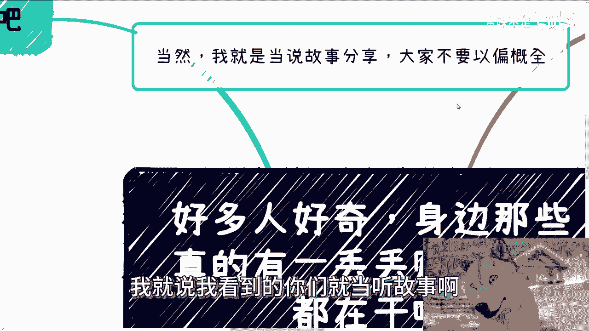

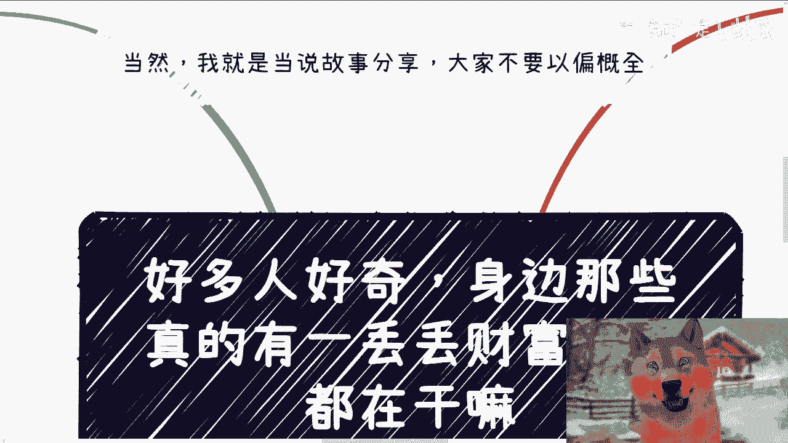

在本节课中，我们将探讨一个许多人好奇的话题：身边那些拥有一定财富（即“一丢丢财富”）的人，他们的日常生活和状态是怎样的。我们将基于观察，以故事的形式分享，并提炼出一些核心特点。请注意，这些内容仅为个人见闻，不代表普遍情况。

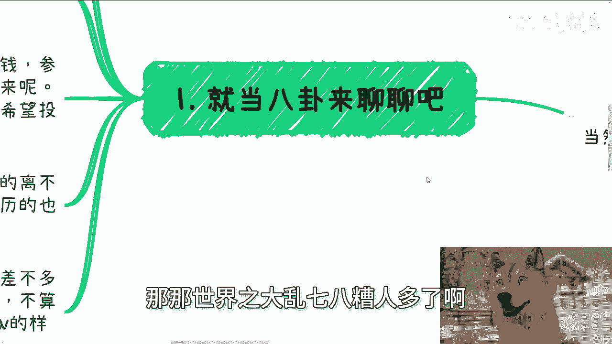

## 一、 定义“一丢丢财富”与观察范围 📊

在开始之前，我们需要明确本课程中“一丢丢财富”的具体含义，并界定讨论的范围。

首先，本课程不讨论传统的“土老板”或先天富有的“二代”。因为观察发现，他们对新鲜事物（如人工智能、低空经济）的兴趣，更多源于寻求新鲜感以对抗无聊，而非真正的追求。因此，对于现在的我而言，与他们合作的最佳模式是“只投资，不参与”，这与许多创业团队希望获得资金但不希望投资人过度干预的逻辑一致。

其次，我们关注的是通过后天努力积累财富的群体。他们可能是普通人，凭借天时、地利、人和，或家庭教导，或野蛮生长（甚至不乏30岁左右的初中学历者）而获得成功。

那么，“一丢丢财富”具体指什么？这里的标准是：**剔除不动产、股票等固定资产和投资性收入后，个人每月可自由支配的现金流**。这笔钱需要能覆盖高品质的日常消费且绰绰有余。

折算下来，这个标准大约在 **每月20万到30万人民币**。请注意，这不是指月薪，而是将各种收入折算后的月均可支配现金流。达到这个水平，可以看作是财富积累的“第一步”。

## 二、 核心特点：自由与多元的生活状态 🕊️

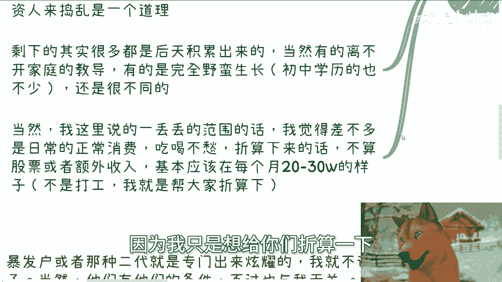

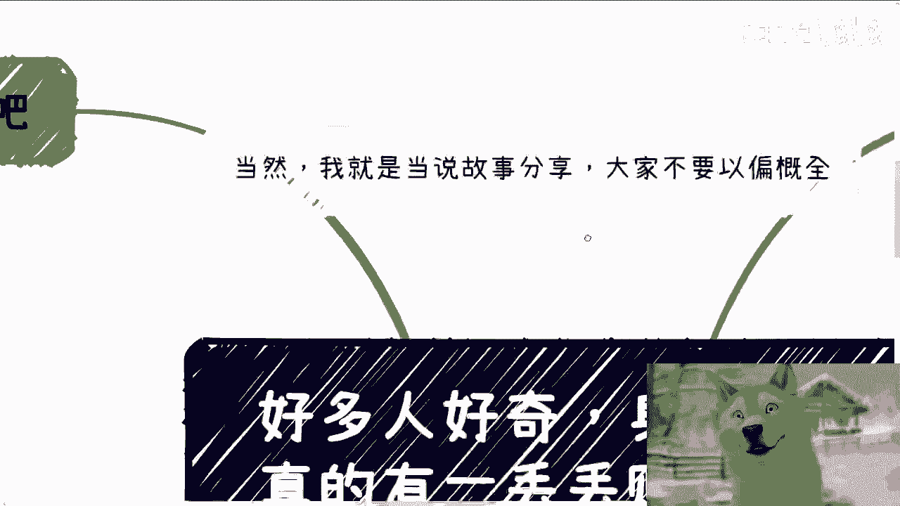

上一节我们定义了讨论的对象和财富门槛，本节中我们来看看这些人最显著的生活特点。

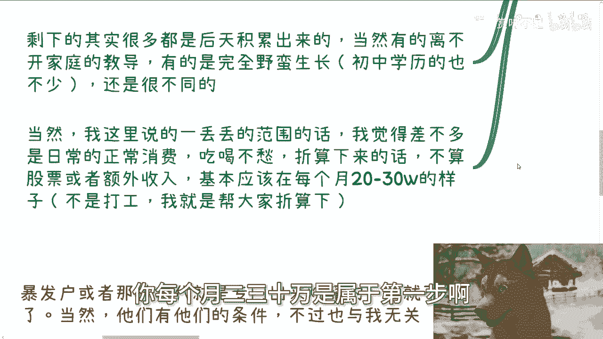

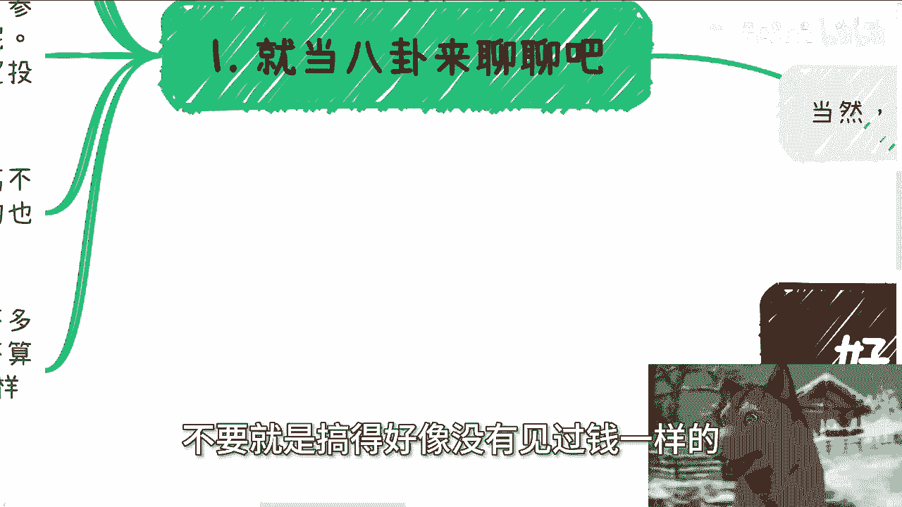

最大的共同点是**自由**。他们不受固定工作的束缚，可以自主安排时间，除了处理核心业务，几乎“想做什么就做什么”。

以下是几种典型的生活状态举例：

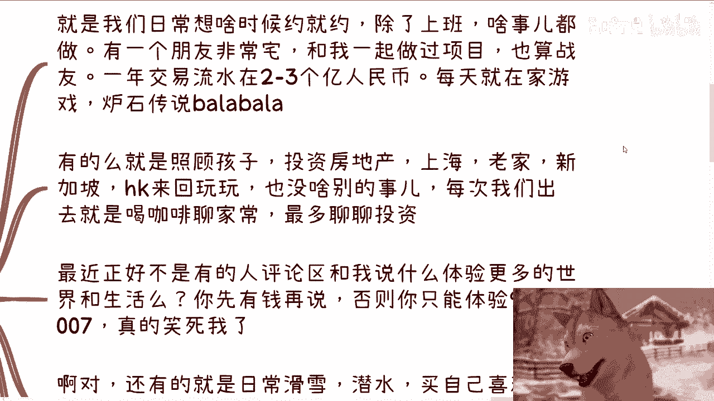

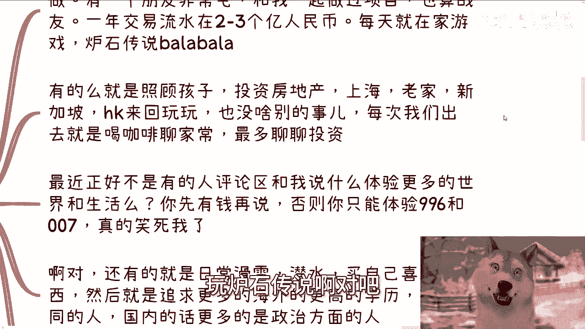

*   **极度宅家型**：例如一位朋友，从事一二级市场交易，年流水数亿。他日常生活就是在家玩游戏（如《炉石传说》、《魔兽世界》），非常低调。
*   **家庭与投资兼顾型**：有些人将重心放在照顾家庭和全球房地产投资上（如上海、新加坡、香港），生活节奏舒缓，社交以喝咖啡、聊家常和投资为主。
*   **体验探索型**：另一部分人则热衷于体验世界，如滑雪、潜水、购买心仪之物，或攻读海外更高学历以接触不同圈子。

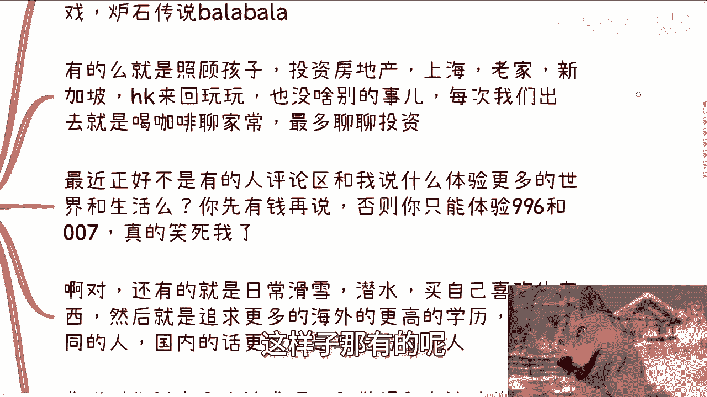

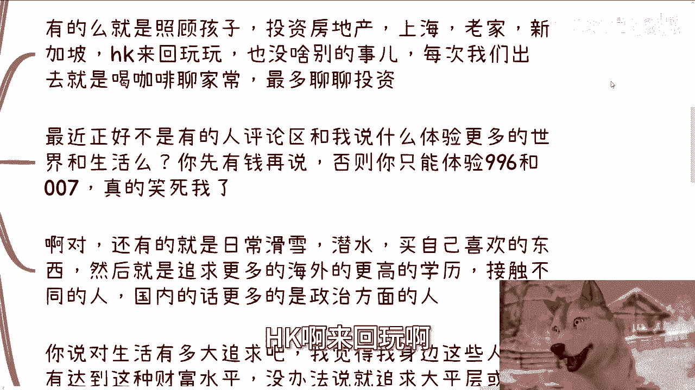

需要理解的是，财富达到这个层级后，收入的跃升不再单纯依靠努力，更多取决于机遇、风口和资源整合。因此，他们并非“不思进取”，而是明白在等待和识别下一个大机会的同时，享受当前阶段的生活品质。

他们对生活的追求，目前更多体现在日常基础消费的品质上，例如日常餐饮的人均消费在500-1000元，并在社交送礼上保持得体。

## 三、 消费观：为值得的人和事花钱 🎁

上一节描述了他们的生活状态，本节我们聚焦于他们的消费观念。

花钱本身是快乐的，但快乐的根源在于**为值得的人花钱**。这包括家人、父母和真正的朋友，其核心是分享成就与喜悦，为他人创造良好体验，而非炫耀。

例如，我们曾为了项目庆祝，一次性点300杯星巴克摆出Logo，或订购50只龙虾营造气氛。这种因共同目标、自由创作而产生的花费，与公司年会的铺张感受截然不同。再比如，在外滩游轮上举办私人沙龙，或朋友包下一栋楼举办私人派对，这些经历都更注重私密圈层的共享体验。

相比之下，单纯为炫耀而消费（常见于部分“暴发户”或“二代”），则不在我们讨论的这些朋友的价值观范围内。

## 四、 社交与事业模式：松弛有度，伺机而动 🤝

了解了他们的消费观后，我们再来看看他们如何维系社交和发展事业。

这些朋友通常深耕于不同领域，拥有稳定的基本盘和合作伙伴，每年获得可观收入。他们不会“疲于社交”，社交活动大多基于原有可靠的朋友或合作方引荐。例如，最近就有朋友引荐了明年计划布局二级市场的投资者，这种基于信任的引荐才是有效社交。

他们的模式是：**在不同领域维持现状，过自己想要的生活，在适当的时机通过社交寻找新机会**。与其焦虑地拼命寻找项目，不如在提升主业或享受生活的同时，保持开放，等待机缘。在赚钱这件事上，大家有基本共识，但个人追求可能不同，有的追求更高学历，有的追求更广圈子。

## 五、 关于理财与守财的认知 💡

最后，我们回应一个常见疑问：这个财富水平的人是否需要专注于理财或守财？

以我的认知来看，**他们尚未到达需要专门考虑“理财”或“守财”的层级**。他们的金融行为（如参与一二级市场投资），首要目的是“通过投资赚更多钱”，追求短平快的回报，这属于**进攻性的赚钱策略**。

而“理财”通常指资产的均衡配置、分散风险和对冲，属于**防御性的财富管理策略**。“守财”则涉及更庞大的资产规模。在每月现金流二三十万的阶段，优先考虑的应是继续扩大财富基数，而非过度焦虑资产配置。这就像每天吃白菜的人，不必过早操心满汉全席的吃法。

---

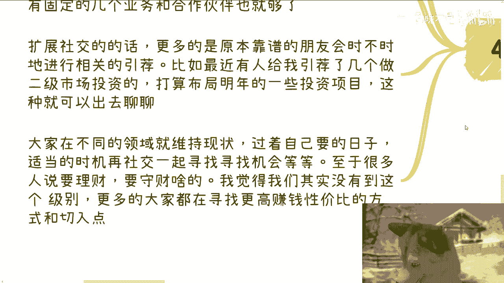

**本节课总结**：

本节课中，我们一起探讨了身边那些拥有“一丢丢财富”（月可支配现金流20-30万）人群的生态。
1.  我们明确了讨论对象是**后天奋斗者**，并定义了财富门槛。
2.  我们分析了他们最核心的状态是**自由**，并展现了宅家、顾家、体验派等多元生活方式。
3.  我们探讨了其消费观：快乐源于**为值得的人花钱**，重在分享而非炫耀。
4.  我们揭示了他们**松弛有度**的社交与事业模式：维护基本盘，靠信任引荐，伺机而动。
5.  我们纠正了一个认知：在此阶段，金融行为更偏向**进攻性投资**以赚更多钱，而非防御性的理财或守财。

希望这些观察能为你提供不一样的视角。请记住，这仅是个人见闻的故事集，世界很大，案例众多，仅供参考。