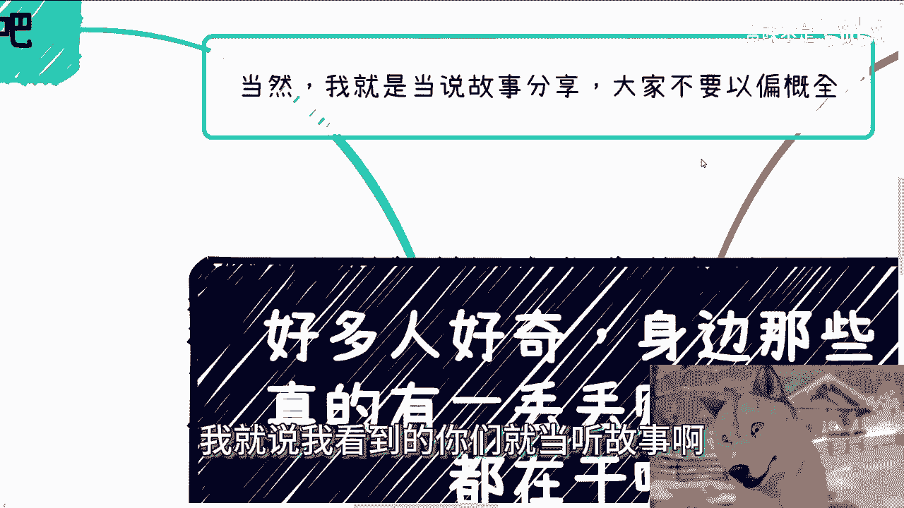
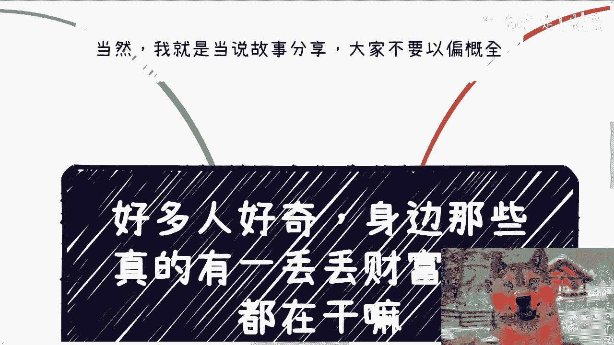
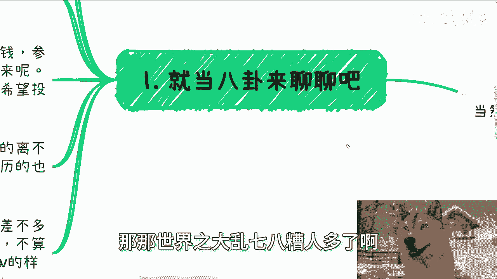
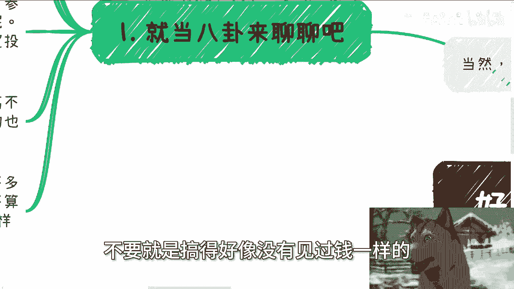
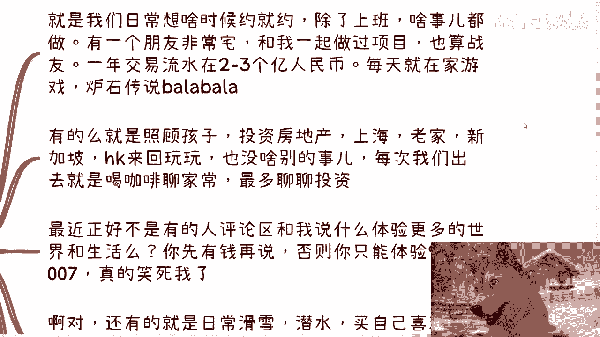

# 很多人好奇，身边那些有 一丢丢财富的人都在干嘛 - P1 - 赏味不足 - BV1mU411U7oB

好大家好啊，这个之前其实很多人跟我提过这个点啊，就问我说啊，跟他们讲讲对吧，身边这个赚到钱的哈，一些人他们在干嘛啊，或者他们生活怎么样，嗯我就这么说啊，就是当然啊，我就是说我看到的你们就当听故事啊。

也不要以偏概全，而且我本来去认识人啊。

接触这些人，肯定也有我的一些判断标准或者筛选啊，也不是，但是也也不能说所有的人都这样子对吧，那那世界之大，那乱七八糟的人多了啊。

呃首先第一点呢就当八卦来聊啊，我认识的一些土老板啊，或者说传统的二代啊，呃这些呢我我我就不放在聊的范围里面，因为其实我觉得比较无趣，因为你对他们认识的越久啊，你会发现他们呢其实对任何的新鲜事物。

都是有兴致去了解的，比如说什么人工智能啊，比如说什么什么什么最近的这个无人机啊对吧，低空经济啊，数字经济啊，他们都很很想了解，而而且呢你可能不了解的情况下面啊，就是你不太熟悉的情况下面呢。

你可能会觉得他们是有追求的，但是去不久之后，你就会明白他们的本质其实都是一样的，就是因为无聊啊，他们就是想要寻求一些新鲜感，所以一般来讲呢对现在的我而言啊，就记住啊，现在的我而言，我以前不是这么看的啊。

就对现在的我而言呢，他们最好的就是投钱就参与呢就不需要了啊，但是我可能话不是不会讲的这么直白啊，但是我我会尽力的极力的跟他们说，就说啊你们就投钱就好了啊，剩下交给我来做啊。

那毕竟呢这个谁希望一个搅屎棍参与进来对吧，那没必要啊，这就跟很多创业的团队本质希望拿到钱，但是又不希望投资人进来进来捣乱，是一个道理啊，那么剩下的呢其实很多都是后天积累出来的啊。

他不是一个先天的这个财富，就比如说你说二二代啊，或者说是什么啊，什么什么中了张彩票啊对吧，那那那其实很多都是后天努力寄来的，这就好像我一直跟你们说，就是不要老是普通人，普通人的就很多人也是普通人啊对吧。

他也也就是天时地利人和，可能正好赚到点钱对吧，那当然了，有的离不开家庭的教导，有的呢就完全野蛮生长，我身边这种人都有，而且野蛮生长呢就是初中学历的也不少，而且你们不要觉得是那种老年人啊。

就是可能大概也就30岁左右的这种，初中毕业的啊，而且很还是很是很不同的，很不同的，当然啊我这里说一丢丢，说这个这个标题上面不是说一丢丢财富吗，对吧，我说一下这个一丢丢的范围啊。

我觉得差不多就是说去掉不动产啊，去掉那些固定的资产，这种都都不去，就不动产这种不去算它啊，那么日常的可用的现金啊，可用的现金，正常的消费呃，吃喝是不愁的，正常消费他是不愁的，折算下来啊。

我觉得不不算不动产，不算股票，不算，就是说分红等额外的收入，他基本的这种呃，类似于像我们说就基本工资啊，或者基本的每个月收入，应该在20万到30万啊，这个左右我觉得就是属一丢丢啊财富啊，那不是说打工啊。

不不很多人不要去误解啊，因为我只是想给你们折算一下。

按月来折算，不是说他月薪啊，对吧啊。

所以说从这个点呢，我觉得你们也能明白，就是至少从我的理解来讲，你每个月二三十万是属于第一步啊。

是属于第一步，不要就是搞得好像没有见过钱一样的。

好吧啊，然后这是第一点，第二点呢最大的特点我觉得就是自由，你比如说我们日常对吧，大家无论在哪，甚至说无论是不是在中国就无所谓了对吧，想约就约对吧，除了上班啥事都能做，对不对，那有个朋友我举例子啊。

有个朋友非常宅对吧，他也是大概1920年左右吧，跟我一起做过项目，也算占有对吧，然后呢，他是做一级市场和二级市场的一年交易流水，当然啊流水啊不是利润啊，利润这是不可能啊，流水呢在两到三个亿人民币啊。

然后呢每天就在家游戏玩炉石传说啊对吧。

什么什么魔兽世界啊对吧等等等等对吧，这样子，那有的呢就是照顾孩子啊。

投资房地产对吧，上海啊，老家啊，新加坡啊，HK啊。

来回玩啊，也没啥别的事，每次我们出去聊呢，反正就是喝喝咖啡，聊聊家常对吧，最多聊聊投资，聊聊八卦也没啥啊，基本上我跟他好像也就一年见个一两面吧，哎其实也没啥好见的对吧。

那最近呢正好不是有人在评论区跟我说，什么体验更多的世界跟生活嘛对吧，我我就觉得很好笑对吧，还是那句话，你有钱再说，否则你能体验的就是贫穷的世界跟生活，以及996跟007有什么好体验的呢，对不对。

我他妈也是把我笑笑死，笑惨了，还有就是说日常的一些呃，有些人呢是日常滑雪潜水对吧，买自己喜欢的东西啊，然后就是追求更多的一些，海外的一些更高的学历啊，接触不同的人，就是嗯就是我也没有干。

就是就你们要这么想，我们以前一直有句话叫什么叫做啊，小钱靠努力，大钱靠风吹对吧，你说你是是因为这些人不思进取吗，不是你说是因为这些人满足于现状吗，也不是是因为很多东西它得看天时地利人和，看机缘，看机会。

他不是说你努力就怎么样的，我不相信说啊，我们比如说有身边这些人，已经一个月二三十万了，你说他努力努力好，能变成四五十万，五六十万，我不信的啊，真不行，我跟你们讲真不行啊，那么你说对生活有多大追求吧。

我觉得我身边有这些人呢，还没达到这种财富水平，就没有办法办法去说啊，就追求直接追求大平层对吧，或者更高的一些呃level的一些东西对吧，我觉得更多的就是说基础啊，满足日常的一些吃饭啊。

有有一些品质上的要求，比如说基本上他们他们现在就是说午餐晚餐啊，不不是宴请啊，就不是算那种请客，就是自己正常吃，基本上一顿人均在500~1000对吧，就基础basically的，然后就是日常送礼啊对吧。

大家社交啊就也就比较自律，我觉得就就很好啊对吧，那第三啊还有很多很好玩的事，比如说我们以前一次性点300杯星巴克对吧，摆出一个项目的logo啊，然后我们订50只小龙虾对吧，那那那种像场面就很帅气啊。

然后好，但是在这里面我顺便提一点啊，就是我们去做这种东西，因为我们都是自由的，所以我们做这种东西你会觉得特别开心，倒不是说我们今天给公司去做个年会对吧，你说也有啊，那种公司什么包包游艇啊对吧，怎么样子。

但是但这种心境不一样，你明白吗，哦你包括以前晚上开会对吧，我们大家这个组一个小小沙龙对吧，在上海外滩游轮啊，然后海那当然海外游艇那种，咱就不去说它了对吧，游轮游轮呢还是很开心的，也很舒服对吧。

你包括比比如说以前有些几个朋友，在某个阶段啊那个暴富，而且不是先天的后天的那种对吧，他直接就是包了一栋楼啊啊六层楼，然后每天晚上就是小酒吧对吧，迪厅啊蹦蹦迪呀啊，而且据说还来了很多明星啊。

只不过就说我在的时候，反正我没看到啊，据据说啊对吧啊，那么花钱这个事呢，其实我觉得是很开心的啊，当然很多人也说了，妈花钱谁不开心对吧，但是呢我觉得我我要阐述的这个点啊，不在这个地方。

我觉得呃主要这个开心是在于说你得花给你，你认为值得的人，比如说你你你这个家属啊，你父母啊对吧，包括你很好很好的朋友啊对吧，你只要值你认为值得的人，其实都是开心的，因为这种更多的是分享你的成就。

分享你的喜悦，同时带给别人一些好的体验对吧，而不是说我们要去炫耀，你你单你你你很多二代或者很多怎么样的，你单纯为了炫耀，其实反正我对我来讲，我我是不感冒的啊，我我我也不去谈什么看得起看不起。

因为对别人而言，我看得起看不起呗，就这也没吊用，对吧啊，那么第四啊，我形容一下那种他们那种感觉啊，就暴发户或者那种二代呢，其实专门出来炫耀，我就不说了啊，当然他们有他们的条件啊。

我我这个哼我我对他们来讲我是loser，对吧啊，那么身边的这些人呢各有不同的领域，有着自己的积累跟业务，其实就如我那天说的，他们不会疲于社交，更多的就是说身边有几个固定的业务，然后固定的合作伙伴。

每一年赚点钱也就够了，那么拓展社交时候呢，更多的是靠原本那些靠谱的合作方或者朋友，时不时的进行相关的推荐，比如说最近就有人给我引荐了几个，明年做二级市场的一些投资的对吧。

打算布局明年的一些这个投资项目的，那么这种就可以出去聊聊对吧，就是说很多东西你是看看看圆的啊，看机遇的，你说我每天在那边卧槽，他妈的啊，很努力对吧，很很在那边拼了命的想要找项目，想找怎么样子。

那也不代表我找得到啊，那你还不如空下来打打游戏呢对吧，那大家在不同的领域呢，就是维持现状，过着自己想要的日子，适当的时机呢在一起社交寻找寻找机会，这个其实就是我觉得至少至少我身边这些人。

他们的这种生活状态，只不过就是说就像我刚说的，有的人可能追求的是学历，追求的是呃更高的一些圈子对吧，追求是正直追求什么，但是呢他们在这个赚钱上面，其实大家的这个怎么说呢，共识还是比较一致的。

那至于你说很多人又又要输了，他说那那陈老师就是嗯按照你这个说法对吧，你说这种越越月入啊，可能二三十万的这种人，要不要理财或者守财什么的，我说实话你按我的认知啊。

我觉得这些人他也没有到理财跟守财这个level，你知道吗，就是说更多的是什么，就是我觉得你们应该把它理解为，如果他们有一些金融行为，更多的还是要通过这种金融行为去赚更多的钱，而不是说到到理财这个级别啊。

守财就更别说了，你们能明白吗，哦也就是说他去做一级市场，二级市场投资，可能为的就是说短平快的赚更多的钱，他不是说理财，因为理财本身是另外一个赛道的话题嘛，对吧，你你怎么你怎么配置对吧，你怎么分散的配置。

你怎么更好的去对冲对吧。

那守财那不得了啦，你你得有多大的财产，你守财啊对吧，所以我一直是觉得其实很多人啊，就是他跟我聊的时候，也会跟我提到艾陈老师，我现在要不要学点理财啊，怎么样的，就是就是我真的客观的说，我不是看不起你们。

说这句话，我实在是觉得大家对财富或者钱这个东西，认知有点格局过于小，你明白吗，就是明明我们还没有达到达这个级别，我们操啥什么心呢对吧，你说哼我们明明明每天吃着白菜，那这何必呢，对不对好吧。

反正就是大家就当就当听个故事嘛，就当听个八卦吧，嗯嗯行好吧，就这么着啊，然后这个呃职业上啊，包括自己在副业或者跟别人合作啊，商业上啊，那么合同啊分红啊，丰润啊对吧，这个商业计划书啊，白皮书啊对吧。

股权啊，股份啊啊呃分红啊这些啊，包括就是说你们希望通过我的一些事业，能够给你们一些更呃直观的建议，或者说避免你们走弯路的一些规划的话，那么你们整理好对应的问题和个人背景好吧。

