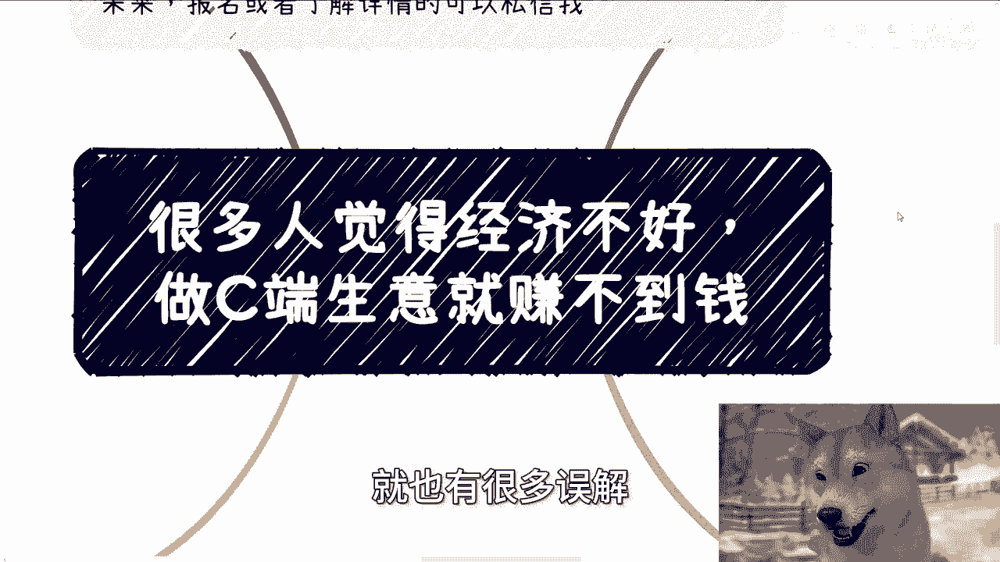
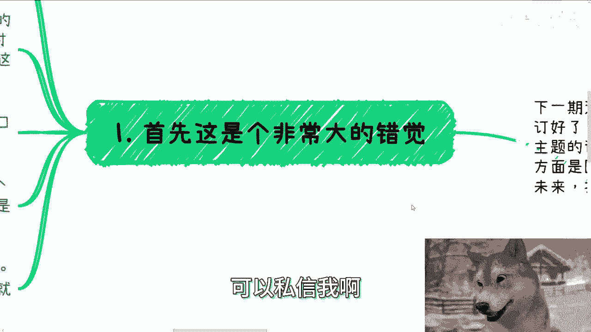
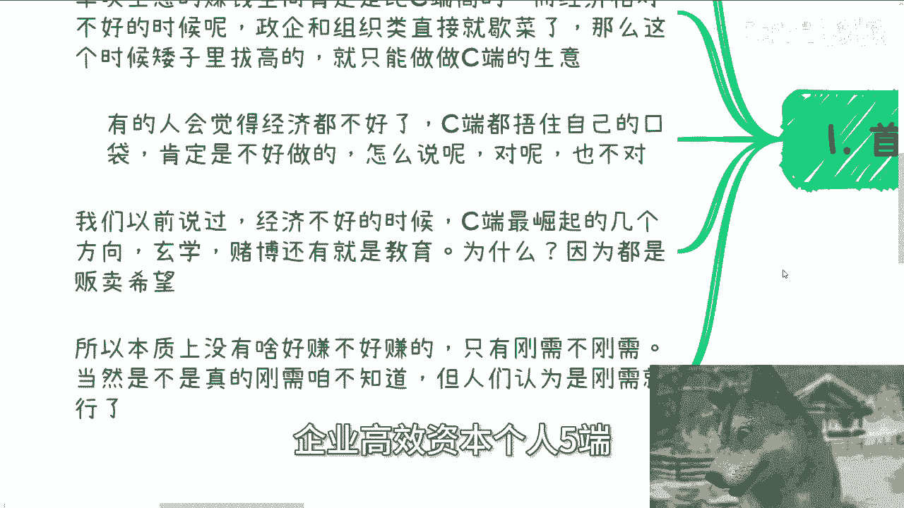
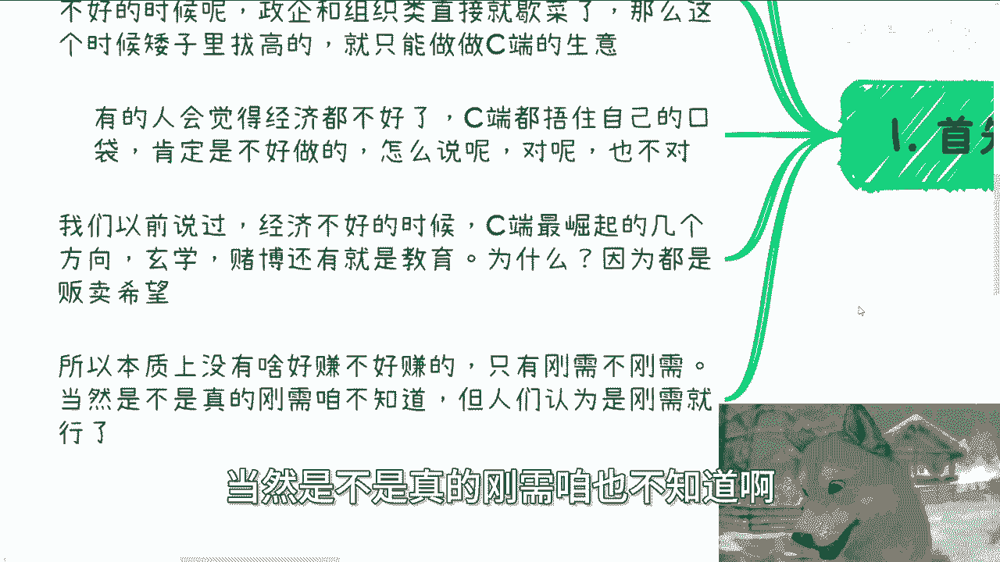
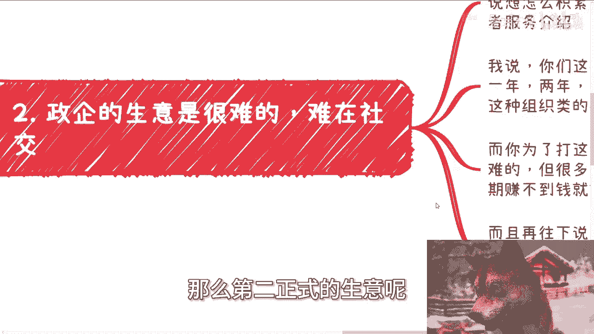
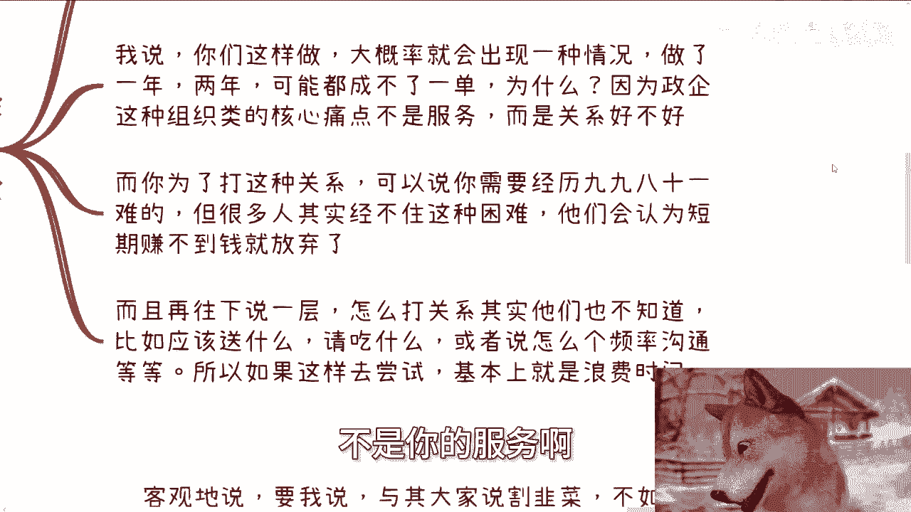
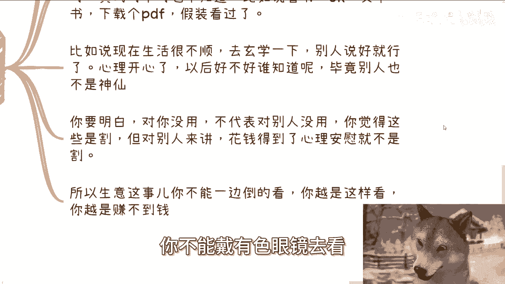
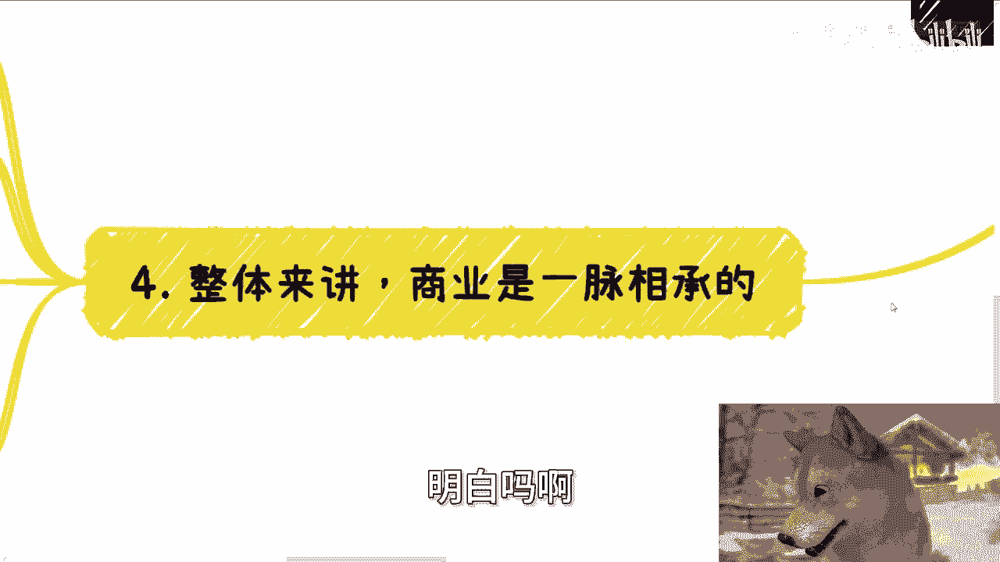
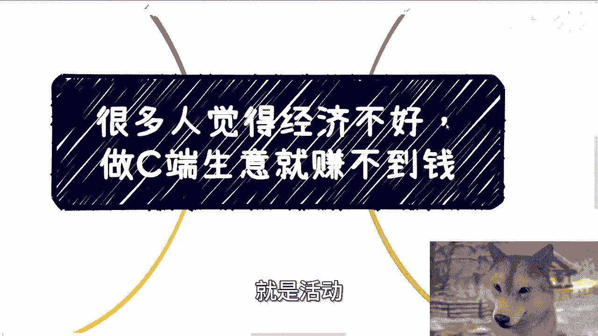

# 很多人觉得经济不好-做C端生意就赚不到钱了---P1---赏味不足---BV1pT421z7UY_n
## 课程编号：P1

在本节课中，我们将要学习一个常见的商业认知误区：经济不好时，C端生意是否真的无利可图。我们将分析C端与政企/组织端生意的本质差异，并探讨在不同经济周期下的商业策略选择。

---

很多人认为经济环境不佳时，面向个人消费者的C端生意就难以赚钱。这个观点也延伸到了对政企和组织端生意的看法，其中存在许多误解。

下一期线下活动已经确定。活动将于8月25日（本周日）在西安举行，地点位于西安建筑科技大学李家村校区附近。活动主题主要围绕两个方向：一是民企、国央企、外企及大厂等职业机会；二是自媒体与跨境电商的发展。最后，我们也将一同探讨行业现状与未来趋势。有意报名或了解详情者，可通过私信联系我。

---

首先，这是一个非常大的错觉。核心逻辑应该这样理解：无论经济好坏，**C端生意都比政企或组织类生意更容易赚钱**。对于普罗大众而言，这是客观事实。

然而，在经济相对繁荣的时期，政企和组织类生意的单次交易利润空间通常高于C端。C端交易额可能只有几百或几千元，而政企类订单，例如在2020年左右，一单的利润就可能达到数百万元。

当经济相对下行时，政企与组织类业务往往会直接停滞。此时，在有限的选项中，你只能选择相对可行的领域。从客户类型划分，无非是政府、企业、高校、资本和个人这五端。你总需要选择其中一端作为目标。

---

有人认为经济不好时，老百姓会收紧开支，C端生意肯定难做。这种说法既对也不对。我们之前讨论过，经济下行期，有几个C端方向反而会崛起：玄学、赌博和教育。无论经济好坏，它们都可能逆势增长，经济越差，需求越旺盛。因为它们都在**贩卖未来**。许多C端消费者花钱，正是因为当下处境不佳，从而将希望寄托于未来。玄学、赌博和教育在这一点上逻辑相通。此时，C端的消费意愿可能非常强烈，许多人花钱只是为了寻求心理安慰。因此，本质上不存在绝对“好赚”或“不好赚”的生意，只有**需求是否被认为是刚需**。只要人们认为它是刚需，市场就会存在。

---

上一节我们探讨了C端生意的韧性，本节中我们来看看政企类生意的难点。政企类生意真正的困难，并不在于产品或服务本身。

很多人在与我探讨政企或组织类生意时，关注点往往出现偏差。他们热衷于讨论如何积累资源、铺垫关系，或如何完善产品服务介绍。如果按照这种思路操作，很可能努力一两年甚至三年都无法成交一单。原因在于，这类生意的核心痛点并非你的产品或服务有多出色，而在于**你与对方决策者的关系是否足够牢固**。为了建立这种关系，你需要经历重重困难，这个过程毫不夸张。许多人无法承受这种长期投入，因为他们认为短期内无法盈利就应该放弃。这种逻辑本身没有错，但对于政企生意而言，短期内盈利几乎是不可能的。更进一步说，许多人甚至不知道如何有效地“打关系”，例如该送什么礼、如何进行频率恰当的沟通等。如果盲目尝试，很可能是在浪费时间。

---

讨论了政企生意的门槛后，我们再来客观审视C端生意。C端生意不能一概而论地被称为“割韭菜”。什么是商业？商业就是不带个人情感色彩的价值交换。

客观地说，与其批判某些个人或组织“割韭菜”，不如说很多C端消费者是“自愿被服务”。因为他们存在心理上的需求，即寻求安慰。例如，参加职业培训以获得转行的安全感，购买书籍或课程以获得知识提升的满足感，或是求助玄学以获得对未来的积极预期。他们愿意为此付费，是因为获得了心理上的抚慰。对你而言无用的服务，对他人可能至关重要。你认为的“割韭菜”，在付费者看来可能是物有所值的心理消费。因此，看待商业时，越是带有强烈的个人情感色彩和偏见，就越难从中发现机会并赚到钱。

---

以上我们分别分析了C端和政企端的特点，现在我们来探讨商业的共通本质。商业活动是一脉相承的。早在互联网兴起之初，就有观点认为，所有互联网公司本质上都是营销和运营公司。因为无论什么类型的企业，核心都是在“卖东西”，区别仅在于售卖的对象和产品不同，但本质都是让客户掏钱。

理性来看，客户为何掏钱——是因为真心认可，还是自我需求驱动——这些都不最重要。关键在于**交易最终合法地达成了**。这引出了一道经典的销售面试题：如何将一支笔或一本书卖给面试官？很多人认为销售的核心竞争力是对产品和服务的深入了解。但这远远不够。正如“溢价空间”的概念，单纯了解产品无法打动客户。销售的核心在于**如何触动对方，使其产生购买欲望**，而非单向的知识灌输。

---

最后，我们来总结并给出当下的行动建议。在当前的经济环境下，若想赚钱，大概率仍需从C端入手。但同时，政企端的资源积累绝不能放弃。因为现在正是打下关系基础、进行长期铺垫的时候。如果等到经济环境好转再去行动，就为时已晚了。

许多人的误区在于思维单一，认为只能专注于一端。人并非单细胞生物，完全可以多线并行。如果在同一时间段内只能做一件事，那么可能并不适合在复杂的商业环境中探索，安心打工或许是更稳妥的选择。

---

**本节课总结**：
本节课我们一起学习了：
1.  **C端生意在经济下行期依然存在强劲需求**，尤其是能满足心理安慰和未来期望的领域。
2.  **政企类生意的核心壁垒在于关系构建**，而非产品或服务本身，且需要长期投入。
3.  看待商业应**避免情感色彩**，理解不同消费者的真实需求。
4.  商业的本质是促成交易，**销售的核心在于触动客户**而非单纯介绍产品。
5.  **当下的行动策略应是“C端求生存，政企打基础”**，为未来经济复苏时的机会做好准备。

---

**活动与咨询提醒**：
本周日（8月25日）在西安的线下活动，欢迎报名或私信了解详情。
此外，如果你在职业规划、副业开展或商业合作中，涉及到合同、分红、股权等法律或商业结构问题，希望获得指导以少走弯路，可以整理好个人背景和具体问题清单后联系我。