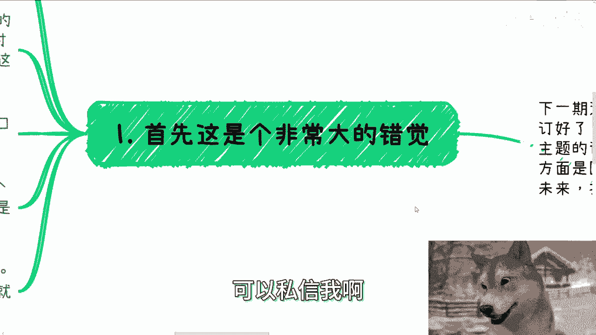
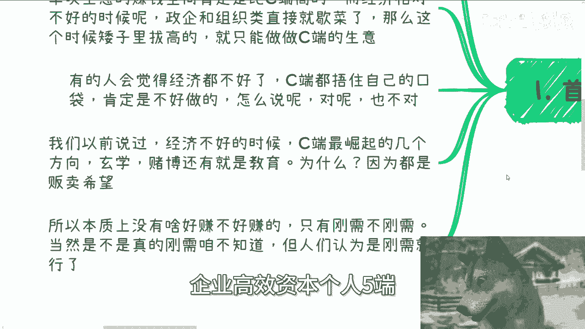
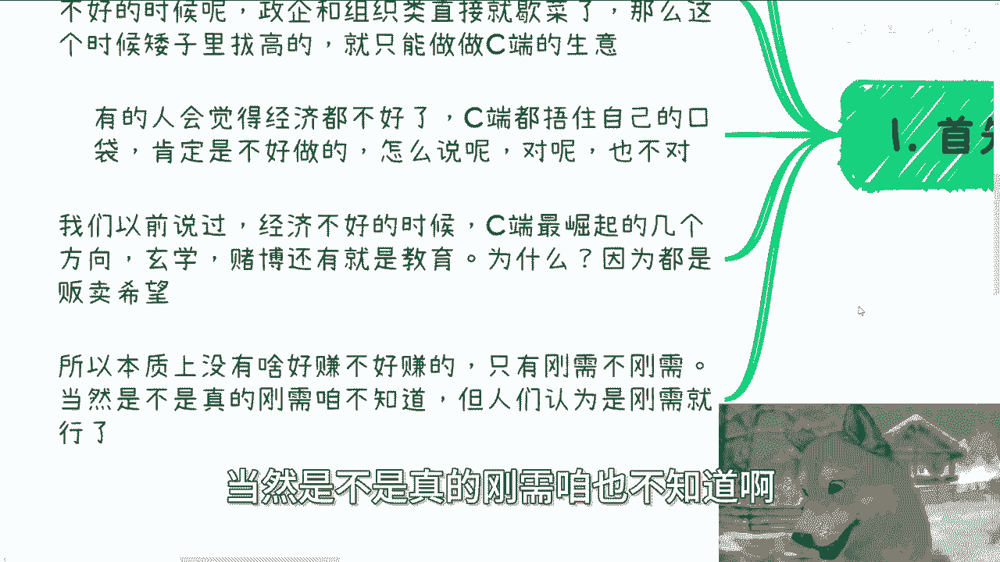
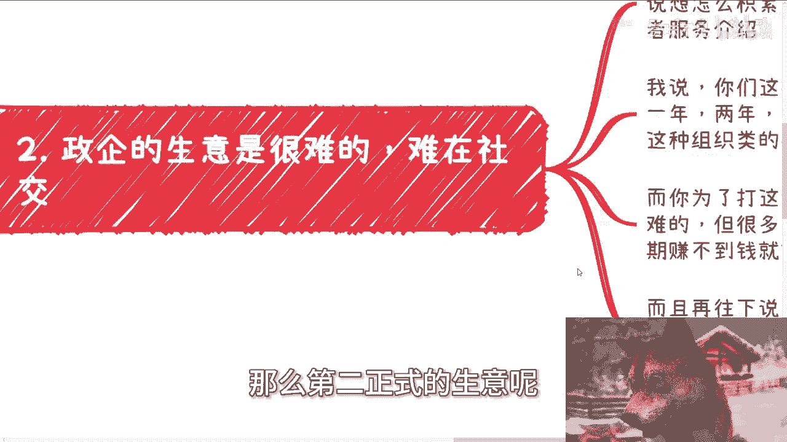
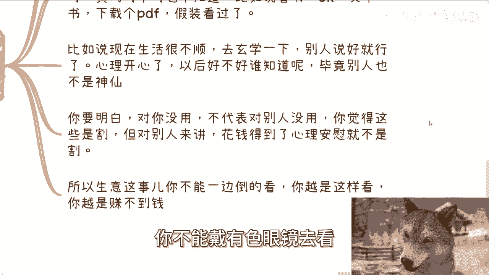

# 很多人觉得经济不好，做C端生意就赚不到钱了 - P1 - 赏味不足 - BV1pT421z7UY

啊大家好啊，这个我又在空隙当中啊，给大家哼找了一个主题啊，呃那个这两天啊，因为咨询的小伙伴呢也跟我提到了这个东西啊，我觉得额当中还有些误区，我正好给大家再强调一下啊，就是说啊很多人觉得经济不好啊。

但是做C端的生意呢就赚不到钱啊，这个事呢，这里面还包括了就是政企和组织端的啊，那这个东西呢就也有很多误解。

我待会会跟大家讲一下，那么首先首先呢下一期活动已经定了啊，8月25号就本周日在西安啊，场地我已经定好了，在西安建筑科技大学李家村附近，那么大概的主题呢一个是围绕呃民企啊，国央企啊，外企啊对吧。

大厂啊这些offer啊，那另外一个呢是围绕自媒体跟跨境电商啊，最后也帮大家展望一下现现场呃，现现在现状和未来啊，能报名或者了解详情的可以私信我啊。

那首先啊这个是一个非常大的错觉啊，就是逻呃核心的逻辑应该是这么想，无论经济好和不好，C端都比政企或者说组织类的钱好赚啊，一定要记住啊，这个东西没办法的，对于普罗大众就是这个样子。

但是呢如果经济相对好的时候呢，你会发现，政企和组织类的单次生意的，赚钱空间肯定比西端来的高啊，也就是说你西装可能收个几百块，几千块对吧，那这种组织类和那个政企类的。

你比如说按照我们2020年左右的那种单子，那可能一单就是几百万啊，不夸张啊，不夸张，就一单可能几百万啊，利润啊，那么而经济相对不好的时候呢，政企跟组织类直接就歇菜了啊，那么这个时候呢矮子里面拔高的。

那你能说难听点，你也只能做出一段声音，对不对，那你还能做啥呢对吧，就我们说据我们说啊，就是前两天我们我也给你们分析过对吧，我们从用户角度来讲，从客户角度来讲，无非就那么政府企业，高校资本个人无端对吧。

你总归得选一端吧，你逃不出的五端呐，啊那么有的人会觉得呃经济不好呢，这个老百姓都捂住自己的口袋，肯定是不好做的，怎么说呢，你说的对啊，但是也不对啊，我们以前也说过，经济不好的时候。

C端最崛起的几个方向啊，你甭管它好还是不好啊，越不好他越崛起是什么玄学，赌博，还有教育，为什么，因为都是贩卖未来啊，就是说白了C很多C端那个花钱为了什么，就是因为他当下不好，而他希望寄希望于未来。

你会发现玄学赌博教育都是一样的对吧，那这个时候C端往往他的生产力是最高的，而且更何况很多人，他可能花钱只是为了让自己有种心理安慰对吧，他不花钱，他他割得慌，虽然他没钱啊，所以本质上呢没啥好。

就是所谓好赚不好赚的，只有刚需不刚需啊，当然是不是真的刚需咱也不知道啊。

但人们认为是刚需就行了啊，那么第二正式的生意呢其实很难难呢。

不是啊，当然我跟很多人聊的时候，我也发现就是大家这个关注点啊，就不这这这关注点永远不在点子上啊，就很多小伙伴跟我聊，这个政企或者组织类的生意啊，就跟我说啊，我要怎么积累，怎么铺垫。

然后大概怎么整理一个产品或者服务介绍，我说你们这样做大概率只会出现一种情况，就是做了一年两年3年可能一单都成不了，为什么，因为你们要做政企或者组织类的这种东西，你们会发现核心点在哪啊。

核心痛点不是你的产品，不是你的服务啊。

而是你跟对方关系好不好对吧，而你为了打这种关系，可以说你需要经历998 11难啊，这这我跟你讲一点都不夸张的，你要经历998 11难，能能把这关系打下来啊，我跟你说，你你就磕头吧啊那么有狗子呢。

哎就我家那个灯啊，是不行，老是吧，我知道是因为这个啊，这样就好了啊，嗯你想啊，呃很多人禁不住这种困难，因为他们认为只要短期内赚不到钱就会放弃啊，当然这种逻辑其实也没有错，但是政企你要在短期内赚到钱。

这几乎就不可能啊，而且再往下说一层，你说打关系吧，其实他们也不知道怎么打，你比我就随便说，你比如说该送什么，该吃什么对吧，该该该怎么一个频率沟通对吧，该怎么沟通对吧，你都不知道，那所以如果这样去尝试。

你基本上一年两年3年就是浪费时间啊，那么第3C端这个生意啊，真的不能一概而论啊，都叫割韭菜，我跟你们这么说，什么叫商业，什么叫生意啊，商业生意就是我们不要带个人情感啊，不要带任何的这种情感色彩。

那么客观的说，要我说你与其说大家啊，这个大家在说啊，这个人割韭菜，那个组织割韭菜，你不如说很多的C端是等着被割，为什么，因为说白了很多C端他是有需求的，这个需求就是心理上的安慰。

就比如说选专业去培训一下啊，呃去转行做开发而去培训一下，假装自己选的对了，假装自己好像会开发了，但是你去培训过的，我说不好听，去培训过的，你专业真的选的对不对呢，你也不知道对吧。

那你开发去培训的后面能不能一直找到工作，或者自己能不能有发展呢，也不知道对吧，你比如说看书啊，OK啊，买本书下载个PDF，假装看过了，那为什么他们愿意花这个钱，是因为他们心里面得到了抚慰，对吧啊。

你比如说现在生活很不顺啊，去买个什么转运瓶啊，去玄学一下啊，别人说好学，别人说你明年运势很好啊，心里开心了，那他妈以后好不好，谁知道啊，毕竟他妈别人也不是神仙对吧，那那不是都这样子吗，嗯你要明白啊。

就对你没用的，不代表对别人没用，你觉得是割的，但对别人来讲，花钱得到了心理安慰，他就不是割，对不对，你觉得哥为什么，是因为你带了个人的这种情感色彩，你戴了有色眼镜，那你那还能说什么呢，对不对。

所以生意这个事，尤其是商业也好，生意也好，这种事你不能一边倒的去看，你不能戴有色眼镜去看。

你越是带情感色彩去看，你越是赚不到钱，明白吗啊。

第四整体来讲，我觉得商业这个东西呢它是一脉相承的，什么意思呢，意思就是说以前有句话啊，在2000年呃，2000年初期啊，就是互联网刚兴兴起的时候，就有人就说过，就所有的互联网公司其实都是营销。

都是运营公司，为什么，因为说到底，你不管是管你是什么传统企业或者什么企业，你都在卖东西，无非卖的就是对象不一样，无非卖的产品不一样，但本质你都需要别人掏钱，对不对，那么我们理性来说。

就我们刚刚说的不带任何感情色彩来讲，别人掏钱给你，是不是别人真心掏给你，是不是别人真的觉得你有自己有需求，其实这些都不重要，重要的就是他掏给你了，对不对啊，掏的是钱啊，不要乱想，对吧啊。

就你只要合法范围就好了，是不是啊，所以以前才会有那道很经典的面试题，就是说啊有人来面销售，那怎么灭呢，就给他一个东西，比如说现场给他一支笔，给他一本书啊，让他现场去卖给面试官啊。

那么很多人就觉得我我以前也问过他们，我说我说你们觉得如果你们要做销售，最核心的这个核心竞争力是什么，他们都觉得啊，核心竞争力就应该是，对产品和服务的全面的了解，看谁了解的深刻，我说这其实远远不够。

对不对，这就和我今天充电视频里面说的那个溢价空间，是一个道理，你单纯对产品跟服务有了解，你怎么卖给对方，对不对，这就好像你今天站在我对面，你跟我讲了一个东西，卧槽你对这玩意了如指掌对吧，说的天花乱坠。

那我就一句话，关我事，对不对，所以说你你要去卖给别人，核心在于你如何打动我，让我去买它，而不是说你对这个东西得有有多大了解，这不是核心问题，对不对啊，所以说就是说我觉得在这个里面啊。

我在最后强调那句结论啊，就当下这个经济环境，你要赚钱，大概率你是从C端身上赚的，但是正起端你不能放弃，为什么，因为你现在就是要去打基础，就是要去就跪舔对吧，都去就需要去搞关系的，你现在不去搞。

等未来某天经济环境好了，你再去搞来不及了，就这么简单，但是你不能就很多小伙伴，你们不能一根筋的，就是说啊我要么就搞这个，我要么就搞那个，你人不是单细胞生物吗，对不对啊，你要是说同一个时间段。

你只能做一件事情，那我跟你说，你还是拉他妈倒吧啊，好好打工啊，该赚不到钱你就拉倒，你就会就就就就躺着吧对吧，你就别折腾了啊，行好吧，那就这么着啊，然后这个呃叫什么就是活动好吧。

本周日8月25号在西安啊，在西安要报名和私信的呃，要报名或了解详情的，继续私信我好吧，然后就是你们工作上面就是职业规划啊，包括你们跟别人呃这个做副业啊对吧，或者做一些其他东西啊。

可能会有一些商业上的一些东西啊，那么在这里面可能涉及到合同啊，涉及到额分红分润啊，股权股份啊对吧，或者其他一些东西，你们希望啊通过我跟我的一些咨询，跟我的一些了解，能够让你们少走点弯路的话。

那么你们可以整理好对应的呃，个人背景跟问题的list好吧。