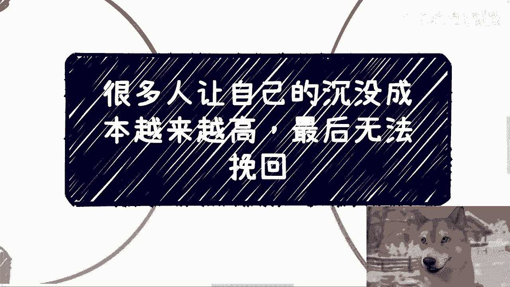
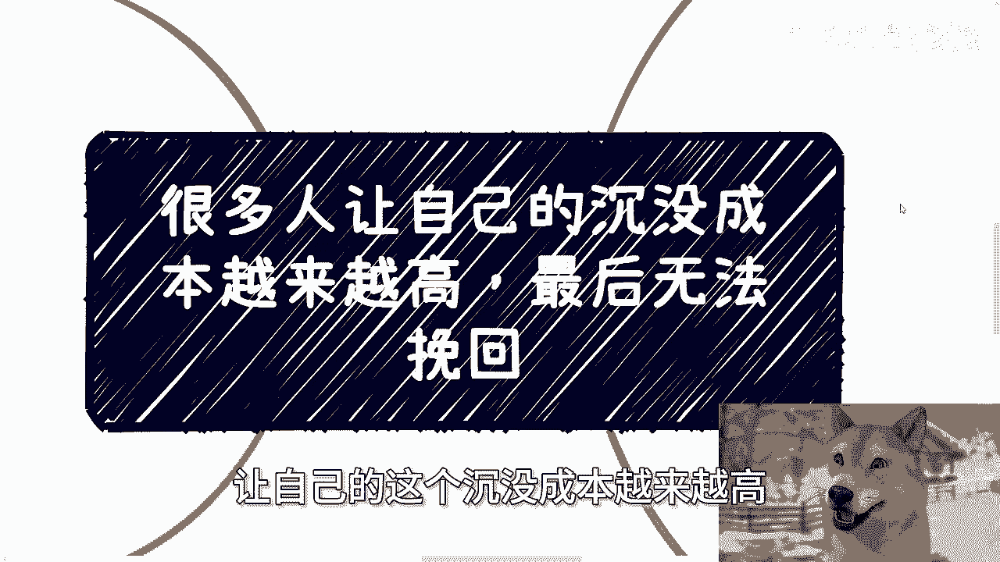
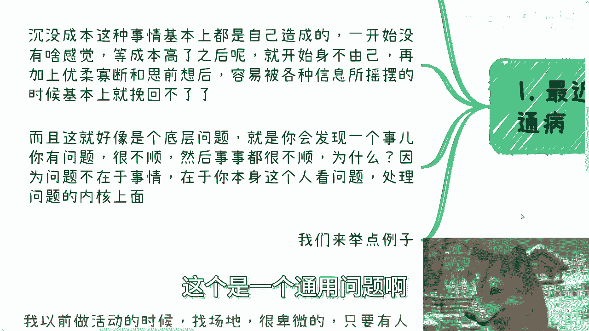
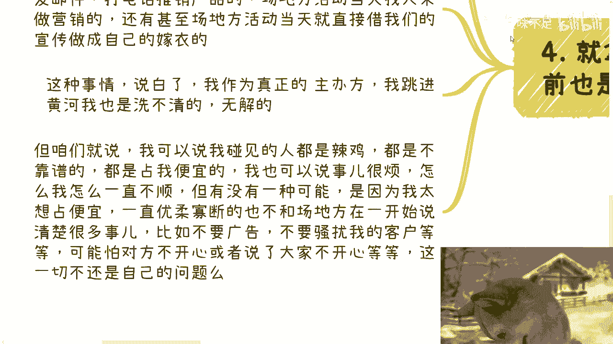
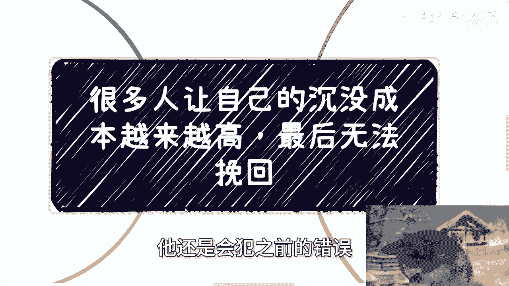
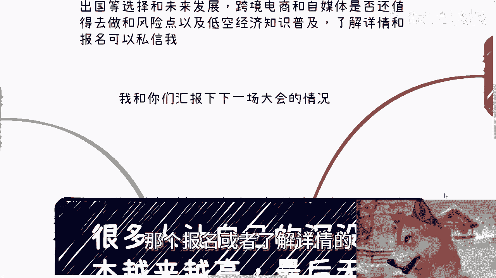
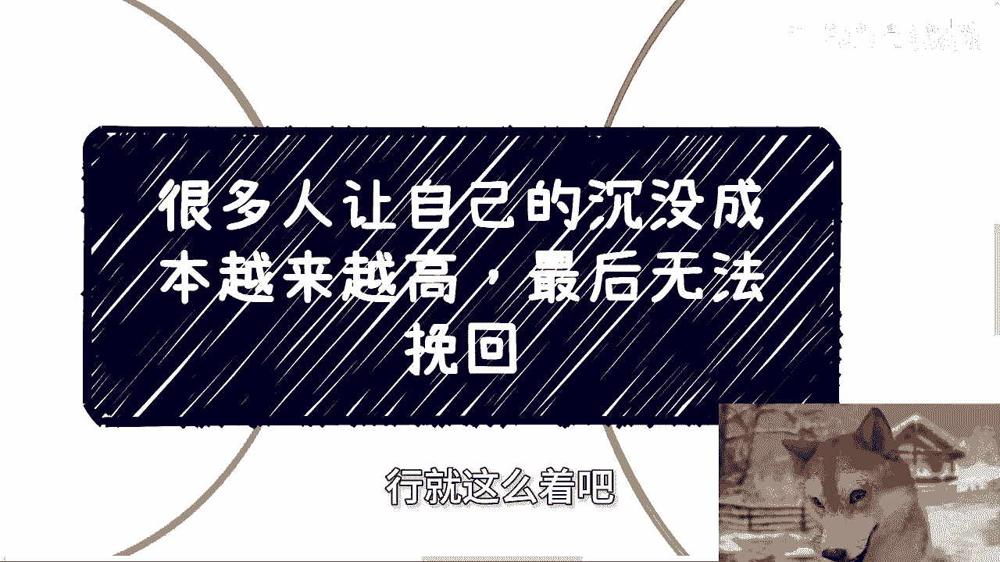

# 很多人让自己的沉没成本越来越高，最后无法挽回 - P1 - 赏味不足 - BV1nn4y1f78n

好大家好，这个今天又晚了啊，因为早上六点钟我就赶车去杭州了啊，然后杭州聊了一圈下来啊，聊了一圈下来额。

那今天我跟大家讲的这主题啊，叫做很多人让自己的这个沉没成本越来越高。

越来越高，然后最后无法挽回啊，这也是个通用问题啊。

呃首先在这之前呢，先说两个事，一个北京活动已经定了好吧，就是下周日啊，本月28号就7月28号下午，在东直门地铁站附近好吧，然后本次活动内容呃一个呢跟上次是一样的，是私企国央企外企啊。

包括出国啊等一些这个offer的一些选择，跟未来的一些发展，然后另外一个呢，就是说个人从这个跨境电商跟自媒体来做，还是不是值得去做，以及风险点，以及就是低空经济的这个知识普及好吧。

然后了解详情跟报名的你们可以私信我啊。

那另外一方面呢我也跟你们汇报一下，就是上海啊，下一场这个大会的这个情况，因为下一场大会放在上海嘛对吧，然后再下一场大会放在北京就年底了啊。

那大会跟我们的这个小活动咱们区分开来啊，那么现在下一场大会呢，就就是呃弄得7788了，因为你像我这今天去杭州呢就搞得特别好，呃有一个这个地区性的啊，就是呃叫什么联合会啊，研究院，然后包括有几个学校啊。

也可以挂到合作方呃，包括就是有一些文旅厅的领导啊，也对接了，然后文旅厅这边的话呢，就是希望在当地啊，就把这个会直接复制过去对吧等等等啊，那么反正到时候你们等我呃。

这个下一期上海这边的大会差不多9月初吧啊，9月初等海报出来，反正你们就会知道，就你像我，我就属于那种就是说你要么我就不出去的，我今天既然选择去杭州了，那整个所有的合作方啊。

所有的一些东西就该敲定都敲定下来啊，否则就是白去啊。

好那么第一啊，最近咨询下来呢，发现有这么个通病啊，就是那很多人跟我说问题啊，那么他说完之后呢，就很关注在这个问题上面啊，关注就是说事本身，你说关注这个事本身呢，其实倒也没有错。

但是你关注事情本身治标不治本啊，那么这个本在什么地方呢，往往都是在自己身上，那沉没成本这个事情呢，其实很多都是自己造成的，那么一开始你没啥感觉，等时间长了，成本高了。

你就会用沉默成本很高这句话来PUA自己啊，然后等真的成本高的时候呢，你你就开始身不由己了啊，再加上你优柔寡断啊，很多人思前想后啊，容易被各种信息呢所摇摆啊，就就就就墙头草啊。

就就今天嘛好像诶他说的有道理好往这边偏，明天呢这个人说的有道理往那边偏啊，那这种情况就很容易让自己，这个陷入啊被动状态，而且这就好像一个啊，而且啊这种问题就好像是一个通用的底层问题。

就是你会发现今天一个事啊，你有问题啊，然后很不顺，然后呢唉不但这个事情不顺啊，事事都不顺，但是事事都不顺，你想想看啊，难道是因为是真的，因为事事都不顺，还是因还是因为就是说你碰到的人不靠谱吗。

真不是你知道吗，就往往事情不在于事情本身，是在于你这个人做事情的方法不对，看问题的方法不对，处理问题的方法不对，这个是一个通用问题啊。

那么我们来举个例子，首先那个学历啊。

包括其他的，我真不想讲哈，妈讲了，我又想我又要被喷，何必呢对吧，但是我他妈的，我觉得这个东西真的就是一个，最最妈的问题，就是咱就这么说啊，我听过无数次，比如说我问他，我说你为啥赚钱啊，他就回答我啊。

因为我我出国留学花了几10万了啊，我这个成本成本很高了对吧，我我不能浪费，对吧好，那问题来了，其实你想啊，你这么想没有错啊，也没有错，但如果原因仅仅是这个，你跟我说，你说啊。

我赚钱仅仅是因为我出国留学花了几10万，我要把它赚回来，你会发现其实你是没有动力的，因为你这个动力就是别人寄给你的，比如说你父母灌输给你的，别人灌输给你的，他不是你的原动力啊对吧。

你你你你而且你很难赚回来，为什么，因为社会在发展，资产在通胀，你难道当时花了几10万，你现在再赚几10万，他他对等吗，他不对等啊对吧，那另外一方面啊，等你转完了，你接下来干嘛呢，空虚吗，没有目标啊。

还是说，你为了把当时的沉没成本的这些钱赚回来，你花了这几年的时间，你又认为是沉没成本，然后你再继续把这几年沉没成本，成本再赚回来吗，那就完完全全是个扭曲的道路啊，你到底在做啥呢对吧，但你我跟你讲。

你还别说很多人就他妈这样往下走的啊，你啊然那我们就这么来说，你说难道这是事情的问题吗，啊他们在过程当中，我跟你们这么说，他们为了去赚到当时留学的这些钱对吧，这些所谓的那个沉没成本对吧。

过程当中一定会碰到各种各样的困难和坎坷，他们处理问题的态度跟方法肯定都不一样，可能会非常困难，但真的是事情造成的吗，真的是因为对方不靠谱造成的吗，真不一定对吧，那别的咱就更别说了，你比如说换赛道。

换赛道是不敢吗，不是不敢，只是因为以前付出太多对吧，你包括有很多人跳槽，跳槽他是不敢吗，不是只是因为以前付出太多对吧，你包括结婚，难道是很有一些人啊，我不说很多有一些人他难道真的想结婚吗。

不是是因为谈的时间太长了对吧，就是你会发现你的理由是什么，是沉没成本太高，但是这是真正的理由吗，不是啊，你拿这个理由做出了一个选择，最终还要说哎我这个选择怎么给我带来了，带来了很多的不好的后果对吧。

我很我好像开始抱怨或者怎么样子，这事情是这问题在事情上面吗，你仔细想想看，他不在事情上面，在人啊对吧，第三你就比如说啊，比如说你拒绝一个人啊，你要懂得断舍离，懂得怎么拒绝一个人，不管不管我们说是朋友。

商业还是恋爱，你都要让自己开心，空出更多的时间，然后就会少更多的困扰跟矛盾对吧，好是这个道理懂都懂啊，但是很多人碰见事情了，他就不会果断的拒绝你，比如说有人找你合作，你也不问清楚到底什么合作。

你比如说今天我去杭州，对吧啊，人家我也不跟人家说清楚什么合作，我跑过去跑过去有什么用啊，对吧，你你你也不问清楚能不到底能不能做好，你说啊我也不问清楚，我也不了解清楚好就出去见面。

那么你想想看今天一件事情，明天一件事情，后天一件事情，你这样的事情一多了，你不就在浪费你的时间吗，对吧，等到时间等到那个时间一长，你到时候就在想了，那我到底这些见过面的人到底要不要合作呢，不合作吧。

那我感觉我的沉没成本太高了，我合作吧，我他妈都不知道我跟他们合作什么东西，对吧啊，然后呢，还有人比如说有人跟你表白啊，你你说我脑子一空啊，也不知道怎么拒绝，怕拒绝啊，怕拒绝了吗，是不是对别人不好。

伤害别人，但是你不拒绝，不就是把对一个人伤害变成两个人的同时，还是时间更长的吗，对不对，然后久而久之，你看似积累下来了很多所谓的朋友，所谓的恋人，所谓的合作方，但其实都很烂，都没有实质性的感情。

或者实质性的这个赚钱的合作对吧，那有什么用呢，你每天就在想哎呀，我花了这么长时间认识对吧，这个这个人微信躺在那边对吧，积累了总不能删除吧，总不能拉黑吧，对但是你越陷入你这种想法。

你就越就是不会去真正的积累出来，这种叫做有积累对吧，有感情的或者有有赚钱的这种关系，那你不就是陷入了一个死循环吗对吧，然后就开始说哎呀，我怎么事事都不顺，对吧啊，那么第四你就拿我以前啊。

我我我早年啊我跟和和呃厂多厂地方来合作。

我以前就是优柔寡断的，就是我跟你们这么说，我以前做活动找场地很卑微，只要有人愿愿意给免费的，我就跪舔，然后呢结果呢卧槽我跟你讲，我可以这么跟你们讲，没有一次不出事的啊，什么有的嘛，什么场地方啊。

活动结束了啊，给给给我拉过来的这些小伙伴对吧，发邮件打电话推销产品啊，然后呢有的呢还场地方活动当天啊，找人过来做营销的，也不跟我打招呼，还有的呢甚至呢场地方就把我直接当劳动力啊，然后呢。

他自己现场就直接开始做那个什么发布会，做什么东西，然后也不跟我打招呼，就就我就完全给别人做嫁衣对吧，那你想想看啊，这种事情说白了我作为一个真正的主办方，我他妈跳进黄河，我也洗不清啊，对不对，我怎么说呢。

你你们如果在活动里面有人，直接在我的活动上面就开始做发布会了，你们肯定在想他吧，他妈的陈老师肯定他妈的跟他妈的叫什么，穿一条裤子对吧，就就开始他妈的呃蛇鼠一窝对吧，他妈不要脸对吧，我能说什么呢对吧。

但是咱们就说啊核心中的核心啊，我可以说我碰见的人都是垃圾，都不靠谱的，都是占我便宜的，我也可以说事情很烦，事事都不顺，怎么他妈一天到晚有人坑我，对不对，但是仔细想看，有没有一种可能性是因为我太想占便宜。

我太想白嫖，我一直优柔寡断，也不在开始活动开始前跟场地方就说清楚啊，比如说你不能广告，你不要骚扰我的客户呃，我为什么不愿意说呢，是因为我怕对方不开心，或者我怕对方说啊，说了之后对方跟我不能合作。

你有没有想过有没有这种可能，这个问题都他妈是因为我的问题对吧。

所以就是我发现很多人啊跟我咨询的时候，讲完问题的时候啊，就是就就像我一开始说的事情本身要不要改变，要但是他渐渐改变这件事情了，你跟他讲清楚了，他觉得哦有道理嗯，我明白了，但是你会发现。

当他下一次面对同一个问题的时候，他还是会犯之前的错误。

为什么，因为他本身做实验方式没有改变对吧，然后时间一长就开始说哎，我成本怎么这么高啊啊，然后就就开始说我怎么这么不顺，就这样子，你们仔细想看，真的我觉得这就是个通用问题啊。

嗯行好吧，就这么着啊，然后那个北京活动好吧，就是下周那个28号啊，28号，反正你们要呃那个报名或者了解详情的。

你们再去私信我好吧，然后剩下的话就是说呃我们在职业规划，商业规划啊，包括我们自己做些什么项目，和别人合作一些项目，什么项目啊，股权啊，期权啊，项目计划书啊，合同啊，包括分红分润啊啊。

包括就是你们呃有些什么牌，你们没有什么牌，你们希望呃通过跟我的沟通啊，通过我的一些认知，或者对于当下经济情况的一些了解呃，能够给你们一些更接地气或者更怎么说呢，更更更少走弯路的啊。

这么一些建议或规划的话，那么你们可以整理好对应的问题和个人背景，好吧，我们再来做咨询啊。

