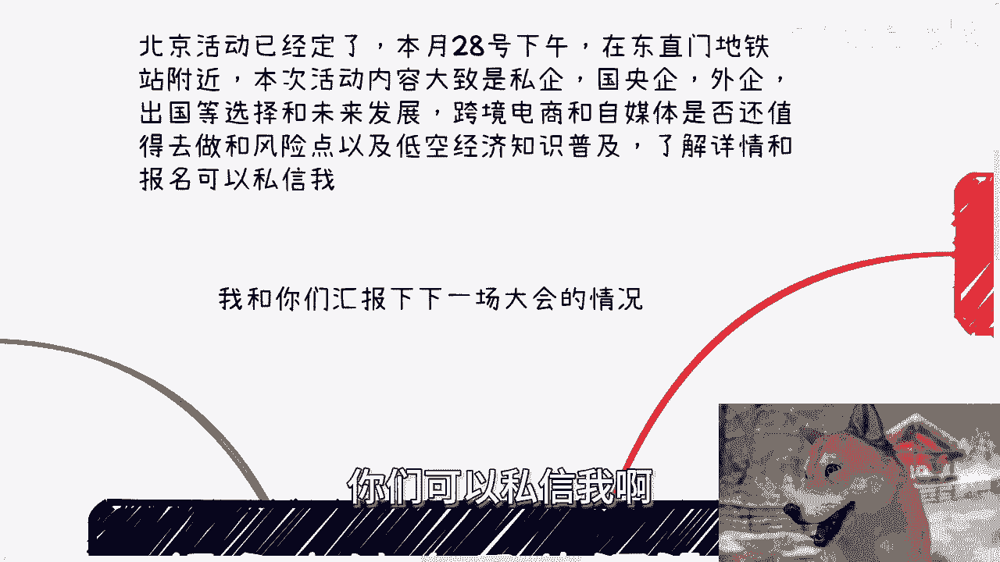

# 很多人让自己的沉没成本越来越高-最后无法挽回---P1---赏味不足---BV1nn4y1f78n_

在本节课中，我们将要学习一个普遍存在的决策陷阱——沉没成本谬误。许多人会不自觉地让过去的投入（沉没成本）越来越高，最终导致自己陷入被动、无法挽回的局面。我们将通过具体例子，分析其背后的心理机制，并探讨如何避免这一陷阱，做出更理性的决策。

## 概述与活动通知 📢

课程开始前，先同步两则线下活动信息。

北京线下小活动已确定于7月28日（周日）下午，在东直门地铁站附近举行。活动内容包括：
*   私企、国企、外企及出国等职业路径的选择与未来发展。
*   个人从事跨境电商与自媒体的可行性、风险点分析。
*   低空经济领域的知识普及。

了解详情与报名请私信。

另一方面，下一场大型行业大会计划于9月初在上海举办，目前筹备工作已接近完成。与杭州等地相关机构的合作也在积极推进中。一旦海报确定将及时公布。

## 核心问题：被沉没成本绑架的通用困境 ⚠️

最近在咨询中发现一个通病：许多人描述问题时，只聚焦于问题本身。关注事情本身没错，但这往往治标不治本。问题的根本常常在于自身。

沉没成本（即已经发生且不可收回的支出）的累积，很多是自己造成的。初期可能感觉不明显，但随时间推移，成本越来越高，人们便开始用“沉没成本很高”来合理化自己的坚持，甚至自我PUA。当真到了成本高企时，人已身不由己。

若再加上优柔寡断、思前想后、容易被外界信息摇摆的性格，就极易陷入被动。这就像一个通用的底层问题：你会发现，当一件事不顺时，似乎事事都不顺。但这真的是因为事事都不顺或遇到的人都不靠谱吗？往往不是。关键在于个人看待问题、处理问题的方法不对。

上一节我们介绍了沉没成本如何成为一个普遍的决策陷阱，本节中我们来看看几个具体的例子，理解它是如何在生活中发挥作用的。

## 沉没成本谬误的典型例子 📝

以下是几个生活中常见的、被沉没成本影响的决策场景：

**1. 为过去的选择买单**
许多人被问及为何要努力赚钱时，回答是：“因为我出国留学花了几十万，成本很高，不能浪费。”这个理由看似合理，但动力源于外部（如父母期望），而非内在原动力。并且，社会在发展，资产在通胀，几年前花掉的几十万与今天赚回的几十万并不对等。更扭曲的是，当赚回这笔钱后，为了填补“赚回钱所花时间”这个新的沉没成本，可能又陷入下一个循环。这真的是事情或环境的问题吗？还是个人决策逻辑的问题？

**2. 困于旧赛道与关系**
人们不敢换赛道、跳槽或结束一段关系，常常不是因为不敢，而是因为“以前付出太多”。例如，有些人结婚并非真心想结，而是因为“恋爱时间太长，分手成本太高”。用沉没成本作为理由做出选择，之后却又抱怨这个选择带来了不良后果。问题真的在事情本身吗？仔细想想，根源在于人。

**3. 不懂拒绝与无效社交**
懂得断舍离、果断拒绝，才能空出时间、减少困扰，这个道理都懂。但很多人实践中却不会。例如，有人找你合作，你不问清楚细节就答应见面，多次之后，时间被大量浪费。等到要决定是否合作时，又会想：“见面花了这么多时间，沉没成本太高，不合作可惜。”但合作内容可能根本不清晰。在人际交往中也是如此，因为怕伤害对方而不懂拒绝表白，结果将对一个人的短期伤害，变成了两个人更长时间的消耗。久而久之，积累了大量看似广泛实则低质的关系，陷入“积累-无法割舍-无法深化”的死循环。

**4. 个人经历：优柔寡断的教训**
以我早年办活动找场地为例，当时心态卑微，只要对方愿意提供免费场地就接受，结果没有一次不出问题：场地方在活动后骚扰参会者、活动当天擅自植入营销、甚至将我的活动变成他们的发布会。我可以说遇到的人都不靠谱，事事不顺。但仔细反思，有没有一种可能，问题在于我太想占便宜、怕事前明确规则会导致合作失败，因而优柔寡断、不敢事先划清界限？核心问题其实出在我自己身上。

通过以上例子，我们看到了沉没成本如何具体影响决策。那么，为什么我们知道了道理，却很难改变呢？

## 问题的本质：行为模式未改变 🔄

我发现很多人在咨询时，听完对具体问题的分析，觉得有道理。但当下次面对相似问题时，仍会犯同样的错误。

为什么？因为其自身做事、看问题、处理问题的根本方法没有改变。时间一长，又开始抱怨“我的成本怎么这么高”、“我怎么这么不顺”。这正是一个需要从自身底层逻辑去解决的通用问题。

## 总结与行动建议 🎯

本节课中我们一起学习了“沉没成本谬误”。我们了解到，许多人陷入困境，并非单纯因为事情本身或外部环境，而是因为被自己过去不可收回的投入所绑架，并因此做出了非理性的后续决策。

要避免这一点，我们需要：
1.  **区分成本性质**：清醒认识哪些是“沉没成本”（**Sunk Cost**），决策时应将其忽略。决策应基于未来的收益与成本，而非过去的支出。
2.  **审视决策动机**：问自己，做决定的真正理由是什么？是面向未来，还是为了弥补过去？
3.  **培养果断力**：在人际和商业合作中，敢于在事前明确规则和底线，敢于对不合适的人或事说“不”。
4.  **改变行为模式**：解决单个问题后，更关键的是反思并调整自己一贯的决策思维和处理问题的方式。

只有从自身出发，改变看待和应对问题的模式，才能避免不断累积沉没成本，走出“事事不顺”的怪圈，做出更明智、更主动的人生选择。

---

**附：咨询与交流**
若您在职业规划、商业规划（包括项目合作、股权期权、合同协议等），或希望基于当前经济形势获得更接地气、少走弯路的建议，可以整理好具体问题与个人背景，通过私信进行咨询。