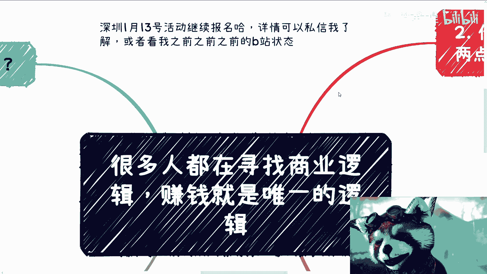

# 很多人都在寻找商业逻辑，往往赚钱就是唯一的逻辑 - P1 - 赏味不足 - BV1tt4y1Z72F

好啊大家好，今天我这个楼上在装修。

我的吵的一批，待会儿要是有噪音，这个我先给你们打个招呼啊，首先啊那个深圳1月13号好活动。

我们继续报名好吧，详情可以私信我了解，或者看我之前的之前的。

之前的之前的之前的B站状态啊，然后这个最近还有很多小伙伴还找我学上海话。

是吧啊，最近电视剧比较火啊。

大家都可以看看啊，那么本次呢今年的第一个的这个主题啊，叫做啊很多人都在寻找商业逻辑呃，但本质上很多时候啊没什么逻辑，就是赚钱就是唯一的逻辑啊。

首先啊你说这么多人问我说，爱因斯坦的脑子是个什么逻辑，你翻译一遍，妈的爱因斯坦我也翻译不来啊，诺诺子日沙鲁吉，那么我们之前啊，评论区还有那个31号的那个直播，小伙伴问了，他。

说这个爱因斯坦的脑子在淘宝上卖了小时嘛，我看了一下78万吧，应该然后到底是什么逻辑啊，你这样说啊，很多人赚不到钱是为什么，说得好听点叫做不接地气啊，说的不好听点叫做自视太高，什么意思呢。

就是说每一个人都觉得自己不是对吧，但是不，他是个辩证的逻辑，就是当你没被割的时候，你的确不是，但是当你被割的时候，你基本上就是，但是你可能还是不愿意承认接受对吧，你比如说爱因斯坦的脑子。

这个东西它不需要逻辑，为什么，因为你想嘛他挂到淘宝上去卖，结束了，这玩意儿需要什么逻辑，你就跟你就跟我今天到地上摆了个地摊啊，然后卖了一个香蕉啊，然后这个香蕉火了啊，然后人家就问我哎。

那你卖这个东西什么逻辑，卧槽我他妈就是摆了个地摊卖香蕉，你问我什么逻辑，我怎么知道什么逻辑呢，对不对啊，就是他是需要你去咳咳咳策划呢，还是需要你去营销呢，他不用啊，我跟你讲所谓的逻辑是什么。

就是天时地利人和，所谓天时地利就是你的运气，人和是什么，就是太多over，这就是逻辑对吧，这就好比你问我为什么中国有还有做社群，是要叫人怎么起床，叫人怎么睡觉，叫人什么时候睡觉，什么时候起床。

这种都能做社群，这种都能收费，那什么逻辑，那我也问了，我反过来问，那为什么这么多高学历的人，却能被骗几万甚至十几万甚至几10万，是什么逻辑呢，他没有逻辑啊对吧，你要非要问我什么逻辑，我只能告诉你太多。

这就是逻辑啊，这怎么不是逻辑的呢，对不对，你知道你知道区块链，你知道web3全球有一句名言叫什么，叫做的共识也是共识对吧，就这么简单，你你你非要说逻辑对吧好，第二个你要真说逻辑啊，我跟你说两个点。

第一你需要降维打击什么意思，就是你需要先去明白世界上的人，就是人类这个生物，它是拥有多样性的啊，你得深刻的明白，人与人的差别比人与猪的差别都要大对吧，你不明白这个东西你就赚不到钱啊。

也就是说你看一个事物，你永远如果来说，我今天给你讲个东西，你要是都觉得卧槽，这种东西他妈的才会付钱，这种东西我绝对不可能付的对吧，什么才会被割，你但凡这种想法我告诉你，你怎么赚钱，你怎么赚钱呢对吧。

因为按照你的逻辑对吧，按照你的这种心态，就好像被割的都是，然后不被割的都是聪聪明人，那么你就想想，按照你这个逻辑，如果你要赚钱，你的逻辑是买单都是聪明人，那有多少聪明人会买单呢，对不对。

所以说你不能就是说看到某些东西，你就就就一刀切的说，哎呀我靠这种东西怎么还会有人付钱呢，我的我都懵了对吧，你这样你就赚不到钱啊，然后第二点就是你需要有行动力和胆量，什么意思呢，一样的道理就是我以前说过。

比如说前两年的web3，前两年的数字藏品，前两年的白皮书对吧等等，我告诉你们价格都虚高，一个PPT，一个word可以卖到100万到200万，我就这么问你们，我今天跟你们说，你们做个word。

做个PPT啊，不需要门槛，你们就他妈瞎吹对吧，然后能能卖出100万到200万，你我就问你们，我告诉你们，你们有几个人有胆量，有行动力去做的对吧，你们肯定是卧槽，这种东西敢做的，这种东西做的要进去的。

好的呀，你装个屁啊，你告诉我，你装个屁啊对吧，就是你知道吗，就是说很多时候你们脱口而出的话，这句话本身它是没有逻辑性的，你就想卧槽这种东西做了要进去，那我就问你，你怎么进去，你是触犯了什么法律对吧。

你什么都不知道，你的投稿就说卧槽这种东西做的要进去了，有意义的，对不对啊，所以说在赚钱这个逻辑上面啊，你只要记住一句话，就是你不要尝试去搞懂它，你当你懂的时候，别人已经他妈的割了几波了对吧。

就钱都赚完了，还轮不到你赚呀，你自己回回想回想，任何事情其实都是这样子的对啊，然后第三个就是赚钱就是唯一的标准啊，别的其实都不重要对吧，你比如说一些小伙伴，和我咨询的时候，和我说以前做了很多事情。

也做了很多故事啊，然后呢我可以说这些故事啊，这些事情都非常的精彩啊，呃但是问题是什么呢，两个一个是说无论他成功与否，无论他怎么个精彩，你会发现他都没有积累，另外一个是什么，他就是没有赚钱对吧。

就是你赚钱了，无论多少，它都代表着一种结果，都代表的是一个节点，这就说明你无意当中，有意当中切中了商业的一个边边角角对吧，但是你是不是能越切越大，你是不是能继续往下切，这就看你进步的操作。

看你进一步的这个这个这个摸索对吧，但是你不赚钱，意味着你肯定没摸到啊，而且当你赚钱了，你实施我们就客观来讲，你可以反过来美化你的故事，但事实是什么样子的，我跟你讲，最终只有你自己心里清楚对吧。

就是和所有的事情，我们不可能是先知对吧，你说能做不能做，一开始都是天时地利人和，没有人能预测未来对吧，你就说前两天有个小伙伴咨询我的时候，问我说哎这个陈老师，你第一桶金怎么赚的对吧，我跟他讲了一遍对吧。

然后他就问我，那你是不是当时看好这行业，我说大哥啊，你觉得一个刚毕业的人，我作为一个什么都没有的对吧，一开始月薪就500块钱的这种，我他妈能看好一个行业，我看个屁啊啊对不对，那你反过来讲，我可以跟你讲。

卧槽我老牛逼了对吧，我当时看好这个行业，但是你自己还是那句话，你用你的脑子去思考一下，凭什么我能看得懂啊，没道理的呀，对不啦，我就早就说了，人与人之间的差别没有这么大，最大的地方在哪里，在于信息差对吧。

但是反过来说，你一开始可以是运气，但是当你走过一遍之后，你会发现，因为你回过头可以开上帝视角去看这一路，你是怎么走过来的，你会发现哪些点是你自己能够想明白的，哪些点是根本就是运气，就是随机出现的对吧。

但是你作为一个走过来能开上帝视角的人，你就会明白，无论是那个你想得到的还是运气，其实你作为一个已经走过一遍的人来讲，对你来讲就已经不存在随机性了，因为你知道哪些东西是关键点。

那么你就可以到别的地方如法炮制。

对不对好，所以说最后一点你看啊，所以其实无论如何，我们要做的是什么，我们要做的是0~1，就是你别管你做的事情low或不low啊，不要就是老老是自己觉得卧槽，这事情好像做的对吧。

就是有点low或者怎么样不重要，你知道吗，就是你们要做的是0~1。

只有这样你才能明白里面的关键点对吧，什么叫0~1，赚到钱并不叫0~1，你懂吗，而是说你在整个业务里面是什么角色，你能不能全局的都参与进去啊，从从比如说一开始对吧，到产品的这个呃产产品也好。

服务的搭建到营销，到最后收钱，你都能全局的参与进去，你今天赚钱了啊，但是在商业里面，如果你是个打工的，比如说关系不在你手上，业务流程，商业流程你也不知道，那么虽然你的确赚到了钱。

但是本质上你还是个工具人，对不对，所以说无论如何，你不管你用什么方法，你需要完整的经历过0~1，这也是为什么我跟大家说，你们要去社交的原因，因为只有你自己社交出来的关系，只有你自己社交出来的case。

你才有可能尽可能的多的参与啊，而不是说而不是说这个这个依靠别人对吧，就是你可以把别人当做工具人，但是你不要依靠别人啊，那么我觉得我们下一期我可以来讲什么呢，就是第一桶金本质上都是蒙的啊。

或者一开始其实都是运气。

但是后面不是为什么，因为后面你可以如法炮制。

所以啊就是说我们回过头来讲，就是你今天看到一个人赚了钱，你今天看到比如说一个人做跨境电商，或者说一个人在自媒体上面啊，营销啊，他做的怎么怎么好啊，你要做的是什么，就是你可以去把它的背后的逻辑。

或者背后的这个流程，你了解一下，然后你可以去复制它，我觉得这没有问题，因为抄就是你不要完全抄它的内容，但是你可以复制他的模式，对不对，但是话又说回来，就是你不要去问自己说哎为什么他能这样做。

为什么他能赚钱没有，为什么哪他妈来的，为什么，咳咳咳咳咳，对不对，啊就是很多时候很多事情啊，你们看到的时候，其实他都已经已经是个结果了，他没有过程，但是你不要去关心这些事情，这些事情没有意义的啊。

我们做所有的事情，不是说像我们去解一个数学题啊，你说我一定要去把这个解的过程写出来，你不一定有过程啊对吧，但是你要有一个结果，就是你得赚钱，对不对，就是我觉得长期不说，你要能够有一定时间的啊，能够赚钱。

然后呢同时呢就是啊你的客户，你的用户不会来觉得诶，你给他的服务，或者你给他的产品跟你收他的钱不成正比对吧，那就说明客户跟你的用户，是对你的这个服务和产品是买单的，那么就说明你的逻辑是成立的，对不对。

就这么个简单逻辑，就这么简单的方式，但是你逻辑成不成立，或者你做什么事情，你一开始不知道啊，你知道吗，就是不是说你一开始今天卧槽，把一个word写好对吧，然后你说好，我今天写了一大堆公式。

因为这些公式我去做了，所以我能做得我能赚到钱，没有这个因果关系的，你只能反过来推，就是当你赚到钱的时候，你说哦，我这个逻辑可能走得通的，我而且你要明白是可能走得通，你知道吧好吧。

所以我觉得就是很多小伙伴啊，就这个考虑问题啊，他这个他不在点子上啊，不在点子上啊，行这个我们2024年啊，大家一起加油好吧，先这么着吧啊，然后那个活动啊你们要参加的，你们私信我了解一下。

然后呃剩下的比如说商业上面，或者来说呃就业上面或者其他的，你们觉得就是有问题的，你们可以整理一下啊。

