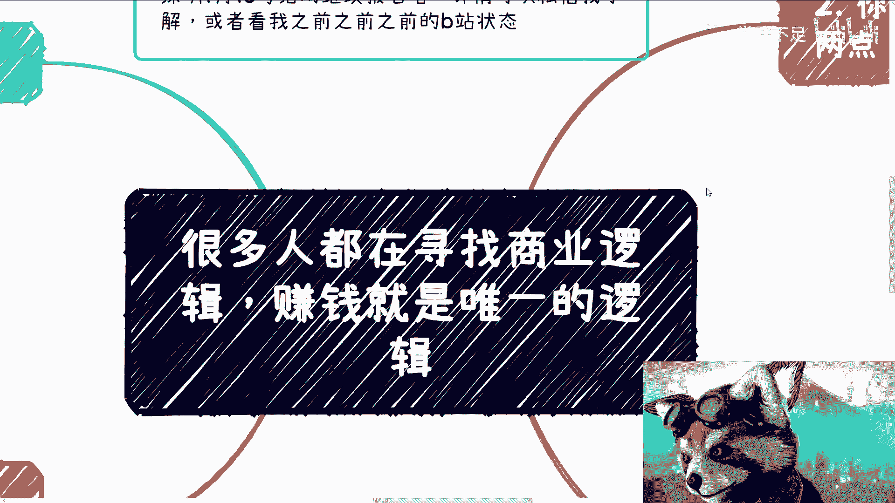

# 商业逻辑课 01：赚钱是唯一的逻辑 💰

在本节课中，我们将探讨一个核心的商业观点：许多人苦苦追寻复杂的商业逻辑，但很多时候，赚钱本身就是最简单、最直接的逻辑。我们将通过分析具体案例，理解为什么行动和结果比空想逻辑更重要。

---

## 概述：商业中的“逻辑”迷思

很多人都在寻找商业逻辑，但本质上很多时候没有复杂的逻辑，**赚钱就是唯一的逻辑**。

上一节我们概述了课程的核心观点，本节中我们来看看一个具体的案例。

## 案例分析：“爱因斯坦的脑子”为何畅销

许多人问我，“爱因斯坦的脑子”在淘宝上卖了数十万件，这是什么逻辑？

这个问题本身可能就陷入了误区。这个东西不需要复杂的逻辑。就像有人在地上摆摊卖香蕉，香蕉火了，你问他有什么逻辑？他可能只是摆了摊，香蕉恰好受欢迎。

所谓的“逻辑”往往是事后总结。真正的驱动力可能是：
*   **天时地利**：运气和时机。
*   **人和**：**Too many overthinkers（过度思考者太多）**。这就是逻辑。

这类似于区块链领域的一句名言：**“傻子的共识也是共识”**。当足够多人相信并为之付费时，一个商业模式就成立了。

---

## 赚钱需要具备的三个关键认知

理解了案例背后的简单性，我们来看看想要赚钱需要具备哪些关键心态。

以下是三个核心认知点：

1.  **接受世界的多样性，进行降维打击**
    你必须深刻理解人类的多样性。人与人的差别，可能比人与猪的差别都大。如果你看到一个产品时想：“这种东西怎么会有人付钱？我绝对不会付。” 那么你很难赚到钱。因为你的潜在客户，可能和你完全不是一类人。你的逻辑如果预设“只有聪明人才买单”，那你的市场会非常小。

2.  **拥有行动力和胆量**
    以Web3、数字藏品为例，早期一个PPT或白皮书可能卖出天价。当你知道这个方法时，有多少人有胆量和行动力真的去做？很多人第一反应是：“做这个要进去（坐牢）的。” 但你是否真的清楚触犯了哪条法律？很多时候，我们脱口而出的限制性想法，本身就没有逻辑依据，只是阻碍行动的借口。当你试图搞懂一切时，别人已经完成收割了。

3.  **赚钱是唯一重要的标准**
    赚钱，无论多少，都代表一个结果，一个节点。它证明你无意或有意地触碰到了商业的某个边角。不赚钱，则意味着你还没有摸到门道。赚钱之后，你可以反过来美化你的故事，但最初驱动你的，往往不是缜密的逻辑，而是行动。

---

## 核心行动指南：完成你的0到1

明确了心态，我们该如何行动？关键在于亲身经历一个完整的商业闭环。

上一节我们讨论了心态，本节我们聚焦于最重要的行动：完成从0到1的跨越。

**0到1** 不仅指赚到钱，更指你在整个业务链条中扮演的角色。你需要尽可能全局地参与：从产品/服务搭建，到营销推广，再到最终收款。如果你只是打工，关系不在你手，流程你不清楚，那么即使赚了钱，本质上仍是工具人。

如何实现0到1？主动社交是关键。只有你自己开拓的关系和业务，你才能深度参与全过程。你可以利用他人作为工具，但不要依赖他人。

---

## 总结与下期预告

本节课中我们一起学习了商业中的一个朴素真理：过度追求复杂逻辑可能阻碍行动，而**赚钱本身就是最有效的验证逻辑**。我们通过“爱因斯坦的脑子”等案例，理解了市场的多样性、行动力的重要性，以及“赚钱即节点”的意义。最后，我们强调了完成 **0到1** 的完整商业闭环是理解商业本质的关键。

很多人第一桶金靠的是运气或偶然。但重要的是，走过一遍之后，你可以开启“上帝视角”复盘，分清哪些是关键点，哪些是随机运气。对于可复制的关键点，你便可以**如法炮制**，运用到其他领域。

因此，当你看到别人成功时，重点不是追问“为什么是他”，而是去了解并**复制其模式**。商业不是解数学题，不一定有标准推导过程，但必须要有“赚钱”这个结果。只要你的客户愿意为你的产品或服务持续付费，就说明你的逻辑是成立的。这个逻辑，往往是在你赚到钱之后才被验证的，而不是事先用公式推导出来的。

下期预告：我们将探讨“第一桶金本质上都是蒙的”，分析运气在商业起点中的作用，以及如何将偶然转化为可复制的必然。

---
*深圳1月13日活动继续接受报名，详情可私信了解。其他关于商业、就业的问题，也欢迎整理后咨询。*