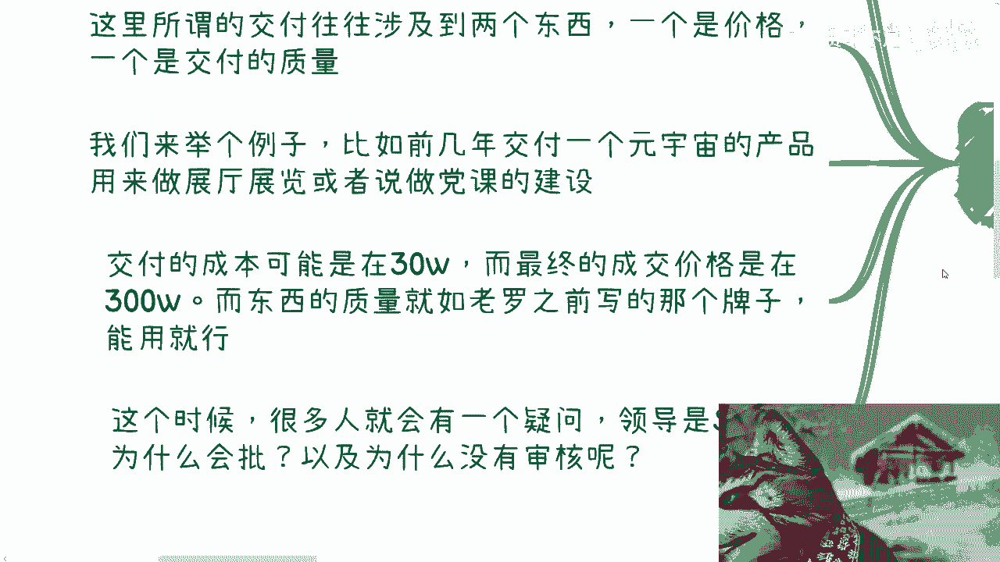
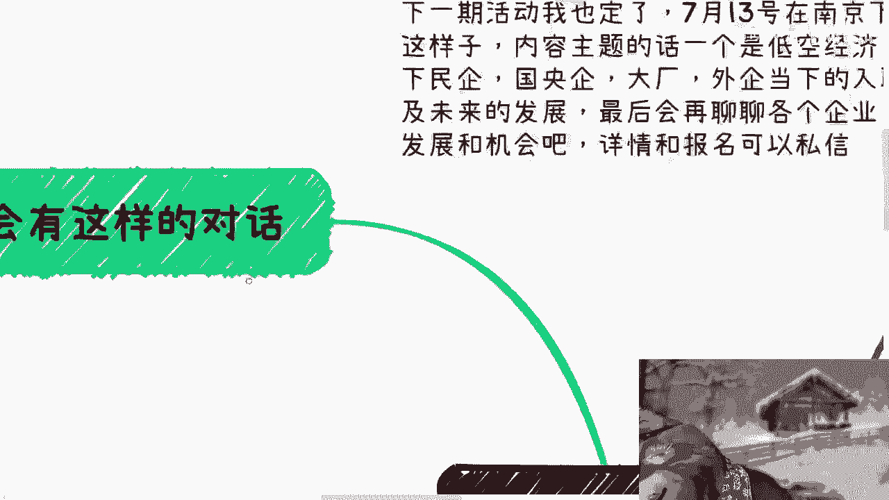
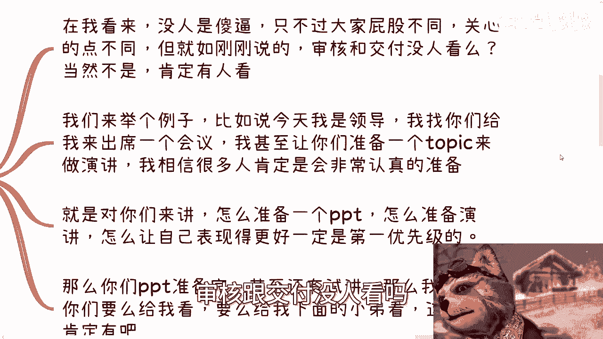
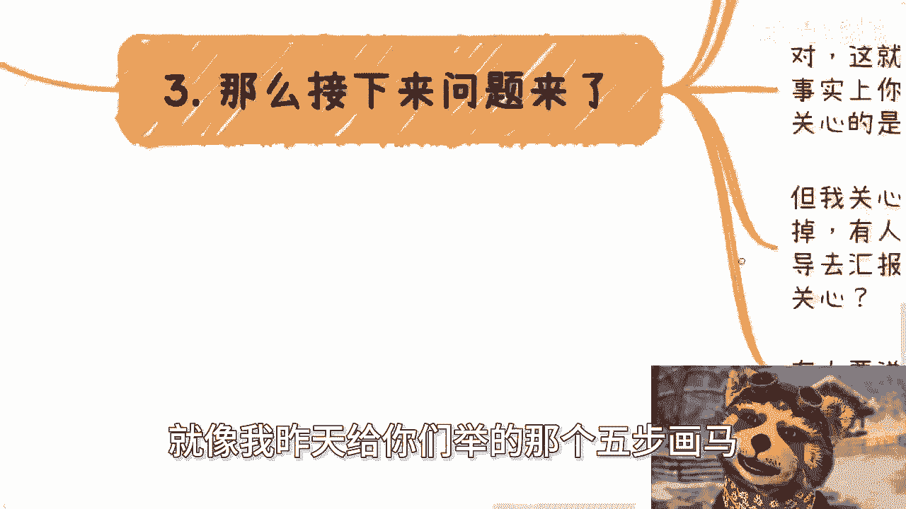
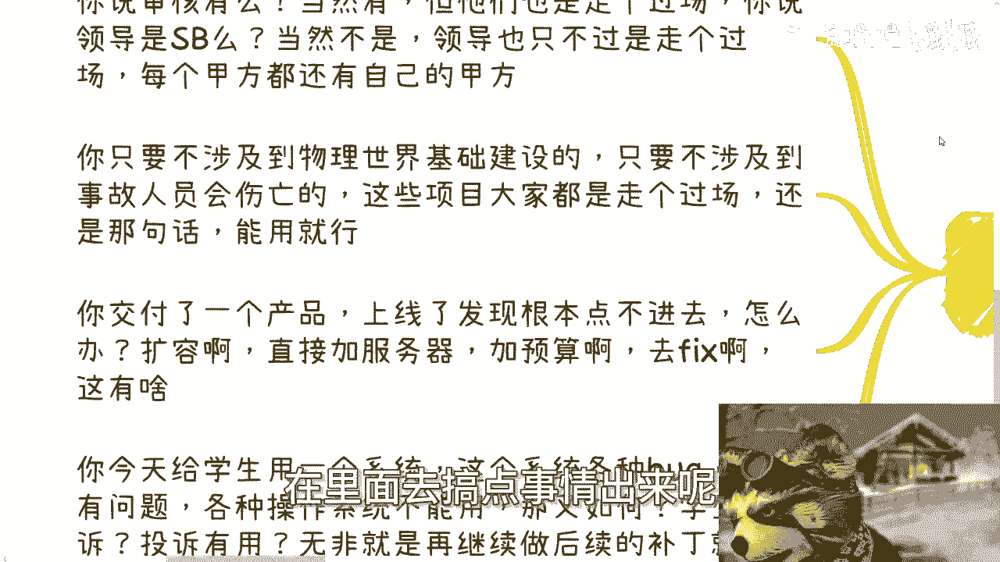
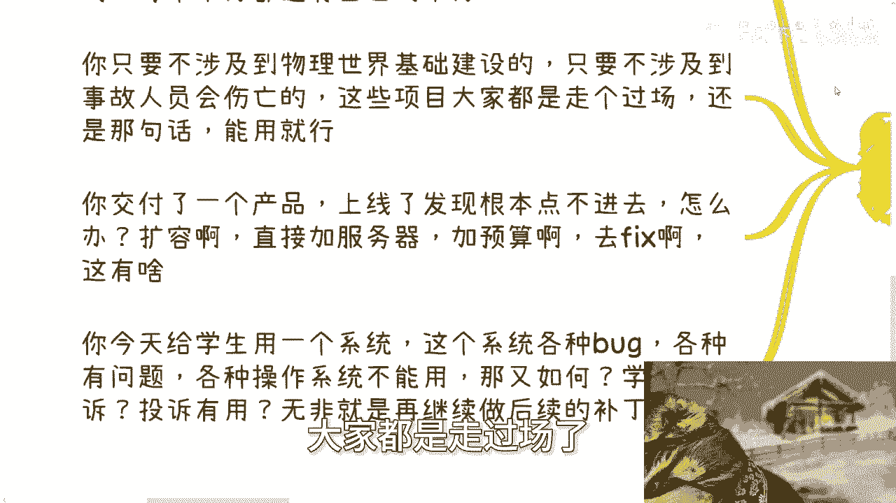
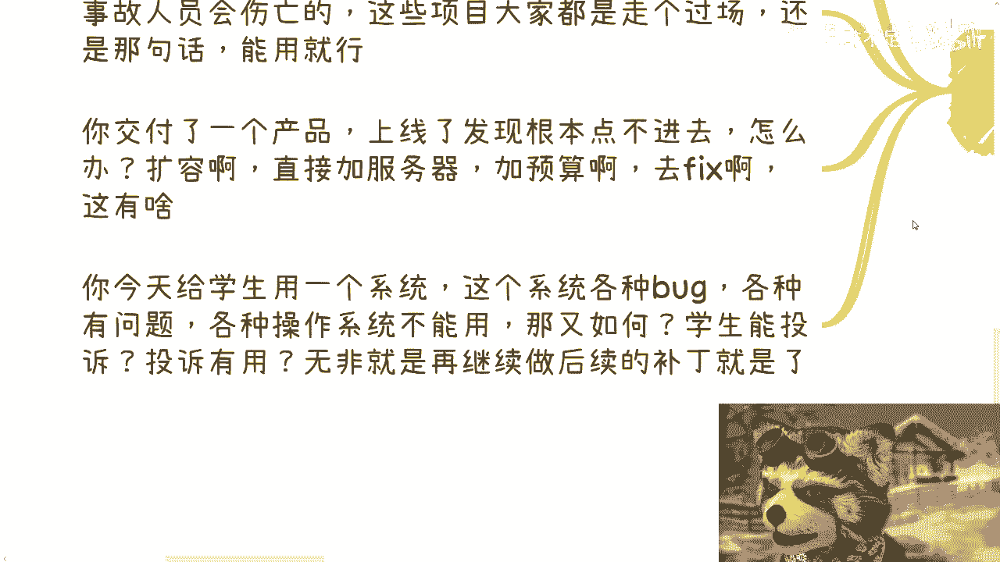
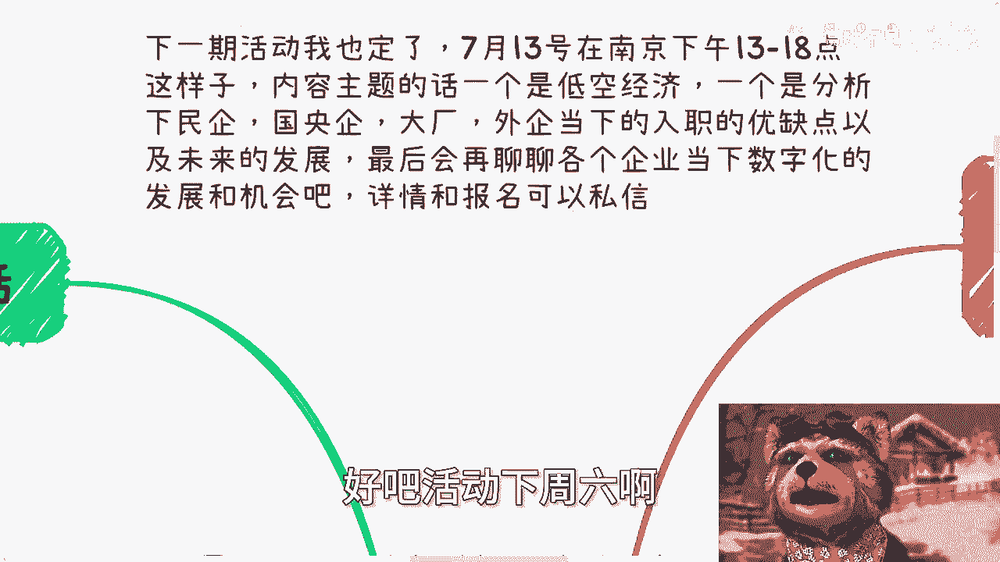

# 很多人问我“领导都是小可爱吗” - P1 - 赏味不足 - BV14m421g7TF

好大家好，这个今天不知道为什么。

就我给你们录过一次视频，然后那个视频呢有大概3分钟是没声音的。

我不知道为什么啊，可能领导的Buff太牛逼了。

哼呃首先是这样子的啊，这个下一期活动我已经定了啊，然后7月13号就下周六在南京好吧，下午一点到六点，然后内容主题呢一个是低空经济呃，一个是分析一下民企国央企大厂，外企当下的这个入职的优缺点。

以及未来的一个发展，然后会聊一下当下企业的这个数字化发展，跟一些机会啊，然后呃大家就可以相互交流啊，然后有任何的问题，你们线下也可以那个咨询我啊。

那么详情跟报名可以私信。

额今天我们讲的主题对吧，你看我就这么直接的吧，哈哈啊，那么我们经常会有这样的对话啊。

他说哎我现在就怕他妈录到一半没声音。

我们经常会有这种对话，他说聊到一些呃政府展厅的交付啊，啊一些园区的交付啊。

一些所谓的这个项目的交付啊，对吧啊，那么这些所谓的交付呢往往涉及到两个东西啊。

一个是价格啊，一个是交付的质量，我们来举个例子啊，比如说前两年啊交付一个什么元宇宙的产品啊，又来做呃展厅展览，或者做一些党课的建设啊，做一些什么学校的这种实验室的这种学习啊，都有可能啊。

那么交付的成本啊，我们打个比方，比如说30万啊，而最终的成交价格呢是在300万，那么这个东西的质量啊，这个质量就如老罗之前写的那个牌子一样，叫做什么叫做能用就行嗯，那么这个时候呢每次聊到这种话题啊。

就很多人就会有个疑问，他说那难道领导是吗，啊为什么领导会批这种项目，以及难道领导下面的团队没有审核吗。

为什么审核会通过啊，好我们今天主要就来讲这个问题啊。

额自然我我先给你们个结论啊，我们不要认为别人是，因为没有人是啊。

只不过大家立场不一样啊，那么在我看来呢啊没人是。

大家屁股不一样啊，关心的点不一样，那么就如刚刚说的审核跟交付没人看吗。

当然不是，那么他妈肯定有人看好，那我现在给你们举一个我们假设啊，举一个这个详细点的例子啊，比如说啊今天我就是啊。

我就这个领导啊，我给你们呃，我找你们啊，来给我出席一个会议啊，我甚至呢让你们这个准备一个topic来做演讲，那么我相信我给你们这么个机会啊，你们肯定很多人啊也觉得还蛮好的。

大家至少能合作啊，同时呢你们肯定会非常认真的准备啊。

比如说来问我啊，这PPT怎么写啊对吧，然后问我就说来大概来什么人啊，大概多少规模啊对吧，那肯定是认真对待嘛啊那么就是对你们来讲呢，怎么准备一个PPT，怎么准备一个演讲，怎么让自己表现的更好一点。

怎么让别人对你们印象更深刻啊。

这是第一优先级的，那么你们的PPT准备完了啊，肯定还会有试讲，那么我就问啊，我说你们这个试讲，你们要么就是给我看啊，要么就是给我下面小弟看。

就给团队看对吧，那这种审核肯定会有嘛，对不对，好，那么接下来就是核心点啊。

问题来了啊，你可能会发现这个活动呢，哎演讲可能不止你一个人啊，然后有的人呢PPT写的他妈跟屎一样啊，演讲的内容毫无逻辑性啊，然后呢啊这个我的这个审核呢也通过了，或者我这个团队审核也通过了。

然后通过几次啊，你跟我的合作之后呢，你就会发现哎啊陈老师这边这种合作呢，这种啊，这种情况不是个例啊，而且经常发生啊，紧接着呢，你心里或者你跟你朋友，晚上他妈的喝酒吃饭聊天的时候。

肯定会说他妈陈老师绝对是个，呃，为什么，因为他根本没有能力看出来好坏啊，你看我他妈花了这么长时间给他他妈的准备PPT，准备topic对吧，他妈的被别人准备了一坨屎啊，然后也也跟我对吧一样啊，对我跟你讲。

这就像我们刚刚一里面所说的啊，那些给政府啊做交付啊，啊给这个社会上的甲甲方做交付啊，这个就是很多时候做交付时候，你们很多人的想法，但事实是什么呢，事实上是你们关心的是质量，你们关心的是内容。

你们关心的是真正的好坏，但我作为这个领导，我关心的是什么，我关心的是这个活动能不能顺利办掉，我关心的是有没有人来参加，我关心的是他一期一期，能不能像滚雪球一样去做啊。

我关键是我要去给我的我的上级领导汇报，不出错就好了，你跟我谈里面的细节好坏，我为什么要关心啊，关我吊事，对不对，好那么有人又要说了，他说那的早为什么早不说呢，对吧，有人要来讲了，那你为什么不直接说呢。

为什么不打明牌呢，哼这就很搞笑对吧，唉你们想想看，我无论你们今天跟谁在社会上合作，或者你们碰到人，我不管你们碰到的是商人对吧，资本家还是你们的老师，你们的mental，你们的各种各样的人怎么滴啊。

你让怎么跟你们讲啊，你比如说你说陈老师，我们要给你呃，我我我找你们做个PPT做做，找你们讲个topic，然后你们问我哎，陈老师那有什么要求吗，我怎么说哎，你们是来凑人头的啊，你们他妈这帮啊。

你们你们他妈的根本没有用啊，你们随便讲，反正就是他妈的过来凑个凑个数的，走个流程的，我能这么讲的，来能这么讲吧啦，对不对，你你自己去看看。

社会上很多东西不都是这个样子吗，对吧，就像我昨天给你们举的那个五步画马。

是一个道理，就是你你就是五步画马里面第一步是什么，是两个圈对吧，那我总不能我总不能跟你们说，你们问我爱穿什么，我画个什么，我总不能跟你回答，你们爱画两个圈，我总是回答你们，你你们给我换匹马，对不对。

那这匹马最终画成什么狗样子，我心里知道我会不知道的啦，对不对，但是问题是这不妨碍我汇报啊，你只要能够让我成功去汇报，我不管你是画两个圈还是画个青蛙，随便你啊，你明白吗，但是这话不能明讲啊啊那么第四。

所以回到日常的项目当中，你说审核有没有，当然有对吧，但他们也是走个过场，你说领导是吗，当然不是领导，只不过也是走个过场。

他为什么要跟自己过不去呢，对不对，就比如说这个项目能顺利做，这个经费能顺利出，他干嘛非要吃饱了撑的，在里面去搞点事情出来呢。

啊那领导是吗，啊每个甲方都还有自己的甲方对吧。

而且另外一方面，你只要不涉及到物理世界的基础建设，你只要不涉及到，如果出事故人员会伤亡，那么很多金融类的或者很多互联网类的项目，大家都是走个过场的。

那还是那句话，能用就行啊，你交付了一个产品上线，发现啊上线了，比如说人一多，发现根本点不进去啊，一直在loading啊，网络卡的一批，那怎么办呢，扩容啊，直接加服务器啊，加预算啊，去修啊，这有啥呢。

对不对啊，你今天给学生用个系统，这个系统各种bug，各种有问题，各种操作系统不能用，各种按钮不能点，那又如何，学生能投诉吗，就算能投诉有用吗。

对不对，那无非就是在做一个后续补丁，无无非就这么样子招了呗。

对吧，所以说就说很多时候是这样子的。

你不要觉得哎呀领导是，或者那审核是或者怎么样子，不是的，是大家关心的点不一样啊，何必呢，对不对，所以我才一直跟你们讲，就是如果你们要想赚到钱，你们要想往上走，你们得要明白。

每一个就是因为我们说做任何一个项目，甲方都有它的甲方，甲方有无数个甲方，一一层套一层的，那你得明白每一层他的需求是什么，你不能老从你自己的角度看啊对吧，地球不围着你这样，社会不围着你转。

你老从你自己角度看，你怎么往上走，你怎么去赚性价比高的钱对吧，你永远从你角度看，那我就问了，那那你怎么不去制定规则呢，对不对，一样的就不要碰到问题啊，碰到一些就是你就是就是跟你们聊的时候。

你们就老是会会会觉得哎呀，这个东西他妈的他们是吗，他们怎么会看不出来呢，你交付了一个一坨屎上去是啊，但是你你你知道吗，你要关心的不是这个东西是不是一坨屎，你要关心的是这坨屎，能不能让对方更好的去做汇报。

能不能把流程走完，只要能走完，你管他是不是一坨屎，对吧啊，行吧啊，那个就说这么多吧。

我我我就怕待会又没声音了啊，呃活动好吧，活动下周六啊。

然后要了解或者报名的继续私信我，然后另外一方面就是职业规划啊，商业规划，股权期权，商业计划书白皮书啊，分红分润啊，包括就是你们手上有什么牌，你们没有什么牌，你们希望通过跟我的沟通啊。

能够呃是那个通过我的一些见解，能够帮你们梳理出来，更接地气的一些计划或者规划的话，那么你们可以整理好相对应的个人背景，跟详细的问题的这个列表啊，我们再来做咨询啊。

