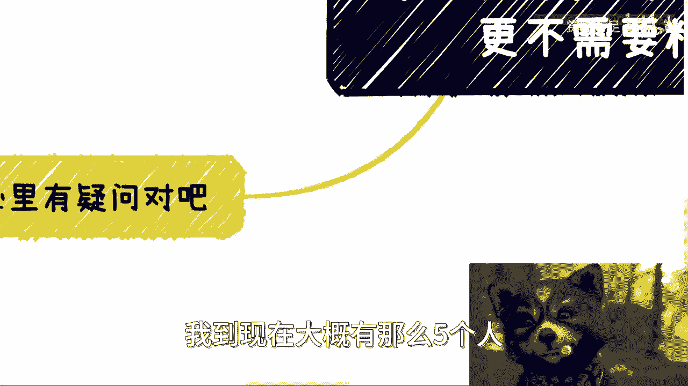
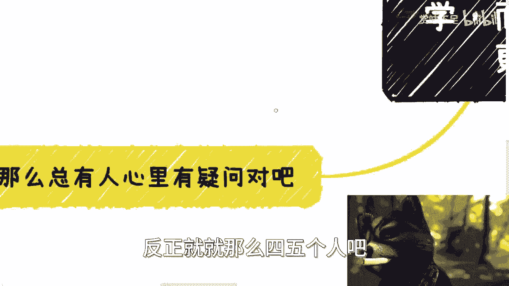

# 很多时候-你需要博学-而不是会或者懂-更不需要精通---P1---赏味不足---BV1vQ4y1J7

在本节课中，我们将探讨一个在商业世界中至关重要的理念：很多时候，你需要的是**博学**，而不是“会”或“懂”，更不需要“精通”。我们将分析为何这种认知模式是切入商业、建立合作与创造机会的基石。

---

## 前言：一个“违背祖宗”的决定 🤔

上一节我们提到了课程的核心主题。本节中，我们来看看为何这个理念看似“违背”了传统认知。

我甚至认为，这个主题是从事商业的根本或根基。但如何理解它呢？不同的知识需要从不同的场景、不同的人那里去了解。有的人可能运气好能了解到，有的人可能一辈子都了解不到。但无论运气如何，你总得去尝试。

打工与商业，或者说打工与赚钱，是两条平行线。它们是两个不同的生态，甚至是两个不同的世界。你要从A世界切换到B世界，总归需要主动。难道指望B世界的人来拉你吗？那不可能。就像我做这些视频，最多只能告诉你们方法。大部分私信找我，希望我帮忙甚至免费做事的人，我的回复都是“感谢，但不行”。因为对于商业人士而言，对商业毫无认知的新手就像是定时炸弹。一切只能靠你们自己去争取。这当中的领悟要靠机缘巧合，但如果不主动，就一定没有机会。

---

## 第一块敲门砖：博学与共鸣的魔力 💬

上一节我们讨论了切换世界需要主动性。本节中我们来看看，主动切入商业世界的**第一块敲门砖**是什么。

前两天我在B站刷到《纪晓岚》，里面和珅提到：伺候皇上容易吗？不容易。这不仅仅是靠事情做得好或马屁拍得好，更重要的是你**什么话都能接得上，什么事都能略知一二**。你得能够沟通和了解各种各样的事情，这才是长久之计。否则，话不投机，认知面和格局不够大，那你就只能退回去好好执行。

我认为，这应该是商业中一个**必需的敲门砖**，甚至是最大的敲门砖，那就是**博学**。如果你不博学，就很难插话；很难插话，自然就很难产生共鸣；没有共鸣，就很难有切入的机会。

任何沟通，你都需要让对方觉得你有足够的格局，同时让他感觉到共鸣和好感。就像谈恋爱一样，有了好感，你提出合作之类的提议，才有可能性。否则，合作无从谈起。

---

## 第二点：颠覆传统“踏实”观念 🔄

上一节我们明确了博学是商业沟通的基石。本节中，我们来看看为何需要颠覆一些根深蒂固的传统观念。

我们就是要做出一个“违背祖宗的决定”。为什么？

曾经有一条评论让我记忆犹新，他说原本以为我是教实战和技术的，没想到点进来一看，讲的都是“虚”的、宏观的东西。

我相信，普通人进入社会之前，几乎百分之百都认为要踏踏实实做事、学好一技之长、找一份稳定工作。这些理念并非完全自我产生，很多是家长和学校灌输的结果。甚至很多人会羡慕简历上写着“精通”各种技能的人。

然而，在商业层面，**单位时间内能赚多少钱是唯一的衡量标准**。富二代身份或许是加分项，但你个人的格局、认知和赚钱能力，才是你的价值。你赚得到就是王者，赚不到就别谈其他。合作伙伴只会从你的**结果**来反推你是什么样的人。

因此，我们需要做的决定是：**“踏踏实实做事”、“一技之长”、“稳定工作”这些观念，在商业赚钱的语境下，都需要被重新审视**。你必须切入商业市场，成为现有商业模式中的一个环节，并拥有高性价比赚钱的能力。这是任何有野心、有想法、希望未来有抗风险能力的人都应该具备的思想。

那么，回到最初的问题，“虚”怎么了？什么叫技术？难道包装、能说会道、说服用户和甲方出钱，不叫技术吗？只有写代码、搞科研才叫技术吗？**Who cares?**

---

## 第三点：博学，究竟学什么？ 📚

上一节我们颠覆了“务实”与“务虚”的偏见。本节中，我们具体探讨商业博学应该涵盖哪些内容。

既然说博学和认知强，那到底学什么？

我记得在咨询时跟小伙伴说过：什么叫商业沟通？就是你无论遇见谁，都要能听懂对方在聊什么，要能接得上话。这样才有合作的可能性。对方也只有听到你能接上话，才可能有合作的意愿。

学习的内容主要是**宏观和框架上的东西**。以下是一些需要了解的领域示例：

*   **政府与组织**：比如各行各业协会、商会的组织架构。
*   **金融领域**：融资、一级市场、二级市场、期货、量化分别是什么。
*   **互联网行业**：运营、市场、销售、产品、运维等岗位及其在软件工程中的位置。
*   **热点技术**：比如AIGC领域的大语言模型（LLM）是什么，提示词（Prompt）工程、模型训练是什么。
*   **特定行业**：比如教育行业（K12，指小学、初中、高中），要知道里面有哪些学科、培训/家教/竞赛怎么做、留学产业链、协会如何招商引资等。

你不必是所有领域的专家，但你需要知道这些术语和基本框架。你的专业背景不重要，重要的是你**是否有能力高性价比地赚钱，是否有能力制定或参与游戏规则**。如果不能，那么“我是XX专业的，所以不懂这个”之类的借口毫无意义。地球不会因为你不懂就不转了。

---

## 第四点：回应常见疑问与心结 ❓

上一节我们列出了博学的大致方向。本节中，我们来解答初学者心中最常见的两个疑虑。

总有人心里有疑问。

**疑问一：觉得自己“空”、“虚”，心里不踏实。**

你之所以有这种想法，完全是心理作祟，是被长期灌输特定观念后的心结。每个人要成为什么样的人，自己选择。如果你选择“踏实”，那请你去卷学术、卷政治、卷打工，但就别抱怨赚钱少。你能卷出头的概率有多大，请自己评估。

**疑问二：博而不精，不是容易被骗吗？**

这事很简单。人是活的，事情是死的。做任何具体事务都可以找外包。你别只找一个，多找几个（比如四五个），玩一个“找相同”的游戏。看看他们提供的方案（Solution）中有哪些是大差不差的，你一眼就能看出谁在骗你或溢价过高。你要明白，作为甲方，你掌握了链路的核心。退一万步讲，只要拿到单子，实在不行可以花点钱（比如5000、1万）找个专业顾问帮你把关。问题能用钱解决，为什么一定要靠自己学成专家呢？

每次说到这，总有人评论：“照你这么说，大家都去搞关系了，没人学技术了。” 这是你需要担心的事吗？请你思考一个问题：你一辈子有多少时间、精力和学习能力去深入技术、紧跟趋势、精通多个领域？请评估一下，你是不是那块料。如果不是，却非要追求“一技之长傍身”，那是没有意义的。

---

## 总结与最终提示 🎯

本节课我们一起学习了商业世界中“博学”的重要性。

我们探讨了为何博学是切入商业世界、建立有效沟通与共鸣的第一块敲门砖。我们颠覆了“踏实做事”与“务虚”的传统对立观念，指出在商业语境下，创造价值与赚钱能力才是核心。我们列举了博学需要关注的宏观领域，并解答了关于“心虚”和“怕被骗”的常见疑虑。

最后再强调一点：**博学这件事，与你的年龄、学历、性别、专业背景都没有关系**。不要为自己找借口。商业世界是别人围着你转（因为你能提供价值），而不是你围着别人转。想在未来获得更高的社会地位、投入产出比，或窥见另一个平行商业世界的景象，你必须通过博学找到一个缝隙切入。

希望本课对你有所启发。在商业、副业或其他方面若有具体、清晰的问题，整理好后可以寻求进一步咨询。一切随缘。

---