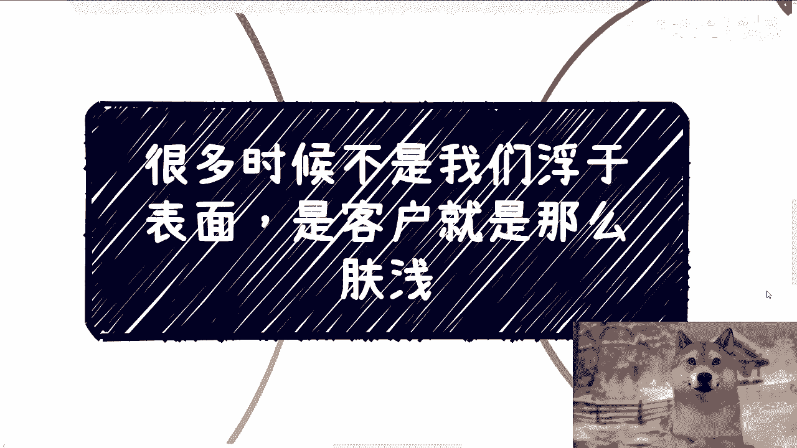

# 课程名称：商业洞察与务实执行 🎯 - 第1课

## 概述

在本节课中，我们将探讨一个在商业实践中常见的现象：为什么许多成功的解决方案看起来“浮于表面”。我们将分析其背后的深层原因，并理解“简单有效”往往比“复杂高深”更具商业价值。课程将围绕客户需求、解决方案的本质以及商业成功的务实路径展开。


---

## 为什么解决方案常常“浮于表面”？

有学员提出疑问：为什么在实际的商业咨询、项目外包或产业园落地中，听到的解决方案逻辑似乎都停留在比较“表面”的层面，而自己在学校或工作中接触到的许多知识却复杂得多，但在这些实际场景中似乎用不上。

本节中，我们来看看这个现象背后的几个核心原因。

### 1. 一切为结果服务，而非复杂度

我们追求的是以最高性价比达成目标，而非刻意追求解决方案的复杂性。复杂的东西常常是为了营销和包装而存在的。

**核心公式**：`商业成功 = 达成目标 / 投入成本`

以下是几个例证：

*   **Web3领域的例子**：在虚拟货币领域，面对交易所突发状况，理论上存在无数技术解决方案来保障用户利益。但历史上最常用、最有效的“解决方案”之一，却是交易所直接“拔网线”或进行接口限流这种简单粗暴的方式。
*   **公司内部的例子**：领导喜欢看运维系统报警并据此让团队加班修复。一个高效的“解决方案”可能是直接屏蔽领导看到的报警信息，让系统对领导显示“一切正常”，从而隔离了问题表象。
*   **人工智能的例子**：与其投入重金开发复杂的人工智能识别系统，有时雇佣外包客服在后台进行人工处理，是成本更低、效果更快的解决方案。

真正的解决方案往往朴实无华。复杂通常服务于市场宣传，而非问题本身。

### 2. 客户需求决定了解决方案的深度

上一节我们讨论了解决方案的本质，本节中我们来看看决定方案形态的关键因素：客户。

很多时候，并非我们愿意浮于表面，而是因为客户的需求和理解能力决定了只能如此。

*   **客户往往不知道自己真正要什么**：在撰写项目计划书、标书或提供咨询时，尝试过无数方案客户都不满意。最终得出的结论是，多数客户自己并不清楚核心需求。当他们不懂时，只能理解和接受“表面”的东西。
*   **沟通必须基于对方的认知水平**：作为乙方或供应商，如果讲述过于深入的内容，客户无法理解，就会导致沟通失败。因此，只能提供他们能看懂的“表面”方案。
*   **“格局”与“务实”的错位**：真正有决策权、能批大额预算的客户（通常是领导），其技能点更多在“宏观格局”和“向上汇报”上。他们需要的方案是能支撑其“格局”叙述的，而非技术细节。而真正懂技术、有具体需求的中下层，往往又没有足够的预算审批权。

### 3. 打破关于“成功”的固有思维

我们常常被一些默认的“成功模板”所束缚，认为赚钱必须遵循特定路径。实际上，社会是多元化的金字塔结构，每个层级都存在商业机会。

以下是需要摒弃的几种固有思维：

*   **赚钱必须开大公司**：认为必须成立大型公司、雇佣众多员工、进行多轮融资。
*   **成功需要华丽头衔**：认为中标必须依靠顶尖技术团队或精英学历背景。
*   **业务必须高深复杂**：认为只有从事高精尖的项目才能赚到大钱。

**核心观点**：社会的每个金字塔层级都有人赚到钱，甚至赚到大钱。成功并不局限于顶层。关键在于在自身所在的层面，找到最高效的盈利模式。


### 4. 需求与理解的悖论

这是一个深刻的商业悖论：有需求的人，往往不理解需求；理解需求的人，往往自己就能解决，而不产生对外需求。

*   **悖论分析**：如果一个人真正熟悉某个领域，他通常会在自己的关系链内解决问题，而不会寻找外部合作方。因此，会寻找外部供应商的客户，本质上是因为他“不懂”。既然他不懂，供应商做“深”了也没有意义，因为他无法理解和认可。
*   **深度合作的真实动机**：即使在我熟悉的领域，我仍然出钱找别人，通常只有两种原因：
    1.  **流程需要**：为了花掉预算或走个流程，并非真正需要对方的技术。
    2.  **补充非技术资源**：我需要对方拥有的、我没有的资源，例如**关系链**、**沟通包装能力**、**成功案例背书**等，这些都与硬技能无关。
*   **结论**：市场上许多书面需求只是“幌子”。深入的需求凤毛麟角，且通常轮不到普通从业者。但**不做深入的东西，并不妨碍我们赚钱**。

---

## 束缚你的往往是自己

承接上文关于思维定式的讨论，最大的障碍常常源于我们内心对“成功形式”的固执想象。


例如，有咨询者说他的目标是“赚钱”，但具体描述却是：要开一家门面高大上的公司，并计划进行A轮、B轮、C轮融资。当被问及这些形式与“赚钱”的直接关系时，他却无法回答。


**核心代码**（比喻）：
```python
if 目标 == “赚钱”:
    路径 = 选择最高效的盈利模式()  # 可能是简单的、轻资产的
else:
    路径 = 追求想象中的“成功形式”  # 可能是重资产、高风险的
```
很多人被困在了 `else` 的路径里，追求形式而忘记了本质。

---

## 总结


本节课中我们一起学习了：

1.  **商业的本质是务实**：有效的解决方案往往简单直接，追求的是结果与成本的最优比，而非复杂度。
2.  **客户需求是导向**：解决方案的深度受限于客户的理解能力和真实（常常是模糊的）需求。沟通必须建立在对方认知基础上。
3.  **成功路径多元化**：需要打破“开大公司、搞融资、做高深技术”才能赚钱的固有思维。每个社会层级都有其商业机会。
4.  **理解需求悖论**：真正的深度合作需求稀少，大量需求是表面化的。作为供应商，应聚焦于客户能感知和付费的价值点。
5.  **聚焦最终目标**：最大的束缚常来自于自己对“成功”应该是什么样子的刻板印象。务必厘清“目标”（如赚钱）与“手段”（如开酷炫的公司）的区别，避免本末倒置。


记住，**很多时候，不是我们浮于表面，而是市场需要和客户认知决定了，最有效的路径往往就是那条看起来最“朴实无华”的路**。