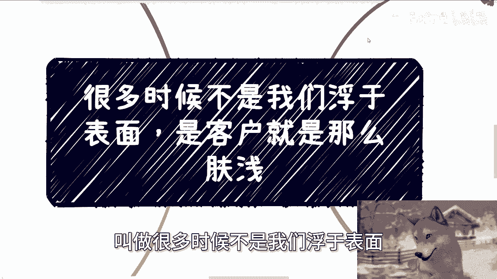
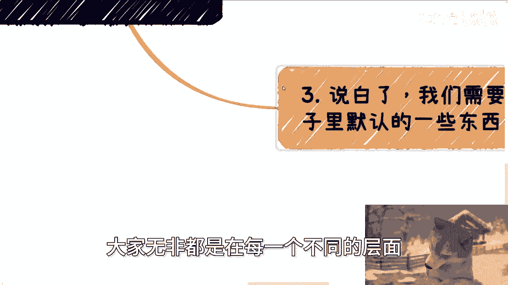
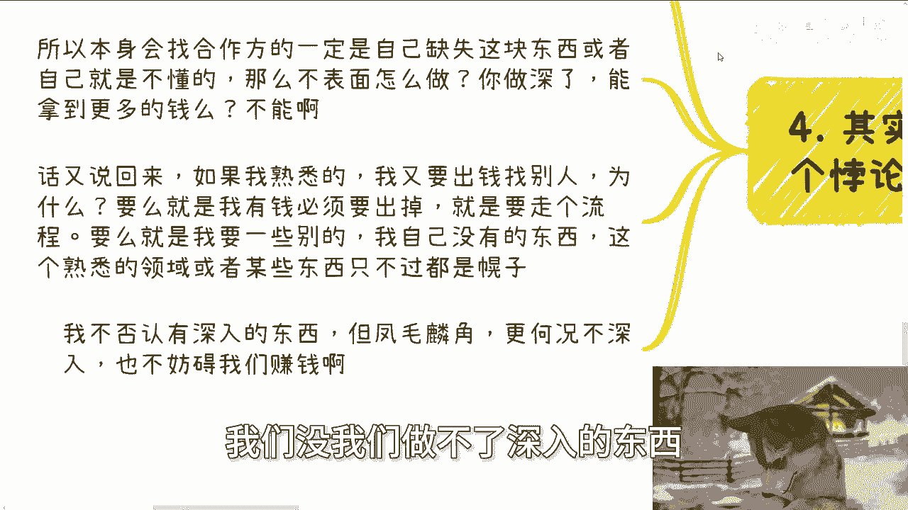
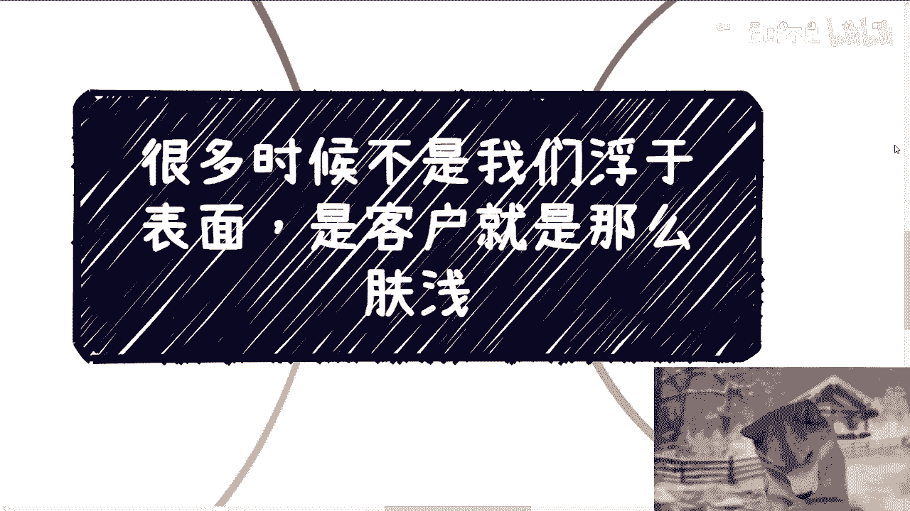
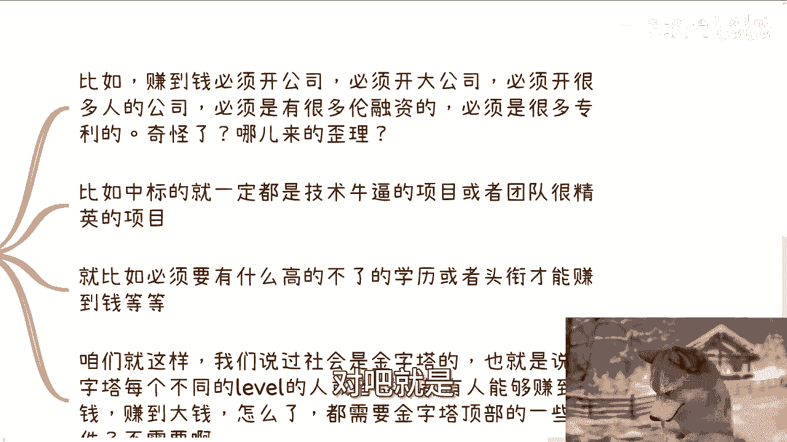
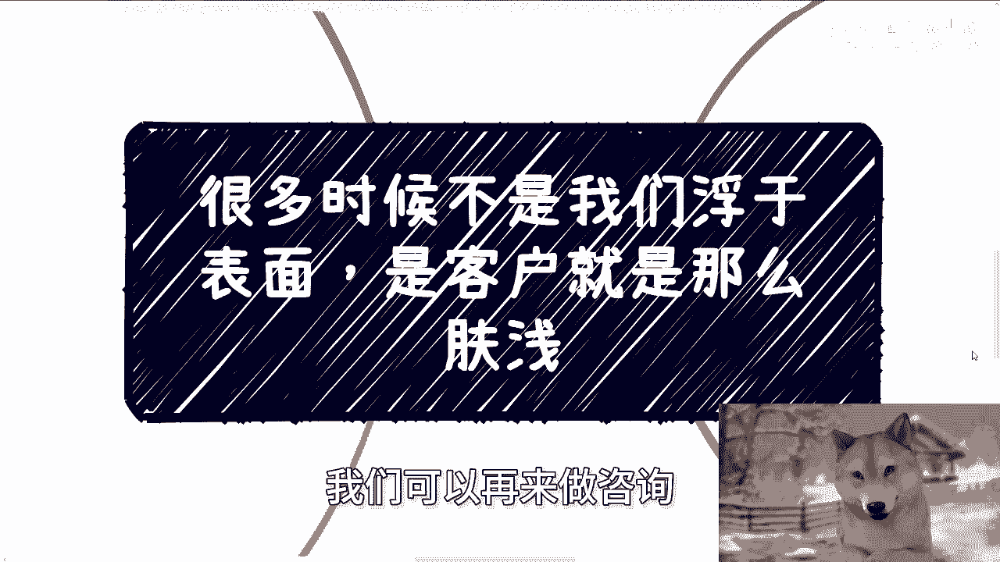

# 很多时候不是我们浮于表面，是客户就他妈那么肤浅 - P1 - 赏味不足 - BV1BptjegEUj

啊大家好啊，首先这个我家咪咪现在疯了啊，到到处他妈的乱跑嘶哎呀。

然后那个啊下期活动已经定了啊，9月21号啊，在杭州下午一点到六点好吧，在杭州啊，杭州好久没去了，那么本周啊本期啊开始定了几个新的主题啊，也不能一天到晚老主题啊，一个是我会私下跟大家分享一下。

这次上海大会的时候，我跟一些研究院院长聊下来，就是最新的一些关注点吧，啊关注点啊，一个是我现场给大家会看一下，之前我跟高校，包括呃产业园呃谈的一些详细方案啊，还有一些PPT啊，因为时间也过了很久了。

所以其实我觉得拿出来可能也没什么太大，所谓啊，那么报名跟了解详情的可以私信我啊，那么今天我们来讲这个主题啊，叫做很多时候不是我们浮于表面。

是他妈客户就这么肤浅啊。

为什么啊，因为前两天有小伙伴这么问我，他说有小伙伴他就说他说他一直有个疑问啊，他说为什么啊，听上去陈老师讲的逻辑，无论是咨询还是产业园落地，还是说是项目的外包啊，还是说一些别的东西的。

就各种各样的乱七八糟的东西啊，落地都是比较怎么说呢，就是他他的原话就是比较表面层的啊，但是我这边解释一下，可能他觉得是比较简单，不是那种特别复杂的啊，呃但是呢他自己啊通过自己的这个工作啊对吧。

本科硕士期间啊，看到的学到的很多东西呢，他他反而觉得就很复杂，但是呢好像就是在我的逻辑当中呢就没用啊，那当然不叫没用就没用上啊，没用上啊，好那么换而言之呢，他的问题意思就是说，就是社会当中很多东西。

会不会涉及到一些高深的技术，或者一些复杂的逻辑啊，今天呢主要就是就这个问题我们来探讨一下啊，首先我先举个例子啊，在web3也就是CRYPTO虚拟货币的这个领域啊，出三了，那屋爆嗯嗯啊。

那么我们早年的时候啊，其实很多人一直在讨论，怎么让自己的这个利益最大化啊，或者说呃应对一些突发的情况，尤其是交易所啊来保障一些人的利益啊，你说有没有技术或者高深的技术可以实现，当然有啊。

卧槽那他妈解决方案，无论你要解决什么问题，解决方案都是十几套几十套的，对不对，有什么不能弄的，但是到最后呢你会发现用的最多的，最常用的流流传，哼这个这个时间最长的是什么，拔网线对吧。

或者来说可能没有这么简单粗暴啊，他可能比如说啊做个接口的线限流对吧，或者怎么样子，对不对啊，那么你比如我们以前在公司里面，我们的领导特别喜欢看运维的系统报警啊，每天他妈到到到晚上到凌晨就他妈报警了啊。

然后呢领导看着哎这个地方有问题，然后让大家加班啊，开始修bug对吧，最后呢我们怎么修bug呢，修bug不如把直接直接把公司领导屏蔽掉，领导看到的都是通过的，都是pass的，没有bug对吧。

直接将领导跟现实是现实的结果隔离，对不对，所以说啊我们以前说过一句话，叫做什么叫做真正的解决问题往往朴实无华，哪他妈这么多复杂的东西啊，不存在的复杂东西都是包装出来的对吧，所以我们得出结论是什么。

我们一切是为了结果服务的，是不是简单或者复杂并不重要，你们我可以这么告诉你们，你们所知道，很多复杂的东西都是为了营销而营销，为了推广而推广，为了市场效果而出现的，就这么简单啊，这就好像什么。

这就好像今天他拿一个我们随便说啊，他拿一个非常简，非常非常普通的一个一个牛肉给你，但是他推广的时候跟你讲，这是M九M十M11对吧，卧槽这个这个和牛对吧，这个这个这个吃金子长大的对吧，吃他妈的啊。

这个这个呃各种比如说什么叫什么啊，吃那个米其林餐厅的东西长大的，对不对，就你听上去卧槽牛逼对吧，然后你比如说包括很多东西，什么说自己冷链对吧，很牛逼或者怎么样子，没有没，你会发现很多的解决方案。

你真的落到实处时候朴实无华对吧，你就好像你就好像又说到之前那个那个叫什么，无人工智能也是的，你与其花重金真的做识别，做人工智能，你你你你雇些外包，雇雇些客服在后面不好吗，对不对啊。

所以说我们追求的是什么，是赚钱的性价比，而非是一定要去把一个，明明可以通过简单方式解决的问题，非要用复杂的方式解决啊，从而体现出你的牛逼没有用啊，那么第二就如我主题说的是我们浮于表面吗。

啊我告诉你是他妈客户好吗，是他妈客户不配好吗，啊那么当然你也不可能明着跟人家甲方说，甲方吧，对不对，那甲方是爸爸，你能怎么能说人家呢，那他妈就是啊，对吧啊，就是我曾经也说过，无论是我以前写项目计划书。

项目申请书，标书还是写方案，尤其是我做咨询培训的时候，我曾经尝试过无数种方案，对方都不满意，我也换过无数的供应商，对方也不满意，结果呢结果就是我只得出一个结论，那就是客户。

他妈的自己根本就不知道自己要什么啊，或者说他他他知道自己要什么的极少啊，或者可以理解为真正自己要什么的，往往也都是所谓的中下层，给不了多少钱，什么意思呢，意思就是说你会发现。

客户根本不知道自己要什么的时候，那么他只能要表面东西，因为他妈的你跟他讲深的东西，他不懂啊，对不对，好，那么真正自己知道要什么的呢，往往是那种比较接地气的，但是往往接地气的人呢。

他也没有就是批那种大金额的那那那种权利，那我就问你要不要这种客户嘛，对吧，就就这么现实怎么办呢，啊领导都是吗，我以前只说过，领导当然不是，只不过领导点的技能点，更多的点在了所谓的宏观，所谓的格局哦。

格局所谓的向上汇报，当然对于你们很多人来讲，你们会觉得所谓的宏观，所谓的格局，所谓的向上汇汇报没有管用，因为你们觉得很虚，但是我只能告诉你们，不好意思，真正的很多单子就是这么虚的来的。

你告诉我十怎么个死法，十得起来吗啊十得起来，十的人你能到上面吗，啊到上面，我看看，啧对不对，就是跟牛牛马的技能点他是不一样的，所以我作为供应商，我作为乙方，我只能浮于表面，否则他们看不懂啊，对不对。

那么我们反过来说，他们看不懂就会认为我是，懂吗啊，第三说白了我们需要去掉，就是在你们脑子里面默认的那些东西，比如说啊赚到钱必须开公司，必须还他妈开大公司，必须还他妈的开养很多人的公司。

必须开他妈的那种融很多轮轮融资的公司啊，还必须得要有很多专利，比较软著，谁他妈跟你说的，哪来的歪理啊，啊妈奇了怪了诶奇了怪了，我都不知道这种逻辑哪里来的啊，比如说什么中标的。

就一定是要什么技术牛逼的团队，或者说什么什么北大清华的团队对吧，很精英的项目，谁跟你讲的啊，就比如必须要做一些项目，做赚些钱，必须要一些什么高不了了不得的学历或者头衔，才能赚到钱，谁跟你讲的。

哎我就这么跟你们讲啊，咱就这么说，首先社会是多元化的，这得你们认可吧对吧，社会每一个层面都是金字塔型的，对不对好，那么也就是说你要明白，也就是说金字塔每个不同级别的人或者群体，都是能够赚到钱的，你懂吗。

也就是说你你不能说没有头衔，没有政政治地位没有，就是说高学历的人，他在金字塔底层就赚不到钱没有，不是的，每一个层面都有人赚到钱，也都有人赚到大钱，你们想想看哦，所有赚到大钱人。

所有赚到钱人全部集中集中在金字塔顶顶层吗，谁他妈跟你说的，对不对，没有啊，就是大家无非都是在每一个不同的层面里面。

去赚不同的钱，但是你说他赚不到钱，这个我觉得夸张了对吧，第四啊，你会还我，我还是要强调那句话，就是你最终会发现需求和了解需求本身，它就是个悖论，你懂吗，就是你要一个有需求的人，你又要让他懂需求。

这是不可能的，因为为什么，因为道理很简单，如果你是一个熟悉某个领域的人，咱都不要说你是专家啊，你只要熟悉的，你真的要做什么，你会找外人吗，不会的，你肯定在你的关系链，在你的熟人之间。

你就把这个东西做掉了，对不对，否则你就不是属于这个领域的人，所以否则你就是个嘛，对不对啊，好那么所以说本身如果会找合作方的，一定是因为他不懂，也就是自己缺失这块东西对吧，或者他就是自己不懂。

那么你你你你说一个供应商给他不做表面，做什么呢，做生了能拿到更多的钱吗，不能啊，那我为什么要做深呢，是不是好，那么咱又话又说回来，如果是我熟悉的领域，是是我熟悉的东西，我又我我我还要出钱找别人的话。

为什么很简单，要么就是我有钱必须要出掉，我不是为了找人，我只是为了要把这笔钱出掉，走个流程，要么就是我需要在别人身上找一些，我没有的东西，但是这个没有的东西一定不是某些技术，或者某一些什么什么什么呃。

叫什么学历或者某些东西，它一定是一些，比如说关系链啊，或者说呃叫什么，就是就是可能能说会道啊，或者能够把一个东西讲的别人能明白啊对吧，或者他身上有些更多的案例啊等等等，他一定不是跟那些硬技能绑定的对吧。

那么这个时候你会发现某些写出来的需求，或者营销出来的需求，或者来说曝光出来的需求都只不过是幌子好吧，那我不否认有深入的东西，但是凤毛麟角，更何况我们作为普通人，我们没我们做不了深入的东西。

但是不做深入的东西，不妨碍我们赚钱了，对不对。

所以说很多时候你会发现我昨天为什么说，我说我说束缚自己最多的PV自己，最多的就是自己，因为就像就像我之前有个咨询的人也是的。

那天晚上我记得很清楚，我问他，我说我说你的目标是什么，他说我要赚钱哦，那我就不明白了，我说那你赚钱，因为你知道吗，他是这么说的，他说我我我我我我想开个公司，而且我还是需要那种有门面的。

就看上去高大上的气派一点的，那我说你目的是什么，是装逼吗，不是那我说我说你目的是什么，他说我目的就是赚钱，那我说你们去赚钱，为什么要蒙面呢，我为什么要高大上呢，我搞不懂呀，而且他还跟我说。

他说我我还想着A轮B轮，C轮D轮融下去，我说我挂不懂，我没听懂哦，我说我是真没听懂，我说你可能不太明白，有很多公司一年流水五个亿六个亿，但他利润可能是负的，哎我操，那这个事情跟你赚钱有什么关系呢。

他妈屁关系没有对吧，就是就是我发现很多人脑子里面他就固有思想。

就觉得哦我必须要做这些东西，但是你问他做这些东西能不能赚钱呢，不知道的，唉我认为可以，你认为可以有卵用啊，是不是啊，嘶唉行啊，就这么着吧，今天反正这个核心思想就这么个意思啊，呃OK然后下周六啊。

下周六这个杭州的活动好吧，报名的继续报，然后剩下的话就是说呃工作上面啊，职业规划，包括商业上面啊啊不包括副业上面商业规划啊，你们里面涉及到一些合同啊，分红啊，分润啊，股权啊，融资啊对吧。

呃包括你们自己觉得这个业务上面有哪些，就是说可能自己没想清楚的点啊，或者怎么样子的啊，你们可以整理好对应的个人问题，跟个人背景好吧，或者项目背景啊，我们可以再来走咨询啊。

行啊。