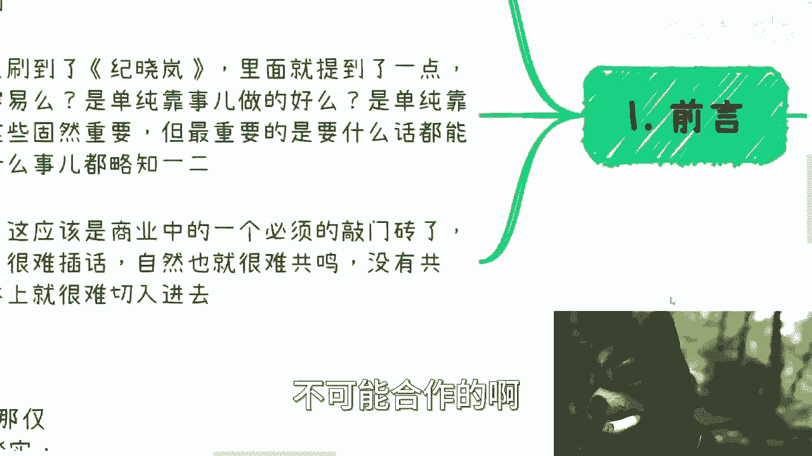
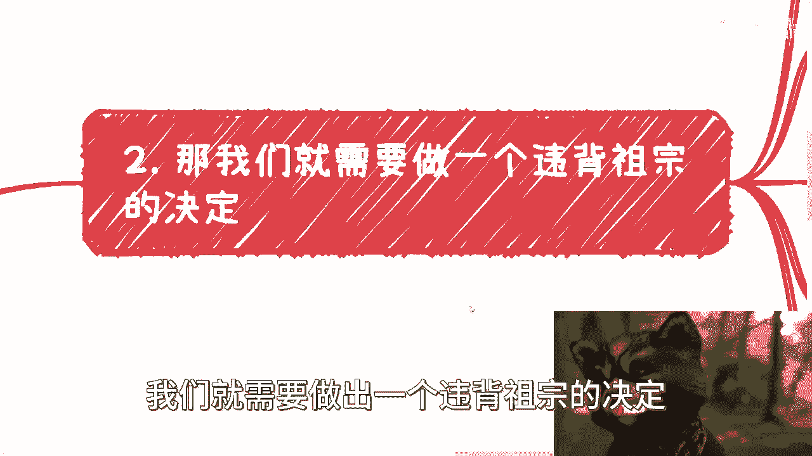
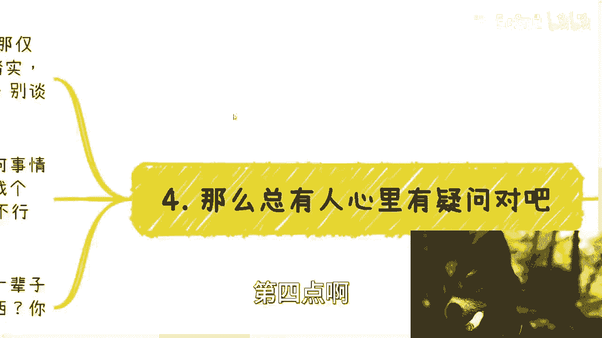

# 很多时候，你需要博学，而不是会或者懂，更不需要精通 - P1 - 赏味不足 - BV1vQ4y1J7Md

啊大家好啊，我们今天啊我六点的时候发了一个那个收费的，就是那个专属的视频啊，然后反正也开了一个新的专题，呃，今天我们这个内容呢主要来讲的是说呃，很多时候呢你需要的是博学，而不是说会啊或者懂啊。

就更不需要精通呃，这个东西呢你就像我在这个地方，第二条写的就是呃可能很多人看到这个东西呢。

就感觉我们需要做一个违背祖宗的决定对吧，那没办法啊。

那的确没办法呃，首先先说一下前沿啊，就是我先做一下铺垫啊，呃我甚至认为呢就是本子的这个主题啊，它基本上是呃做商业的根本或者说其根基啊，但是怎么了解呢，哦可能比如说不同的知识需要从不同的场景。

不同的人去了解啊，有的人比如说命好吧，我觉得了解到有的人一辈子都了解不到，但是甭管我们命好不好，你总归得要去做尝试嘛对吧，就像就像我一直说呃打工跟商业对吧，或者说你呃你这个叫打工跟赚钱。

它是两条平行线啊，它是两个不同的生态，两个不同的这个这个甚至是两个不同的世界，对吧，你要从A世界切到B世界，那你总归是要主动的，你难道指望B世界的人来拉你吗，那不可能的呀对吧，你就像我现在做这些视频。

我最多只能告诉你们怎么样怎么样，你们大部分的人啊，只要但凡私信过我说哎，比如说因为其实到现在为止，其实蛮多人找过我的啊，就说什么啊，能不能给我做啊，啊能不能能不能比甚至免费帮我做啊对吧。

也也还有倒贴帮我做的，我不要我都不要我，我都是两个字啊，感谢啊，然后不行，对不啦，就不可能的，你知道吗，因为我们任何人，你只要是正常做商业的，没有人愿意冒风险的，因为你要明白你们就是相对我们来讲。

你们对于商业没有任何认知，你们简直都是定时炸弹，而任何一个时候都是定时炸弹，你知道吗，所以说就是就是一切只能靠你们自己去啊，G g，至于这当中是不是能够很好地了解到很多东西，这个东西要靠机缘巧合啊。

他不是说啊一定怎么样怎么样对吧，但是这个东西就是你们不主动，那就一定不怎么样怎么样啊，那么前两天呢，我又在B站上面刷到了那个纪晓岚对吧啊，里面就提到一点，就是和珅说啊，他说伺候皇上啊，容易啊。

他说不容易，为什么呢，因为你看啊你伺候皇上是单纯靠事做得好吗，是单纯靠拍马屁拍的好吗，并不尽然，因为你这些东西固然是重要的，但是更重要的是什么，就是你什么话都能接得上，你什么事都能略知一二。

你各种各样的东西，你得能够沟通得能够了解对吧，那这个才是长久之计，否则的话你说啊隔个两三天啊，这个话都话不投机对吧，都说都说不到一起，然后就感觉这个认知面对吧，知识面，还有这个叫这各个的这个角度。

都格局不够大对吧，那你说还要你干嘛对吧，还怎么个沟通法啊，你就好好干事就好了，那你不就还是退到，你就好好的干活，好好的执行不就好了吗对吧，那我想了一下呢，这应该是商业当中一个必须的敲门砖啊。

这个反而是一个最大的敲门砖，也就博学啊，如果你没有剥削，你就很难插话，你很难插画，自然就很难有共鸣，你没有共鸣，那很难就有切入对吧，因为任何的东西你们想想看啊，你们跟任何一个人沟通。

你们要的是对方要觉得你们是有足够的格局，同时呢你要让他感觉到啊，有这种共鸣感，然后要让他也不叫非常主动啊，就让他有这种诶，就像你们谈朋友一样的，就让他对你要有一定的好感对吧，那么你这个时候跟他提出来。

你说哎我们比如说合作对吧，我们怎么样子，那才有可能性。

否则怎么可能合作呢，不可能合作的啊。

好那么第二点就像我刚刚说的，我说我们就是要做出一个违背祖宗的决定。

为什么，因为嗯你看啊，曾经有一个评论一直让我记忆犹新啊，他大概的意思就是说啊，原来那呃就他点击我那个视频嘛，我忘记哪个视频啊，反正他意思就是说，原来呢原原本以为我是教实战跟技术的啊。

然后呢他的原话就是说，没想到点进来一看是虚的啊，讲虚的啊，讲讲这个宏观的啊，好那么我们来看啊，我相信正常人，普通人啊在进入社会之前呢，几乎百分之百啊，这个几乎百分之百可能就99%吧，99。9%吧。

啊他都是认为呢要踏踏实实做事情，要做好一件事情，要学习一技之长，要找到一份稳定的工作，那这些理念并非自己所有，有的可能是自己所有，有的是家长跟学校的PUA，但是就我感觉啊。

每一个人从小到大成长的环境里面，他不太可能自己能悟出来说哦，我一定要踏踏实实做事情，我一定要有一技之长，我一定要找一份稳定工作，我觉得大家不会的，我觉得一个正常人不会的，他之所以有这种想法。

就是因为一定是被批评出来的，一定是被灌输出来的啊，那么甚至我跟你讲，还有很多人会羡慕那种简历上拥有各种，精通各种各样技能的那种人啊，然而你要明白啊，在商业层面赚钱啊，就是叫做单位时间内能够赚多少钱。

是唯一的衡量标准，你知道吗啊是唯一的衡量标准，富二代，富二代对吧，那么这个可能是能够有加分项，但是同样的你这个人的格局，你这个能认知你这个人的单位时间内赚多少钱，是你的价值，而不是你父母的价值。

你父母的价值，你父母再牛逼，唉如果你是个叫什么扶不起扶不起的阿斗，那基本上别人也不会看重你啊，你要明白，那么我可以说啊，你赚的到你就是王者，赚不到就是，呃不要去谈当中那些有的没的，你知道吗，就别去谈。

就说哎呀，因为我学历怎么样啊，我我因为我当初努力过来对吧，当中我可能因为一些小失误被人坑了，或者怎么样，别管啊，胜者为王，败者为寇，结束了，没办法，就这个样子的，你不要你不要来问我说啊。

这个为什么这样子，你也不要就是说啊。

就好像看完看到这就觉得我的，这个人瞎扯对吧啊，没有意义的，你觉得怎么样，我觉得怎么样都没有用，因为我们都无法去左右大局，我们都无法左右大环境，就这个样子，那他就这个样子，你能怎么滴呢，你想你随便怎么想。

无所谓啊对吧，那你的合作伙伴或者其他的人，我跟你讲是没不会有多废话的啊，他是会从你的结果直接来反推，你是怎么样的一个人啊，那么那么我们需要做一个决定，那就是说是什么，踏踏实实做什么事情啊。

什么就说什么一技之长，什么稳定工作，我跟你讲都他妈是，你懂吗，就是你必须切入商业市场，你必须切入已有的这些商业模式，你必须成为已有商业模式里面的，这个其中的一个环节。

你也必须要拥有能够高性价比赚钱的能力，你知道吗，这就是我觉得只要有一定野心，有一定想法，有一定为了未来抗风险能力的这么一些人啊，甭管你什么性别，甭管你什么学历，你就应该有的这么一个思想。

对吧好，那回到最早我们说的这个东西啊，虚虚怎么了呢，哎诶什么叫虚，什么叫实对吧，那请问什么叫技术啊，你难道说包装不叫技术吗，难道说难道说这个这个能说会道不叫技术吗，难道说这个能够说服用户，能够说服甲方。

让甲方出钱，不叫技术吗，啊只有你写代码，只有你在那边搞那些所谓的科研，在教技术嘛对吧。

Who care，那么第三博学学什么啊。

我们这都既然说博学认知强，对你说学什么啊，我还记得机器人咨询的时候呢，我跟小伙伴这样说过，我说什么叫沟通啊，什么叫社交，什么叫博学，商业上的沟通就是你无论碰见谁，无论对方是谁，你都要听懂多少啊。

你都要听得懂啊，多多少少就是聊的是什么东西，你得能接得上话啊，那么才会有所谓的合作的可能性啊，否则一点可能性都没有，对方也需要对方，只有听到你可能能够硬核的上，那么他才有可能和有合作的意愿对吧。

那么当然是呃，当然主要是宏观和框架上的东西，就是不是说你今天就像我们打个比方说，你说我要了解互联网对吧，好那互联网里面有什么东西啊，你得有各种各样的术语对吧，那他可能有不同的岗位对吧，就像我们这边说的。

你比如说有些政府组织对吧，各行各业，你比如说协会商会组织架构怎么样子，比如说融资对吧，一级市场，二级市场期货对吧，包括量化分别是什么东西，你不能别人讲的，你不知道啊对吧。

那你比如说互联网我们刚刚提到的对吧，运营啊，市场销售，产品运维啊等等，他联网里面相对的岗位啊，这些术语啊，你也得知道吧，而他们到底是在整个比如说软件工程里面，处于怎样的位置，你都得知道吧。

啊你包括就是说我不管你什么行业的，你甭你甭跟我自己去想说，唉我好像是这个专业的，我怎么领域的不重要，就就我就说嘛，就说你今天有没有足够的能力，能够高高性价比的赚钱，你能不能有足够的能力去制定游戏规则。

如果你不能，那不好意思管他们，你是什么专业呢，对不对啊，你跟我们去谈商业，在那边说哎呀那个陈老师啊，我我是计算机专业的，你们讲的这个金融的东西，我不懂，你不懂滚啊，你不懂干什么，跟我们有什么关系啊。

who care啊啊，地球缺了，你不转了，对不对啊，你打我发现真的很多人就是思考问题，就非常的神奇，你知道吗，就是就是就是他又要就是哎呀，好像希望别人帮他，你知道吗，然后呢他真的碰到一些问题呢。

然后他就来跟你说，哎呀这个因为跟我专业没关系对吧，你看我也不懂对吧，那他们怎么地啊，哦天上馅饼掉下来，他妈掉你嘴里啊，我对吧，然后你看我这边写了，当然也包括一些热点，就是AIGC里面的这个呃。

大语言模型是什么啊对吧，提示词训练是什么，你总得知道吧，你懂不懂，我不管啊，那么就好像我们再举个例子，就好像你去学校谈生意，你总得知道K12是什么吧，哎我跟你讲，真搞笑了，我跟很多人沟通下来。

每次讲到K12啊，K12是什么，你知道吧，哎你总归得要知道小初高对吧，他比如说里面有哪些学科对吧，可能大家能合作怎么合作对吧，比如说如果做培训，可能现在家教啊，各个培训班怎么做的对吧，然后竞赛啊。

比赛啊，有他基本上有哪些生意可以做，然后国内国外如果要留学，大概是怎么流产对吧，比如你要去协会成员一般都怎么去招商引资的，一般招商引资流程怎么样子的，你都得去了解吧，当然你说你要去咨询我也没问题。

你就一个小时问这些问题也没问题，但是问题是你这一辈子成了，你总不能什么问题都问我吧对吧，对不对，而且啊我也跟你们讲啊。

我我就这么跟你们讲，我到现在大概有那么五个人。

我估计一只手吧，反正就那么四五个人吧。

真的不是说大家，因为也真的也不需要大家相互尊重吧，就是就是说我不是说大家这个出了钱对吧，我就一定会接这个咨询，并不是因为我有好多人是什么呢，就是要么就是说他自己也想不清楚，他想不清楚他要什么对吧。

然后要么就说是属于那种，可能怎么说呢，就是说就我自己判断吧，我给他的建议其实对他没什么用，因为他可能自己压根就没有主观能动性，对就是他属于那种就是啊我想做事情的哦，我想比如说赚钱的，我想干嘛干嘛。

但是我不愿意做，我懒对吧，这种我就不用不用咨询了，咨询干嘛呢，你别说你给我500，给我5万，我也不做这个咨询，这个就没有意义的呀。

对不对啊，那么总有人啊，第四点啊。

总有人心里有疑问对吧，我给你讲很大部分的人对吧，说到这他就要觉得说了，他说我觉得自己空啊，我觉得自己虚啊，自己心里有点没底，一点都不踏实对吧好，那我就告诉你，你之所以有这种想法。

是因为全部都是你自己的心理作祟，全部都是因为你被PUA出来的，结果都是你自己的心结对吧，我就还是那句话，你每个人自己要做成什么样子，自己选择，你要选择踏实可以，那你去卷，我请你好好卷啊。

我不管你是卷学术卷，卷这个政治还是卷打工，你就好好去卷，你就好好学习呃，卷科研也可以随便去卷，你别要谈钱啊，你有多大能力，多大的概率卷的出来，你自己去评估一下，我不说你自己去看，对不对啊，那么第二点啊。

博而不精，不是容易被骗吗，对吧好，我跟你讲这事也简单啊，我们人是活的事情是死的，什么意思呢，你做任何事情都可以找外包，对不对，好，那你去找啊啊，你别找一个，你多找几个，找他个四五个，找他个五六个对吧。

然后你开始开始开始玩个游戏，叫做找相同总会了吧对吧，哎找五六个外包，问问五六个外包要solution，你在当中看看哎，这当中有哪些写的大差不差的对吧，那你不是一眼就能看出来哪个外包是来骗你的。

或者哪个外包就溢价溢到高的，你要明白你是甲方啊，啊你要明白你掌握了整个的这个这个叫什么，就是链路的核心啊对吧，而且退1万步来讲，你只要拿到单子了，实在不行，找顾问花点钱，花个5000块钱，1万块钱。

花个5万块钱，给点钱，找个顾问帮你把把关不好吗，不就解决了吗，啊那问题能靠钱解决，为什么一定要靠自己去学呢，我就不明白了对吧好了，我跟你讲啊，哎呦我跟你讲，真的每次说到这种问题下面，评论区总会有人说。

那他妈照你这么说，大家都去搞了，没人学，这这是你要担心的事情吗，哎呦我他妈也是绝了，这是你我要担心的事情吗，啊哥哥们啊啊我跟你讲啊，如果你还有疑问，那么我就是我，我觉得你就思考一个问题。

你一辈子能有多少时间，能有多少精力学习，能有多少单学习的这个呃呃呃呃呃，有非常强的这个学习能力的时间去深入技术，你能有多长多少的时间去紧跟趋势，你能所谓的精通多少的东西，我就请你自己评估你一下。

你是不是这块料，对不对对吧，就每个人都要做每个人适合的事情，你说你不是这块料，或者你爸妈也觉得不是不是这块料，然后你还要说哦，我非要去学一技之长，傍身，帮个屁呀啊。

好吧，所以说啊，你就是我觉得在这个地方也是也是一个，就是说提示吧，啊就是说我们做任何的商业都可以啊，我们怎么去做业都可以，但是呢只要大家希望啊，未来自己能够有一定的社会地位，或者说能够有一定的投入。

产出比高的赚钱的可能性啊，或者说呃能够想看到自己，就目前不在的这个平行商业的，这个平行世界里面的各种各样的东西，你要切入找到一个缝隙，往里面切的话，那么你必须要剥削，没有办法的啊，好然后最后我再提一点。

博学这件事情，跟你的年纪跟你的学历，跟你的性别，跟你的各个方面都没有关系，不要为自己找借口，你知道吗，因为太多人就说哎呀陈老师，我现在还小，哎呀我还没毕业，哎呀陈老师，我是个我是个小姑娘对吧。

然后哎哎陈老师，我这个专业很冷门，我跟你们讲不重要的，还是那句话，你们是围着别人转的，不是别人围着你们转的，明白吧啊，行啊就这么着吧啊大家呃商业好吧，大家商业上，副业上或者其他方面有任何的不清楚的。

你们啊，或者说有有有任何的，比如说那种自己搞不清楚合同，不知道怎么签到或者怎么样子的，你整理好问题好吧，你可以再来咨询啊，嗯所有都随缘好吧。

