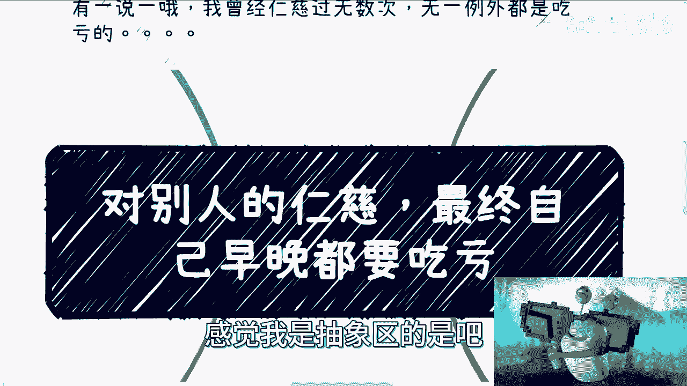
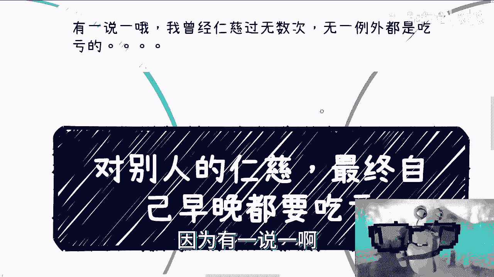
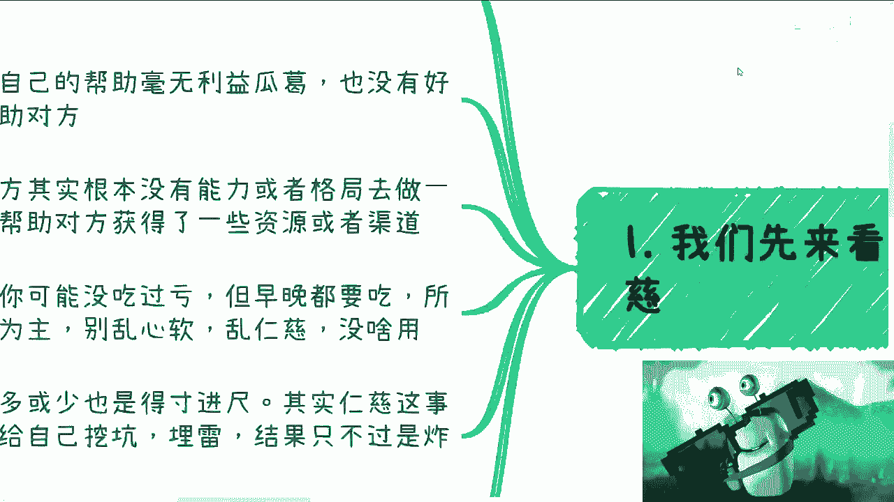
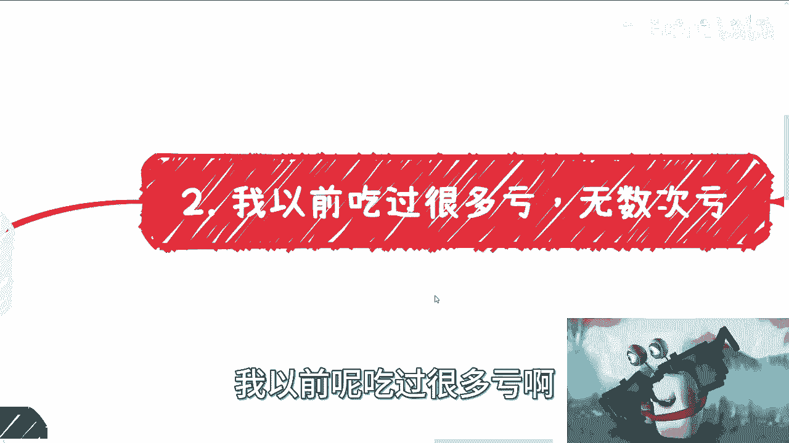
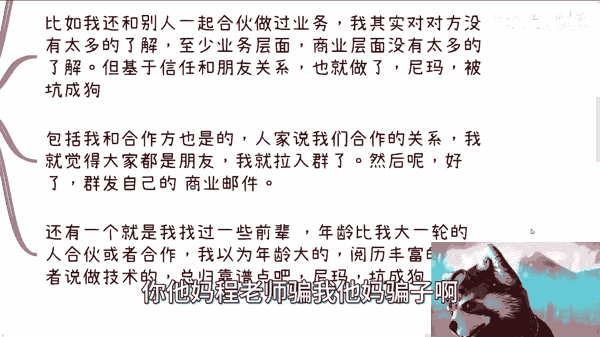
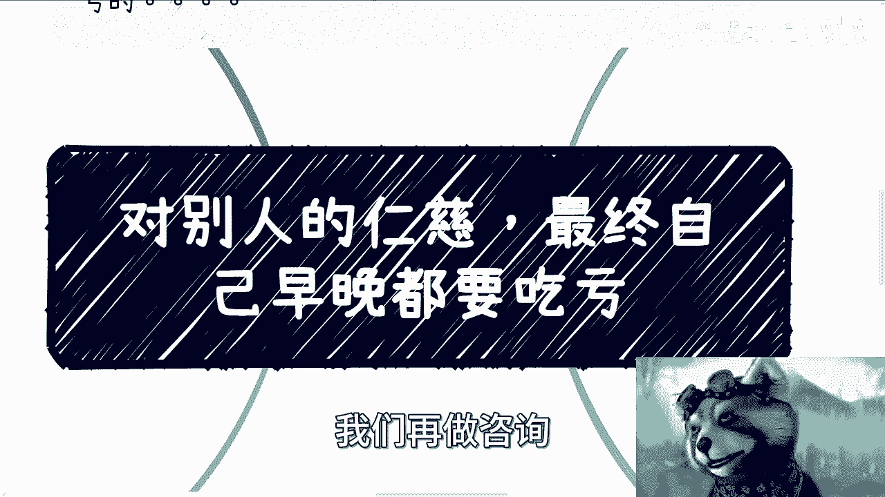

# 心软或者对别人仁慈，其实都是自己给自己埋雷 - P1 - 赏味不足 - BV12Q4y1x7dJ

好大家好啊，我现在这个感觉我是抽象区的是吧。

呃我们继续来说啊，就这个主题啊叫做人间清醒是吧，嗯这次讲的呢就是说对别人的仁慈啊。

最终自己早晚都是要吃亏的啊，为什么呢，因为有一说一啊。

我曾经仁慈过很多次，无一例外都是吃亏的，可以很明确跟你们讲。

呃首先我们先来看看什么叫仁慈啊。

我总结下来就是所谓仁慈呢，就是说感觉对方很可怜，或者说自己这个心生怜悯，但其实呢自己根本就没有这个能力帮助对方，或者说对方没有这个能力去做很多的事情，好那么这是第一个，那么第二个呢就是说是自己的帮助呢。

其实呃就就相当于是我们帮助别人呢，这当中也没有什么利益瓜葛啊，也没有什么好处啊，纯粹的就是帮助对方啊，那么第三点呢就是还有一种呢，就是对方其实没有能力或者格局去做一些事情，而你呢你的这个帮助啊。

却让对方得到了一些资源或者渠道，呃这个反正后面例子我会给你们举的，那么说白了呢我觉得这些事呢你可能做了啊，你也可能没吃亏，但是早晚都得吃呃，所以呢本质上我觉得一切的合作呢，嗯必须以利益为主。

没什么好心软的，不要乱仁慈没什么用，而且你这个多心软了之后，你就会发现可怜之人必有可恨之处啊，就是很多时候呢嗯怎么讲呢，就是你会有一种感觉啊，就是不是说我们一定看不起那些啊，这个这个是家境不好的人啊。

或者说我们看不起一些缺钱的人，而是说他们很多就是在他们这群人当中，会有比较相对比较高比例的人呢，他其实会不择手段，那么你会觉得他就是他也不会领情啊，同时呢他你帮过他，他可能还会反过来啃你啊。

就算不坑你呢，他或多或少也会得寸进尺，所以说其实你会发现仁慈这个事呢，他更多的其实不是说对别人好，而是说是自己给自己挖坑去埋雷啊，结果结果呢其实就是炸不炸的问题，或者什么时候炸的问题啊。

所以说核心在于一切利益交换啊。

不要抱有任何侥幸心理，那么这样的话最好何必呢。

你说对吧，何必呢，没有必要啊，那么我来跟你们说啊，我以前吃过很多亏啊。

无数次亏，比如说比如说啊我帮助别人找过工作啊，比如说介绍一些简历呀对吧，给到给到这个企业找了啊，然后呢这个进去了，试用期也过了，那么过了之后呢，背后开始说我不好说，我这个不好说，我那个不好呃。

你帮别人呢，别人从来不寄情，而且另外一方面呢，你要这么想，我曾经也说过，我们不要去使企图去想，那些我们控制不了的事情，就像很多人问我，他说哎这个行业未来好不好，未来怎么样怎么样，我说关我屁事啊。

这未来好不好，还是我说了算的，你有这时间去考虑这些问题，你还不如好好想想怎么赚钱，对不对啊，所以就说你说你今天做一个行为，你总不能跟别人说啊，我今天帮你了，你一定要记清，这叫道德绑架对吧。

但是你你会发现别人不记情吧，你又不开心，那索性你就别帮对吧，有什么好帮的呢，是不是啊，比如我们还跟别人，比如我还跟别人一起合作过，做过项目啊，我其实这个说实话，我对对方可能也没有这么多么多的了解。

我靠怎么回事，他怎么傻了，哎哥你怎么回事，它能使你，我靠，你们是看不到那个画面，它它能识别到我，但是他不动了，我去，我我要么重新识别一下，我天哪bug了，完了完了，你们等我一下，我重启一下，稍等啊。

稍等我重启一下，我靠这种情况我还真没看到过，它能识别到我的脸，但是他那个那个那个样子他不动就很神奇啊，呃重启一下看看好了好像好了好了好了好了，真奇了怪了啊，OK然后就是说比如说我跟别人一起做过业务啊。

我其实对对方没有太多了解呃，至少业务层面，商业层面其实都没有太多了解，那大家最多最多就是说，可能平时呃就就认为是那种朋友啊，基于信任和朋友的关系，其实也就合作了，然后我跟你讲，坑成什么样子啊。

就是啊我们去融资啊，融完资呢，人家就是说那个投资方啊，而且是很大的投资方啊，人家跑过来就跟我说，他说陈老师啊，你们这个资料有问题对吧，巴拉巴拉说一堆，然后呢就是说我觉得还好啊，就是说我们可能关系比较好。

人家就是意思就是说让我去看一下，这资料有什么问题，我跟你讲，我要是那些投资方，我肯定他妈的就在想，陈老师骗我他妈骗子啊。

给我们资料他妈全是假的，唉你说怎么办呢，对吧，就是很多时候你知道吗，就是你心软，他会连连带你一起坑，但是呢你对外呢，你跳进黄河也洗不清，因为这事情怎么说呢，你这么说，人家说我就不相信你，那你能怎么办呢。

对吧哦，包括我跟合作，我之前还有个合作方也是的，就是我我去办个活动啊，人家说我们是合作关系啊，然后呢我觉得也是大家也都朋友嘛对吧，我就拉入群了，你知道吗，紧紧接着就牛逼了。

他就给那个群里面的人来群发自己的商业邮件，对吧，就是我觉得是这样子的，你做任何事情，你提前说没问题，他也不讲，他也不跟我打招呼，然后呢就群发商业邮件好了，人家就就开始就开始说了，哎就总有人会说嘛。

哎陈老师做这个活动啊，表面上说这工艺啊，背地里这个发邮件说要那个人在家买东西，你说你让我怎么讲，我说什么都是我不对，对不对，然后还有一个呢就是我找过一些前辈，年龄比我大一轮，我以为我当时以为年龄大的。

阅历丰富的，或者说做技术的总会靠谱一点吧，尼玛坑成狗啊，为什么坑成狗呢，他就是我跟你讲也好笑的，就这个人呢就感觉自己好像是乔布斯，你知道吧，就觉得我的，我要一言堂啊，就我说了算啊，我这种就是不听别人的。

这种叫什么，就是我跟你们说，他精髓都没学进去，他妈的学到这都是糟粕啊，就觉得就是说我他妈必须说我说了算啊，你们他妈都是垃圾，然后我必须这样子啊，我就有这种乔布斯的style，妈脑子有毛病啊。

那么第三点啊，我在拿私信啊，跟这个咨询举例子啊，呃B站最近就一直到现在为止呢，私信每一天其实都很多啊，我呢也不瞒你们说啊，我一般都是回的，一般以下情况我是不回复的，比如说什么，比如说他上来什么都不说。

他就给你直接一堆问题啊，说陈老师我最近有什么问题，123456789十对吧，你给我一堆，我就问你，我怎么回，而且更何况我回来之后啊，很多人我其实一开始是回的，我只是后来不回啊，我我我回来之后呢。

他还在问，那怎么地啊，我是免费GBT，他妈人家GBT都他妈收费呢，对不对，还有就是来来回回的，就是把私信当QQ聊天的，其实我跟你讲啊，你要真的跟我聊八卦，我倒也无所谓，你对吧啊，你要真的问点啥吧。

你要这么想，一方面私信讲得清楚吗对吧，我B站一个私信来来回回，可能当中间隔几个小时，你能说得清楚吗对吧，另外一方面，就是说我也不能一直当免费劳动力啊，对不对啊，这我跟你讲啊，我当免费劳动力。

免费劳动力不是我不尊重你，是我自己不尊重我自己啊，然后另外一方面咨询其实也是的，然后在跟我约咨询的时候，其实会有一些小伙伴说哎自己是不是学生啊，对吧，那个梗怎么说呢，我是大学生打钱是吧。

或者来说就是说别的各种各样的原因，说能不能优惠啊，或者怎么样，我在这里也公开跟你们讲啊，比如说之前有活动啊，有人说自己在当天就生日啊，他说能不能当送送生日礼物，我说可以啊，没问题。

我可以把你的费用免了啊，同时呢对方也给我这个马赛克的身份证，以作证明，我觉得这很合理，对不对，但是呢同样的你说剩下有的没的对吧，这个说免费的参加活动啊，说免费的或者怎么样，我跟会跟他们说对吧。

不是我不给你们优惠，包括就是咨询，有些人说我能不能打八折啊，打六折啊，打什么东西对吧，我说不是我不给你们优惠，是我给你们优惠，等于对别人的不尊重，那我给你们优惠了，别人算什么，对不对，你一碗水端不平电。

我要是别人我就会问，那凭什么学生多了，那没道没道理啊，那照照这么个说法，今天这个学生，明天那个比如说有残疾证的对吧，后天那个说有抑郁症的，那我怎么办，我那照这么个说法一样的，我这碗水端不停。

我每天都白嫖呗，是不是啊，所以其实很本质上你知道是什么，其实就是自己没有原则，而这几天呢我朋友身边也发生了一些事情，就是比如说他们的这个科研被白嫖啊，一些科研成果成果被盗窃啊等等的。

就是我我为什么跟你们说这些呢，是因为我希望你们能明白你，你会发现你身边很多坑的发生，不是因为别人还是跟你自己有关的啊，你回过头去想想看，一定是某些原因，一定是因为你心软，或者说你做事情没有原则。

你知道吗啊要么就是你心软，要么就是你没有原则，就是你可能会已经感受到有不靠谱的地方，但是你可能没有意识到，就觉得这个事情对自己是有伤害的对吧，你可能感觉对那个算了，问题不大啊，那么我就说嘛。

有些时候是小坑，有些时候是大坑，很多时候呢你要明白啊，我们对别人一碗水很难端平的哦，你说生日吧，我可以接受对吧，毕竟同一天这个生日在活动上，他不可能这么多对吧，但是有时候你说出来一些什么什么摄影啊。

来摄像啊，甚至说甚至过来的时候有打扫的对吧，怎么样啊，你让我免费，你怎么说得过去呢，对吧，就是你对别人一碗水端平可能会很困难，你知道吗，但是本质上是什么，你对自己一碗水端平，对你自己要有原则。

你把这碗水端平了就可以了，别人就是说有的人，你比如说有的人沟通完了，他可能会觉得，那我就这么跟你讲，我今天我做到今天对吧，你去看好了，有的人总有总是五五开的对吧，有的人说陈老师不尽人意啊。

有的人有的人说陈老师很凶，有的人说我很好，有的人说我说我就是特别的好，你你没有办法的，因为你在这个世界上做做人对吧，千人千面，每个人看你都是不同的样子，你指望在每个人这碗水端平，你端的平，你端不平了。

我跟你讲，你但凡想把每一碗水端平，你最后只会做成一个样子，就是跪舔，我就明确跟你讲，这是跪舔，就是老好人，但是问题是你再贵点，再老好人依然也端不平啊，我就这么跟你讲，我退1万步来讲。

我今天就算每个人发钱，我每个人发1万，你觉得这世界会每个人对我好吗，不会的，他照样该落井下石，落井落井下石对吧，所以说那我那句话怎么说来着，害人之心不可有。

防人之心不可无，就这个道理你知道吧啊。

所以说呢我觉得嗯但凡你们折腾过的人。

你们做过事情的人，你们被坑过的人们终究会明白这个道理，就是说，累了乏了，你知道吗，就是就是已经心累啊，就是你说失望也好，怎么样也好，无所谓，但是最终你就会明白，就是说我不想再去弄这些有的没的。

我也不想再来跟你们谈感情，不想谈什么就谈利益就结束了对吧，我为什么跟你们说，比如说啊怎么判断这人赚钱啊对吧，你拿出证据啊，或者怎么样子，为什么就是因为不愿意被坑啊，你要拿得出来就合作，拿不出来就不合作。

避免被坑，我尽量说这笔单子我我不赚，我这个钱我不赚对吧，你跟我说这个钱你有可能赚到一个亿也好，几个亿也好，我不要我没必要对吧，因为什么，因为我要遵守我的原则，你一旦今天开一个口子。

你就有可能开第二个口子，你开第二个口子，你就可能开100个口子，你到时候怎么做，对不对啊，所以说呢我觉得就是就是不管啊。

就说我们是做商业啊，做朋友还是做在职场对吧，就是一样的道理，就是你会发现有各种各样的原因会让你心软，或者说有各种各样的原因啊，会让你就是说啊就是就是在没有证据，没有真凭实据，没有一些东西的时候。

你还愿意跟刘欢合作，那这个时候你一定要明白，就是一旦未来有坑这件事情，其实就是你自己的问题，怪别人没有用，你只能怪你自己没有原则，这个问题我就给你讲到这，呃北京那个活动呢名额差不多了。

嗯唉那这次就没有办法了好吧，我们可以以后再说，以后再说，那么同样的嗯，大家有什么问题好吧，有这种职业上啊，商业上或者其他各个方面，也或者像我跟我合作的或者怎么样子的，你们也可以整理好自己的问题。

整理好自己的方案啊，我们在做咨询。

