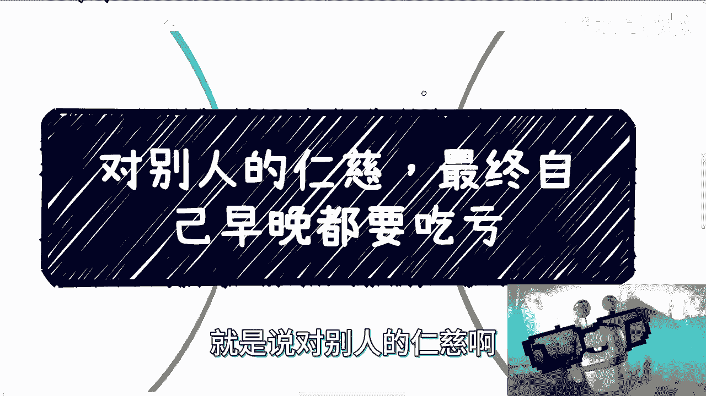
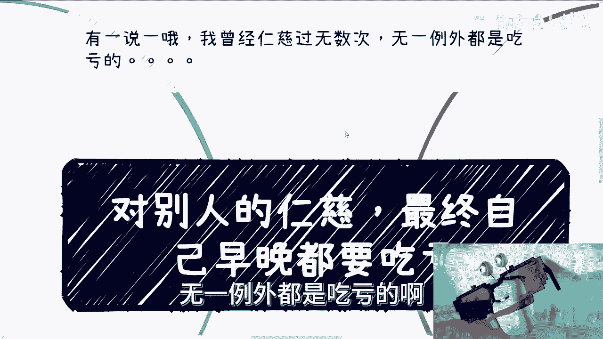
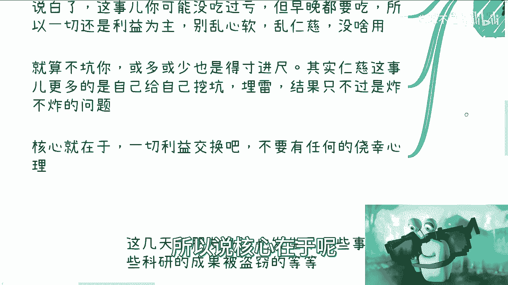
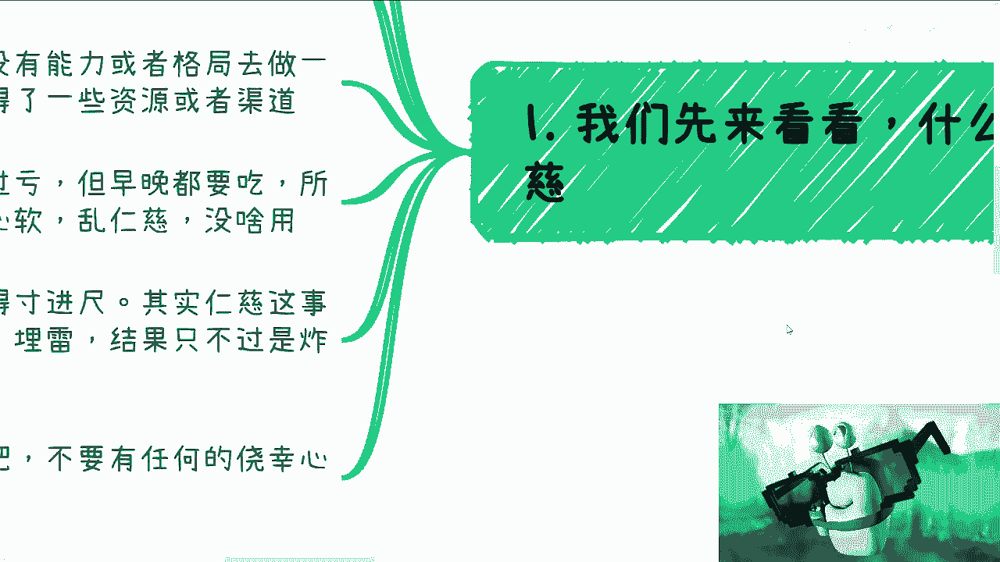
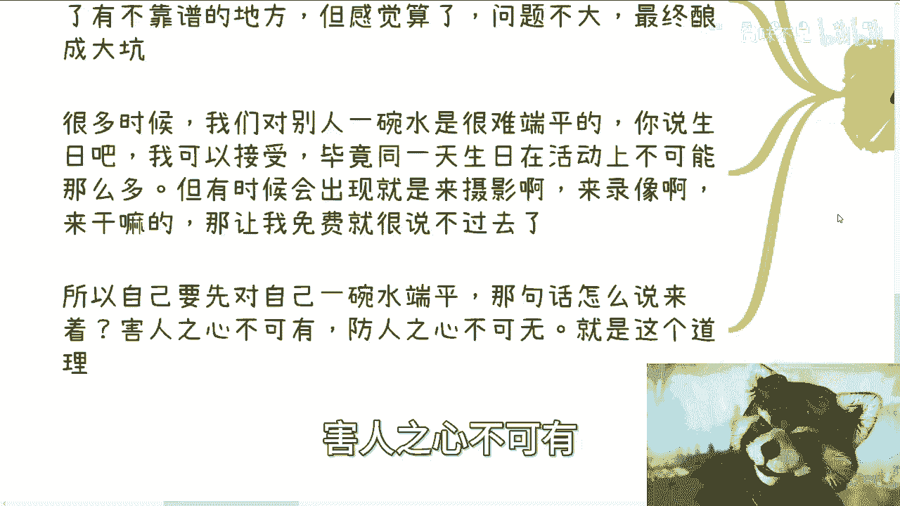
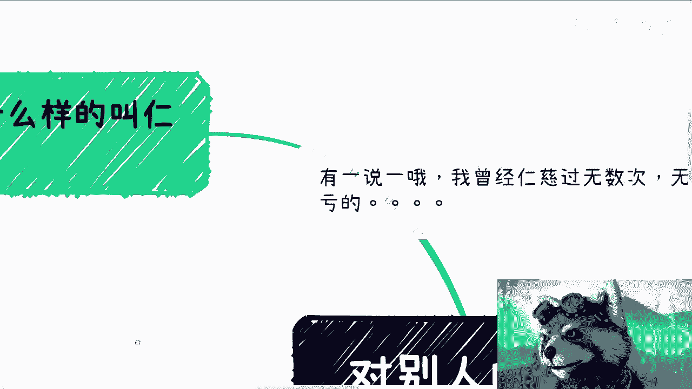
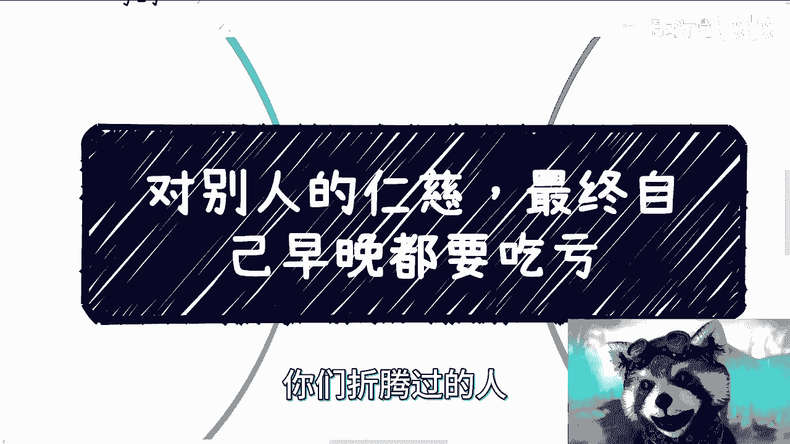
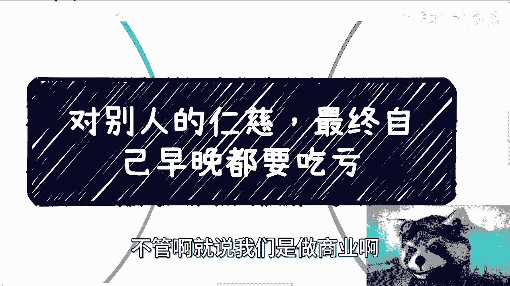

# 课程 P1：人间清醒 - 对他人仁慈就是给自己埋雷 💣

在本节课中，我们将探讨一个普遍存在的人际交往陷阱：对他人无原则的仁慈与心软。我们将分析其本质、潜在风险，并通过实例说明为何这种行为最终会伤害到自己。核心在于理解，一切健康的关系都应建立在清晰的利益交换和原则之上。

## 什么是“仁慈”？🤔

上一节我们介绍了课程主题，本节中我们来看看“仁慈”的具体含义。这里的“仁慈”并非指一般意义上的善良，而是特指在人际交往中，基于怜悯或感情，忽视原则和自身能力去帮助他人的行为。

我将其总结为以下三种常见情况：

1.  **感觉对方可怜，心生怜悯**：但自身其实没有足够能力帮助对方，或者对方没有能力完成某些事情。
2.  **帮助行为无利益关联**：帮助别人纯粹出于善意，当中没有任何利益瓜葛或好处。
3.  **帮助对象缺乏能力或格局**：你的帮助为对方提供了资源或渠道，但对方可能无法妥善利用，甚至滥用。

说穿了，这些行为你可能做了，短期内未必吃亏，但长远来看隐患巨大。因此，一切合作本质上都应以**利益**为基础，不应滥施仁慈。

## 为何仁慈是“埋雷”？💥

上一节我们定义了何为有问题的“仁慈”，本节中我们来看看它为何危险。核心原因在于，这种无原则的帮助常常无法换来感激，反而可能引发对方的得寸进尺甚至反噬。

你会发现，仁慈更多时候不是对别人好，而是给自己挖坑。结果只是“雷”是否爆炸或何时爆炸的问题。这背后有一个残酷的现实：可怜之人常有可恨之处。这不是指我们看不起家境或经济条件不好的人，而是在这类人群中，相对有较高比例的人可能会不择手段。

他们可能不会领情，甚至可能在你帮助过后反过来“啃”你。即使不坑害你，也或多或少会得寸进尺。因此，核心原则在于：**一切关系应以利益交换为基础**，不要抱有任何侥幸心理。

## 亲身经历：仁慈带来的教训 📉

理解了理论，我们通过一些具体例子来看看仁慈在实际中如何导致问题。以下是我个人经历的一些教训：

*   **介绍工作**：我曾帮助别人介绍工作，对方成功入职并通过试用期后，却在背后说我不好。帮助他人却从未获得感激。
*   **项目合作**：我曾基于朋友信任与人合作项目，对对方的商业层面了解不深。结果在融资时，对方提交的资料有问题，导致投资方认为我是骗子，让我跳进黄河也洗不清。
*   **活动合作**：我举办活动时，将一位合作方拉入群聊。对方未经我同意，直接向群成员群发商业推广邮件，导致他人质疑我举办活动的动机，让我百口莫辩。
*   **与技术前辈合作**：我曾与一位年长、看似经验丰富的技术前辈合作。对方却固执己见、独断专行，只学到了乔布斯的“糟粕”（一言堂），导致合作非常失败。

这些经历都表明，心软和缺乏原则的合作，不仅会坑害自己，还可能连带损害你的声誉，让你对外难以解释。

## 原则的实践：以咨询和私信为例 💼

理论结合实例后，我们来看看如何在日常互动中坚守原则。以我处理B站私信和咨询预约为例：

*   **私信处理**：我通常回复私信，但以下情况不回：
    1.  提问者上来就抛出一大堆问题（如123456...），让人无从回复。
    2.  把私信当作即时聊天工具，来回闲聊。私信沟通效率低，且我不能一直充当免费劳动力。
*   **咨询预约**：关于费用，我坚持原则，极少提供优惠。
    1.  **例外证明原则**：曾有用户在活动当天生日，并提供了马赛克身份证证明。我免除了其费用，这是一个合理且可验证的例外。
    2.  **拒绝随意优惠**：对于其他如学生身份、要求折扣等请求，我通常拒绝。因为对一个人优惠，就是对其他付费者的不尊重。如果为各种理由（学生、残疾、经济困难等）破例，这碗水永远端不平，最终只会导致自己一直被“白嫖”。

这些做法并非冷漠，而是对自己时间和价值的尊重。免费劳动不是不尊重对方，而是不尊重自己。

## 核心：对自己“端平一碗水” ⚖️

通过以上分析，我们可以总结出问题的根源。你会发现，生活中很多“坑”的发生，根源不在别人，而在自己。

核心原因有二：**心软** 或 **没有原则**。你可能已经感觉到某些地方不靠谱，但选择了忽视，心想“算了，问题不大”。但你要明白，有些是小坑，有些是大坑。

关键在于：你无法让所有人满意（对别人端平一碗水），但必须**对自己有原则（对自己端平一碗水）**。一旦今天为A破了例，明天就可能为B破例，原则将荡然无存。试图让所有人满意，最终只会变成“跪舔”的老好人，但即便如此，依然无法让所有人满意。

我始终相信：**害人之心不可有，防人之心不可无**。

## 总结与行动指南 🎯

本节课中我们一起学习了无原则仁慈的风险与应对之道。无论是商业合作、朋友交往还是职场相处，总会有各种原因让你心软，或在没有充分依据的情况下愿意合作。

此时你必须清醒：一旦未来因此产生问题，这就是你自己的责任，不能怪别人，只能怪自己原则不清。因此，建立并坚守自己的原则和底线至关重要。例如，在判断是否合作时，要求对方“拿出证据”（如成功案例、数据），拿不出来就不合作。宁愿不赚这笔钱，也要避免潜在的大坑。

请记住，坚守原则，就是对自己最大的负责。

---
**注**：北京活动名额已满。如有职业发展、商业合作或其他问题，欢迎整理好你的具体问题和方案，通过正式咨询渠道进行交流。