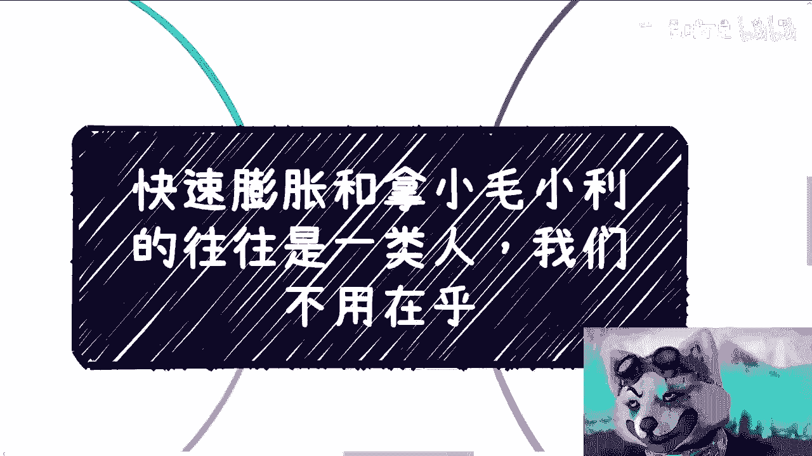
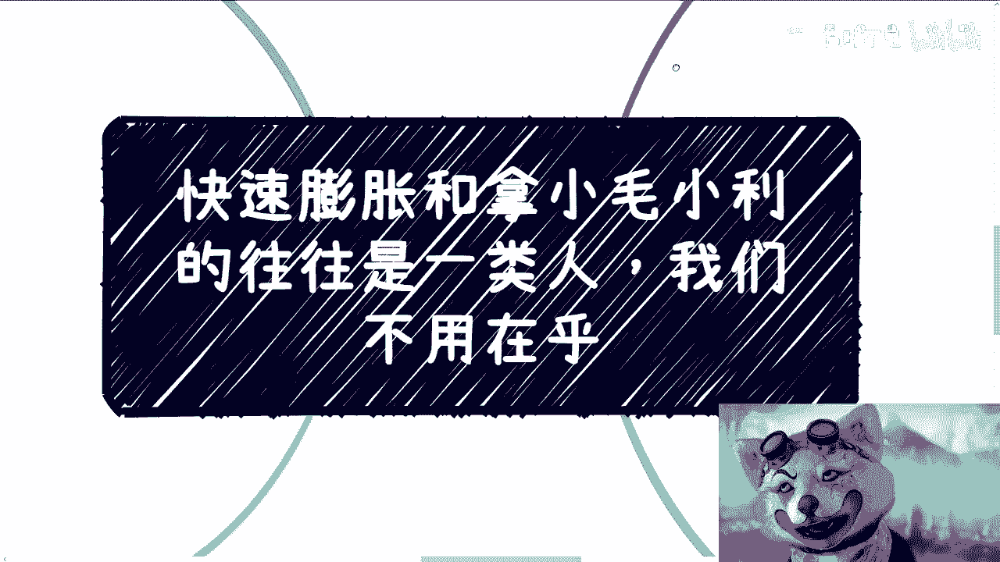
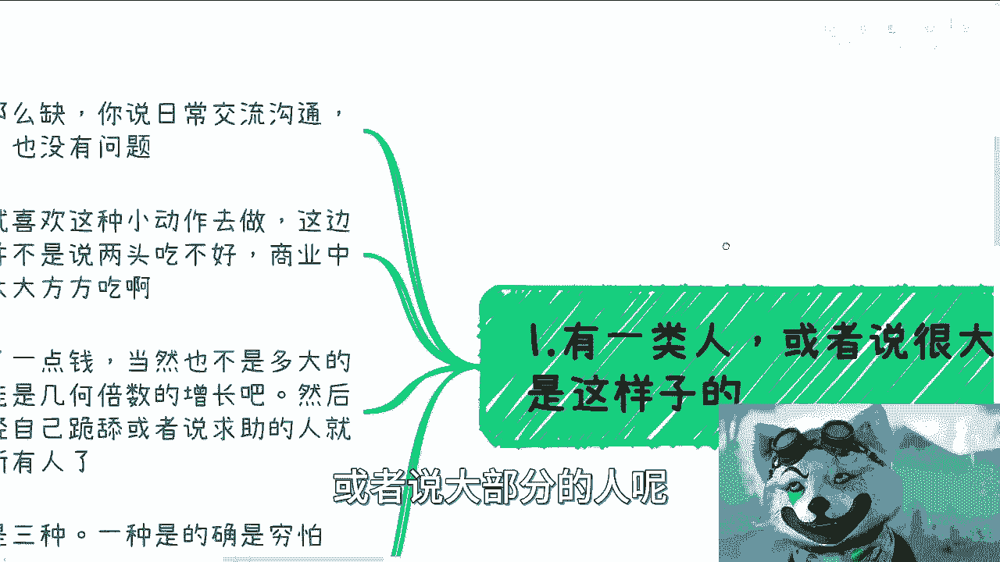
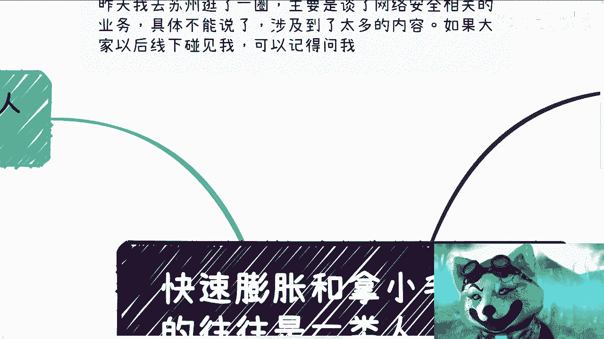
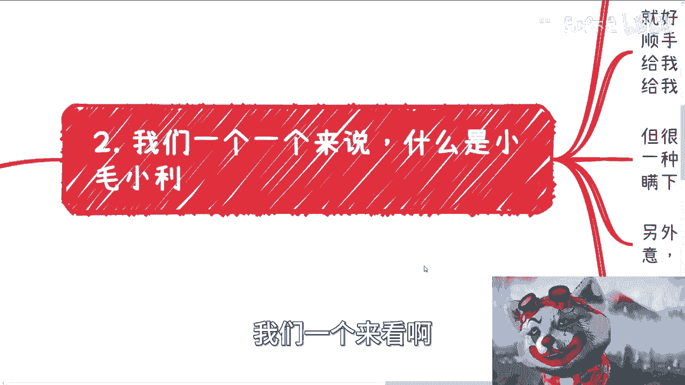
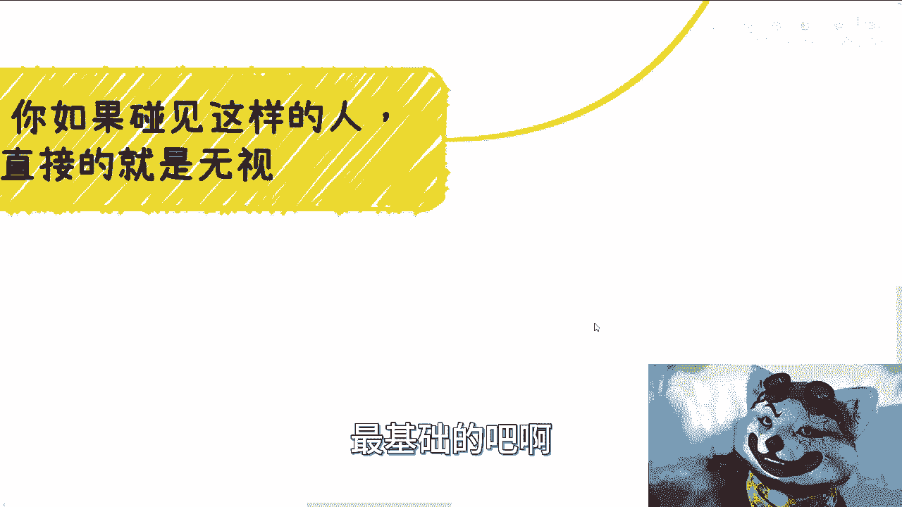
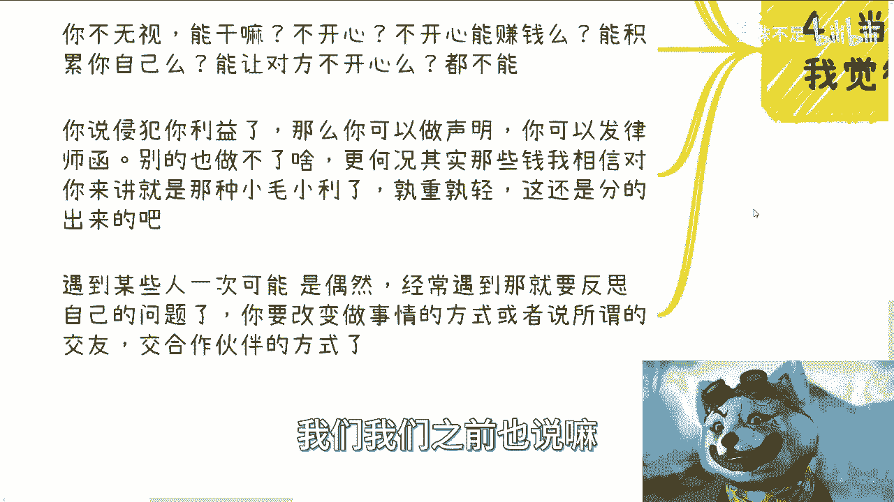
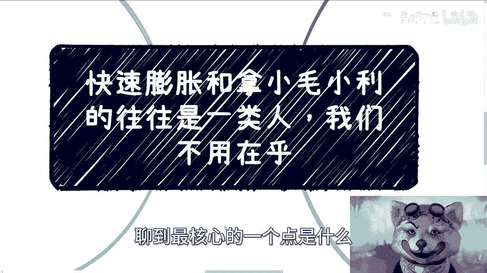
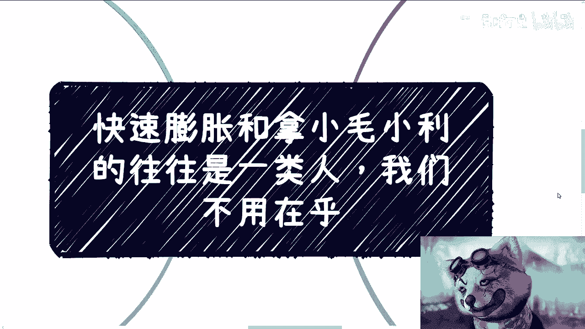
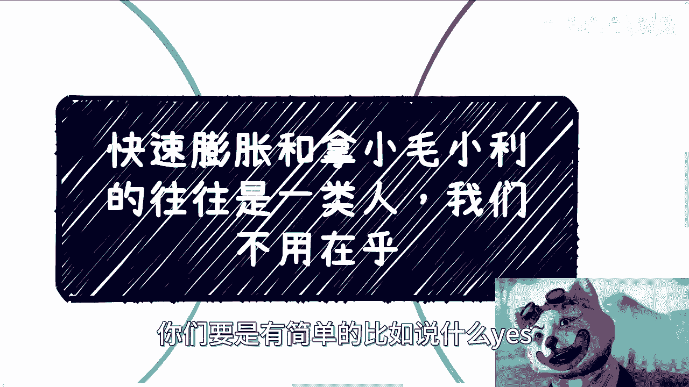

# 快速膨胀或关注小毛小利，都是走不远的 - P1 - 赏味不足 - BV1vG411a7Qw

哈喽大家好啊，今天礼拜五啊。

我先说一下啊，就是昨天我去苏州逛了一圈，主要是谈了一些网络安全相关的业务，呃但是这个具体就不太好说了，因为这个东西涉及到太多对吧，就不适合放到明面上的内容，所以大家以后要是线下碰到我呢对吧。

你们可以记得问我对吧，这个只能线下说啊，那当然啊也谈到两个方面问题，一个呢是一些小伙伴快速的膨胀啊，也谈到了一些小毛小利。

我觉得这些东西呢今天正好来聊一下啊，呃啊我们就直接往下说了啊。

呃这个最近呢因为那个谁啊，就是那个新东方这个事对吧，也闹得很嗯，反正就是大家吃瓜啊，这个东西后面我会再来说一下这个东西，唉真的就只能说什么呢，只能说人呢是在进步的对吧，世界也是在进步的。

国家也是在进步的，社会是在进步的，但是呢人性本身从来是不改变的啊。

那么首先第一个有一类人或者说大部分的人呢。

他是这样子的，怎么样呢，你说你说他们不缺钱吧，哦不是你说他们缺钱吧，不是那么缺，你说他们不缺钱吧，那肯定缺，对不对，你说日常交流沟通社交吧，就是你聊下来，比如说这个这沟通下来觉得有没有什么问题。

都没有什么问题啊，都是比较正常的，但是呢你就像我以前跟你们讲的，如果你们想要去看明白一个人，你们一定是要去合作过啊，不合作过没有用的啊，那么如果合作呢，你就会发现诶有一部分人啊，他喜欢这种小动作啊。

去做这边扣一点，那扣一点啊啊对，顺便提一点啊，呃你们会发现我在描述当中呢，有的时候用某些人啊，有些时候呢用某些小伙伴对吧，这是为什么呢，这是因为我描述小伙伴的时候，我认为这是一个褒义词啊。

用人的时候往往是贬义词，那同样的你看我这个装束对吧，我这个哥谭小丑的这个叫什么形象，出现次数并不多，我每次出现意味着什么，意味着我的视频背后背后，或者说我做这期视频的根本缘由，一定是要讽刺的。

就这么个原因啊，好那么继续啊，当然我并不是说在商业当中两头吃不好，商业当中你们但凡去做了两头吃多了去了，但是问题在于你不要偷鸡摸狗的吃啊，那么另外一种就是什么呢，突然赚到一点钱啊，当然也不是说多大点钱。

但只不过是相比他之前的收入，可能是几何倍数增长啊，然后呢就容易忘恩负义啊，对曾经帮助过自己或者自己跪舔的，或者说求助的人就忘记了啊，那么他要演绎的是什么呢，他要演绎的就是他脑子里面那种啊。

这个昨天你爱搭不理，今天我让你高攀不起是吧啊，甚至用鼻孔看所有人，就是就是怎么说呢，就是说很多人啊他活是活在这个世界上，活着也是活在这个社会里，但是他对这个社社会跟世界毫无认知。

他所有的认知就来自于那些什么，莫名其妙的逻辑，莫名其妙的鸡汤，莫名其妙的电视剧，莫名其妙的东西，这就是他所有的价值观，世界观，人生观，那莫名其妙啊，简直就是啊，这他妈比楚门的世界的楚门还得还要出门。

对啊，就赛博朋克啊，那么这种事情呢我觉得往往原因归结于三种，一种是的确是穷怕了啊，那么他可能有比较大的这个两极反转啊，那么一种呢就是格局太小啊，他根本就不知道更大的世，界跟社会是怎么样子的。

甚至他不知道世界跟社会是怎么样子的，那么最后一种呢就是我刚刚说的啊，比如说被电视剧啊，被鸡汤啊，被家庭啊，被身边的朋友啊PUA出来的，那么他幻想当中可能所谓的有钱人，或者所谓的成功就是如此啊。

那怎么办呢，对吧，你没法沟通啊，看看啊。

OK啊那么第二个我们一个来看啊。

什么叫小毛小利呃，首先啊在这个上面我先说一点，我觉得很多人对小猫小弟的理解呢，还是有偏差的啊，小毛小利指的是在我们能力范围内啊，比如说去帮助别人也好，甚至还谈不上帮助，就顺便搭把手啊。

其实你自己没有做什么，但是呢你也就是由于各种各样的原因对吧，你不可能说我就是真的免费劳动，因为很简单嘛，你做事情做的真的成熟的话，你就会明白你是不能被白嫖的，为什么你被白嫖，只要有一次。

你后面永远会被白嫖，对啊，所以你不能免费，那么收点钱，意思一下对吧，理所当然啊，那么就到今天，就好比今天呢我们有个AIGC的咨询啊，你说你可以做，我呢做不了啊，我顺便给你，你去做。

那做完你给我多少就可以啊对吧，你给我发个200块钱红包也行，你说给我，你这个单子10%也行，但你不能不给我对吧，因为你不给我，那就是你的态度问题，你不给我，你就不要想有下一个case对吧。

哦不是说哦好像从很多人角度来看啊，这是说啊陈老师这点钱都要的啊，这不是钱不钱的问题，这个是你的态度问题对吧，我跟你们讲啊，你们做事情只要时间足够长了，你们一定会发现什么叫共赢，什么叫共利对吧。

什么叫关系维护，这就叫关系维护，千万不要想着去贪图那些小毛小利啊那种，就是说啊这个今天好像做了个单子对吧，然后呢啊这个就是比如说我们请陈老师吃个饭，或者怎么样子，这是两码事啊，呃所以在这个地方呢。

我得说啊，很多人真的理解歪了，那就感觉呢小毛小利是精明的一种体现，或者来说怎么样啊，他就很神奇，一种就是过程当中呢通过其实瞒下去抠出来，就像我们说的两头吃啊，但是他偷鸡摸狗的吃啊，另外一种呢就是抄袭。

或者直接拿别人的东西去卖或者做生意，那当然现在在YOUTUBE上面或者其他地方也很多，甚至可能还会有一些，我相信很多小伙伴也会打着我这个XMD的主意，对吧，去做啊，但是你要明白啊，就是说啊你赚点小钱。

这并不是体现出你自己的聪明啊，呃问题在哪里呢，问题是我们做这些事情不要去自欺欺人，因为其一你能做一次，两次，你能一直做吗，对吧能吗，能有多久呢啊，那么这种在自我身上毫无积累竞争力，毫无就毫无竞争力。

毫无积累的这种事情，同时还伤害别人利益的事情，你做不长呢是吧，那当然了，有些人说我要今朝有酒，今朝醉，可不可以可以啊，那你你你你你你爱咋地咋地嘛，对不对，那么其二要命了对吧，我昨天跟他们聊的时候。

就说我说要命了，这才多少钱，你要跟我说几百万对吧，你抠的出几百万，那你去做啊，我什么什么都不说啊，我双手双脚支持你做呗，有什么不好做的呢，利益至上呀，对吧啊，但问题是你会发现很多这种小毛小利，他两头吃。

他就是贪图那几百几千，你有意义吗，有什么意义呢，对吧，就极其离谱啊。

极其离谱，然后第三点呢就关于膨胀啊，其实这就是对自己的认知和社会认知不足。

为什么呢，呃我记得我以前有一期我曾经说过，当你了解社会越多，你了解到高性价比赚钱的方式越多，或者说更多的那种超出你认知的方式，打破你三观的方式之后，你就会明白自己多么渺小或者多么无知。

或者说以前你活在这个世界上这么多年，多么的幼稚啊，膨胀主要是因为没有定位清楚自己的位置，以及不清楚山外有山，人外有人，这个道理啊，你要明白，无论你是否有钱，是否有社会地位或政治地位。

你都要保持一个谦逊的态度，为什么，因为无论你是谁，无论你拥有任何的物理上，或者说所谓人类社会所赋予你的一些东西，但是在这之前你得必须是个人吧对吧，那很多小伙伴其实也会误解所谓的谦逊。

因为这个谦谦逊不是说啊，这个就很多鸡汤在里面说的，或者怎么样子，就很多东西啊，它容易被歪解啊，不是说我们要去跪舔，不是说我们要不自信，不是说我们要低人一等啊，比如说就像我以前说的，我们要去幕墙吗。

根本不需要你幕墙，只会让自己陷入一个被割的境地，而我们要做的是什么，就是需要给予足够的尊重，需要先礼后兵，无论他是谁对吧，你不能因为他今天比你有钱，比你地位高，你就在那边啊。

这个这个好像要去跪舔他或者怎么样，你也不能因为他今天在路上写了一张纸头，说啊，我要六块钱就买个吃的对吧，怎么样，你就你就在那边觉得我的啊，我高我高人N等对吧，然后怎么样怎么样不行的呀对吧。

因为你一定要先礼后兵，如果发现交流下来，沟通下来对吧，不符合自己的价值观，那么你你就要看情况什么呢，要么你就马上离开，要么你就直接开骂对吧，就简单明了嘛，啊，我觉得膨胀的本质呢。

就是有的人呢被洗脑洗太久，觉得钱跟地位代表着一切啊，但是他却不知道，就是说你有钱啊，有有地位与否，TMD你得是个人呐对吧，就我们不是说你的道德底线怎么样，而是说你作为一个人的基本的底线，你得有吧。

你尊重是最基础的吧。

啊当然啊如果你碰到这样的人呢。

我觉得最直接的就是无视同事呢，同时呢你得去反思你自己，因为你要明白任何类型的人满地都是啊，关于接触人这个事吧，我觉得我们需要自我反思，因为接触到什么样的人，什么样的圈子，就是你们自己决定啊。

你可以说有人看不起你不开心，你也可以说有人侵犯了你的利益啊，抄袭了你的东西，或者来说利用了你的一些这个介绍的关系啊，那你想嘛，你不无视你能干嘛呢，你不开心啊，你有情绪啊，你不开心能赚钱吗。

能积累你自己呢，能强大你自己吗，能让对方不开心吗，那不能啊，是吧啊，你说侵犯你利益了，那么你可以做声明，你可以发律师函，别的你也做不了啥啊，为什么，因为有第一个就会有第二个，有第二个就会有第三个。

怎么滴了呢对吧，而且更何况我相信他们赚的那些钱，相比你的这个要赚钱的这个方向一定就是小毛，小利，一定就是九牛一毛，孰重孰轻，这还分不出来吗，是吧啊，你要明白，遇见某些人一次，他可能是个偶然哈。

呃这就像我跟你们讲，我以前碰到过一些奇葩，就真的奇葩，就是你跟他在一个活动上认，就是见面，第一次见啊，他就来问你，哎哎这个谁对吧，你晚上住哪，我要跟你一起住，是吧啊，我经常这种可能是偶然。

但如果你经常遇到这种对吧，你可能要去反思自己自己的问题，哎是不是你经常去参加了一些，比如说这个网平台路600号的聚会啊对吧，怎么样子啊，你要改变的是你做事的方式，什么意思呢，也就是说你就要很简单的。

就是如果你觉得不行，OK下一个不行，下一个不要在里面拖，也不要再去，就是说就是就是我们我们我们之前也说了嘛，就是不要再是永远是去听信那些有的没的。

title对吧，或者怎么样子。

也就是说你自己做事情的方式其实也会决定啊，或者说终究会去决定你接触到这个圈子的人，或者怎么样子对吧，你说你你你在那边幕墙，你在那边跪舔对吧，你在那边就是说啊不知道自己要做什么对吧，然后怎么样。

那你永远碰到的还是跟你一样，不知道自己要做什么的人，那有什么用呢对吧，所以你像我们昨天在苏州聊的时候，聊到最核心的一个点是什么。

就是你得去干，因为你只有干的过程当中，你才会明白有哪些问题有问题再去解决啊，而不是就像我们说的，不是说啊，我们这个每天在那边想着说啊，我我我这个没有资源啊，我那个不行。

然后就是说啊陈老师说要有自己的介绍啊，我也没有，你想这些没有用的呀，你要出去浪啊对吧。

然后你说就像之前还有小伙伴跟我说，他说哎我线下做一些内容被骗了啊，被被人家什么跳单了或者怎么样子的，那就跳呗对吧，你要做的是什么，你要做的是让这件事情让自己能够有成长，让自己能够明白问题出在什么地方。

是不是自己做事情，有有这个做事情的方式有问题对吧，你得去调整，而不是一直在那边想着说，唉我被跳单了，唉我很难过，我很怎么样，没有用的好吧，那么同样的就是这个内容呢，我也是希望大家不要变成这样一类人啊。

没有必要啊，真没有必要，你要说膨胀，那不好意思，比你赚钱的多的人多了去了，比你性价比赚钱高的人也多了去了对吧，你要说赚这些小毛小利，那你最终只会把自己变成一个孤岛，为什么，因为你早晚要被发现的。

没有意义的对吧，你今天可以啊，亲亲就是就是伤害这个人，你明天可以伤害那个人，那你在网上做呢，你把事情做大呢，怎么做呢对吧，好吧行，那就这么着吧，啊嗯，OK大家反正有什么这个详细的问题啊。

或者说一整套的这种商业啊，或者说职业规划的问题，你们反正列出来，我们再去走详细咨询啊，你们要是有简单的，比如说什么yes or NO的问题。

