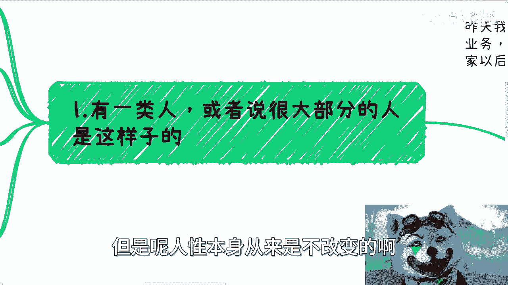
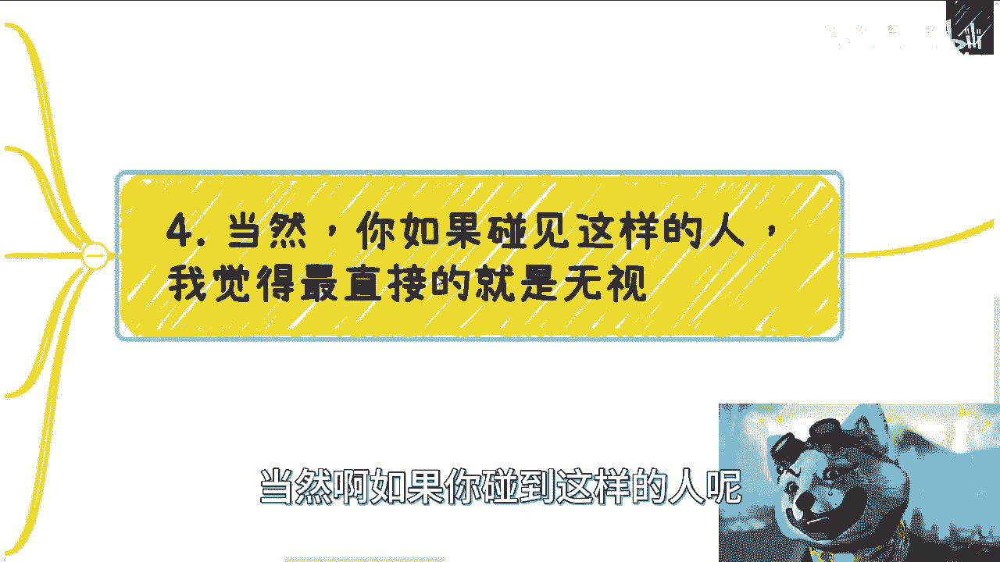

# 课程 P1：避免短视行为，追求长远发展 🚀


在本节课中，我们将探讨两种常见的短视行为——“快速膨胀”与“贪图小毛小利”，并分析它们为何无法带来长远的成功。我们将深入理解这些行为背后的心理与社会认知根源，并学习如何调整心态与行动策略。


---




## 1. 两种短视行为的现象与根源

上一节我们介绍了课程的主题，本节中我们来看看这两种行为的具体表现及其产生原因。

### 1.1 贪图小毛小利的行为模式

以下是这类行为的一些常见表现：

*   **行为特征**：在合作或交易中，通过隐瞒、欺骗或“两头吃”的方式，试图从他人处额外获取少量利益。
*   **认知偏差**：将这种“精明”视为一种能力或优势，并为此沾沾自喜。
*   **典型心态**：信奉“今朝有酒今朝醉”，缺乏长期规划。

这种行为产生的根源在于对“共赢”与“关系维护”的误解。健康的合作建立在互惠基础上，象征性的回报（如一个红包、一次请客）是态度和尊重的体现，其公式可以概括为：


**可持续合作 = 明确规则 + 互相尊重 + 长期互惠**

若破坏此规则，短期可能获利，但长期必将损害信誉，使合作网络崩塌。

### 1.2 快速膨胀的心态表现

以下是取得一定成功后容易出现的膨胀心态：

*   **行为特征**：在收入或地位获得阶段性提升后，变得傲慢，忘记初心，甚至轻视曾经帮助过自己的人。
*   **认知根源**：对社会和世界的认知主要来源于电视剧、鸡汤文等脱离现实的内容，形成了扭曲的价值观。
*   **核心问题**：无法准确定位自己，不明白“山外有山，人外有人”的道理。

膨胀的本质是**自我认知**与**社会认知**的严重不足。当一个人见识到更广阔的世界和更多元的价值创造方式后，往往会意识到自己的渺小。保持谦逊并非低人一等，而是作为“人”的基本修养：**尊重他人，先礼后兵**。如果对方不尊重你，你有权选择离开或反击。


---


## 2. 如何应对与自我调整

了解了问题的表现与根源后，本节我们来看看如何应对他人此类行为，以及如何进行自我调整。

### 2.1 面对他人的短视行为

当你遇到具有上述行为特征的人时，可以采取以下策略：




*   **核心策略：无视与反思**。与这类人纠缠只会消耗你的情绪和精力，无法带来任何积极收益。你的不开心并不能让对方不开心。
*   **保护利益**：如果对方行为侵犯了你的核心利益（如抄袭、诈骗），应通过正式渠道（如声明、法律途径）解决。
*   **权衡轻重**：要明白，对方所贪图的利益，与你长远的发展目标相比，往往是“九牛一毛”。分清主次，不要因小失大。

### 2.2 关键的自我反思与行动

更重要的是，你需要通过反思来优化自己的行为模式，避免陷入不良的圈子。

以下是自我调整的关键点：


*   **反思接触的圈子**：如果你频繁遇到不靠谱的人，可能需要审视自己参与的活动和圈子。所谓“物以类聚，人以群分”，你的行为方式决定了你会吸引和接触到什么样的人。
*   **改变做事方式**：停止无效的“幕强”（盲目崇拜强者）和“跪舔”。明确自己的目标，如果感觉不对，果断放弃，寻找下一个机会，不要拖延。
*   **核心行动准则：去干**。所有认知的提升都源于实践。只有在行动中，你才会遇到真实的问题，才能去解决它。空想“没有资源”、“没有人脉”毫无意义。
*   **从挫折中学习**：如果遇到挫折（如被“跳单”），重点应放在分析原因、调整策略、让自己成长上，而非沉溺于负面情绪。

用一段简单的代码来描述这个成长循环：


```python
while True:
    take_action() # 采取行动
    problem = encounter_problem() # 遇到问题
    if problem:
        analyze_and_adjust(problem) # 分析并调整
    else:
        keep_going() # 继续前进
```

---

## 总结


本节课中我们一起学习了两种阻碍长远发展的短视行为：“贪图小毛小利”和“快速膨胀”。我们分析了它们源于对利益关系、自我认知和社会规则的误解。要避免成为这样的人，关键在于建立**共赢思维**、保持**谦逊心态**，并通过持续**行动与反思**来提升自己，构建健康、可持续的个人发展网络。记住，真正的竞争力来自于积累和信誉，而非一时的算计或膨胀。