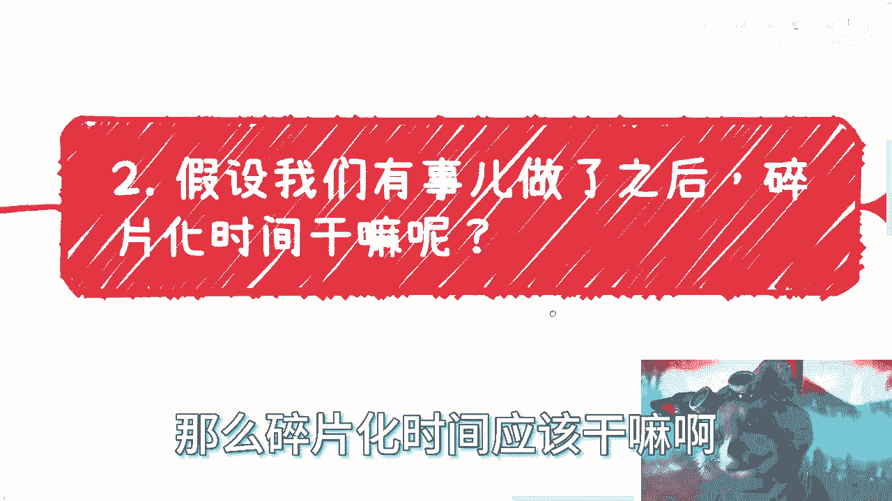
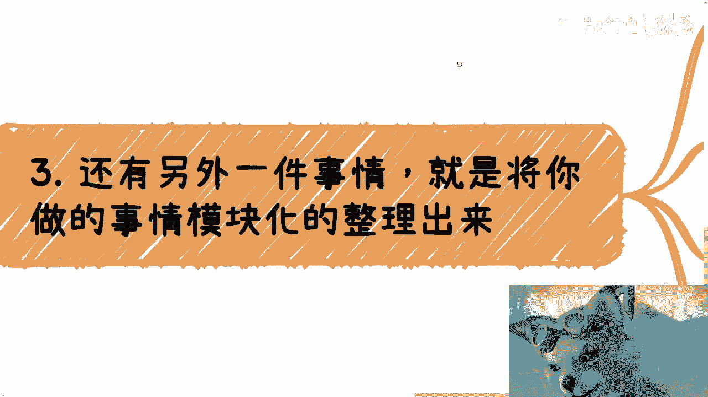
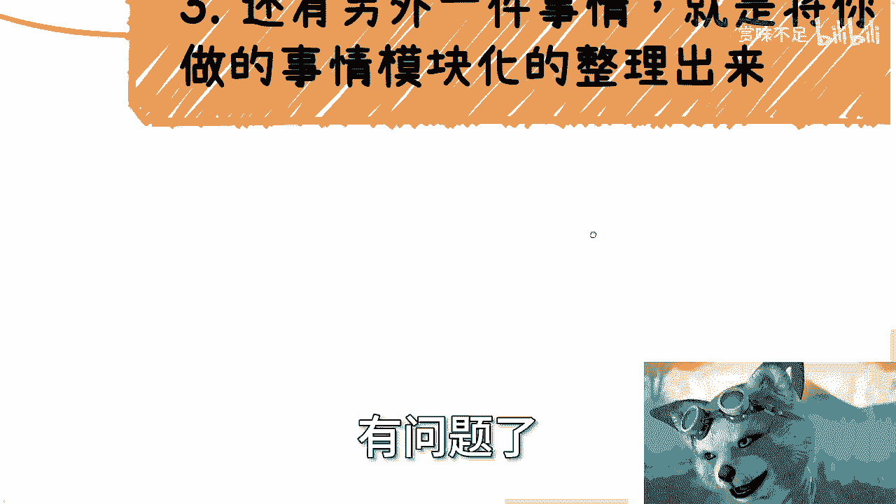
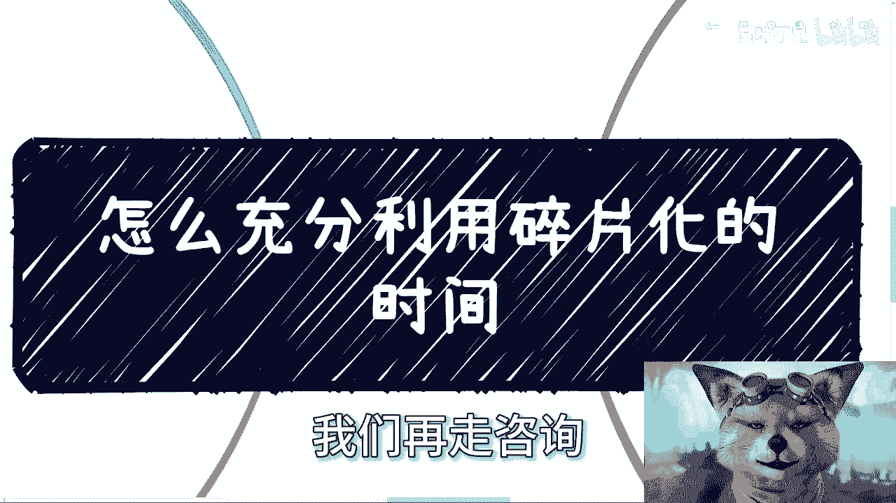

# 怎么充分利用碎片化时间 - P1 - 赏味不足 - BV12m411f73U

嗨大家好，这个杭州活动就结束了，然后3月份的话上海嗯，到时候我再通知大家，然后后面的话啊，反正大家等我通知吧好吧，然后今天我们讲的这个呢，叫怎么充分利用碎片化的时间啊。

呃这个是上个月吧，好像还这个月有可能这个月就有在咨询上，有个小伙伴就问出来的一个支线问题，然后他问我的时候，我听到这个问题的时候，我思考了一下，我就在想啊，那他说碎片化时间啊，我就在想我在干嘛啊。

这个空下来啊，或者出差啊对吧，呃高铁上个飞机上了啊，我后来发现嗯我在打switch是吧，笑死不过当时自信的时候呢，我就马上想到另外一个问题，就是碎片化时间利用啊，他的确是大众一个普遍的问题。

他不知道怎么利用对吧，而且大部分人觉得，碎片化时间利用的一个切入点的，应该就是看看书，看看视频啊，但是我跟你们讲本质上没什么卵用啊，呃然后我当时是这么回答的，我说碎片化时间的利用本身重要吗，重要的。

但是我说这件事情本身之前，可能还有一个更重要的问题，就是你需要让自己在碎片化时间里面，得有事做啊，而不是说真的就是出现了碎片化的时间，因为本质上什么是碎片化时间，你想啊，我觉得更多的是说你的空余时间啊。

比如说出差啊，比如说双休啊对吧，或者怎么样，那我们也可以宏观地理解为，所谓的工作外的时间对吧，就是你坐班以外的时间，然后在你的一些就是呃啊，这个这个这个公差也好，私拆也好，就是各种各种高铁啊。

飞机上这种事件其实都叫碎片化时间，那么问题来了对吧，那就是如果今天你不知道碎片化时间干什么，那我觉得难道不是因为你你你你应该去想的是，难道不是为啥你没有事干嘛对吧，而不是说而不是说在那边想着说啊。

我就因为没事干。

所以我得看看书，看看视频，你应该思考的是你为啥没事干啊，那么我们从这个逻辑上往下推啊，从这些逻辑往下推啊，就假设啊，假设我们今天有事做啊，那么碎片化时间应该干嘛啊。

你看啊，其实有一件事有一件很重要的事情，那就是整理，就是将你做过的事情抽象出来的案例啊，然后整理自己的产品包。

以方便以后来做事呃，提升以后做实验的效率，就简单来讲，就是说，假设你现在已经有了自己可以去做的事啊，咱不管这事是多多多大多小，但我们往往容易陷入做事情的细节当中，或者说就是不停的在执行中啊。

也就是说你会比较上头，你会觉得我今天要做东西啊，有的吗是做方案，有的做表格，有的做word，有的做什么东西，而且你一做，那你就就有有有很多人他就陷进去了，你知道吗，不是说他平时想不起来。

但他忙的时候做的时候他就想不起来啊，但从做事情的角度来讲呢，你看啊怎么扩展用户啊，怎么寻找用户啊，怎么让自己更加更高效啊，增加性价比啊，其实才是最重要的，而不是说你一直在那边闷头做事情对吧。

那比如说你现在做了一个电商教育或者活动啊，或者说这个跨境贸易对吧等等案例啊，那么你在碎片化的时间里面，你就需要将这些案例当中的呃，这个敏感东西或者跟品牌相关的东西啊，什么东西啊，文字啊你都模糊掉啊。

但是呢你把这些案例，把这些东西你得整理出来，整理成一个PDF或者整理出来一个PPT，那么这个东西呢是为了未来给你的这个，这个未来的客户去看的啊，那么以方便你能够帮助别人，能够帮助自己拓展更多的渠道。

因为很多东西是这样子的，你不在碎片化时间做，等到你要的时候，你还是会去做对吧，那你要的时候去做呢，你就很急很急，那你就会很多东西想不清楚对吧，那你还不如空闲时间你把它做掉啊。

你不要让自己陷入一个干活的思维当中，就是很多时候呢也许你有了自己的赚钱方式，也许你有自己的团队和合作伙伴，但是你还是需要站在一个更高的维度啊，去整理材料，去拓展，然后你无非就是要么横向拓展。

要么就是纵向对，纵向就是说啊，打通更多的一些这个上下游啊对吧，要么就是说呃把你的这个客单价提高啊，要么就是说你把你的地位提高啊，要么就横向扩展，横向扩展就是CTRLCCTRLVVVVV对吧。

但是不管怎你，你是纵向还是横向，你总不能一味的埋头干嘛啊。

那么第三就是还有另外一件事情呢，就是将你做的事情呢模块化的整理出来。

就是说其实你任何一个业务做多了，你会发现很多东西都是重复劳动啊，所以我们需要把一些通用的东西都整理出来，比如当然这种东西，因为由于每个人做的业务不一样，那么这个东西的这个展现形式可能不一样。

你比如说有的是文档类型的对吧，你可以找碎片画画时间去整，理出来一些可以复用的文档啊，比如说PPT啊，比如说PDF啊对吧，比如说word解决方案啊，这些东西你其实都可以整理的啊，然后因为就是你自己会知道。

就是在你的这个行业里面，在这个你的业务里面，客户大概会要些什么，或者说可能未来还会要些什么，那么你就提前去做好横向拓展，做一些方案的文档对吧，然后要么就是那重复化的操作，比如说什么账号管理啊，啊运营啊。

社群管理啊对吧，你也可以整理成文档啊，那么因为业务做到最后呢，其实除非是非常非常专业性的啊，呃剩下其实无非在时间长了之后，你都是需要去脱手，或者说流水化运作的，因为这种重复性的东西，但凡你都去做。

你未来只会减少就降低你的效率啊，所以说你一旦要脱手或者流水化，流水化运作的时候，你就需要保证这个东西的质量，那怎么保证呢，就是你需要有规范，需要有流程对吧，那么这种东西还是那句话嘛，就是嗯。

就不管咱们是个人运作还是企业化运作啊，还是说是什么什么，你说哎我可能企业人不多啊，我可能就四五个人，你别管你企业人多少，你该有的流程还得有你该有的规范还是得有，因为你总不可能说所有的东西有问题了。

然后来问你吧，你妈烦都烦死了啊，这不是一个做事情的方式啊，那么第四呢就是碎片化时间，还可以适合更高维度的。

就是啊这个思考自己的业务，也就是说嗯比如说你现在做自媒体，那你就思考怎么增加自己的媒体矩阵对吧，怎么增加你的影响力，怎么增加你的变现模式啊，你你可以慢慢去想了啊，你觉得怎么跟变身模式好啊。

你你而且你要把它细化，你说啊我要做活动对吧，我要做什么广告商对接广告，那我大概接广告接多少呢，单价多少呢，我能够给他们做什么呢，对吧等等等，你都得想明白啊，那么比如说你要做电商。

那么你就多想想怎么拓展啊，拓广呃，国那个扩大上下游对吧，你怎么去增加你的货品啊，你怎么去，这会增加你的利润，怎么能够更好的在一边做的时候，一边蹭政政策对吧，能不能把自己的产品通过不同渠道。

不同的方式更好的卖出去对吧，能不能做一些，比如说高精尖啊，就是那个联名的产品，能不能做一些，就是说那个高高高价的高单价的产品对吧，你也可以看看不同城市的发展和政策偏向，那边有很多人说哦，我平时不看。

那平时光你空下来可以看啊对吧，你你你发现你你说你说你可以看看别的吧，长三角珠三角东北你都可以看啊啊我跟你讲啊，我发现很多小伙伴啊，他只看自己的城市，我跟你讲没用的啊，哎你如果真的是赚钱为目标，谁赚钱。

谁做商业会被城市所束缚的，那你不是自己把自己路走窄了吗对吧，然后最后呢就多盘盘自己的资源。

你记住一点啊，盘资源是什么意思啊，盘资源不是说你们去吃个饭，不是说你们去喝咖啡啊，是我们给方案，不要让别人给方案，你别什么就说啊，我是做什么的啊，我最近在做什么，我们合作合作这么都是屁话啊，不要这样。

你要的就是直接给出方案，告诉对方，对方做什么，你做的什么，给对方多少钱，或者让对方给你报个价就结束了啊，没这么多逼逼的事啊，但是这些东西呢你不是拍脑袋的，你得深思熟虑懂吗，所以说这些事情。

其实都是适合碎片化时间去做的啊。

你我在最后举个例子，你就像我以前做咨询，我会把我通用的，比如说技术类的PPT，我做一个400页的，比如说呃那个元宇宙和数字经济的PPT，我做一个400页的，那这样的话以后随便直接来找我。

我其实就是删删补补一个PPT就出来了，哎我跟你讲，真的不夸张啊，真的不夸张，我一个PPT就是500页就五百五百页，500多页的就没有办法的呀，因为你你你你你你其实不是说我写500多页。

是我把以前就是一次一次一次做的案例，我把它整合在一起，整出来了一个500多页的，不是说我一次性写500多页，他妈脑子有毛病啊，对不对啊，但是这500多页的东西呢，就是就是就是未来做的时候我就会很轻松。

否则你说未来已经有kiss找我哦，陈老师，你做什么东西啊，好好他说哎你能不能能不能什么半天啊，给我们一个方案，我我我他妈半天找个地方，然后我就我就把我散落的PPT，各个地方全部找一遍，全部再贴进去。

全部格式调一遍，这他妈烦都烦死了，对不对，很多东西你都可以做啊，行啊，这个问题就这么着吧啊就这么着嗯，反正你们那个职业规划好吧，商业规划啊，然后什么融资啊，股权啊，什么合同啊，什么这个别的乱七八糟的。

你或者说你们未来方向不明确的等等等好吧，你们有什么整理好问题，我们再走咨询好吧。

就这样吧。