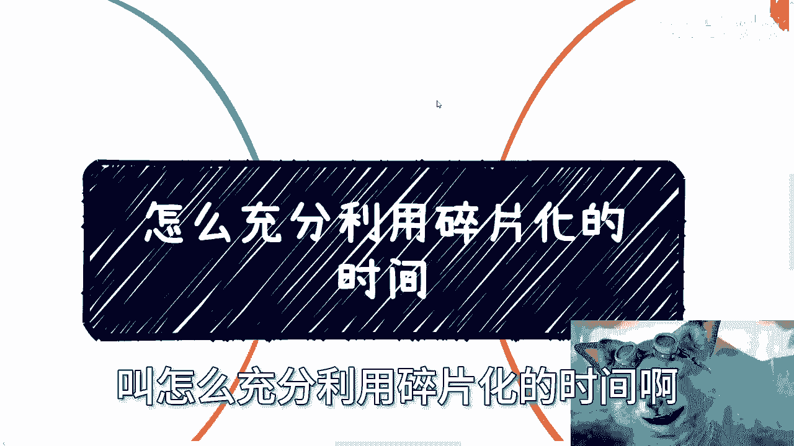
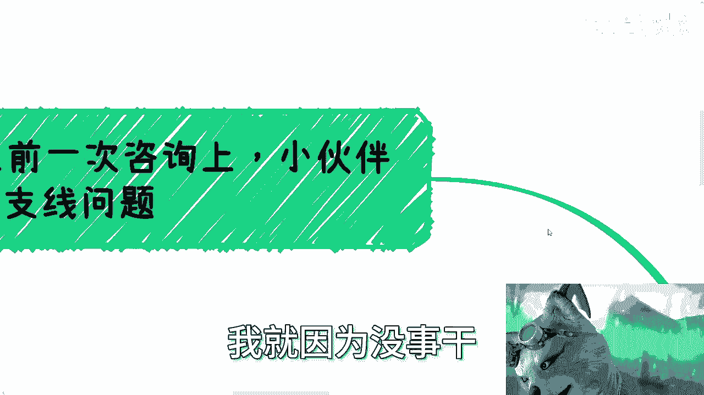
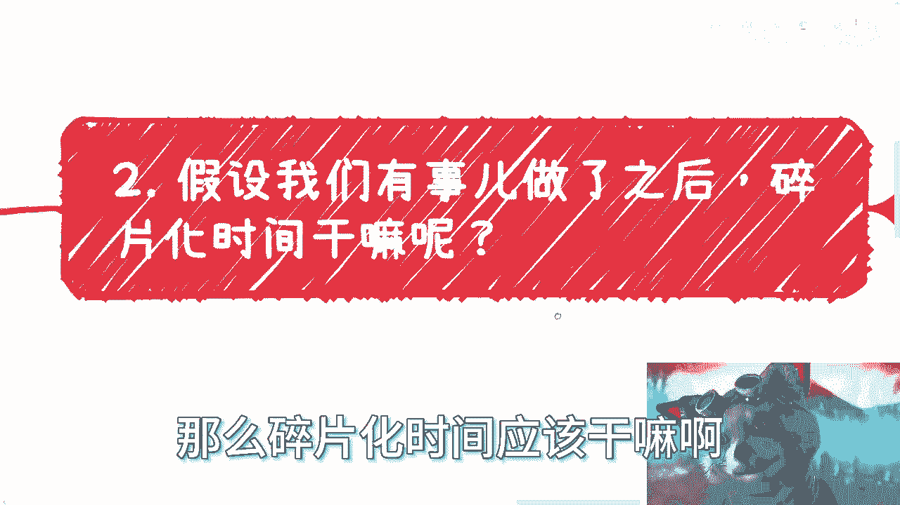
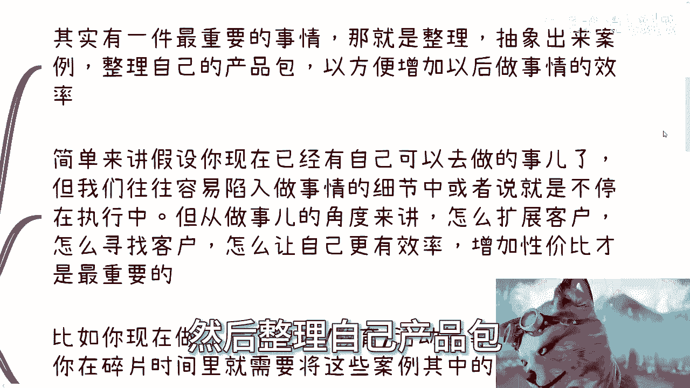
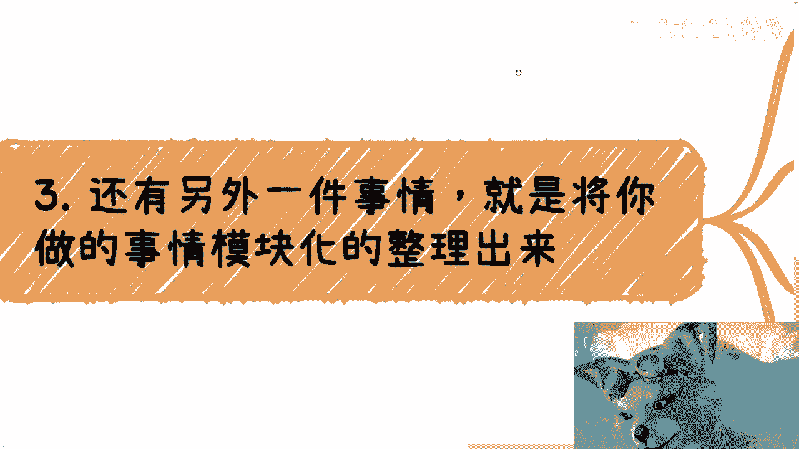
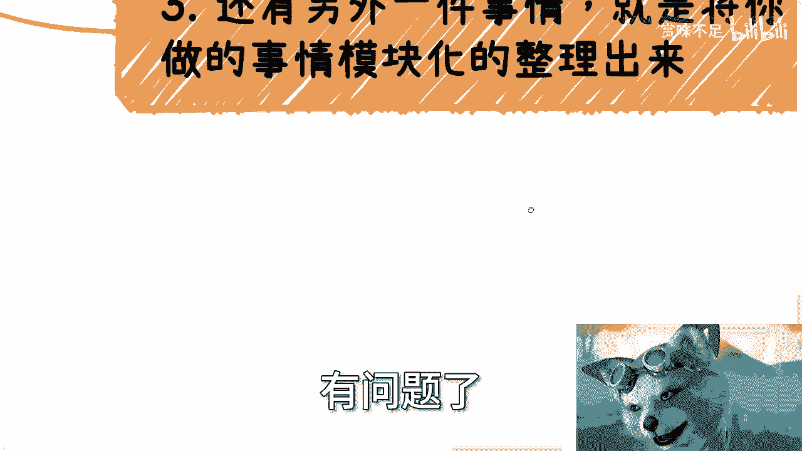
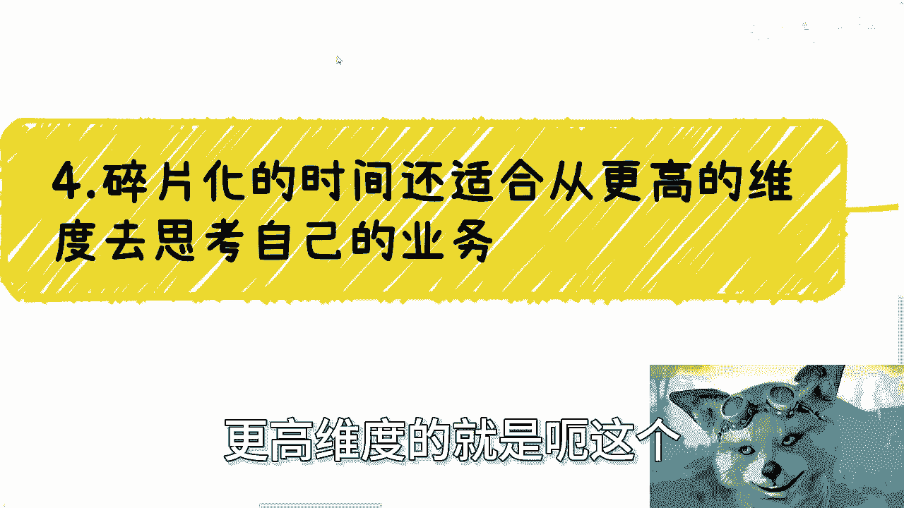
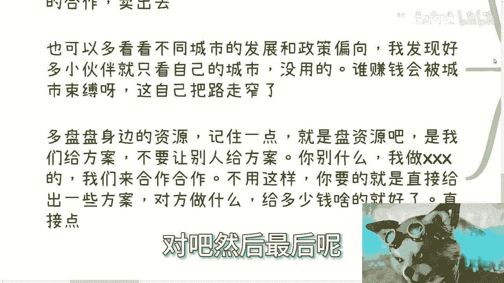
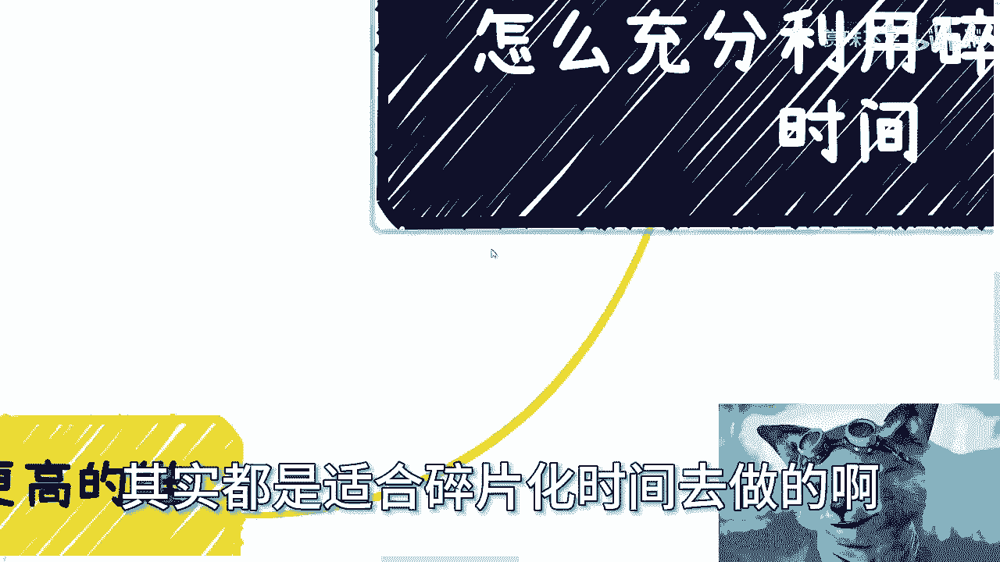
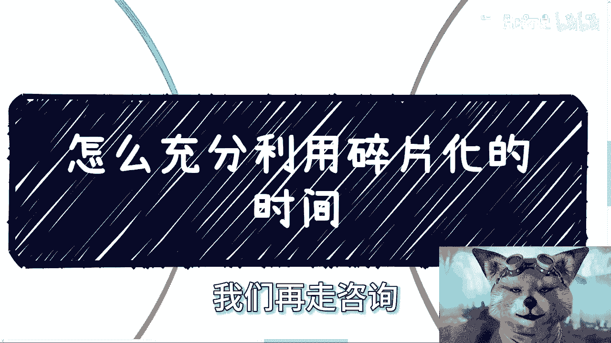

# 课程：如何充分利用碎片化时间 - P1 🧩



在本节课中，我们将探讨一个普遍存在的问题：如何有效利用碎片化时间。许多人认为利用碎片化时间就是看看书或视频，但我们将从更根本的层面分析，并提出更具建设性的行动方案。

---

## 核心问题：为何无事可做？

上一节我们提到了碎片化时间利用的普遍困惑，本节中我们来看看问题的根源。



碎片化时间本质上是工作之外的空余时间，例如出差途中、周末或通勤时间。许多人感到困惑，不知道在这些时间里该做什么。

问题的关键往往不在于“如何利用时间”，而在于“为何无事可做”。如果你在碎片化时间里感到无事可做，更应该思考的是：**为什么你没有需要做的事情？** 而不是强迫自己去看书或视频。





从逻辑上推理，如果你已经有了明确要做的事情，那么碎片化时间的利用方向就会清晰很多。

---

## 碎片化时间的四大高效用途

假设你已经有了明确的事务，以下是碎片化时间可以高效完成的四类核心任务。

### 1. 整理与抽象案例 📂

将你做过的具体事情抽象成可复用的案例，并整理成自己的“产品包”。

**核心公式：** `碎片化时间 = 案例整理与抽象时间`




我们往往容易陷入执行细节中，忙于做方案、表格或文档。但从长远发展角度看，如何扩展用户、寻找新渠道、提升效率才是更重要的。例如，如果你完成了一个电商或教育项目，可以在碎片化时间里，将案例中的敏感信息模糊化，整理成一份清晰的PDF或PPT。这份材料未来可以用于展示给潜在客户或合作伙伴，帮助你更高效地拓展业务。

### 2. 业务模块化与流程化 ⚙️

将重复性工作模块化，并建立标准化流程。

**核心代码：**
```plaintext
if (任务 == 重复性劳动) {
    利用碎片化时间将其模块化();
    建立标准化流程();
}
```
任何业务做到一定阶段，都会出现大量重复劳动。为了提高效率并为未来的团队协作或业务扩张做准备，你需要将这些通用部分整理出来。这可以是可复用的文档模板（如PPT、解决方案Word）、运营SOP（标准作业程序）或账号管理规范。建立流程和规范，能保证业务质量，避免所有问题都集中到你一个人身上。

### 3. 进行更高维度的业务思考 🧠



跳出日常执行，从战略层面思考业务发展。



在碎片化时间里，适合进行需要深度思考的战略规划。例如：
*   **如果你是自媒体从业者**：思考如何搭建媒体矩阵、增加影响力、设计变现模式（如广告单价、活动策划）。
*   **如果你是电商从业者**：思考如何拓展供应链、增加产品线、利用不同渠道和政策提升利润。

不要局限于自己所在的城市，多关注其他地区的发展与政策，才能发现更广阔的机遇。

### 4. 盘点与整合资源 🤝

有效盘点资源，并为合作准备具体方案。

“盘资源”不是泛泛地聊天吃饭，而是准备好具体的合作方案。利用碎片化时间，深思熟虑地规划：你能提供什么，对方需要做什么，利益如何分配。当机会来临时，你可以直接给出方案，高效推进合作，而不是临时抱佛脚。



---

## 实践案例分享



最后，我们用一个具体案例来总结上述方法。

以咨询行业为例，我曾在碎片化时间里，将过往大量的项目案例和技术内容，整合成了一个超过500页的通用PPT素材库。这个素材库涵盖了元宇宙、数字经济等多个主题。

**核心价值：** 当新客户提出需求时，我不需要从零开始，只需从这个庞大的素材库中筛选、组合、调整，就能快速生成一份高质量的定制化方案。这极大地提升了响应速度和服务效率。这正体现了利用碎片化时间进行“整理与抽象”和“模块化”的巨大威力。

---



本节课中我们一起学习了如何重新定义碎片化时间的价值。关键在于转变思维：从“被动消磨时间”转向“主动为未来积累和规划”。通过**整理案例、模块化流程、战略思考和盘点资源**这四类活动，你可以让每一段零散的时间都成为推动个人或业务向前发展的宝贵资产。