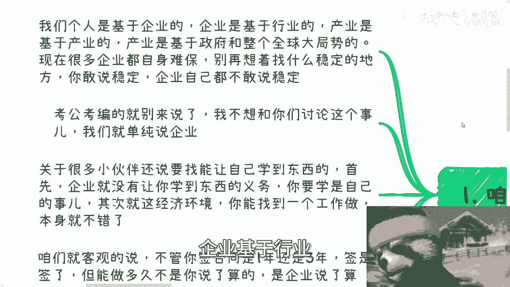
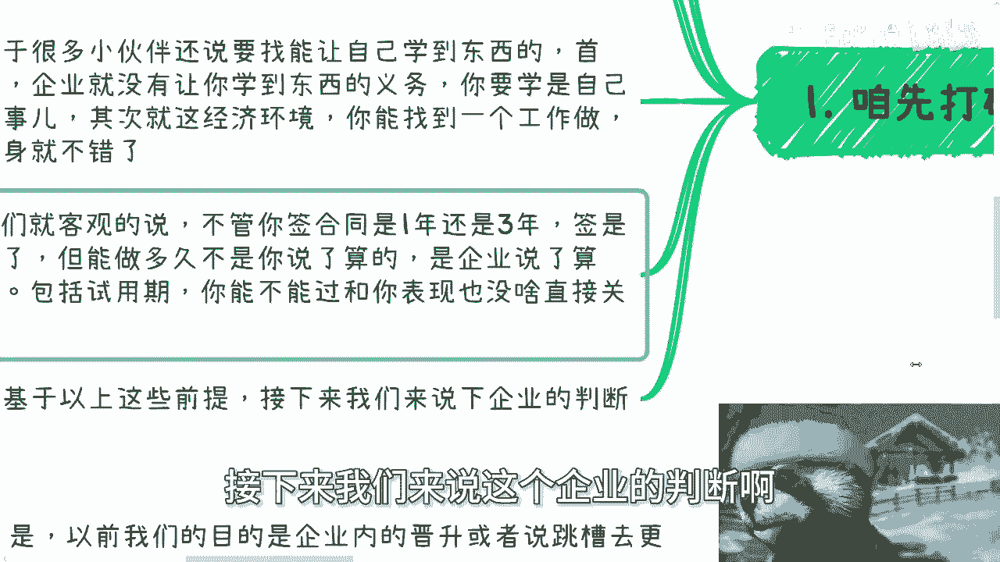

# 怎么判断一个企业值不值得你去 - P1 - 赏味不足 - BV1q1421b734

好啊这个大家好啊，今天晚上因为去这个请领导吃饭啊，所以就又晚了一些呃。

首先今天这个主题呢，是怎么判断一个企业值不值得你去啊。

呃我们在这之前先说两件事，一个是呃下一期活动我也定了对吧，本周六本周六在南京啊，在南京，然后是7月13号1点到六点这个样子，然后内容主题的话呃一个是低空经济，一个是分析民企国央企大厂啊。

包括就是外企当下这个入职的优缺点，以及未来的一些这个发展啊，然后最后的话可能再聊一下各企业当下的这个，数字化发展的一些机会或者一些切入点啊，详情和报名你可以再私信我，然后另外一点呢就是我再强调一遍啊。

就是我们进入社会做事是要看具体事，就是要要么就是看数据，要么就是看关系对吧，我们不是应试教育，你们不要再来问我，应试教育的问题。

你明白吗，就像今就是从去年到现在，就无数的人来问我，他说陈老师，你觉得我做多少的活动，或者我做多少的社交，我能进入下一步，大哥你做多少活动和做多少睡觉能进入下一步，这他妈没有标准答案，你们能听得懂吗。

对吧，你如果来说抱有这种思想，你是做不好事情的，我就这句话，我不管你是谁，就这么回事，就这么简单哦。

好首先第一点我们先打破一些幻想啊，就是首先我们个人基于企业，企业基于行业产额额产额就行业是基于产业的。

产业是基于政府跟整个全球大局势的，现在很多企业你们自己去看自身难保哦，我就这么跟你讲，最近也有很多企业还在裁员，但是没有曝光曝出来啊，具体我就不说了，别再想着找什么稳定的地方啊。

你敢说稳定企业都不敢说稳定对吧，好，然后呢，考公考编的，你就别来说了啊，我不想跟你们讨论这个事啊，我们就单纯先说普通企业好吧，考公考编，你们你们爱咋滴玩咋滴玩啊，不要来跟我讨论这个事啊。

然后关于很多小伙伴还说，要找到能让自己学到东西的企业啊，首先企业就没有让你学到东西的义务啊，你们仔细想想看，企业为什么要让你们学到东西呢，没有必要对吧，其次你要学，那是你自己的事情。

企业是不可能来管的啊，然后再加上整个经济环境，你能找到一个工作做，我觉得就不错了啊，你还就挑三拣四，我跟你讲，你妈你想多了啊，那么咱们就客观的说啊，不管你合同签一年还是签3年。

我发现很多小伙伴真的叫做什么天真的就离谱，他就会他会跟我说，他说陈老师我签的合同是一年或者3年的，我觉得我就能做3年，大哥，谁跟你这么讲的啊，你去看看很多中小型企业就算把你裁了，连赔都不赔的啊。

因为你在搞笑吗，对不对啊，那么能做多久，不是你说了算的，是企业说了算的，包括试用期你能不能过啊，跟你的表现其实没有多大关系，还是那句话，你们要记住一点，最终解释权解解释权归主办方所有，对不对啊。

不要来跟我讲那些有的没的啊，包括你说啊，我可以去仲裁，你去种啊，你去种一个看看啊。

好基于以上这些前提啊，接下来我们来说这个企业的判断啊。

G1啊，第一啊，去之前看企业的规划。

就一般来讲啊，你面试你总归有面试嘛对吧，面试有三类人会对你面试。

一类是跟你没有直接业务关系啊，呃这么一个比如说大领导或者谁啊，一类是你的直属，或者说可能直属领直属团队的这种领导啊，呃还有一类就是hr对吧，那其实很多人会问我企业怎么样怎么样啊，嗯我跟你们这么讲。

你们本身就不应该来问我，也不应该来问别人，你们应该就直接去问企业的人，就很奇怪啊，你们面试一家企业，你们不去问他们，问外人有什么用啊，没有用的呀，对不对啊，而且我就这么跟你们讲，你们要是不敢问。

你们要是不会问，那你们进这些企业，你还跟我谈什么学东西啊，还跟我谈什么进去有什么发展啊对吧，你连面试的时候都不敢问，都都都不会问，那进去只能被PUA，你还能给干嘛，对吧哦，所以说记住一点。

面试你们的人啊，面试是双向的，面试你们的人你们可以多问问，比如说对你这个岗位的规划啊，对这个业务部门未来的规划，对企业未来的规划，对不对，那当然要是对方直接给你画饼，就假大空的啊，说了很多假大空的话。

那我跟你讲，你就别抱希望，如果你有的选，你就没去，如果你没得选，你就当一份工作苟着就这么简单对吧，如果他们都说的支支吾吾，那就说明自己规划都不清楚。

那就跟上面逻辑是一样的啊，就很简单，就是你有的选就选。

没得选，你就狗就就就就就这么回事啊，然后第三另外一方面呢。

就是你入职了应该关心什么啊，那其实从现在来看啊，本质上都是从个人成长出发，就应该更多的脱离岗位，然后看上下游需要多跟你们企业里面的市场啊，销售啊，商务啊，多了解了解业务啊，多了解了解这个单子怎么来的。

反正就是说白了看你自己怎么社交啊，肯定不那当然啊肯定不是直挺挺的去问对吧，那么真的我跟你们讲，就现在叫做保姆式教育啊，就是我发现我少说一句话都不行啊，就是你不能直挺挺的去问，你，还是得要通过社交。

通过喝咖啡，通过聊天，通过旁敲侧击，通过吃饭，通过喝酒的方式去，你别跑过去，他妈直接问你谁啊，对吧啊，当然也别觉得去了小公司就一定哦，好像比去大公司了解的概率更高一点，对吧也不尽然。

毕竟你可能能够的确有更大的概率，见到一些合作伙伴或者说上下游的客户，但是你相对来讲也仅仅只是见到你，别把见到就觉得好像哦，我能够呃这个更多的接触到，或者相对来讲，大企业能能能能够呃更多的积累自己的关系。

没有这种区别的啊，当然你要是本身就是销售，本身就是市场商务港，其实你也需要跟自己同业务部，甚至其他业务部的人多聊一聊，因为毕竟你从牛马的角度来讲，你每个人什么叫拧螺丝啊。

因为每个人本身了解的东西都是很局限的对吧，你只有多聊聊，你才能对大局有了解好，那么我们再来看第四啊，现在跟以前是很不同的啊，也就是说什么意思呢，就是说我们以前的目的是在企业内晋升。

或者来说去跳槽去更好的企业，这是大众所受到的教育所得到的信息，但现在的经济情况跟大局情况，这种土壤没有这样的机会给我们，所以本身我们再去卷没有用，你们明白吗，就是哼就是你们卷最多是一个温饱。

最多是一个说把同胞踢下船，你们还在船上，但是你们在船上也仅仅只是为了温饱，仅仅是苟着啊，当然这只是我认为你们自己去选啊，我我我你们自己判断，我说的对不对啊，在我看来。

我们更多的需要关注的是你们自己的成长，而这个成长更多的是要么是技能类的成长，要么就是对大局的了解对吧，你否则你后面怎么弄呢，你你很简单，我不管你是竞争赢了还是竞争输了，你到30岁。

你早晚要面对后面的一个一个生存，那你后面怎么生存呢，你不还得靠你自己吗，你到时候靠企业，我就跟你们讲，你们后面去看看有多少企业给你们选，还是那句话，狼非常多，肉非常少，那总有很多人，你总不可能跟我说。

陈老师，我就是那个能那个额额头上长角的人。

那不好意思，我不觉得对不对。

其实我觉得不是说啊，就是很多人要说啊，贩卖焦虑或者怎么样子，就现在这个情况，你们从数据去看对吧，你们把每一年1200名应届生算进去，你们把把30岁到40岁，这个被优化的失业的人算进去。

有能全社会能有多少岗位，外面能有多少人，你自己去想，你凭什么告诉我，你就是竞争赢的那个人，你凭什么告诉我，35，30岁到35岁，你还能在岗位上面，凭什么啊，凭你头上有角，对不对，这是何必自欺欺人呢。

好吧啊行。

那就这么着啊，然后本周六好吧，南京的活动呃，要报名和了解详情的，继续私信我好吧，然后另外一点啊，我还我再强调一遍啊，你们要去考公考编的，不要来找我，你们爱咋地咋地啊，我不想跟你们来讨论这个问题。

没什么好讨论的啊，那另外一个方面，职业规划，商业规划，股权期权，商业计划书白皮书啊，分红分润啊，包括看合同啊，包括就是说你们手上有什么牌，你们手上没有什么牌，你们希望通过跟我的沟通。

能够让我帮你们整理好呃，整理出来一些未来更接近地气，更呃这个符合你当下个人规划的一些东西的话，那么你们在整理好个人的问题，跟详细的一些背景好吧，我们再来做咨询。

