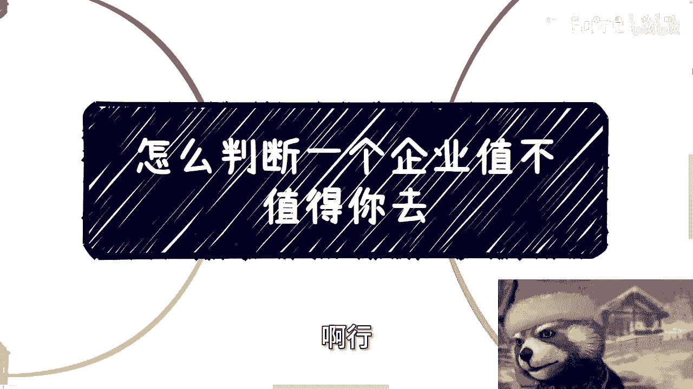

# 怎么判断一个企业值不值得你去---P1---赏味不足---BV1q1421b734

在本节课中，我们将学习如何客观地评估一个企业是否值得你加入。我们将打破一些常见的幻想，并提供一套基于现实情况的判断方法。

---

在开始具体分析之前，我们需要先建立几个重要的前提认知。

首先，个人发展依赖于企业，而企业则依赖于行业。行业又建立在产业之上，产业最终取决于政府政策和全球宏观局势。当前许多企业自身难保，仍在进行未公开的裁员。因此，追求绝对的“稳定”是不现实的。

其次，企业没有义务让你“学到东西”。学习是个人自己的事。在经济环境下，能找到一份工作已属不易。

最后，劳动合同的期限（如一年或三年）并不代表你实际能工作那么久。雇佣关系的最终解释权归企业所有，包括试用期能否通过，也并非完全取决于个人表现。

---

基于以上前提，我们进入企业判断的具体步骤。

## 第一步：入职前审视企业规划 📋

面试通常是双向了解的过程。面试官一般有三类：与你无直接业务关系的大领导、你的直属或团队领导、以及HR。

你不应该向外人打听企业情况，而应直接向面试你的人提问。如果连面试时都不敢或不会提问，进入公司后也很难有好的发展。

以下是你可以询问的方向：
*   **对你应聘岗位的规划**
*   **对业务部门未来的规划**
*   **对企业整体的未来规划**

根据对方的回答，你可以做出判断：
*   如果对方回答假大空、像是在“画饼”，那么不要抱太高期望。有选择就别去，没选择就当作一份普通工作。
*   如果对方回答支支吾吾、规划不清，逻辑同上。

## 第二步：入职后应关注什么 🔍

入职后，为了个人成长，你应该努力超越本职岗位的局限。

核心方法是：多与公司内部的市场、销售、商务等部门的同事交流，了解业务是如何运作的，订单从何而来。这需要通过社交、喝咖啡、聊天、吃饭等非正式方式旁敲侧击地进行，而不是直接生硬地提问。

请注意，不要认为去了小公司就一定能比在大公司了解更多。虽然在小公司见到上下游合作伙伴的概率可能更高，但这并不等同于能积累更优质的关系。关键在于个人的主动性和社交能力。

即使你本身就是销售、市场岗位，也需要多与其他业务部门的同事沟通。因为每个人（尤其是执行层）了解的信息都很局限，只有多交流才能把握大局。

## 第三步：转变思维，聚焦个人成长 🧠

现在的经济环境与过去不同。过去的目标可能是在企业内部晋升或跳槽去更好的平台。但在当前环境下，单纯“内卷”最多只能保证温饱，或者把别人挤下船，自己暂时留在船上。

在我看来，我们应该更关注自身的成长。这种成长分为两类：
1.  **技能类成长**：提升硬技能。
2.  **认知类成长**：加深对行业大局的理解。

无论你在当前的竞争中输赢，到了30岁以后，最终都要依靠自己来面对生存问题。市场上的岗位（肉）有限，而竞争者（狼）众多。自认为一定是赢家的想法往往不切实际。你需要为自己未来的生存能力做好准备。

---

本节课我们一起学习了如何判断一个企业是否值得加入。我们首先打破了关于稳定性和企业义务的幻想，然后提出了三步法：**入职前通过面试询问企业规划**、**入职后主动跨部门了解业务**、以及**从根本上转变思维，聚焦于个人技能与认知的成长**。记住，在当下的环境中，自身的可迁移能力比依赖单一平台更为重要。

---
**附：活动与咨询信息**
*   下期活动定于本周六（7月13日）在南京举行，主题涵盖低空经济、各类企业分析及数字化机会。详情请私信。
*   关于考公考编，不做讨论。
*   如需职业规划、商业规划、合同审查等一对一咨询，请整理好个人详细背景与问题后再进行预约。