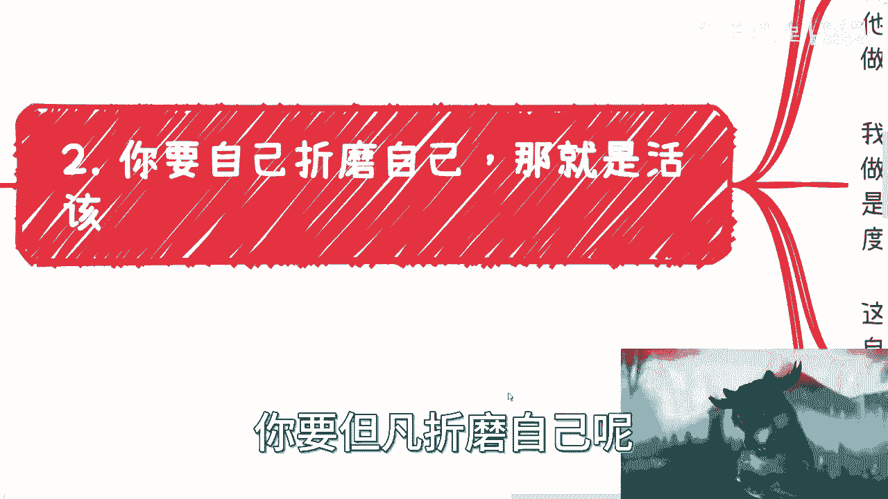

# 课程 P1：如何建立职场健康心态，为自己工作 🧠💼


在本节课中，我们将探讨如何在工作中保持良好的心态，避免精神内耗，并建立“为自己打工”的思维模式。核心在于调整对工作的认知，明确个人目标，并建立稳固的底气。

---

## 一、 核心前提：破除幻想，认清现实


上一节我们介绍了课程主题，本节中我们来看看建立健康心态的首要前提。


许多人存在一种误解，认为“努力 -> 晋升 -> 稳定 -> 赚钱”是一条必然路径。但现实是，这种机会在未来10到20年并非人人可得。这就像买彩票，有人中奖是事实，但能否轮到自己则是概率问题。

**核心公式**：
```
个人成功 ≠ 单纯努力
个人成功 = 努力 × 机遇 × 环境 × 个人独特性
```

除非你从事的是创造独一无二价值的工作（如研发光刻机、火箭），否则在大多数标准化岗位上，你都是可被替代的“标品”。中国的优势是人力资源丰富，因此不要陷入自我PUA，将别人画的“饼”当作必然的未来。

---

## 二、 第一原则：摒弃“过度负责”的心态

在明确了现实前提后，我们来看看具体操作的第一原则：不要过度负责。




其本质是避免成为被压榨的“干电池”——付出远高于所得，最后还要心怀感激。无论是打工还是做纯粹外包，都存在这个问题。

**价值计算示例（打工）**：
假设月薪10万，年薪16薪，总计160万。但你所参与的项目，其收益或亏损通常与你无关。你的时间付出是弹性的（甚至24小时待命），但回报是固定的。你的付出与公司收益永远不成正比，否则你就不是打工人，而是资本家了。

**价值计算示例（外包）**：
一个500万的单子，执行层可能只拿到20万。真正的交付和价值由你创造，但大部分利润被上游拿走。许多人对此没有意识，拿到远低于价值的报酬还会道谢。

因此，“负责”的前提是权责利对等。当钱、名、股票都与你无关时，过度负责只是自我感动。


**核心态度**：
```
工作态度 = 领取的报酬 / 付出的劳动
目标：让这个比值 >= 1
```
即“拿多少钱，干多少活”。这是对自己最负责的态度，也是尊重自己、展现个人边界的方式。否则，就是自我消耗，结局只能是“活该”。


---

## 三、 保持心态的两大支柱

理解了不要过度负责后，我们来看看如何主动构建积极心态。这主要依靠两大支柱。

### 支柱一：对工作建立正确认知

以下是建立正确认知的几个要点：

1.  **放弃线性回报幻想**：认清“努力必有回报”在职场中并非真理。要么真正享受工作过程（不抱怨），要么明确自己的忍耐是“忍辱负重”，有更高远的目标。
2.  **明确个人目标**：想清楚你在职场追求什么。
    *   **如果目标是晋升**：需冷静评估，是靠技术、人际关系还是其他手段？评估自身能力和意愿，并为自己的选择负责，避免多年后怨天尤人。
    *   **如果目标是开拓其他收入渠道**：则将工作视为保障基本收入的平台。正常工作8小时，其余时间研究如何“搞钱”——了解渠道、所需资源、能力与护城河。这样，工作本身的波动就很难影响你的核心心态。


### 支柱二：建立个人底气

心态稳定的根本在于有退路，不把全部希望寄托于一份不可控的工作。

**底气的含义**：在寻找第一份工作前，就应该规划好Plan B、Plan C……即拥有能保持收入的多种方式或技能。这才是你的护城河和自由之源。


**注意**：有底气不等于在工作上为所欲为。在报酬对应的合理工作范围内，仍应尽职尽责。但对于996、007等无理要求，则有底气说“不”。

---

## 四、 总结与个人感悟分享

本节课中我们一起学习了构建职场健康心态的完整框架。

回顾我自己选择不上班的经历，最关键的原因是厌恶“内耗”和“情绪被绑架”。当我通过商业合作获得收入时，合作方往往更尊重、客气，同时收入更高且自主权更大。这让我认清：在单一工作岗位上，与无数人竞争一个“萝卜坑”，既卷不过别人，也未必是自己想要的生活。

广阔的商业市场提供了更多可能性。**最重要的启示是：人生要活得通透**。想赚钱，就直奔主题去探索短平快或可持续的赚钱方式，不要用“读个研再做自媒体变现”这类绕远路的方案来自我欺骗或表演给他人看。

人生时间有限，年轻时可能觉得选择很多，但很快会面临上有老下有小的压力。尽早想清楚自己是什么样的人，想要什么样的生活，并为此规划和行动，才是对自己最大的负责。

**最终心态模型**：
```
健康职场心态 = 认清现实（非线性回报） + 摒弃过度负责（权责利对等） + 明确目标（晋升或开拓） + 建立底气（多重收入计划）
```

希望本教程能帮助你建立更清晰、更自主的职场心态，真正开始“为自己打工”。