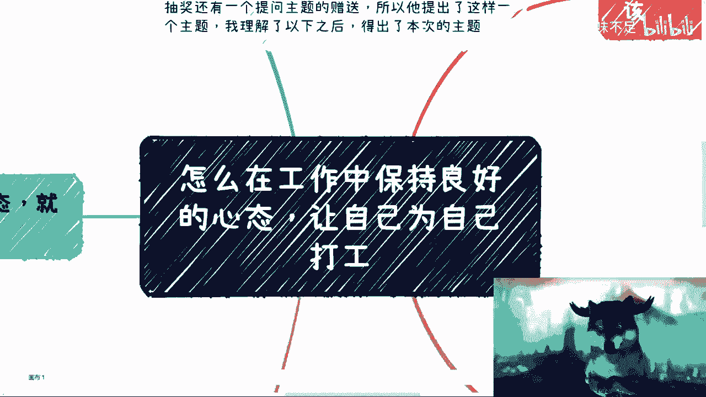
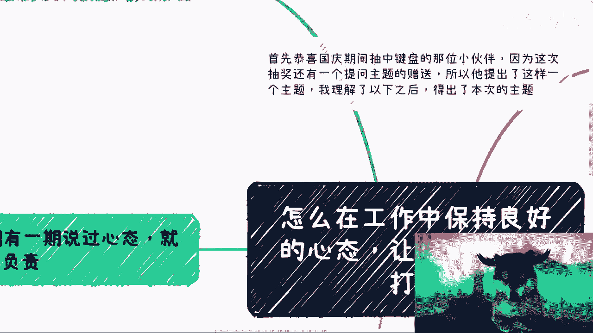
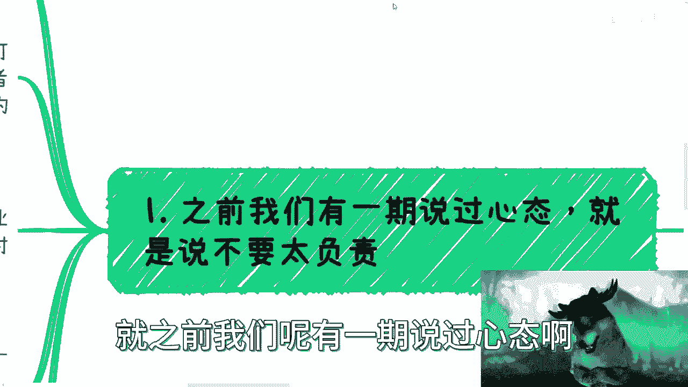
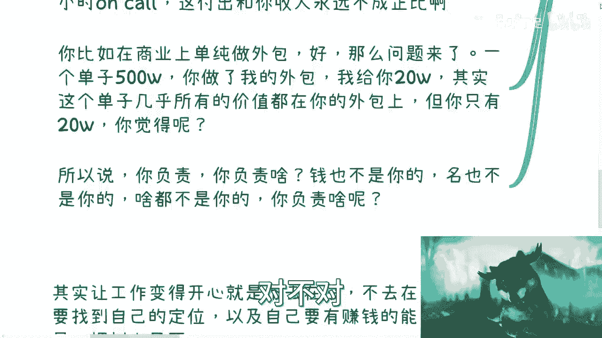
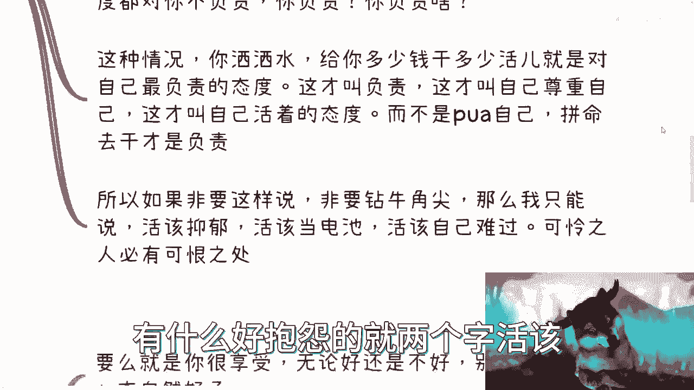
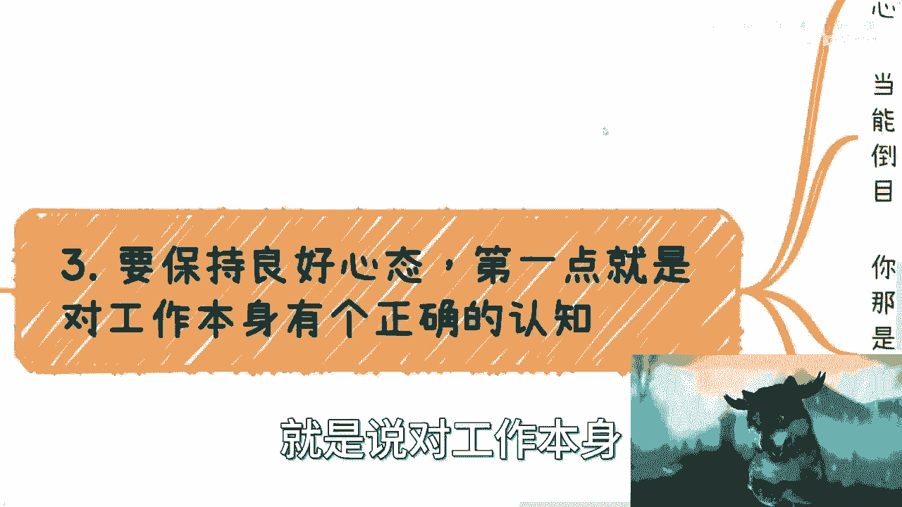
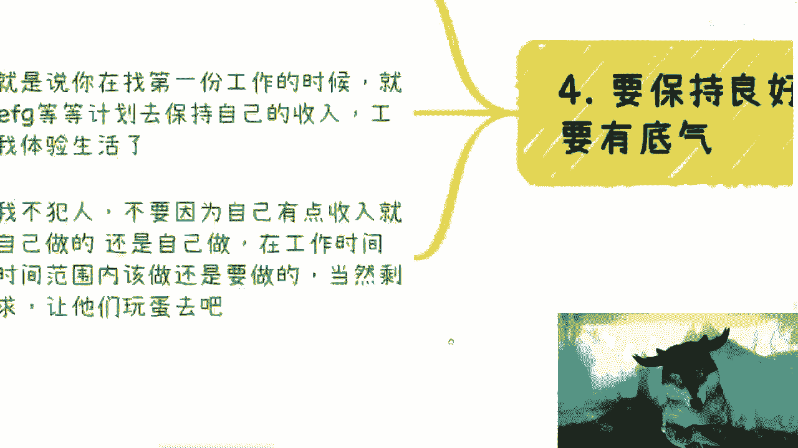

# 怎么在工作中保持良好的心态，让自己为自己打工 - P1 - 赏味不足 - BV1ow411k78d

啊大家好啊，抽中键盘的这位小伙伴啊，然后因为这次抽奖呢，还有一个提问主题的这个赠送，所以呢就是昨天我跟他沟通了一下，这个他提了这么一个主题啊，然后我总结了一下啊，然后得出了本次主题啊。

就是说怎么在这个工作当中保持良好的心态，对吧，就是不内耗啊，不不不以物喜，不以物喜，不以己悲是吧。

这个情况啊，那么让自己为自己打工，首先呢我这边列了一下啊，就是先说这个大前提。

先说个大前提，就是千万别误解这个事情什么呢，就是说很多人呢他认为工作就是努力啊，然后努力呢就可以晋升啊，然后晋升呢工作就可以稳定啊，稳定了就可以赚钱，呃不好意思啊，这个我可以很明确跟你们讲啊。

这个未来10年20年呃，不是没有啊，你们别老是去被那些恶按个理所迷惑对吧，这不是没有啊，有肯定有啊对吧，但问题是轮得到我们了，轮不到我们呀，那那你说我今天早上公众号看到有一个，中了1。9个亿呢对吧。

在好像东莞这边，那他妈的我去买，我能中吗，来不是一个道理嘛，对不对啊，我跟你讲，抱有这种想法呢，很多人会觉得呢做得很开心啊，自己呢貌似找到了自己的价值啊，然后就说有那种就是燃烧殆尽啊，要为为此奉献终身。

对吧啊，呃其实无非是在象牙塔里面被PUA而已，首先我先把这个大的前提说清楚啊，因为还是那句话啊，只要你不是资本家，无论你做什么啊，除非你说你今天是在这个，造一些独一无二的东西，比如说你跟我说光刻机对吧。

或者说这个这个这个这个火箭对吧啊，那个卫星对吧哈，那否则我都是标品，有什么好说的呢，对吧啊，你你写你做开发，我也做开发吧，你做设计啊，我也做设计，对你做什么我也做什么，有什么不能做了，中国有什么优势了。

不就人多嘛，对不啦，嗯不要自己PUA自己啊，别别就是说别人画个饼。

你还当真是吧啊，好我们先说第一个啊，就之前我们那有一期说过心态啊。

就是说不要太负责，这一期呢这个要没看过小伙伴可以回头去看啊，我来重新提交一下，说白了呢就是不要做干电池啊，你不要做电池呢，又要被资本家压榨啊，赚不到钱呢，还要帮别人去数钱啊，最后还要说声谢谢啊，是吧啊。

那说白了之前我们说过呢，要合作就是商业合作啊，别去打工，也别去做纯粹的外包，为什么呢，因为无论前者还是后者，本质都是付出远远高于自己，得到报酬的这么一个时间和价值啊，我们可以说是圆圆圆圆圆圆圆圆啊。

你比如说你打工啊，我这样好了对吧，我给你们算笔账啊，我算你一个月10万块钱不啊，好啊，我算你一年16薪160分是吧，好那很多企业呢，如果啊他一个月能给你发10万啊。

那么我相信这个企业的项目肯定也不会差对吧，那很多企业，往往一个项目可能也就是那么一两个人，三四个人负责的，那请问啊，我就说这个项目的收益有多少对吧，或者一年的企业的时候有多少，但是安大就是大框架来讲啊。

无论多少，你说多也好，亏也好，都跟你没关系，因为你付出的时间价值就是固定的对吧，你付出的价值就是固定的，而且你付出的时间是弹性的，甚至24小时on call对吧，那你有很多人要说了啊，这个我10万块钱。

我觉得很多是是啊，但是从很多项目本身来讲，我不觉得10万块钱跟你的付出成正比啊对吧，就是你的付出跟企业得到数永远是不成正比的，那否则的话就资本家就不是资本家了，对你就不是打工人了啊。

你比如在在商业上做单，做单纯的外包好，那么问题来了，比如说啊我一个单子500万，你做我的外包对吧，我我开心的时候给30万，我不开心的时候给你20万，我他妈10万块钱就当就当他妈喂狗了，对吧啊。

然后但是你会发现，这个单子真正的交付是你交付的真正价值，是你做的对吧，真正的产出价值按照打工人的思路，按照按照电池的思路，在这个付出都是你们付出的，那我就请问为什么500万的单子，你们只拿20万呢。

对不对，为什么呢，但是大部分人不知道呀，对啊，给他20万，我说的为什么说喂狗了，因为很多人他不懂啊，你给他20万，他还要谢谢啊呀，那当然了对吧，从商业角度来讲啊，这个执行层的确很容易被替换对吧。

但是我们就单纯从价值上来讲，有很多人明白这个道理吧，他不明白呀是吧，你要他要是明白这个道理啊，我有很多被替换，那他就知道我应该去做些什么东西，而不是一味的在那边说啊，我要磨练技术，我要磨练这个。

我要磨练那个没有用的，你再磨练你都是标品啊，所以说啊你负责对吧，有很多人说工作上哎呀，这个东西我要做，我负责，我就问你，你负责啥玩意，对你负责个屁对吧，钱也不是你的名，也不是你的，啥也不是你的股票。

也不是你的，你负责个锤子，对不对啊。

首先这是第一点，第二点你要但凡折磨自己呢。

我跟你讲，那就是活该，为什么呃，自从我毕业到现在啊，我碰到这种人老多老多了，劝都劝不动的啊，就是说你自己就告诉你自己，你就是个电池，我就干这点活，我就拿这点钱，这不就结束了吗，对吧，非要就是什么呢。

当然对吧，非要说哎呀，我是个负责的人对吧，很多开发测试产品运营我写错了啊，运营对吧，都跟我说过这句话，就是那种哎呀晚上加班加到很晚，哎呀我要抑郁了，我他妈的老难过了对吧，我他妈哭了很久了对吧。

而且经常要加，每次我就想着安慰他们嘛，他们就跟我说，我的，因为我是个负责的人对吧，自己就是这种人，要么不做，要么做了就好好做，我他妈只有两个字活该对吧，四个字活他妈该真的，我跟你讲啊，我还是那句话。

道理很多，乱套对吧，你要么不做，要么就好好做对吧，他妈真的笑死了，你一个电池啊，业务业务不是你拉的客户，客户不是你的股票，股票不是你的加班费，也没有，别人领导资本家360度对你不负责，开始PUA你负责。

你告诉我，你负责个什么锤子啊，哎我就不明白了哦，该负责的人不负责，在负责对吧，这种情况我觉得很简单，你要我说你洒洒水对吧，给你多少钱，干多少活就对了对吧，给你八个小时的钱，你干四个小时活有什么不好呢。

反正大家都摸鱼，有什么不对呢对吧，我跟你讲，给你多少钱，干多少活，就是他妈的对自己最负责的态度，这才叫负责，这才叫自己尊重自己，在才这才叫自己活着的态度，这才叫自己展现出来，让别人明白你是怎样的一个人。

而不是一个软柿子对吧，而不是PUA自己说拼命在那边，哎我我要他妈的拼命干，我就要负责，这叫什么，这他妈叫傻，这他妈叫蠢啊，所以如果非要这样说，你非要钻牛角尖，那我只能说活该啊，活他妈该啊，活该当电池。

活该自己难过，可怜之人必有可恨之处，结束了，你爱咋地咋地啊，有什么好抱怨的。

就两个字，活该妈的安慰你，都他妈浪费时间，都他妈浪费我情绪，你知道吧啊，三你要保持良好的心态对吧好，我跟你讲就两点，第一点呢就是说对工作本身。

你要有一个正确认知，正确认知就是我们刚刚说的，首先啊努力就能得到回报，努力就能晋升，就能够迎娶白富美，这种思想是不可有的，而且未来外史20年你都不能有啊，我跟你讲，工作这个东西，要么你就很享受。

无论好还是不好，你别去抱怨你，自然你心态自然会很好，没毛病的对吧，没问题的呀，对吧啊，谢主龙是啊，那当然上面这种抖M我们先不说对吧，就正常来讲啊，俗话说能屈能伸，我们可以加班，我们可以996。

我们可以倒贴，我们也可以做的不开心，但是我们要知道我们的目标是什么对吧，忍辱负重吧，对不啦，我可以知道我现在是啊，我也可以知道我现在做的不开心，但是我得知道我到底应该做什么，我不是说我做的不开心。

我就在那边抱怨啊，仅仅就是因为我不开心对吧，你我跟你说，你的目标可以是工作内的晋升，你可以去卷，没有问题，那么你就正确的评估好整体的情况，那到底是靠你技术往上卷呢，还是靠你跪舔往上卷呢。

还是靠一些别的不可告人的手段往上卷呢，你得去想好这个事情对吧，你自己是不是这样的人，有没有这样的能力，你要去想好对吧，你别最终自己作为一个成年人，你说好，我做了这个决定啊，我就要在工作上卷的。

然后卷了5年，卷了10年，发现自己卷不动，从而怨天尤人，那他妈怪谁啊，活该活他妈该，对不对，你就像我这么跟你讲，这就像很多人咨询我的时候是这么说的，他说卢老师对吧，陈老师对他说。

你觉得啊我现在怎么样怎么样怎么样，靠不靠谱，我说我觉得都不靠谱，为什么，因为你现在的样子就决定了你是怎么样的人，你你懂吗，就是如果来说你觉得你是个好学的，或者你是你觉得你是会折腾的，或者你是个会赚钱的。

你现在手上给我的牌，就应该是那些已经折腾过一些东西的东西，一些情况，而不是两手一摊，什么都没有，然后你问我哎，你觉得我是不是这样的人，那不好意思，我觉得不重要，反正你就不是这样的人，那当然你目标也可以。

自己寻求自己赚钱的渠道对吧，不管副业还是什么业啊，比如说大家老喜欢咬文嚼字，别去管这些东西啊，有的没的好吧，那无所谓啊，那么既然你你目标明确的话，那你就去看，比如说别人怎么搞钱的，搞钱有什么渠道对吧。

都需要什么资源，都需要什么能力，都需要什么护城河，那你去搞啊对吧，工作就随便了，正常八小时啊，爱咋地咋地呗，对不了，剩下怎么地啊，他能他妈的一下子把你开掉，开掉，我再找呗。

有什么关系吗，对不对，反正我也没指望工作晋升啊对吧。

你要保持良好的心态，第二点是什么，就是要有底气对吧。

其实啊你会发现让工作变得开心啊，就是不去在乎，不去在乎，那就是找到自己的定位，以及自己要有赚钱能力，而不是说你一棵树上吊死对吧，那么有底气的意思是什么，就是你在找第一份工作的时候，我跟你们这么说。

你们大学没毕业的时候，就应该有plan b plan c，Plan d，plan e plan f plan g等等等等等等等，plan是保持自己的收入工作者对吧，你别的东西怎么样，就当你是体验生活了。

这才叫护城河，这才叫你们的自由啊，对吧哦，还他妈把希望都寄托在工作上，这你把所有的希望都寄托在一个，你不能控制的东西身上，你怎么会好呢，对不对啊，那当然有一说一啊，有底气并不代表你可以为所欲为啊。

当然人不犯我，我不犯人，不要因为自己有点收入，你就不认真对待工作，你要是做了，你还是该做的东西还是要做的对啊，比如说工作公司给你报酬，你在工作范围时间内，你该做的还是要做的对吧。

当然剩下如果有非常多无理的要求，996007或者怎么样的，你就他妈让他们玩蛋去吧，对不对，不就好了吗。

好那么我们回到这个主题啊，呃我之前在分享这个有一次内容的时候，我也说过，就是我为什么不上班对吧，是因为我这么长时间我上班之后，我知道就是上班最让我最就是包括我在内，你让我最难过的是什么，就是内耗。

而且最让我难过的就是你会影响我情绪对吧，就是明明他妈的我一个月就拿不到几个钱啊，就是就感觉虽然也不算打发叫花子嘛对吧，但是就感觉没拿几个钱，但是我每天都他妈活在高压下面啊，每天都要被他妈别人催。

每天感觉催了都不尊重我对吧，我之前跟大家讲这个商业合作也好，怎样也好，这个当中最最重要的是什么呢，比如说我这个月24号，26号到北京去上课是吧，就那有很多人，你从客观角度来讲，我是政府的工具人。

没错是政府要我去的，没有问题对吧，我也承认我是政府的工具人，但是大家很客气啊，非常的客气，你知道吗，就是包括今天早上他们来给我订机票对吧，来来给我安排住宿，很客气啊，我不管这个客气，真客气假客气。

但是大家开心啊，愉悦啊对吧，而且我还不用付钱了，而且我还能拿钱啊，而且我拿的钱还不少啊，对不对，那我去工作干嘛呢，哦我他妈就工作一个月22天，23天，然后我就在那边每天高压下面，每天他妈都愁眉苦脸。

然后还要被人PUA，还被人说我图什么啊，我就图所谓的近身，卧槽晋升给我涨个20%，还要让我他妈的跪跪跪下来磕头呢，我真的有时候想想真的没必要，有什么必要呢，对吧，就是我对我自己有很清楚的认知。

中国14亿人，我头上不长角，我卷不过别人，我承认了，对不对，在工作当中拍马屁，我也拍不过人家的，做技术，我也做不过人家啊，总比总有天外有山，山外有山，人外有人，我搞不过人家的。

那我还不如自己搞搞一亩三分地啊，对不对，商业市场多广大啊，这打工一个一个萝卜一个坑，你做到什么时候去啊，对不对，其实我觉得所有的人想明白这个道理，他就自然而然的明白了对吧，但是问题在于你选择什么。

你不要去抱怨，你懂吗，就是你选择什么都是你自己的选择，没人逼迫你对吧，你就像你就像昨天那个咨询也是的，卧槽我真的就这两天火很大，你知道吗，就是咨询也是的，就是聊半天啊，我每次都会问我说你的目的是什么。

你要是要赚钱，你就去赚，那就不要绕圈子啊对吧，就是有很多人你知道吗，就就非常的神奇，就跟我说刘老师我想赚钱，我就特别想赚钱，然后他说我有个方案，什么方案呢，就是你看啊，我先读个研对吧，然后我做个自媒体。

然后我开始积累我的我的流量啊，然后积累到一定程度把它变现，我说脑子有病吧对吧，你要去赚钱，我就告诉你了呀，一个月两个月短平快的赚钱方式，你去赚，那哎就奇了怪了，你知道吗，就就就人活的一点都不通透。

人活的一点都不一点都不自在，就你活的叫什么，就是就是你是怎么样就怎么样呢，你为什么要装呢，哎就真的我的骂，骂得我头疼，你知道吗，就是我我说你赚钱，你要真的想赚，你就赚，对不对，你别再去做那些哎呀。

我又要做这个样子，做给我爸妈看的啊，我那个样子又要做给谁看的，哎真的我跟你们讲啊，人生匆匆几十年，说是这么说的，很多人我以前接触过很多人，30多岁，20多岁身体就不好了啊，这个回头30多岁上有老。

下有小，你们顾及的事情多了去了啊，你你别觉得好像你的自由你可选择自由，可选择时间很多，没多少时间给你选的，到最后你能怎么办，不是无奈地郁郁而终吗，好吧行吧，那先这样吧，这个再次恭喜这位小伙伴啊。

这个牛逼的，就一位啊脱颖而出，然后那个好吧，先这样吧，然后大家反正一样的，就是大家要知道怎么搞钱的对吧，知道手上牌怎么打的，知道未来这个规划规划想怎么走的对吧，觉得我不满足于现状的啊。

包括你们就是说呃碰到一些ID，因为他们现在也有很多，就是说碰到一些合作版或者合同怎么签，不知道怎么合作的，也会总结出来问我，反正你们总结好好吧，然后私信我们可以做咨询行吧。

