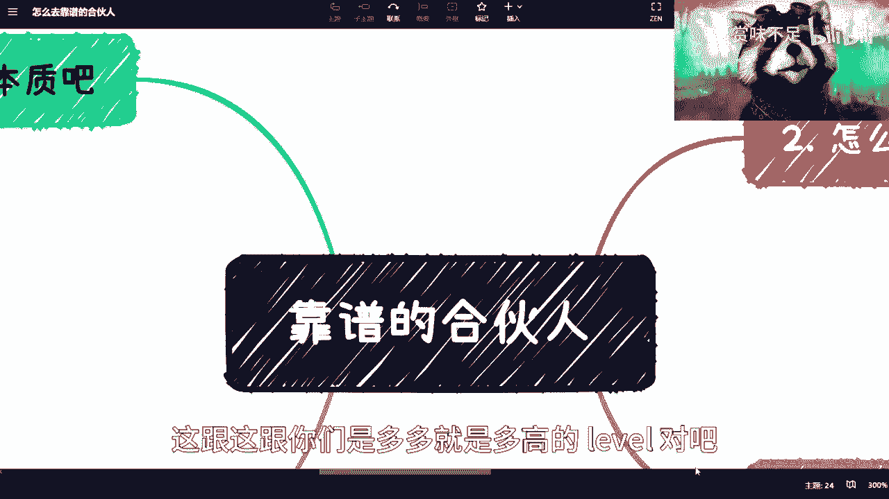
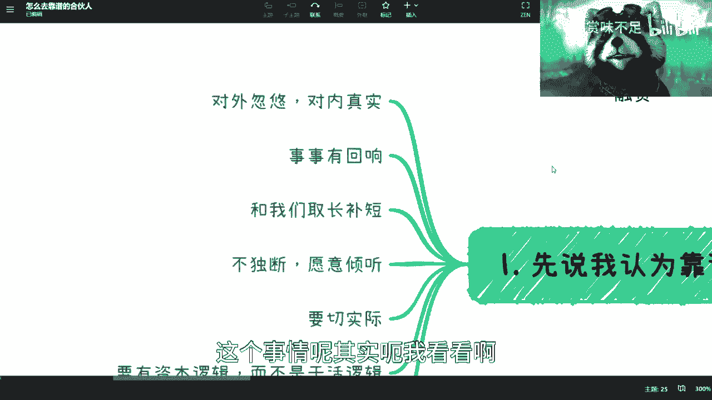
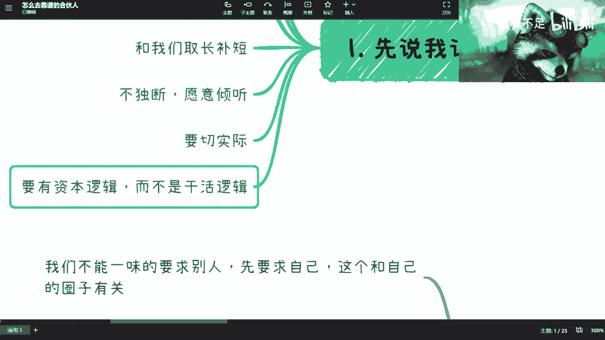
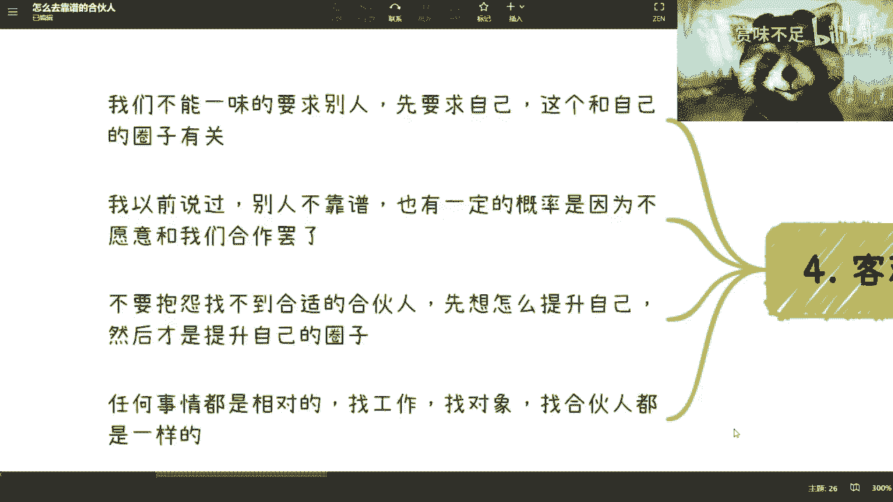
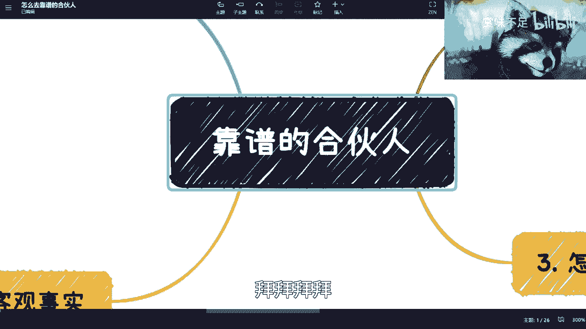

# 怎么寻找和判断一个靠谱的合伙人 - P1 - 赏味不足 - BV1Hk4y147HG

哈喽大家好啊，我是你们的驴老师是吧，我跟你们说昨天晚上12点到家啊，然后这个看资料看到了02：30，然后呢，我本来昨天晚上我凌晨我就现在想了，我要不要去做个视频，我也感觉并不困，但是我后来想想算了。

我这个把驴卷死了，对我有什么好处是吧，今天是礼拜天啊，我这个弄完了，我待会要去华师大给他们讲了一个GPT嗯，我昨天看到了，就是有很多小伙伴说合伙人的这个事儿啊，我大概列一下。

但是我不是很清楚大家的这个切入点是什么，好吧，有什么，反正呃这个细节或者你们想了解的，可以在到时候写在评论区吧，哎感觉我还没缓过来呃首先是这样子的啊。

我先说一个大方向吧，好吧，就是合伙人这个事呢，其实本质上是蛮难找的啊，就是我跟你们说本质是什么呢，就是你们就是不停的找不停的试错哦，然后不停的复盘，不停的总结，这就好像你去小时候学跑步，你知道吗。

就不停的摔，但是你不能因为你说哦我摔了，我就怕了，我就我就觉得各种各样的反思对吧，然后我就不跑了，那不行，就是说这是个必经之路，这跟这跟你们是多多就是多高的level对吧。

有有多强的这个能力没有关系啊，首先我认为靠谱的本质。

因为在这个地方其实说的是靠谱嘛对吧，大部分人找合伙人不是找不到啊，但是你们要明白啊，就是嗯尤其是当下，就是我说比如说现在往后3年对吧，就很困难的这个时间你们我知道就每个人想法，因为我也很焦虑对吧。

就是但是我跟你们说啊，就依我以前经验啊，越是这种时候，你们越是不能去想着说哦，我看到一个一个人对吧，或者或者我看到一个一个一个什么样的项目啊，然后呢我就觉得啊救命稻草对吧，这个项目能给我赚钱对吧。

或者这个人能给我赚钱，我跟你们说啊，越是这种时候大概率你越容易被骗啊，就是最近找我咨询的人啊，是这样子的，就是在这里面其实涉及到很多的投资啊，涉及到很多的就是那个叫什么，就是合伙创业对吧。

当然也不见得叫创这种全职业，可能兼职的part time的这种业嘛对吧，我为什么，因为我为什么会跟很多人说，你们比如说咨询是走这种私人的，就不要让我说啊，所有的你们跟我讲一个东西。

我就公开的来跟你们讲对吧，因为为什么，因为第一个点是很多的东西，我的确不能去公开说啊，就是因为我看到评论也有说嘛，就说啊能不能再讲些更敏感的东西，同学们更明白的东西，我人都没了好吗，更敏感的东西啊。

这是第一个，第二个是什么呢，就是我跟所有人都说的很清楚，就我跟你们讲，你们所以但凡问过我的，我都一个回答是什么，就是这3年所有不必要的投入啊，记住所有不必要的投入都不用啊，尤其是金钱就现金都不要啊。

不要讲的是什么投资啊，什么东西，我跟你们说，包括我对吧，我们现在缺的是什么，是想办法增加赚钱的渠道，而不是想办法去投资。

增加你赌博的渠道，好吧啊，那么我认为靠谱的本质呢，我觉得你们练了几个点啊，第一这一点非常重要，叫对外忽悠，对内真实，什么意思呢，就是说我们去找投资人哎，回头对对对对对，你们说的对，我又忘记了对吧。

那个融资的事情，我回头帮你们给你们讲一下啊，就是是这样子的，就是你对外忽悠，就是对外你就找投资人，找合作方，你肯定是要画饼的对吧，你现在这个社会你不画饼，怎么可能呢，是不是，但是你我跟你们说啊。

就是你们你们自己也好，你们找合伙人也好，一定要记住啊，你们不能骗着骗着把自己骗进去，因为我见过很多人，就是他饼画的很好啊，他的这个说说辞也很好，简直是销售中的战斗机，但是问题是他对内忽悠对啊，对外忽悠。

对内也忽悠，这个时候你会发现时间一长，你就会发现它不但对外偏，他对内也偏，你知道吗，这种切忌啊，大忌啊，这是大忌，第二呢就事事有回响，这个事情呢其实呃我看看啊。

就这个事情其实是要跟这个有关系，我放在这吧啊就是说不管多大多小的事情。

他都有回响对吧，也就是说你能做一好，不能做也行，你做的好也好，做的差也好，你不能没有反应，因为我在呃合作的很多人当中，我碰到过这种人的，而且不少啊，就是那种就是说好的时候没问题。

不好的时候你发他微信没反应的啊，打电话也没反应的，就发发这个语音也没反应的，就是人间蒸发，这种不行啊，这种切记不行啊，那么呃这个可能还有funky，那么第三个是什么呢，就是自驱力，自驱力的意思是什么呢。

因为很多人呢他创业，因为嗯创业本身不管是你全职兼职啊，创业本身它是一个过程对吧，就很多人他要从一个打工思维到创业思维，是很难的啊，或者说他总归是有个过程的，我们在很多大厂里面呢。

其实一直提到有个东西叫什么叫ownership啊，Ownership，什么叫ownership，就是你得有主人翁意识，什么叫主人翁意识，就是你得有自驱力对吧，那什么叫自驱力。

就是你不能所有的事情要别人来盯你对吧，你比如说我们今天合伙对吧，你比如说陈老师啊，我们来合伙对吧，好没问题的，但是呢你跟我讲的所有东西，你得自己去安排好啊，就好像比如说我一直跟你们讲啊。

我说我今天签两个PPT对吧，我前天建议个PPT，那这个东西就是说我得每天有一个task list，我得去列我到底要做哪些事情，而不是说不停的我的合伙人来说，哎陈老师啊，你这个东西怎么还没完成啊对吧。

你这个你你你这个就是每天来问我对吧，这个就不要合伙人啊，这个还不如招个员工对吧，那这个是自驱力，然后是一定要跟我们是有取长补短的，就是嗯一个团队的核心成员一定要有它的特长，一旦他的擅长里呃。

我们其实从目前来看，我越来越觉得就是说并不需要就是核心团队，并不需要有几个能力相似的人，因为这个事情不太合理，而且有很多时候，说实话就是说你是需要独断的啊，你是需要独断的，当然就是有些时候对吧。

否则你你说你创业公司跟别的公司的优势，在什么地方哦，你说阿里的劣劣势在于船大很难掉头，那你小公司好，大家讨论个问题，讨论个餐厅两页对吧，五天四夜也很难掉头，那你创个啥业对吧，你说是不是。

然后在这个地方呢是这样子的，就是，我给你们举个例子，我第一家就是我毕业的时候，就是去的那家创业公司，四个创始人我记得很清楚啊，我这边就不写了吧，我记得很清楚是三个微软出来的，一个是日企留学的。

然后差不多我去的时候，他们应该差不多是二十七八吧，30岁左右，然后呢这四个人就属性非常的就是鲜明啊，就是一个是CTO，就一个是专门做技术的，一个是那个小姑娘是商务商务，她是计算机背景。

然后精通八国语言吧，还是六国语言，然后他就专门做sales和BD的，然后还有两个人，一个是CEO，CEO是主要是对全掌控全局和跑业务的，然后剩下一个人呢是呃团队管理，也他也不算完全。

团队管理就是一半团队管理，一半是客户管理，那这四个人我觉得就配合就很很，你说配合好不好吧，大家其实都需要磨合的，这毫无疑问你再强的人，越追越强的人越是需要磨合的，但是呢就是说呃属性是非常互补的啊。

这个就是当时对我来讲是非常的，就是就是就是有参考性的啊，而且我当时我觉得，第一家公司对我的影响还是蛮大的，因为我我们团队这个技术人员其实很少啊，都是应届生，都是应届生，然后当时的话是三个开四个开发。

三个是交大cs的，做ASM的，然后一个是清华的啊，那个清华就是我跟你们说的那个叫李一鸣呸，就l y m panda，他中文叫李一鸣嘛对吧，他以他是专门打那个google code jm，然后。

嗯对然后下面就不独断啊，这个地方呢其实有很多人会觉得，跟我刚刚讲的有所冲突，其实不冲突，就是啊创业公司要的是什么，要的是灵活啊，团队要的是什么，要的是这个尽快的效率高往前走对吧。

那你大部分情况呢是不独断，一定要愿意倾听，什么意思呢，就是说你所有的事情大家先互通有无对吧，就是我可以跟你拍桌子，我可以跟你对骂对吧，但是就是说大家一定要去辩这个理，不是靠就是并不是靠感性啊。

就是比如说啊我们我们随便举个例子，就比如说你说你创业了对吧，好合伙人，你有些合伙人之间呢唉谈的是感情对吧，有的合伙人之间呢就是谈的是这种，就是感觉对吧，就是就是你会发现做所有事情。

他是没有一个就是理性上的依据呢，那我跟你们说啊，创业这个事情，所有的东西你一定是要有数据支撑的啊，数据支撑你没有数据支撑，不要做判断对吧，这就好像我做视频做到今天今天啊。

你们会发现我做所有东西我都是很随意的，为什么，因为我做一个就是做一个x x min对吧，然后我就我就录一个视频，我从来不剪辑的，我最多加个字幕，然后字幕还自动加了，很多人还吐槽我字幕很乱对吧，那为什么。

是因为我跟你们讲的所有东西，都是我一步一步走过来的，我知道这里面有哪些问题，我也知道这里面数据大概是什么样子的对吧，包括我整个面了解的，就是就非常的可能是人肉大数据的情况对吧。

所以我不会说哎觉得呃就是说这里面有任何的，比如说啊不切实际啊，或者说没有根据的，因为往往所有的东西我都是我听看，再结合我自己的经历对吧，你说我但凡没有一步一步踩过来过，我跟你们讲这些。

你们早就把我喷死了，你们知道吧啊那么其实呢就是说这是一块啊，这个男孩就要切实际，因为我以前也碰到过合伙人是什么呢，就是那种什么都好啊，但是呢就是那种天马行空，就是就是你做事情呢。

你得一步一步一步一个脚印，哎我跟你们讲，这就像最近这个你们跟我聊也是一样的，哎呀就是就怎么说呢，就说那这么说就是大家的目标都是赚钱，没有错啊，大家目标也都是脱离所谓的普通人对吧，我也没有错啊。

但是这个当中的过程就是我那句话，你该跌的还是要跌，你该踩的还是要踩，你不可能是避免他，你要做的就是尽快尽快的踩完这些课，就是有些人你比如说我对吧，我觉得我可以自豪的说对吧，我可能56年才玩人家呢。

15年20年的坑对吧，那你尽快采用人教坑，那你不就开心了吗对吧，你你不就你不就能够做很多更多的事情了吗，你说是吧，那那你说我之前碰到那个合伙人，就是的，就是我跟他讲对吧，我说我说你你你做一个创业公司。

你的第一首要目标是先活下去，所谓活下去就是先赚钱对吧，赚多赚少，另外一件事情，当然你不能骗别人对吧，就是就是说你可以有一定的包装，但你不能纯片，你明白吧对吧，就是这么个逻辑。

那么你知道你们知道他当时跟我怎么说啊，他说啊我不要啊，我的这个这个自我定位啊，我就是要去做那种一个亿的生意啊，小目标是吧，我我跟你讲就越是这样子啊，你你越是没有任何的进展啊。

就是跟大家比如说呃找工作啊对吧，读研啊一样的，就是就不管你们是未来为了是找到5000块钱，1万块钱稳定的工作，还是为了未来改变世界，这个都不重要，重要的是你们先走出第一步，你知道吧啊。

啊最后呢就是说也是最核心的，就是一定要有资本逻辑，而不是干活逻辑，就是因为做事情你可以很靠谱啊，以上所有东西你都可以很靠谱，但是呢如果他只有一个干活逻辑，没有资本逻辑，这个不叫合伙人啊。

这个不叫联合创始人，这个你最多最多也就是一个高管。

啊那么，那么这些事情啊，你们一定要记住，这些事情，就是在我这边说的，你们记住任何事情都是相对的，找工作找对象，找合伙人都是一样的，任何事情都是相对的，什么意思呢，就是说你几斤几两就去找几斤几两。

或者说你几斤几两也就只能找得到几斤几两，这个我不是说这个我就客观的说啊，这不是说哎呀，很多人又玻璃心了是吧，我的啊，怕玻璃心碎了是吧，这没办法，我跟你讲，这个本来就是残酷的，你说怎么办呢，你说是吧。

就是你们要找到这些人，那首先你自己得是这样的对吧。

你首先得要改变你自己，你你说我改变不了，你改变不了，别创业。

就这么简单对吧，你改变不了，你也别别别去找，觉得爱自己找不靠谱的对象，你没戏啊，没戏嗯，第二个呢我们就说怎么判断对吧，我跟你们说啊，第一呢就是我以前讲过，我被骗过无数次。

真的无数次就是那种就是说啊我这个你看他啊，比如说以前在某某某公司，或者某某某这个这个创业的业务上面，担任了什么什么东西对吧，巴巴巴巴一大堆对吧，我跟你讲虚的态度，90%他妈都是虚的啊，就是你说他呆过吧。

maybe啊，也许是呆过的，但是你说他任何做过任何核心吧，我说的可能不恰当一点，就是他就在那边负责扫地的，其实差不多啊，就负责打扫打扫，这个负负责可能这个叫什么，就是后勤的可能差不多啊。

但是你看上去好像哦核心团队是吧啊，这啊这没没卵用，真的就这种我被骗过无数次，这你总归年轻过嘛是吧，第二呢就是千万不要对我列的这些属性去让步。

就是我左边刚刚列的这些东西，这些东西千万不要去让步。

什么意思呢，就是说嗯就是大家可能也觉得啊找人很难对吧，我这个这个陈老师说啊，这么一些对吧，我当中可能找到一些人满足了四五个啊，哎我觉得已经很不容易了啊，这个区让步，我给你讲，千万不要啊。

千万不要因为这些属性最终的你你们这么说吧，就是我刚刚其实没有写在那边，这些属性最终的你们知道为什么要满足呢，是因为他主要是为了信任，因为创业很多时候呢你要这么想，就是业务是一方面对吧，法务啊。

财务啊对吧，尤其是金钱上的东西更说不清楚啊，那么你你又话又说回来了，你你就会问嘛，你说我怎么去信任一个人呢对吧，你总不能跟他说来你吃了几碗粉对吧，你你给我剖一下，你到底他妈吃了几碗粉是吧对吧。

那你怎么信任呢，你就必须要通过这些属性，大部分综合这些属性人他一定是值得信任的，对啊，你要明白你但凡为了一些东西去让步，你说只满足了两三条，三四条，我跟你讲这个里面大概率不靠谱。

就是你还是会为了你的让步去买单的啊，那么很多事，然后就问哎呃然后就问嘛，他说就是核心怎么判断，我跟你们讲判断条件依据只有一个，就是你一定要去合作啊，这个我跟你讲就喝什么呢，就是我跟你们说。

有很多人的脾气，有很多人的癖好哦，有很多人的毛病，他是必须你去谈恋爱了，你去结婚了，你才知道的对吧，那合伙人也是一样的，你不去合作，你永远不知道这个人怎么样对吧，你就你就比如说啊，我随便举个例子。

比如说我对吧，你们跟我说，你们你们嗯陈老师这个讲的不错对吧，做的不错啊，然后你们跟我合伙，然后就发现卧槽陈老师不行啊对吧，这个什么都做不来啊，是个骗子，对吧啊，那这个就一样，我跟你讲。

中国人很多很多很多很多，所以呢我跟你们讲，你要先从弱合作开始，就是你先从一些业务合作，就比如说大家分润的对吧，比如说你负责上游，他负责下游，大家企业去企业的合作，然后合作过程当中呢。

你通过跟这个人的沟通啊，通过跟这个人的就是项目的合作制，你慢慢慢慢慢慢去理解这个人，你知道吧，就只有这种可能性别的，我觉得几乎没有啊，几乎没有，然后呢第二点呢就是说能力强不强并不重要，重要的是合不合适。

你就还拿我来举例子啊，你说啊陈老师我们合作一下合可以呀，可以呀对吧，然后呢，你说这个这个找我合作和嗯，嗯这个什么谈股份啊，谈谈那种什么乱七八糟的东西，很多很多对吧，但是问题是什么。

问题是诶你觉得合不合适，因为我对我来讲，我觉得没事都都合适，没什么不合适，因为我跟你们说，我做事情是这样子的，第一我有无数个plan对吧，我有很多的备选方案，我不我并不会在一棵树上吊死。

我绝对是在十棵以上的树上吊死对吧，首先这是第一点，第二点是我会以我的价值观来判断所有的事情，包括我跟你们说的这个属性，我会把他们先在你们身上套一遍，然后我所有的出发点全部以赚钱为主，没办法对吧，你创业。

你不创业，不赚钱干嘛做慈善吗，对吧啊，然后呢，我也会很强势，为什么，因为我会去听你的说法，但是如果你的说法没有任何数据以支撑，或者没有任何的理由，那我不会听你说的，再动听，跟我也没关系。

你说的在天花乱坠，对我来讲就是BULSHIT对吧，那也很简单，就是我并不是说难听点，我只care你有价值那部分，我并不care你这个人啊，你一定要明白对吧，那我觉得是这样子，如果你你就为什么叫合不合适。

就是如果你们不能接受这一点，那OK啊，无所谓啊，那就不合作呗对吧，那如果你们又不能接受，但是又觉得要合作，我跟你讲，这合作不下去的，就这个样子，对吧，所以说呢，就是说你但凡让我觉得你这个人很靠谱的。

一定是说我们背靠背赚钱，我们背靠背做过项目，那么我就会觉得哎这个人是不靠谱的，那么无无论我以后做什么项目，我都会想起你对吧，但是如果来说一开始在合作的时候对吧，我根本就不看这个人是谁。

因为我只看他到底能提供什么价值啊，那么第三点你说怎么寻找呃，首先他的背景最好是创业的，因为没有创业，就像我说的，你很难去判断他到底是打工的人还是创业的人，因为这两个东西的这个出发点是不一样的啊。

那么呃成不成功你不用去看他，因为纳斯达说直说的不好听点，纳斯达克上面敲钟的人对吧，我我这边也碰到过很多个啊，这个就跟web3里面都说是MIT辍学，是一样的对吧，这个创业里面你路上随便找个人都是啊。

我以前纳斯达克敲过钟的对吧，那么鬼知道你去的是哪个纳斯达克是吧啊，但是呢就是说你成功不成功，你需要复盘，什么意思呢，就是说你做一件事情可以失败，但是你要明白为什么失败，然后你明白为什么失败之后你得去改。

否则说难听点你有卵用啊，啊有卵用啊是吧，这就好像很多人找工作是一样的啊，陈老师找不到工作是吧，陈老师，我怎么我怎么简历投资就没反应啊，这个大哥大姐们啊，我跟你讲简历没有反应，第一步你先包装简历对吧。

你你包装简历不包装对吧，你就觉得哎我找不到好，我就在那说我找不到，然后我就继续海投，没有用的，你要把细节都做到位，你知道吗，就还是我那天不是说那个书的事情一样吗，就是酒香不怕巷子深，这个时代已经过去了。

那怎么办呢，你得包装啊对吧，你们要知道一家企业，一年在营销上面得花多少钱啊，他们在营销上面花的是大大部分是大头啊，为什么有很多人觉得营销是虚的是虚的，但是为什么人家要花钱，就是因为你不营销。

你死你就是死啊，你只有死路一条啊，一样的道理啊，你知道吧，第二是什么呢，就是最好你要不停的合作当中去寻找对吧，因为你这个人已经已经很了解了对吧，第三呢就是说你要接触的话呢，就是你可以通过网络。

你比如说哎哎创始人对吧，我听你这个视频哎，我觉得你蛮不错的啊，你可以找我对吧，但是你找我也是一样的，我跟你们说有很多合作方式，通过网络找我的，没毛病，但是第一步是什么，第一步还是要线下见面。

因为你只有线下见面了，你去细聊了，你对我才能有了解，我对你们才能有了解对吧，因为虽然我不care你们的这个人是怎么样，但是我care的是别是一个骗子，到时候把我把我骗去，把肾噶了对吧啊。

然后这个事情呢本质上就是大海捞针，但大海捞针你你不能说啊，我因为捞的不靠谱的就不捞对吧，你还得捞对吧，你只有捞的基数够大，你才能捞到靠谱的好，那么最终，我靠我他妈讲了这么久了啊，不行啊。

我这个要把驴卷死了，看来唉客观事实啊是这样子的，第一你们不要一味的要求别人，首先所有的东西先要求自己，所有的时间都一样的啊，包括我跟你们说，我去跟人家谈恋爱的对吧，找工作的，找对象的啊，不呸。

找合伙人呢，我都这个一开始都说了对吧，我说我也不怕得罪人对吧，我说第一件事情就是什么呢，你们别去看别人，你先看你自己，你先把你自己管好啊，先把自己要求好，该做到做到做到位再说啊。

你所有找人一定跟你的圈子有关，这是第一点，第二点是你也别觉得别人不靠谱，有一定的概率是因为不愿意跟我们合作，这就好像我跟你们说，现在整个认认识我的人，B站上面肯定认识我的人，基数变多了对吧好。

但凡你们认真就是客观讲话的对吧，好好讲话的，不阴阳怪气的，我都回复的，不管是私信还是评论，我都是回复的对吧，不回复我是给你们点赞的对吧，毫无疑问，不管多少人对吧，但是问题是你我跟你们说。

在过程当中也有人，我是不回复的，为什么，因为我觉得不靠谱啊对吧，就是我觉得我在你身上花的时间不值得，为什么不值得，是因为你给我描述的东西我觉得不靠谱，就是我我回答等于白回答，回了之后也没有意义对吧。

那么这个有很多人就会，就就可能有些人就会觉得哎呀，这个这个up主不靠谱啊，这个啊骄傲自大对吧，怎么样，那我时间不是时间啊，我时间他妈不值钱吗，啊我跟你们说啊，这客观的说对吧，政府找我，企业找我对吧。

政府政府这边可能钱比较少，可能比如说一天一天这个咨询和一天的培训，基本上也有六七千对吧，企业这边一天六个小时，基本上我能给到1万5对吧，我我靠，我不值钱吗，虽然我没有这么值钱是吧啊。

第三你不要抱怨找不到合伙合适合伙人，你知道吗，你得先去提升你，然后再去提升你的圈子，然后这是一样的，找对象也是一样的，你知道吧，所以我一直会跟很多人说，我说我说，你不要觉得世界上对吧，找不到合适的对象。

你也别说找不到合适的，就很多东西其实很多东西都有的，就是这个世界你就把它看成什么，它是一个就是啊，比如说你你打游戏啊，有一个冲关的游戏，你就在雷欧一，然后呢这有20层，那可能我们现在都在，比如说第三层。

第四层，但是可能很多很优秀的啊，然后那些人可能在第十层，第11层对吧，它们存在，但是只不过我们接触不到对吧。

我靠9。9。40差不多了，好吧呃反正有什么你们跟我讲好吧。

那个有什么评论跟我讲好吧，有什么私信跟我讲，然后呃，你们有什么创业的idea或者简历要修改的对吧，或者来说个人职业发展要问的，你们可以私信咨询我好吧，反正价格我也是公开的，就这个价格嗯行就先这么着吧。

我要赶赶PPT，下午还要去华视的好吧，我觉得蛮好的。

