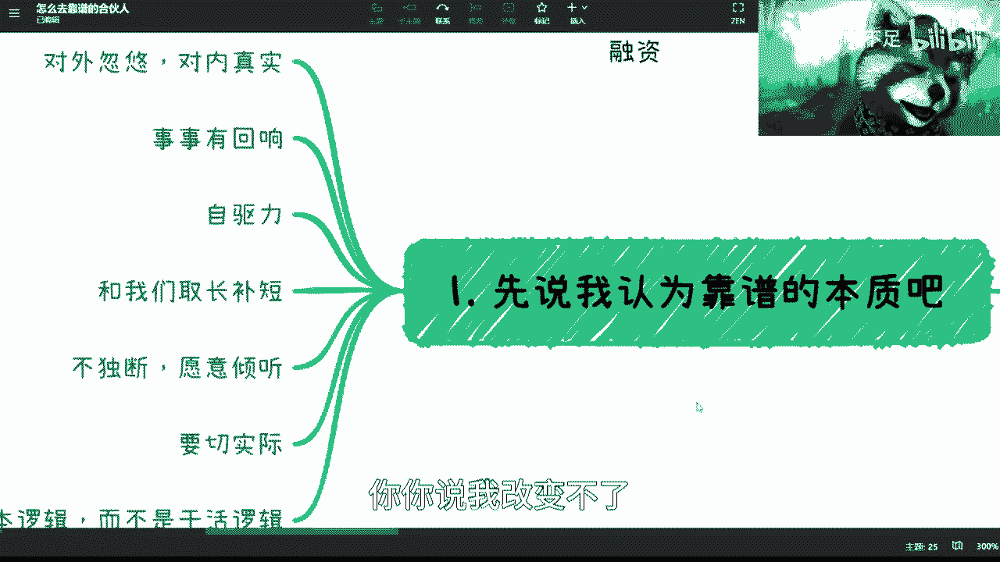

# 创业合伙人指南（P1）：如何寻找与判断靠谱的合伙人 👥

在本节课中，我们将要学习如何寻找并判断一个靠谱的创业合伙人。寻找合伙人是一个充满挑战的过程，其本质在于不断尝试、犯错、复盘与总结。这就像学习跑步，摔倒是必经之路，但不能因此就放弃前行。无论个人能力高低，这个过程对所有人都同样重要。

## 靠谱合伙人的核心特质 🔍

上一节我们介绍了寻找合伙人的本质是一个试错过程，本节中我们来看看一个靠谱的合伙人具体应具备哪些核心特质。这些特质是建立长期信任与合作的基础。

以下是判断合伙人是否靠谱的六个关键点：

1.  **对外画饼，对内真实**
    *   含义：面对投资人、合作方时，必要的“画饼”（即描绘愿景和前景）是商业社会的常态。但核心团队内部必须保持绝对的真实与坦诚。切忌“骗着骗着把自己也骗了”，对内对外都失去诚信是合作的大忌。

2.  **事事有回响**
    *   含义：无论事情大小、结果好坏，都必须给予反馈。能做或不能做，做得好或不好，都需要明确沟通。那种在遇到困难时就“人间蒸发”、失联的合作伙伴是绝对不可取的。

3.  **拥有自驱力与主人翁意识**
    *   核心概念：**Ownership**（主人翁意识）。
    *   含义：合伙人必须具备强大的自我驱动力，能主动规划和管理自己的任务，而不是事事需要他人催促。创业需要从“打工思维”转变为“创业思维”，主动承担责任是关键。

4.  **能力互补，而非相似**
    *   含义：一个高效的创始团队，成员之间的能力应该是互补的，而不是相似的。例如，团队中需要有人擅长技术（CTO）、有人擅长商务拓展（BD）、有人擅长全局把控（CEO）、有人擅长团队与客户管理。这样的组合才能覆盖创业所需的各个方面。

5.  **基于数据的理性决策，而非感性独断**
    *   含义：创业公司需要灵活高效，但这不意味着可以凭感觉独断专行。团队应鼓励充分讨论甚至辩论，但所有重大决策都应尽量建立在**数据支撑**和理性分析的基础上，而不是靠感情或感觉。

6.  **具备资本逻辑，而非仅仅是干活逻辑**
    *   含义：合伙人不仅要能踏实做事（干活逻辑），更要理解商业、股权、增长等宏观层面的运作（资本逻辑）。如果一个人只懂得执行具体任务，而不具备商业视野和格局，那么他更适合作为高管，而非联合创始人。

## 如何判断与筛选合伙人 🧐

了解了靠谱合伙人的特质后，我们来看看在实际操作中如何运用这些标准进行判断和筛选。这是一个需要谨慎和技巧的过程。

以下是三个关键的判断与筛选原则：

1.  **警惕过度包装的背景**
    *   许多人在介绍自己时，会过度夸大在以往公司或项目中的角色与贡献。对于声称拥有“核心团队”、“辉煌经历”的人，需要保持警惕并深入核实。表面的光环往往不可靠。

2.  **绝不妥协核心特质**
    *   对于上一节列出的六项核心特质，**不要轻易让步**。不要因为“找人难”就降低标准，接受一个只满足部分条件的人。这些特质是建立信任的基石，妥协往往意味着未来需要为不匹配付出代价。

3.  **通过实际合作进行验证**
    *   判断一个人的唯一可靠方式就是**合作**。就像谈恋爱，不真正相处就无法了解对方的脾气和习惯。应从“弱合作”开始，例如通过分润明确的项目进行业务合作，在合作过程中观察对方的沟通方式、执行能力和诚信度。

## 如何寻找潜在的合伙人 🌐

明确了判断标准，接下来我们探讨可以去哪里以及如何寻找潜在的合伙人。寻找过程本身也是扩大圈子和自我提升的过程。

以下是三个寻找合伙人的途径与建议：

1.  **优先寻找有创业背景的人**
    *   有创业经历（无论成败）的人，通常更理解创业的思维模式和挑战。重要的是，他们是否具备**复盘能力**——能从失败中总结教训并做出改变。

2.  **在既有合作网络中发掘**
    *   最理想的合伙人往往来自你已有的、经过验证的合作网络。那些曾经与你“背靠背”完成过项目、彼此信任的伙伴，是合伙人的首选。

3.  **主动拓展，线下验证**
    *   可以通过网络（如内容平台、专业社区）主动接触你觉得不错的人。但**线下见面深入交流**是必不可少的一步，这有助于建立更真实的认知，避免“见光死”。要明白，寻找合伙人本质上是“大海捞针”，只有扩大接触基数，才能提高找到合适人选的概率。

## 核心前提：反求诸己 💡

在课程的最后，我们必须强调一个最重要的前提：在要求别人之前，先要求自己。所有的人际关系都是相对的。

1.  **提升自我是根本**：你能找到什么样的人，很大程度上取决于你自身所处的圈子和层次。与其抱怨找不到靠谱的合伙人，不如先专注于提升自己的能力和价值。
2.  **理解被拒绝是常态**：别人不愿意与你合作，有时并非对方不靠谱，而是你目前提供的价值或展现的状态未能达到对方的合作标准。这需要理性看待。
3.  **像闯关一样升级**：将世界想象成一个有层级的游戏。优秀的合伙人存在于更高的层级。你需要先通过自我提升，进入更高的圈子，才能接触到他们。

---

本节课中我们一起学习了判断靠谱合伙人的六大核心特质、三条实用的判断筛选原则，以及寻找合伙人的途径。最重要的是，我们明确了“反求诸己”是这一切的起点：寻找优秀的合伙人，始于成为一个更优秀的自己。创业之路道阻且长，与合适的人同行，方能行稳致远。