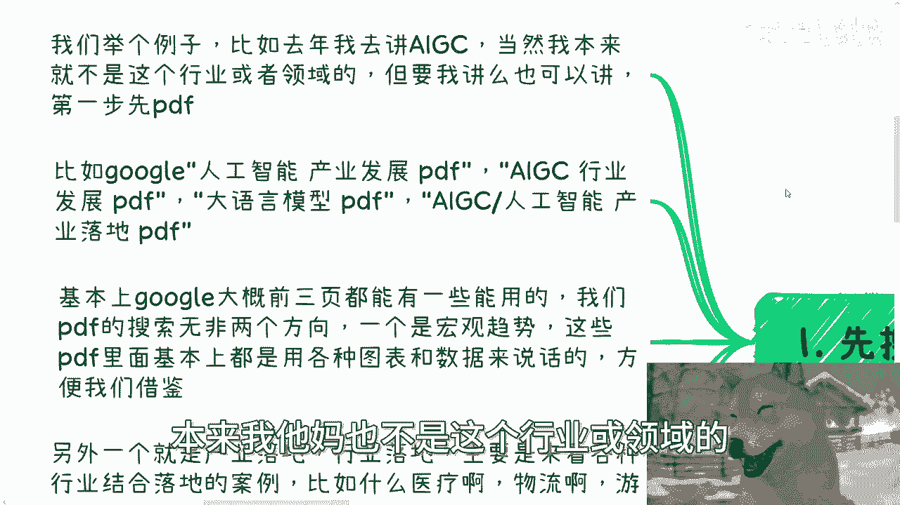
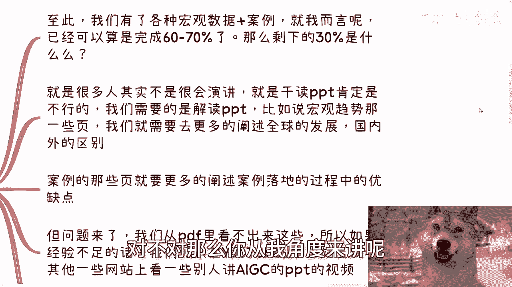
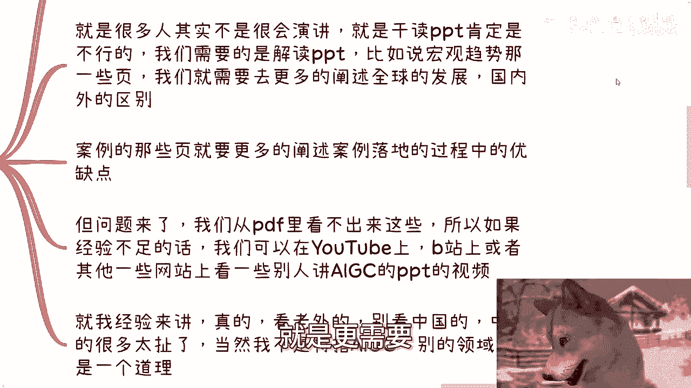
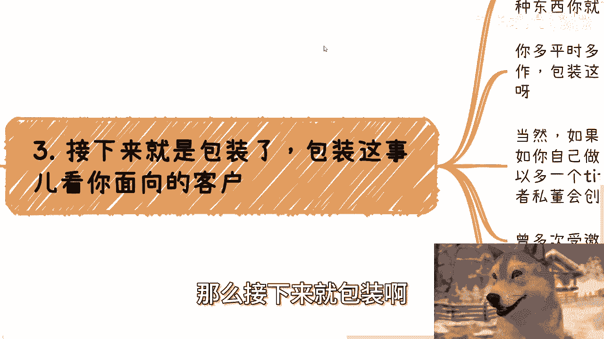

# 怎么快速学习一个领域以及做包装 - P1 - 赏味不足 - BV1QE4m1R7MW

好大家好啊，这个今天我们来讲的是，这个怎么快速学习一个领域啊。

以及做一个包装，这个好像是昨天还是前天啊，有个小伙伴这个给我提的这么一个点啊，也蛮好的对吧，我记得之前我好像讲过啊。

但是啊没关系啊，这个我再给你们提一下好吧，反正这个总归能越讲越越讲多了，总归能明白吗对吧，那么北京活动已经定了好吧，本周日本周日28号下午啊，在东直门地铁站附近，那么本次活动内容呢。

一个是我会给大家讲一下私企啊，国央企啊，外企外企啊，出国啊，等一些offer的选择跟未来的一些发展，然后跨境电商跟自媒体呢，它是否还值得，就是说从这种个人角度去做啊。

和一些风险点以及低空经济的一些知识普及，那么了解详情跟报名呢，你们可以继续私信我好吧，那么首先第一步啊，我跟你们讲啊，怎么快速学习一个领域。

很简单，第一步啊先搜索PDF，什么意思啊，我们举个例子，比如说去年啊我去讲这个人工智能啊，当然这个本来我他妈也不是这个行业或领域的。

对吧，但是你让我讲呢，只要给我钱，我也可以讲对吧，那么第一步就是先PDF，比如说啊你打开google啊，千万不要百度啊，你百度他妈的，你就就就我不想跟你说话啊，比如说打开google啊。

搜索人工智能空格，产业发展空格PDF，当然啊人工智能这边是个变量，你们随便填啊，比如说你们想做什么土木啊对吧，或者说什么什么大数据啊，云计算啊，反正就是都都这一个套路啊，啊这个什么什么什么空格。

产业发展空格PDF什么什么什么行业发展空格PDF，什么什么什么呃核心的一些一些关键字啊，空格PDF对吧，包括什么AIGC啊，人工智能啊，产业落地啊对吧，PDF啊，那么基本上呢google啊。

大概前三页它都能有一些能用的啊，呃你们去查的时候直接去点开，就是搜索隐形出来的，就直接是PDF的这种链接，你懂吗，就不要去在什么什么打开一个网页，或者怎么样的，你就打开一个PDF啊。

那么我们的PDF搜索呢无非两个方向，一个是宏观趋势啊，那么这些PDF里面呢，基本上都有这种什么各种图表啊，数据啊来说话的啊，方便你们去截图啊，方便我们去借鉴，那另外一方面呢就是产业落地啊，行业落地。

那么主要是来看各种行业，结合产业这个落地的一些案例，比如说什么，比如说啊你现在搜的是X对吧，比如说什么X与医疗怎么结合啊，X与物流怎么结合，X与游戏怎么结合，互联网降本增效啊，巴拉巴拉巴拉这这一大堆啊。

那么当然顺便提一点啊，如果你找不到合适的，记得要用全英文来搜索，毕竟啊中国互联网的结果还是有限的啊。

还有就是我说的对吗，千万千万千万不要用他妈的百度啊，你用了百度，你得拉拉拉他妈倒啊。

那么第二啊，第二就是对应的这个视频啊。

那么至此啊，我们已经有了各种宏观数据加案例，对不对，那么你从我角度来讲呢。

可以说已经完成了60%到70了，那么剩下的30%是什么呢，就是很多人其实可能不是很会演讲，也就是说他会的是干读PPT啊，那么你干读PPT肯定是不行的，无论是现场的氛围。

还是说你这个整个的一个时长都是不行的，那么我们需要的是解读PPT，那么比如说宏观趋势那几页对吧，我们需要用更多的一些语言啊，包括一些这个宏观的描述来描述这个呃，某某一个东西，比如说这个X对吧。

在呃全球的发展对吧，国内外的区别等等等，那么案例的那些页呢，就是更需要比如说你阐述一些呃落地案例。

但是落地案例这个东西，你呢你不能一句话带过对吧，比如说这个落地案例可能是哪家公司做的对吧，做的时候碰到了哪些困难对吧，那么当下的发展又是怎么样子的对吧，那么这个过程当中他的优缺点是什么啊等等等。

那么问题来了啊，我们从PDF里面看不出这些东西对不对，所以如果经验不足的话，我们可以在YOUTUBE上，B站上或者其他的一些网站上面看一些，不用太多，比如说一两个啊，比如说别人来讲这个X。

比如说这个地方例子就是人工智能嘛对吧，比如说别人来讲人工智能的PPT的视频，或者说别人来讲这个某某某，你关心这个东西PPT的视频，那说白了就是你要学习一下别人是怎么讲的啊，那么就我经验来讲，真的啊。

我跟你们讲，看老外的，真的看老外的，别看中国的，中国的很多太扯了，他讲的东西对不对，你都不知道啊，当然我这个地方也写了，我不是特指AAIGC啊，别的领域也是一个道理啊。

没有区别的好，那么第三，那么接下来就包装啊。

包装这个事呢就看你面向的客户啊，我以前就说过，就是包装这个事呢不是临时抱佛脚的，你比如说今天你接到一个单子，然后说我的啊，怎么包装对吧，这个东西呃你就算让别人我跟你讲啊，你真的临时抱佛脚。

你就算让别人给你挂靠，其实这个东西你看上去也很鸡肋啊，那么你需要的是平时多找高校啊，协会啊，研究院啊，什么产业园啊，什么什么基金啊对吧，多合作合作对吧，包装这个事呢是靠日常积累的。

否则他妈的你很难临时抱佛脚的啊，当然啊如果你说非要死马当活马医，有没有有啊有啊，比如说你自己做一个活动品牌，做一个logo，然后你就可以多个title，比如说某某某活动创始人对吧。

或者某某某俱乐部或者某某某私董会的创始人，可以啊，可以啊，没问题啊对吧，然后包括就是说呃，这个你可以写一些比较空的啊，一些抬头，比如说什么曾多次受邀前往各种大会活动，出席相关的什么嘉宾对吧。

说白了呢这种介绍都是空话，你们可以在哎其实你们到网上做搜索，你们就知道这种空话的介绍其实不少，主要就是因为中国老百姓认知太低，所以说很多空话介绍的挂出来的，人家也会觉得卧槽牛逼啊对吧。

但是这些介绍本身根本就找不到一个，对应的组织，或者说就是耳熟能详的组织，那都是空话哦，那么第四点，就像我们这边说的，死马当活马医的方式有没有呢，还是有的啊，我给你们举几个例子，比如说你做一个活动。

多找一些大学生，或者多找一些你的朋友，找一些托儿对吧，拍点照片，快速的做几个也可以呀，啊对吧，这个就就相当于案例了嘛对吧，比如说你找认识的企业和你签一些咨询，培训或者顾问的合同对吧。

或者说给你印一些这种咨询，顾问的这种名片对吧，那就当你做过咨咨询了也行啊，啊比如说你认识的企业或者组织给你些名头，或者说什么项目挂个顾问啊，就当你做过这个项目，和他们合作过项目也OK啊。

啊这些东西在日常的商业活动当中，或者商业的这种这种怎么说呢，就是行为当中也很常见啊，比如说你去学校做过公开课对吧，拍点照片就当跟学校合作过，那也行啊啊不过呢还是那句话，你还是要看具体看客户是谁。

就说白了啊，如果真的是下沉市场，比如说是什么2。5线城市，三线城市，我跟你讲，你你随便啊，PS4个照片都无所谓。

他妈没人懂的，你以为呢对不对啊，真的对吧。

你像以前我们这种去什么微商大会啊，去什么呃那种什么呃传销的，去那种web3的会议啊，卧槽这他妈的那种介绍那种案例，一看就是P的，一看就是那种抠图抠出来的，也没人管啊，为什么。

因为没人关心上面的人来是为了骗钱的，下面的人来是为了被骗钱的，谁关心你，真的假的对吧，我还是那句话，关心真的假的人，谁会来啊，对不对，就就你们很多人关心的问题太过于怎么说呢。

太过于呃认真或者太过于那种啧嗯执行层，就你太关注执行层的东西呢，你只能被人利用，你是赚不到钱的，你明白吗，哦所以就是就是每次就是说大家很关心那种，就是说非常贴实际的东西呢，我嗯我不是就怎么说呢。

就是说我很矛盾，你说我讲吧，我可以讲，但是讲了吧，你说我又得不停的提醒你们，就是啊你们不要老是去关心执行层，不要关心执行层，因为官星执行到最后，你往往就是要么被白嫖，要么被坑，你是赚不到钱的。

因为这个是一个金字塔或者一个一个商业逻辑，这个就是本身所规则所解决定的，好吧行啊，那就这么着吧啊就是这个东西死马当活马医。

我也跟你们说的很清楚了啊，额然后呢就是说活动好吧，你们要咨询或者了解详情，报名的继续私信我，然后另外一方面呢，就是说你们现在自己做些什么业务，或者自己跟别人合作些什么业务啊，在一些合同啊，分红啊。

分润啊种呃公账对私账走走额走走那个资金啊，或者还说呃那个商业计划书白皮书啊对吧，包括一些和呃那个股权，期权啊等等等一些问题的啊，或者说你们手上有什么牌，你们没有什么牌，你们希望通过我的一些呃那个认知。

或者对整个社会的一些经济上的发展，呃，希望我根据你们的个人情况，给你们一些更接地气或者更呃直接的一些建议，或者方向的话，那么你们整理好个人的问题跟背景，我们再来做咨询，好吧啊行。

