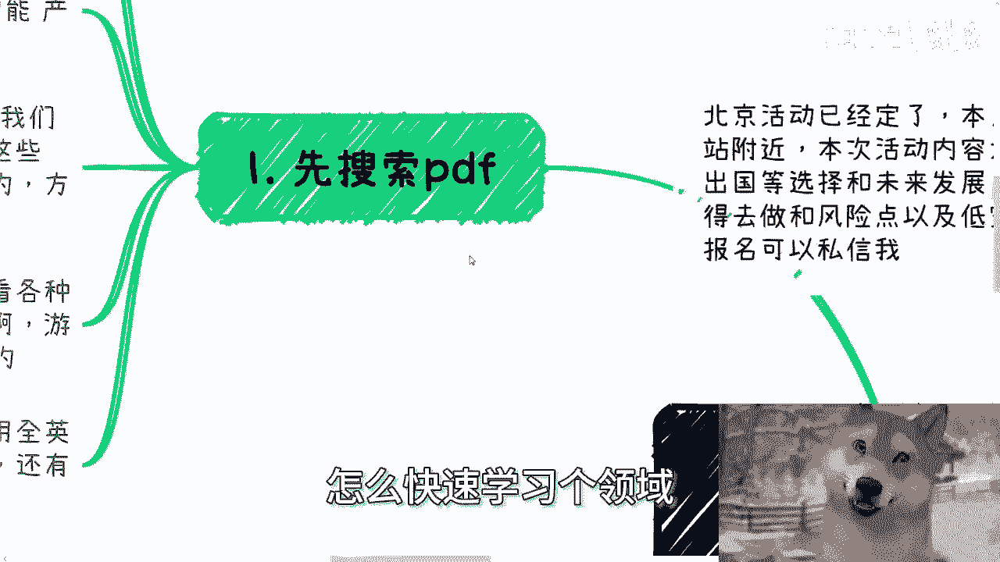

# 课程一：如何快速学习一个领域并进行个人包装 🚀

在本节课中，我们将要学习如何高效地掌握一个新领域的知识，并在此基础上进行有效的个人或项目包装，以提升专业形象和影响力。

---

## 第一步：搜索PDF文档 📄

快速学习一个领域的第一步是搜索相关的PDF文档。这能帮助我们快速获取结构化的宏观信息和行业案例。

**核心操作公式**：`[领域关键词] + 产业发展 + PDF`

以下是具体操作步骤：

1.  **使用Google搜索**：避免使用百度，以获得更高质量和更广泛的国际信息。
2.  **组合关键词**：在搜索框中输入你的目标领域，例如“人工智能”，然后加上“产业发展”和“PDF”格式限定。例如：`人工智能 产业发展 PDF`。
3.  **拓展搜索**：可以尝试替换关键词，如“行业发展”、“产业落地”、“AIGC”等，以获取不同侧重点的资料。
4.  **直接打开PDF链接**：优先点击搜索结果中直接指向PDF文件的链接，而非普通网页。
5.  **使用英文搜索**：如果中文资料有限，尝试用英文关键词进行搜索，以获取更全面的国际视角。

通过这一步，我们可以获得两类核心资料：一是包含图表和数据的**宏观趋势**报告，便于引用和展示；二是描述**产业落地**的具体案例，了解该领域在不同行业（如医疗、物流、游戏）的实际应用。

---

上一节我们介绍了如何通过PDF快速获取一个领域的“骨架”信息。接下来，我们需要为这些信息注入“血肉”，使其表达更加生动和丰满。

## 第二步：观看解读视频 🎬

至此，我们已经掌握了各种宏观数据和案例，可以说完成了60%到70%的学习内容。剩下的部分在于如何生动地解读和呈现这些信息，避免干巴巴地朗读PPT。

以下是寻找和学习演讲技巧的方法：

1.  **寻找演讲视频**：在YouTube、B站等视频平台，搜索他人讲解该领域PPT或主题的视频。观看一两个高质量的视频即可。
2.  **学习解读方法**：重点观察演讲者如何：
    *   解读**宏观趋势**页（例如，描述国内外发展差异、市场规模增长等）。
    *   阐述**落地案例**页（例如，讲解案例背景、实施中的挑战、当前进展、优缺点分析等）。
3.  **优先选择海外内容**：建议优先观看海外专家的解读视频，其内容往往更具参考价值。

通过观看他人的演讲，我们可以学习如何将静态的PPT内容转化为有逻辑、有吸引力的口头表达。

---

掌握了快速学习和表达的方法后，我们来看看如何将这些知识转化为个人或项目的“包装”，以提升可信度和影响力。

## 第三步：进行个人包装 🎁

包装取决于你面向的客户或受众，并且它是一项需要日常积累的工作，而非临时抱佛脚。

以下是关于包装的核心观点：

1.  **注重日常积累**：平时应多与高校、协会、研究院、产业园、投资基金等机构合作，积累真实的项目经验和头衔。
2.  **临时应对策略**：如果确实需要快速包装，可以考虑以下方式：
    *   **创建自有品牌**：自己创建一个活动品牌或俱乐部，自称“创始人”。
    *   **使用模糊头衔**：使用诸如“曾多次受邀作为嘉宾出席行业大会”等宽泛的描述。
    *   **快速制造案例**：组织小型活动、与朋友的公司签订象征性的顾问合同、获取合作方提供的名誉头衔等，并保留照片、合同等作为“证据”。
3.  **认清受众差异**：包装的真实性要求因受众而异。对于下沉市场或某些特定场景，对方可能更关注表象而非深度核实。

需要明确的是，过度关注执行层面的细节（如某个案例是否完美无瑕），有时反而会让人陷入“工具人”的困境，难以把握真正的商业机会和利润空间。包装的本质是传递价值和建立信任，需根据实际情况灵活运用。

---

## 第四步：补充与咨询渠道 📝

最后，关于商业实践中的具体问题，可以提供更深入的咨询服务。

以下是可以提供指导的问题类型：

*   业务合作中的合同、分红、资金流转问题。
*   商业计划书、白皮书的撰写。
*   股权、期权结构设计。
*   基于个人现状与资源，提供发展方向和策略建议。

如有此类需求，请整理好个人背景和具体问题后进行咨询。

---

本节课中我们一起学习了快速学习新领域的“搜索PDF-观看视频”两步法，并探讨了基于此进行个人包装的策略与注意事项。核心在于高效获取信息、学习表达技巧，并依据目标场景进行有针对性的形象塑造。