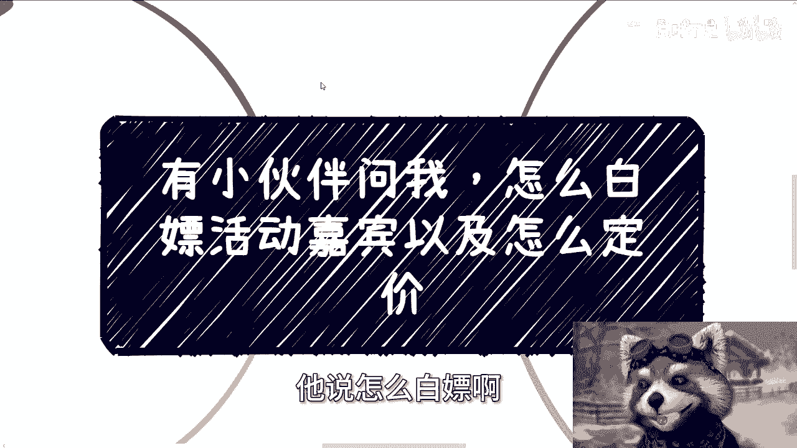
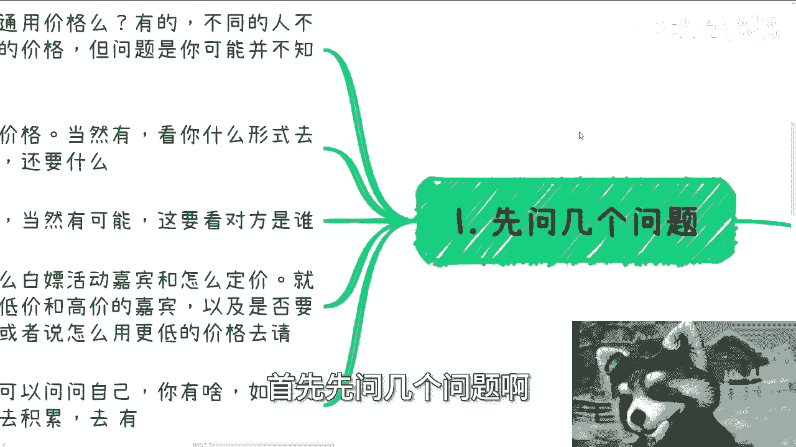
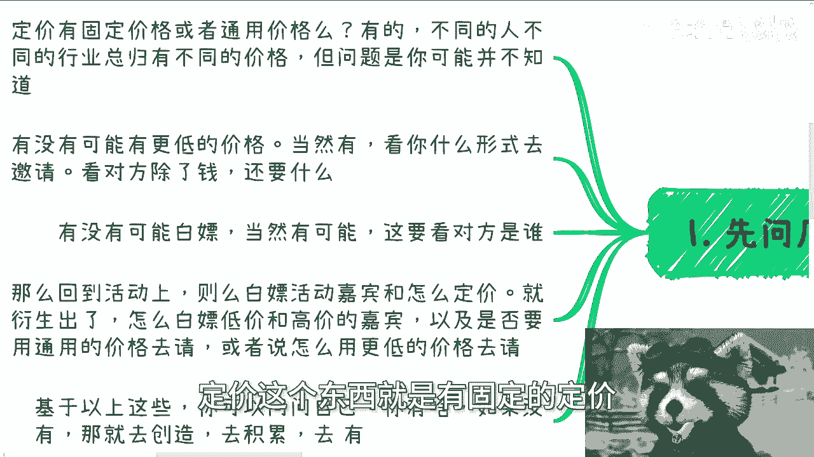
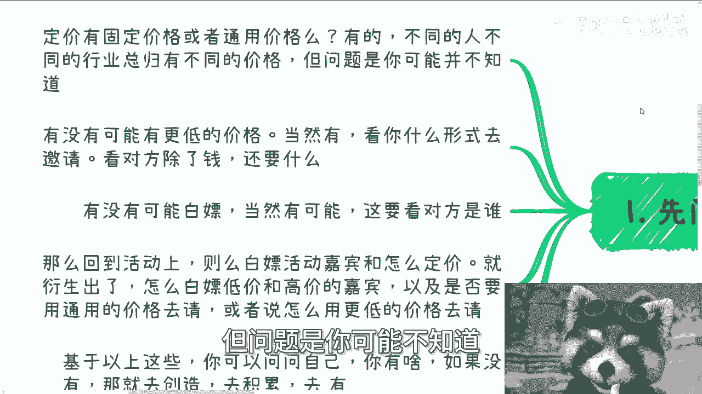
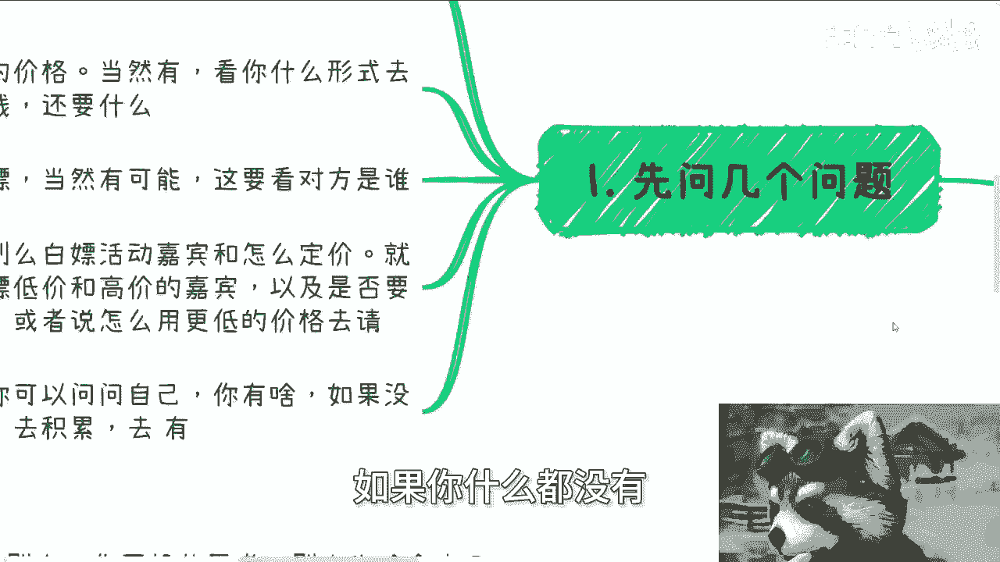
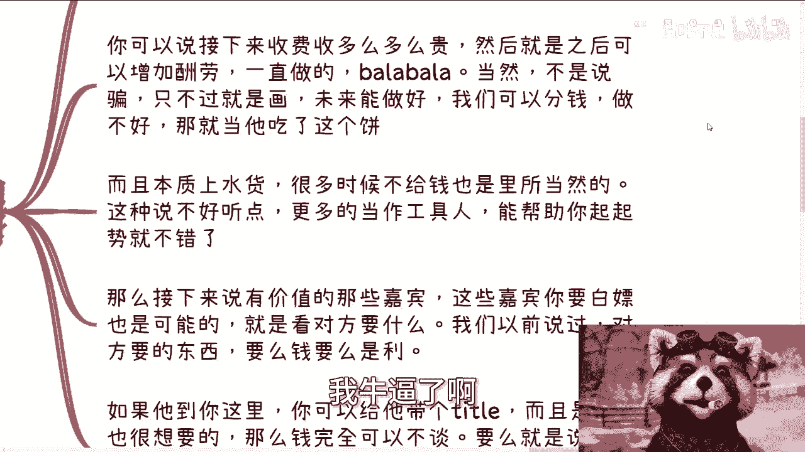
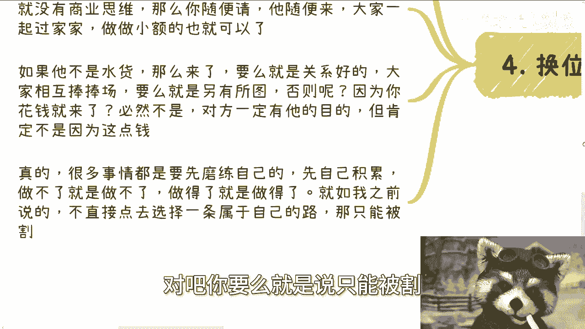

# 怎么白嫖活动嘉宾以及怎么定价 - P1 - 赏味不足 - BV1JD421g7n2

哈喽大家好，今天这个话题呢也是一个小伙伴问我。

哎呀，我想了一想啊，这个还是可能是不是讲得不够细啊。

我也没想到要讲那么细啊，他说怎么白嫖啊。

这活动嘉宾以及怎么定价啊，也蛮好的啊，首先先问几个问题。

第一定价啊，什么叫定价，定价这个东西就是有固定的定价。

或者有通用的价值，那么有的啊，不同的人，不同的行业，他总会有不同的价格，肯定是有的啊，一个一个规范化的，但问题是你可能不知道啊。

第二有没有可能有更低的价格，也有啊，看你什么形式去邀请啊，看对方除了钱还要什么对吧，有没有可能白嫖也当然有啊，那要看对方是谁啊，那么回到队活动上，那就是说白嫖活动嘉宾跟怎么定价。

就衍生出来怎么白嫖低价跟高价的嘉宾，以及是否要用通用的价格去请，或者说怎么再用更低的价格去的，衍生出这几个问题啊，那么基于以上这些，你可以问问自己，你有啥啊，你有什么东西，比如说什么背书啊。

或者是对方想要的东西，如果没有，那你就去创造，那你去去积累，让自己有，如果你什么都没有。

你就不要问这个问题，你明白吗，就是如果你什么都没有，你还问我，我要去白嫖，那他妈凭什么让你白嫖啊，大哥啊，我我就不明白了，是不是啊，好那我们继续来往下讲啊。

第二怎么白嫖嘉宾哎。

我现在是讲了多少啊，就差不多啊，第二怎么白嫖嘉宾啊，第一如果你找到都是水货。

那么你的白嫖逻辑很简单，就是画饼，画未来的饼，你可以说接下来收费收很贵，然后之后可以增加酬劳，一直做巴拉巴拉巴拉跟他说啊，以后你牛逼了啊，我牛逼了啊。

然后我可以给你很多钱，当然不是说骗他还画饼嘛，怎么是骗呢，对不对，只不过就是画嘛，那未来能做好，我就我也愿意分啊，那做不好他妈的拉倒嘛对吧，那你就当饼吃呗对吧，那好而且本质上你从我的逻辑上面来讲。

他如果是个水货，很多时候不给钱也理所当然，这种说说不好听的，更多的就是你把他当工具人，能帮你一开始起起事，能帮你一开始站站台就好了呀，你想怎么滴啊，你想怎么滴啊对吧，我跟你讲，你要不是个。

你要不能从一个资本家去思考，你就别做对吧，那么接下来说有价值那些嘉宾，那些嘉宾你要白嫖也是有可能的，就是看对方要什么，我们以前说过，对方要的东西要么是钱，要么是利益，如果他到你这边。

你可以给他带一个title，带一个头衔，而且也是他很想要的，那么钱完全可以不谈对吧，要么就是说他去你那边，后续呢可能会有项目成交，成交的话给分润，那么授课的这种小费用，那完全可以不计对吧。

那你说如果这些东西都没有，那怎么谈啊。

卖身不卖艺，那不好意思，人家也不要对吧啊，三关于定价。

定价这个东西我早说了，如果你要找嘉宾或者邀请别人，你就开价，你要不知道，你就去多了解了解，多问问也也就知道了，千万不要让别人开，你让别人开，他妈的不割你吗啊人家不割的可能吗，啊比如今天有个小伙伴跟我说。

他找嘉宾，那嘉宾我一看就知道是个水货啊，开了一个人5000块钱，我他妈要我跟你讲，众人就可以拉黑了对吧，你既没有实践经验，然后又在当下这种经济情况下开5000，脸呢，你不就是贴脸割吗，对不对啊。

我们就这样说啊，正常如果是活动的话，非企业内训，非政府内训的情况，下面那种有价值的，就当下这情况，基本上也就是2000到4000差不多了，你知道吗，大概一到两个小时，剩下当然也有可能更贵。

比如说他有拥有很高的政治地位，或者说是那种院士，那这些不在我们日常讨论的范围当中对吧，你包括就是说网上录播的课程，可能就是说更便宜对吧，因为说白了这种能讲的太多了，满地都是对吧，你不愿意你开高价。

你随便怎么说，别人低价愿意做的人门口排队，对不对，好，那么最后一点是什么，就是你要换位思考对吧，也就是说其实你邀请别人，你换位思考别人为啥会来啊，哦别人就是缺你那两千四千吗，肯定不是吧。

那你也不可能跟我说，别人买你面子吗，那不好意思，没什么面子呀，对不对对吧，所以说本质上你邀请别人，如果他是个水货，他根本就没有商业思维，那么你随便请他，随便来，大家一起过家家做做小额的盈利就可以了。

你别去想他妈的定价定太高，对不对啊，如果他不是个水货，那么问题来了，你说他要买你面子，那请你先去积累，先去沉淀你的面子，对不对，如果他不是买你面子，也不是图，那你图你那2000块4000块钱。

那么他一定另有所图，那否则呢哦你花钱就来，不可能的呀，他吃饱了撑的对不对，就是如果你觉得他有价值，对方一定是有他的目的的，他一定不是只因为这点钱啊，所以说我跟你讲很多事情，你得先磨练自己的判断能力。

先磨练自己对这个市场的认知能力，先磨练自己对这个市场的了解对吧，你不积累，你怎么可能做呢啊就是我之前说的，你要么就直接一点选择一条去野一点的路对吧，你要么就是说只能被割。

你你又不严对吧，又又又不怎么样，你你你你做啥呢，是不是就是你永远纠结在先有鸡先有蛋，你怎么做，好吧行啊，那就先这么着吧好吧，这个问题我觉得就这个细节，我算给你们讲明白了啊，真的是讲明白了啊。

就这么回事啊，要找打感情牌也可以，打面子牌也可以打，打钱也可以，但是一定是综合的，因为真正有价值的人，他不会因为你给他钱就来了呀对了，这是个悖论呀，你们真的换位思考一下，你们想想看吧，对不对啊，行好吧。

就这么着，职业规划好吧，商业规划，然后呃合同啊，分红啊，丰润啊对吧，然后那个商业计划书白皮书，然后你们自己有什么牌，你们没有什么牌的啊，你们希望通过跟我沟通对吧，跟我交流对吧。

通过一些想希望通过我的一些认知，通过的一些视野，给你们更好的一些，贴近于当下社会发展的一种建议的话，那么你们可以整理好问题再来咨询我好吧，然后我最后再提一点啊，就是你们自己为自己负责啊。

不要搞得我给你们咨询了，就要让我给你们负责，不好意思啊，你们要是觉得要让我给你们负责的，你们不要来找我，请拉黑我。

