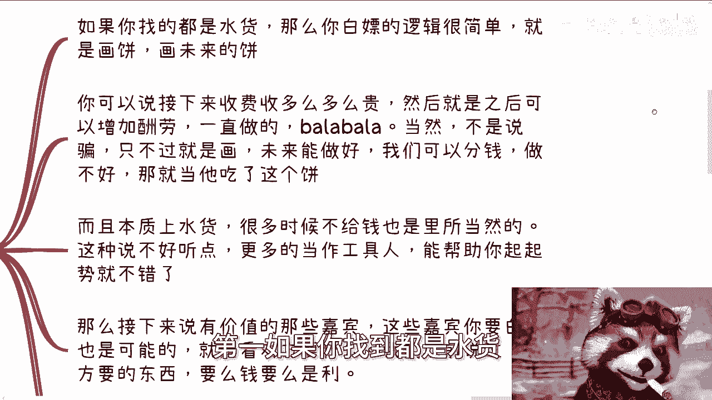

# 课程P1：如何低成本邀请活动嘉宾及定价策略 💰

在本节课中，我们将要学习如何以低成本甚至免费的方式邀请活动嘉宾，并探讨如何为嘉宾出场制定合理的价格。我们将从核心概念出发，分析不同嘉宾类型的应对策略，并提供具体的操作思路。

---

## 概述

本节课程将围绕“白嫖”嘉宾和定价两个核心问题展开。我们将首先明确“定价”的概念，然后分析如何针对不同类型的嘉宾采取不同的邀请策略。核心在于理解价值交换的本质，并学会评估自身拥有的资源。

---

## 一、 理解定价与价值交换

上一节我们介绍了课程主题，本节中我们来看看“定价”的本质。

定价是指为某项服务或产品设定一个固定的、或在其所在领域内具有通用参考意义的价格标准。不同的人和行业确实存在不同的价格规范。问题在于，你可能并不清楚这些规范。

同时，存在以更低价格甚至免费获得服务的可能性。这取决于你邀请对方的形式，以及对方除了金钱之外还看重什么。

因此，“如何白嫖活动嘉宾及怎么定价”这个问题，可以衍生为以下几个具体问题：
*   如何邀请低价与高价嘉宾。
*   是否应该使用通用价格去邀请。
*   如何用更低成本达成邀请。

基于以上问题，你需要先问自己：**你有什么？**
例如，你有什么背书，或者对方想要的其他资源？如果没有，你就需要去创造和积累，让自己拥有这些资源。如果你什么都没有，就不要问如何“白嫖”的问题，因为对方没有理由让你无偿获取价值。

---

## 二、 如何邀请不同价值的嘉宾

理解了价值交换的前提后，本节中我们来看看针对不同嘉宾的具体策略。

以下是针对两类不同嘉宾的邀请思路：

1.  **邀请“水货”嘉宾（价值不高）**
    *   **核心策略：画饼。** 即描绘未来的收益前景。你可以承诺活动未来会收费且价格不菲，后续合作可以提高酬劳等。这并非欺骗，而是基于对未来良好发展的预期进行承诺。若未来未能实现，则承诺自然失效。
    *   **本质逻辑：** 对于价值不高的嘉宾，很多时候不支付报酬也属合理。更多是将其视为项目启动阶段的“工具人”，帮助站台和造势。

2.  **邀请有价值嘉宾**
    *   **核心策略：洞察需求，提供金钱以外的价值。** 对方的需求无非是**金钱**或**其他利益**。
    *   如果对方看重**头衔/名誉**，你能提供一个他想要的Title，那么完全可以不谈钱。
    *   如果对方看重**长期收益**，你可以承诺后续项目成交后的**分润**，那么授课的课时费可以忽略不计。
    *   如果以上都无法提供，则很难达成合作。

---

## 三、 如何制定合理的报价

在了解了邀请策略后，我们进入实操环节：如何定价。

如果你要邀请嘉宾，应该由你主动开价。如果不知道行情，就去多方了解和询问。**切忌让对方开价**，因为这很可能导致你被“割韭菜”。

例如，在当前经济环境下，对于非企业内训、非政府内训的普通商业活动，一位有价值的嘉宾进行1-2小时分享，市场行情大致在 **2000元到4000元** 之间。当然，拥有极高社会地位（如院士）的嘉宾不在此常规讨论范围内。

对于录播课程等，价格通常会更低，因为市场上可替代的供给很多。如果你开价过高，自然会有愿意接受低价的人参与竞争。

---

## 四、 关键：换位思考与自身积累

最后，所有策略都离不开一个核心：**换位思考**。你需要思考，对方为什么要接受你的邀请？

*   他缺那两三千块钱吗？通常不是。
*   他是买你的面子吗？如果你没有积累，那就没有面子可言。

因此：
*   如果你邀请的是“水货”嘉宾，他可能缺乏商业思维，你们可以一起进行小规模的尝试，但不要期望定高价。
*   如果你邀请的是有价值的人，他要么是看中你的面子（需要你提前积累），要么是另有所图（如头衔、长期合作机会）。他绝不会仅仅为了那点课时费而来。

**结论是，你必须先磨练自己的市场判断力和认知能力，积累自身的资源（面子、渠道、项目机会等）。** 没有积累，就无法进行有效的价值交换。你只能选择更“野”的路去闯荡，或者只能接受被收割的局面。

---

## 总结

本节课中我们一起学习了低成本邀请活动嘉宾与定价的核心逻辑。

1.  **定价基础**：了解市场通用价格，但明白价格可协商。
2.  **邀请策略**：根据嘉宾价值（“水货”或有价值）采取不同策略，如“画饼”或提供**金钱以外的价值**（头衔、分润）。
3.  **报价原则**：主动开价，了解行情（例如常规活动嘉宾费在 **2000-4000元**），避免被动。
4.  **核心心法**：始终进行**换位思考**，并持续**积累自身资源**（如行业声誉、合作机会）。感情牌、面子牌、金钱牌需要综合运用，因为真正有价值的人不会只为了钱而参与。

最终，你需要为自己的决策负责，明确自身拥有的“牌”（如商业计划、合同分红方案、人脉背书），并在此基础上进行规划和邀请。