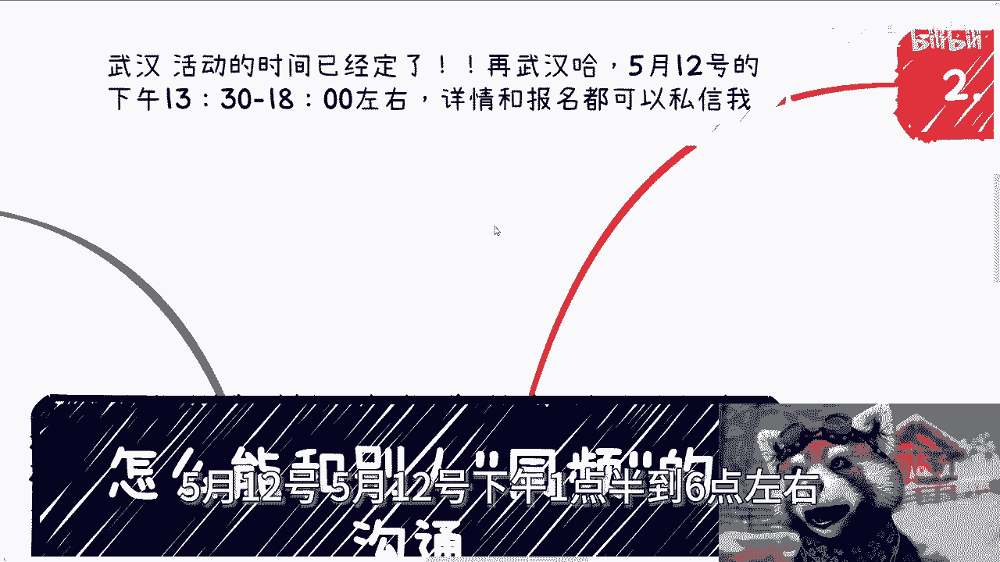
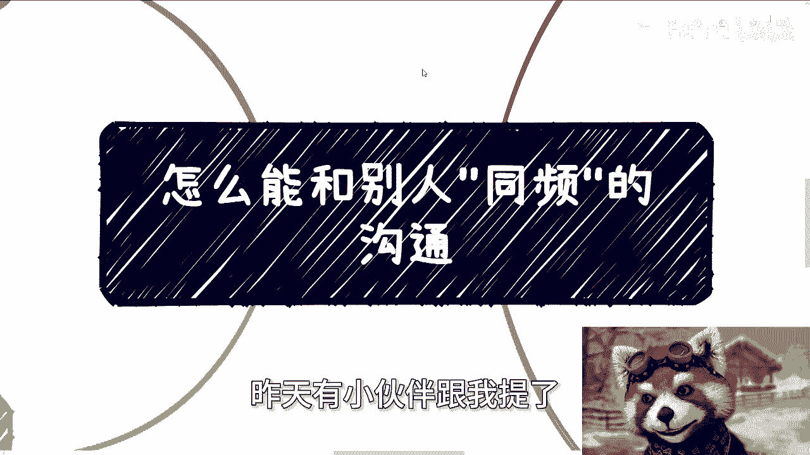
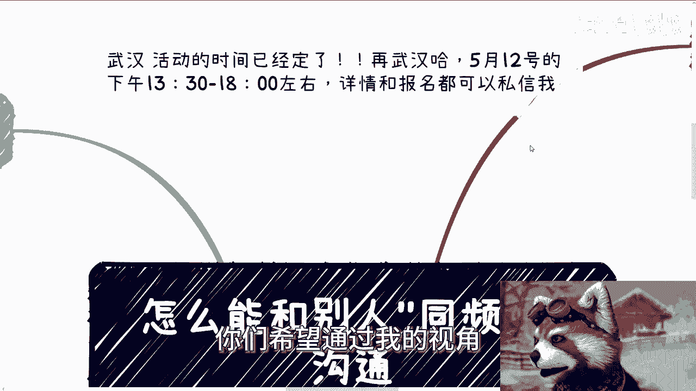
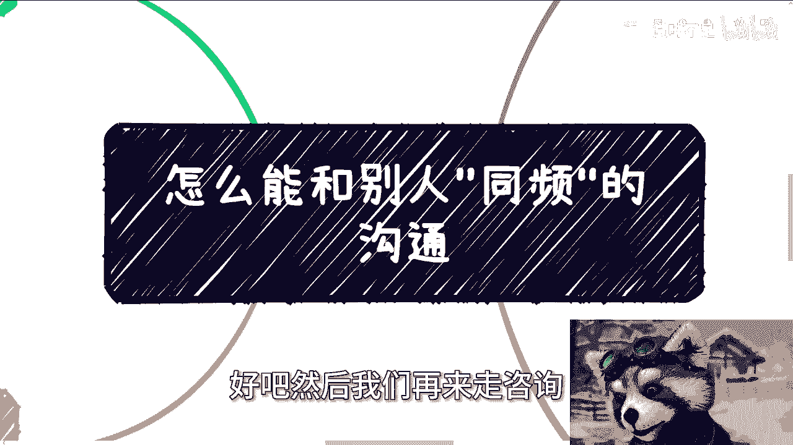

# 怎么能和别人”同频“的沟通 - P1 - 赏味不足 - BV1Vm421W7xV

好大家好，首先啊那个武汉活动已经定了啊，在武汉，在武汉啊，5月12号，5月12号下午01：30到六点左右好吧。

详情跟报名都可以私信我好吧，武汉活动啊。

呃今天讲这个主题呢是昨天有个小伙伴，昨天前天昨天有小伙伴跟我提了。

他说呃怎么能和别人同频的交流啊，呃他原话，你看啊，这段话就是他的原话，他说呃想问陈老师一个问题啊，在具有一定逻辑性的对话当中，怎么能不被对方带偏啊，问这个问题的原因呢，是我在跟领导对话时呢。

经常被他的逻辑带着走啊，相当于一直被主导，所以请教一下，面对逻辑性特别强的人呢，我该怎么去进行反制啊，或者能够同频的对话不陷入被动啊，然后他说一旦陷入被动呢，啊就很容易迷失自我的目的，或者说吃暗亏啊。

那么很多次了啊，都这样子，他原话这么说的啊，那这事呢首先我们先这样来讲，因为它具体的这个事情是什么，我也不了解啊，那我只能根据他这个话啊，来来来做我的一些判断啊，那首先这事是这样子的啊。

我觉得呃你先有没有必要去对话，或者说呃去沟通，你如果我们先说啊，有没有这个必要，如果你没有自己的目的性，或者说你就不能赚钱，那我就不用给我投了啊，这是什么意思呢，就是说在我看来所有的事情都非常的直接啊。

也就是说你做一件事情，你今天去沟通，我要么就达到我的目的，我要么就是沟通完能赚钱，我但凡不能达到我的目的，或者压根就不能赚钱，我为什么要沟通呢，没有没有意义啊，对吧啊，没什么沟通的，有什么好沟通的人。

怎么理解他妈谈朋友啊啊沟通啊啊，那另外就是如这个小伙伴说的这个案例呢，你说你和反智或者说同频对方啊，你你你就是你要去反制或者同频，得要有个大前提，那就是你完全可控，完全不受束缚，什么意思呢。

也就是说你比如说你跟他沟通的这个这个对象，是你领导对吧，那你可能会害怕丢工作，或者说这个领导给你小鞋穿，那你还他妈沟通个屁啊，你一开始就没有沟通的资格，对不对，那你你说这还有啥好沟通的呢。

啊就是这也就是我说的，就是说你这个人在沟通的时候，你就得想清楚，就是他妈的我也不，你对吧，你我就是在跟你沟通的，就像我们刚刚说的，我就有我的目的，我就要达到我的目的，我不达到我的目的，他妈的我就辞职。

对不对，我就不干了，你知道我怎么滴嘛，对不对，或者说我今天沟通不达到我的目的，那我就支持吊儿郎当，我就是摸鱼对吧，就是说你不能怕，你不能被对方去束缚住你但凡一开始就怕，或者一开始就束缚住你就完了。

那还沟通个P，对不对啊，那我们假设啊，我们假设啊呃你都是有目的性的，同时也不被对方所束缚啊，也没有别的东西能够束缚你的情况下，好了啊啊好，基于以上这些前提啊，我们开始讨论这个问题啊。

啊开始讨论这个问题好，首先核心的关键词是目的跟吃亏啊，什么意思啊，就如这位小伙伴说的，其实在我看来啊，是不是能够针锋相对，你来我往谈笑风生啊，根本就不重要，因为重要的是你能不能达到你的目的。

以及对方能不能达到他的目的，对不对，这就是个博弈的过程，就是谈沟通这件事情不重要啊，也就是说沟通不在于聊得嗨不嗨，也不在于别人是不是压着你打啊，那很多时候我就告诉你们。

很多时候我们跟别人的商业呃谈判也好，包括商业的这个沟通也好，我们很嗨，嗨到KTV走起来，开嗨到呃这个那个KTV走起来，小公主走起来，然后呢，怎么样呢又怎么样呢，又怎么样呢，不够嗨吗。

啊我们不够针锋相对吗，我们不够谈笑风生吗，不要太谈笑风生啊，全他妈是欢声笑语，是不是一分钱看不到，反而成本花掉一大，花掉一大堆，那么几10万几10万的花，对不对，有卵用啊，啊然后别人压着你打也没用。

我跟你讲啊，很多人一顿操作猛如虎，都是废操作，你就像DOTA里面啊，不知道你们有没有多少人，多少人打DOTA，DOTA2总知道吧对吧，以前人家打刀打DOTA就是我他妈的，我他妈操作看我牛逼啊。

一顿操作猛如虎，然后一个一个小兵补刀都补不到，有卵用啊啊你在那边他妈的晃来晃去，看上去很牛逼，有什么用啊啊，咱就这么说，你认为很多人说得很到位，滔滔不绝，那仅仅是你认为对吧。

为什么你认为那是因为你的认知和格局不够，所以你认为所以你容易被唬住，所以你觉得他很牛逼，所以你觉得他讲的东西很到位，没有用的，我跟你们这么说，你们但凡跟我能够出去一起聊过东西啊，我跟你们这么讲。

我要么就不开口，我不开口意味着什么，意味着我心里在默念，懂吗，我要是开口，我就会直接直捣黄龙，就问他怎么合作，多少钱，什么时间啊，我就这两句话没了，别的我不想听，有啥好听的呢，对不对。

唉你要是但凡跟我说啊，这个跟我绕圈子的，我直接带着人走，不聊了，没什么好聊的，怎么了呢，这不是说了吗，怎么了呢，啊缺了这合作方，他地球不转了，哎呦对吧，你要明白，你认为他操作很到位。

只是因为你不你不懂啊，只是只是因为你不懂，不是因为对方牛逼，这就好像你今天一顿操作猛如虎，你你你找个他妈的没有打过DOTA的，不懂DOTA的人，他过来卧槽，牛逼啊，牛逼个屁，对不对，我跟你讲吃亏这事呢。

反正我是不理解的，因为我觉得吃亏呢不是因为沟通导致的，是因为自己根本就不知道自己的目的是什么，导致的啊，就是什么意思呢，就是说可能你想得到某些东西最后没有得到啊，但是没有得到这些东西的原因呢。

也许是ABCDEFG很多很多原因，但就是不可能是因为通过沟通的原因，你明白吗，因为你认为沟通的原因仅仅是因为信息差，导致了，你认为是沟通的原因，但其实这背后一定会有别的原因，沟通只是一个幌子啊。

那么第三那我们就说啊，如果真的要沟通怎么办，你仔细想看啊，我为什么一直让大家要去不停的认识人，去了解人家赚钱的逻辑，去了解社会上各种机制运作的逻辑，就是为了让大家去沟通的时候不露馅儿啊对吧。

你要明白一点，你们的9年制义务教育加高等教育，你们在社会上面，你们就是个婴儿，你们什么都不知道，你们必须从零开始学，你知道吗啊，你只要不停的认识人，而且我再三强调，不要什么认识一两个人。

然后参加一两场活动就跑过来，陈老师啊，我们参加这个东西，大哥啊，我就告诉你，你知道吗，我做咨询，我大大小小场合做咨询，收费免费做咨询，我不说个人啊，我就说给政府企业啊，我从毕业到现在做咨询。

你知道多少场吗，1000场以上好吗，大哥啊，就参加两三个活动，有卵用啊，啊你这他妈聊了几十个人有卵用啊，如果说聊几十个人就有进展，那他妈老百姓就不会那么难了，懂吗，唉我妈也是服了啊，但是这些东西啊。

我跟你们讲，你们靠看书看不到的，看视频是看不到的，这些东西就是所谓的社会经验，或者说社会逻辑，我就告诉你这些东西就是作为老百姓，我们只能去摸，我们没有别的办法，为什么，因为我们是老百姓对吧。

除非有贵人带你没了，那我就给你们举个例子啊，就比如我今天跟你沟通一个高效业务，我说我们今天来讨论一下高校的这个软件采购，产学研，共建高效的技术教育的课程，实验室以及共建专业等合作，我就问你，你了解吗。

你不了解的话，我们怎么聊呢啊你怎么聊，怎么意思，意思是要让我先给你全部科普一遍，全部科普一遍吗，可能吗，你觉得啊，那我再问你，如果你不了解你怎么输出，你不就会感觉你被压着打吗，对不对。

打了之后还不能合作啊，还还不能反击对吧，那我就问你，你最后比如说你跟我不能合作，或者你跟对方不能合作，你一定会觉得是接不上话，一定是因为觉得你不能跟我沟通，一定是觉得你跟我不能针锋相对。

不能叫什么谈笑风生，但是你自己想想看原因是吗啊是吗，不是啊，原因是对背后的东西一无所知，对不对，你是因为你根本不了解社会的运作规则啊，是你能不能跟我谈笑风生吗，这他妈这他妈是原因吗，你觉得啊，对不对啊。

第四点啊，我们一切的行为都是为了目的，而不是过程，什么意思，就是我们也许能聊得很好，谈笑风生，但只要你没有我想要的，你没有切中我的痛点，聊的再好也没有用啊，因为商业就是商业，没有感性在里面的。

聊得再好怎么了，拜把子啊，对不对，拜把子你也赚不到钱，所以说我跟你们讲啊，是不是同频，我觉得不重要，真的一点都不重要，重要的是你能不能明白对方要什么，而要能明白对方要什么，是通过对方的沟通当中得知的。

而不是对方的科普当中得知的，什么意思，就是我当我跟你讲，我想来聊这些东西的时候，你应该就已经能摸清楚我的痛点是什么呢，你但凡摸不清楚，那他妈是你的问题，你懂吗啊，不要搞得好像这个问题是因为沟通上。

沟通没有问题啊，所以你明白了吗，聊这件事情本身需要很大的内涵和积累，需要很多的经验，但可惜的是这些经验和积累，你们无法通过书籍或者网络集中式的学习，不要问我为什么要问，就是你们就是老百姓有什么好问的呢。

对不对对吧，然后你们可能还要再问个问题，就是那陈老师按照你这个说法，为什么高校不教呢，诶那我就我我我反过来问了，高校为什么要教你们赚钱的东西，哎我奇了怪了，哎我奇了怪了，为什么呢，凭什么呢。

你觉得你想赚钱，但不好意思，别人不希望你赚钱，别人只希望你好好的做电池，好好打工对吧，Do you understand，不就这么回事吗，你难道难道20多岁的人这点事情还不明白吗，对不对，说我跟你讲啊。

我跟你们这么说，所有的花里胡哨的东西，所有的这种这个技术层面的东西，都是为它的核心服务的，也就是说当你能够了解社会另一种规则，这个社会里面包含了非常多的相关单位，非常多的组织，非常多的高校。

非常多的产业园，非常多的研究院对吧，非常多什么东西，你但凡了解了之后，你无论是朴实无华的操作，还是一顿操作猛如虎，你都能达到你的目的，但是别人不懂的人，他只会看到表面啊。

那你们现在很多人就只能看到表面没有用啊，不要妄想着去解决用，就是我们说不要试图用这种华丽的这个，表面操作去掩盖自己的无知，你掩盖不了的。

因为你不懂就是不懂啊，啊也不要来跟我讲，你们什么什么。

很多人跟我说什么懂啊，要去什么深耕，什么技术有用吗，有卵用啊，你技术只要不是改变，不要不是那种屠龙之技，只要不是屠龙之技，主要只要不是那种非常核心的技术，你剩下的那些技术有什么用呢。

啊你学的再深又如何呢，你赚到钱吗，赚不到好吧，OK好吧，然后那个武汉活动啊，5月12号你们要报名了，就找我报名呃，呃问我要详情，然后找我报名好吧，然后剩下的话就直接规划商业规划啊，然后是那个股权融资啊。

合同啊，包括什么呃，什么分红啊，包括其他的东西，包括你们有什么商业计划书啊，包括你们手上自己什么职业规划，商业规划有什么牌，你们希望通过我的视角。

能够更多的帮你们来做一些规划啊，做一些整理啊，做些指导啊，那么你们可以整理好相关的问题跟背景好吧。

