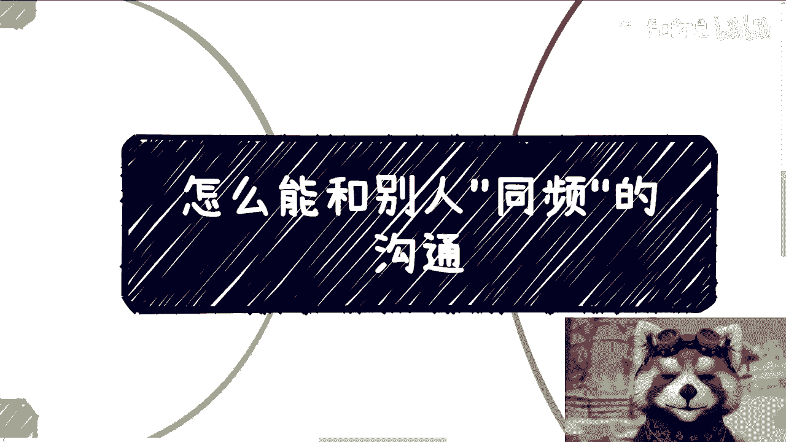
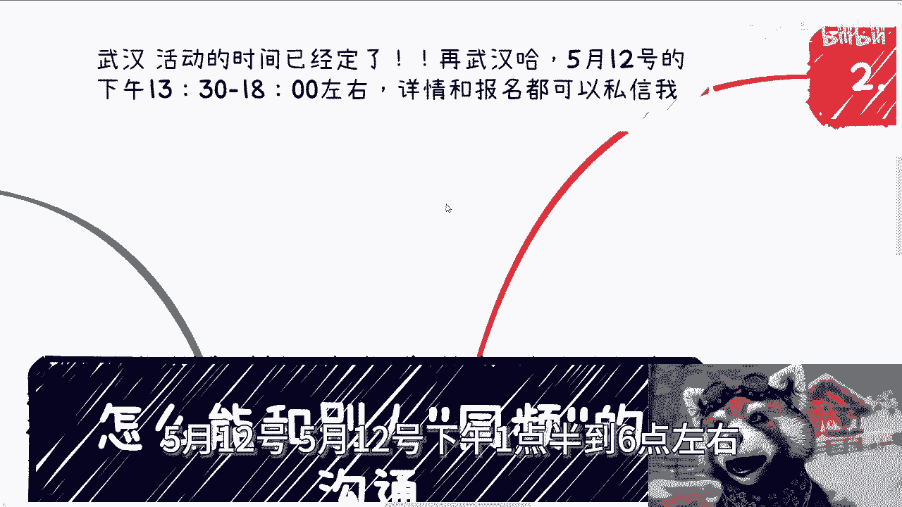
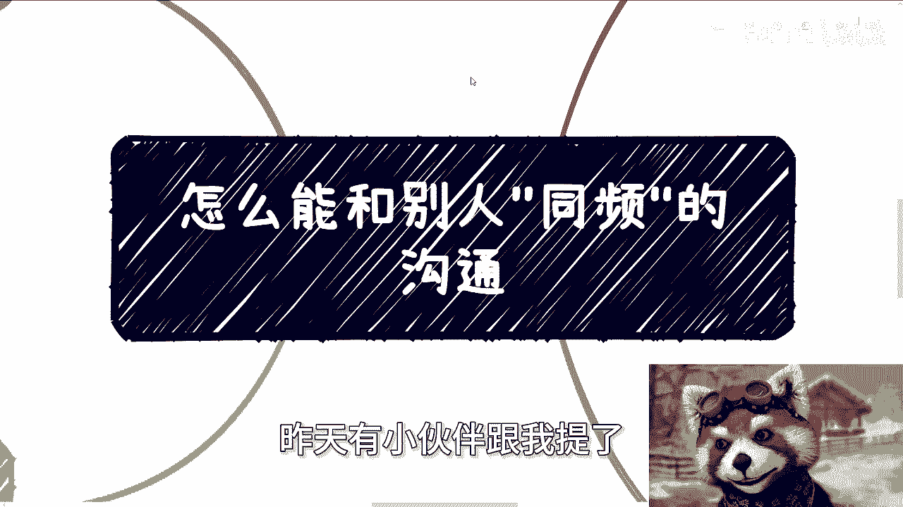
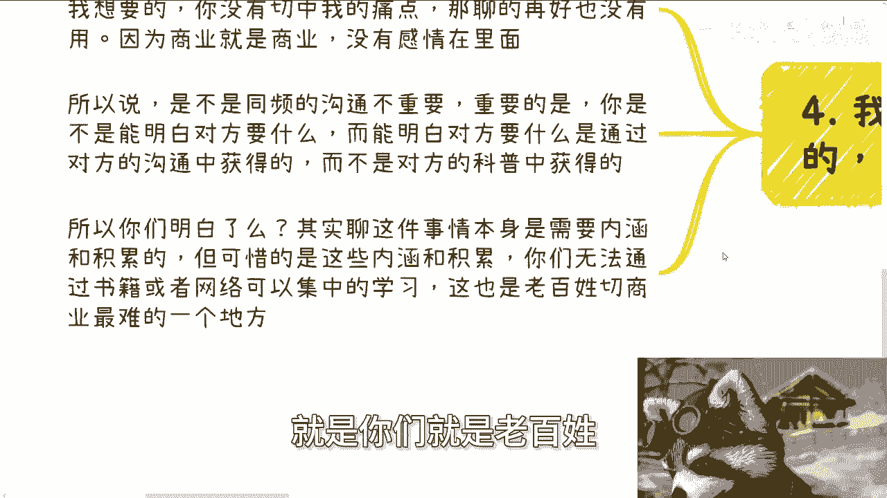
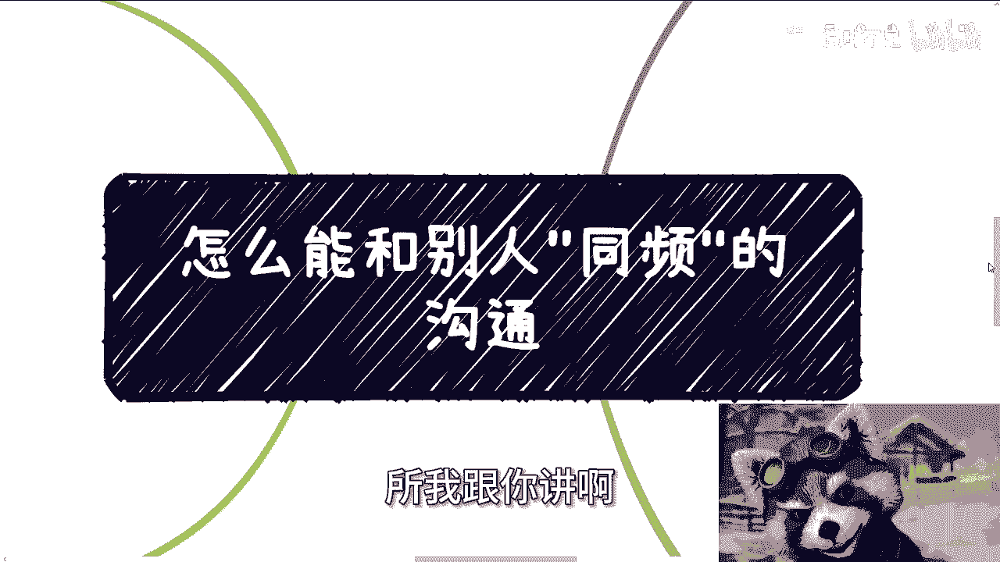
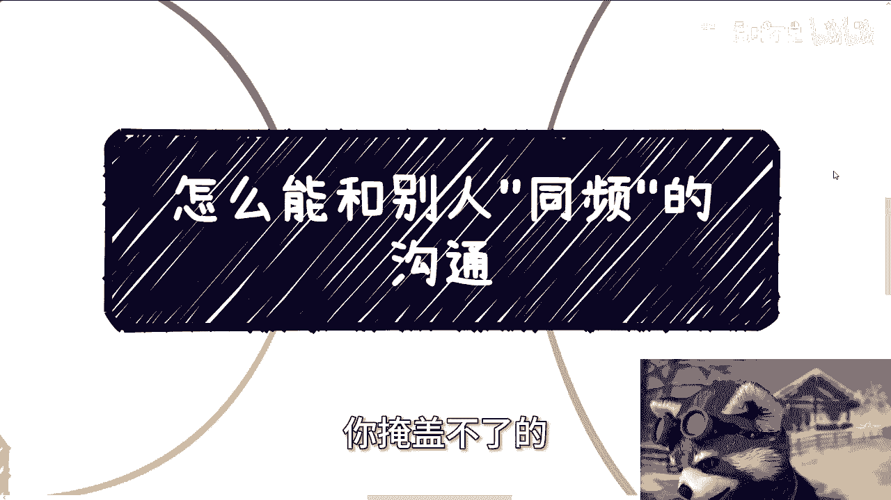
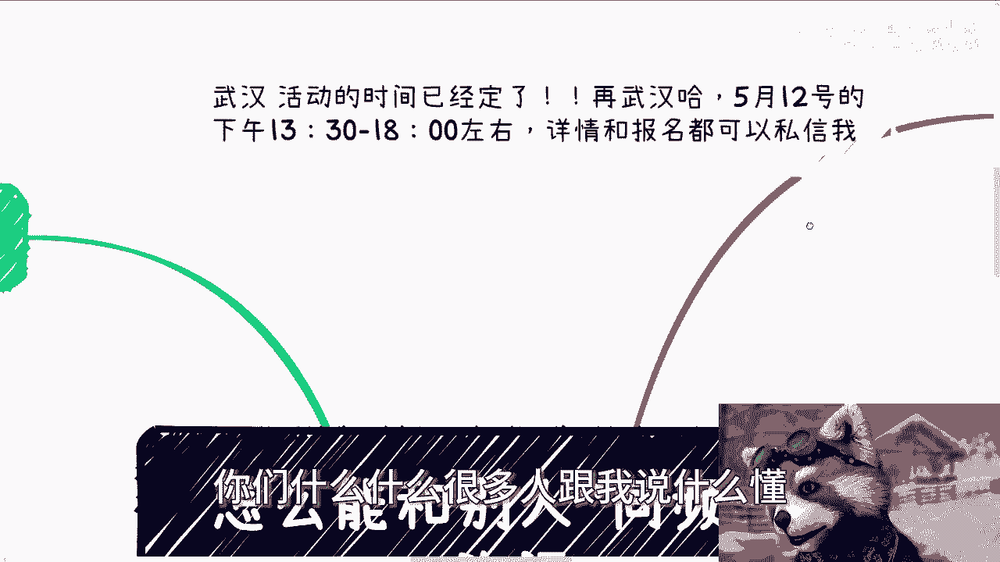
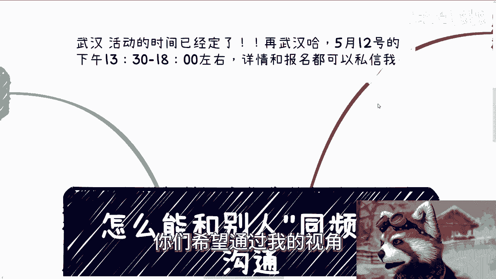
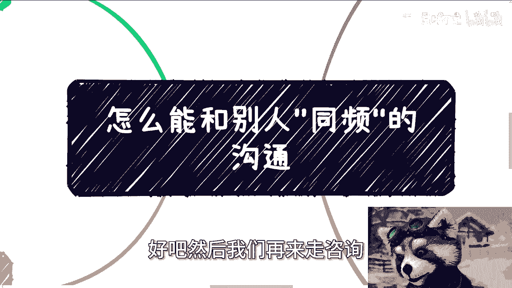

# 课程 P1：如何实现“同频”沟通？🤝

在本节课中，我们将探讨一个核心问题：如何在具有逻辑性的对话中，不被对方带偏，并实现“同频”沟通，从而避免陷入被动和吃亏。课程内容基于一个具体案例展开，我们将分析沟通的本质、前提条件以及实现有效沟通的关键。

---

## 概述 📋

一位学员提问：在与逻辑性强的领导对话时，经常被对方的逻辑主导，导致自己陷入被动，迷失目的甚至吃亏。本节课将围绕此问题，拆解沟通的核心，并给出清晰的行动思路。

---

## 1. 沟通的必要性前提 🎯

在探讨沟通技巧之前，我们必须先明确沟通的前提：**目的性**与**自主性**。

上一节我们概述了问题，本节中我们来看看沟通发生的根本前提。所有沟通行为都应服务于明确的目的。

*   **沟通必须有明确目的**：沟通要么是为了达成特定目标，要么是为了创造经济价值。如果两者都无法实现，那么沟通本身就没有意义。
*   **沟通者必须保持自主**：沟通时不能因恐惧（如害怕丢工作、被穿小鞋）而受制于人。如果你在沟通开始前就已感到束缚，那么你实际上已丧失了平等沟通的资格。真正的沟通建立在“不怕失去”的基础上。

**核心公式**：
`有效沟通 = 明确的目的 + 不受束缚的自主性`

---

## 2. 沟通的核心：目的与结果，而非过程 🏁

明确了沟通的前提后，我们来看看沟通中什么才是最重要的。许多人误将沟通的“过程表现”视为核心，这其实是一个误区。

沟通的本质是博弈，其价值在于结果，而非过程中的言辞交锋或气氛是否热烈。

*   **结果重于形式**：沟通是否成功，不取决于是否“谈笑风生”或“针锋相对”，而取决于双方目的是否达成。许多看似热烈的商业谈判，最终可能毫无实际收益，反而耗费大量成本。
*   **认知决定判断**：你觉得对方“逻辑严密”、“滔滔不绝”，很可能是因为你的认知和格局尚未达到相应水平，存在信息差。这就像不懂游戏规则的人看高手操作，会觉得眼花缭乱，但实际上可能只是无效的“废操作”。
*   **“吃亏”的真相**：沟通中所谓的“吃亏”，很少是因为对话技巧不足，其根本原因往往在于**自身目的不清晰**，或对事情背后的运作规则（信息差）一无所知。沟通只是表象，深层原因是认知不足。

---

## 3. 实现“同频”的基础：积累社会经验与规则 📚

既然认知不足是问题的根源，那么如何弥补呢？本节我们将探讨构建“同频”对话能力的根本方法——积累对社会运作规则的理解。

要实现不被带偏的沟通，关键在于弥补信息差，这需要长期的社会经验积累。

*   **弥补信息差**：沟通中“接不上话”、“被压着打”的感觉，通常源于你对讨论领域（如某个行业、某项业务）的规则、术语和逻辑完全陌生。例如，对方谈论“高校软件采购、产学研合作”，如果你一无所知，自然无法有效对话。
*   **经验无法速成**：这种对社会规则、商业逻辑的理解，无法通过读书或看视频集中获取。它属于“社会经验”，需要你**持续地、大量地接触不同的人，参与各种实践**去摸索和体会。仅参加一两次活动或认识几十个人是远远不够的。
*   **教育的局限性**：常规的学校教育并不教授这些关于社会实际运作和“赚钱”的规则，这是有意为之的设计。作为个体，我们需要主动跳出框架，去探索和积累。

---

## 4. 行动指南：聚焦目的，厚积薄发 🚀

最后，我们将前面的分析转化为具体的行动思路。记住，所有技巧都服务于最终目的。

以下是基于以上分析的几点核心行动建议：

1.  **永远明确你的目的**：在每次沟通前，先问自己：我这次对话要达到什么具体目标？所有言行都应围绕此目的展开。
2.  **放弃对“表面和谐”的执着**：不必追求一定要在言语上压倒对方或显得非常“同频”。允许对话中有沉默、有直率的提问（如直接问“如何合作？多少钱？什么时间？”）。
3.  **将重点放在“理解对方需求”上**：在对话中，努力通过对方的表述去洞察其真正的痛点和需求，而不是等待对方给你“科普”。能否洞察，取决于你的经验积累。
4.  **长期投入于经验积累**：主动、持续地拓展人脉，深入理解不同行业、组织的运作模式。这是你能在各类对话中保持底气、不被唬住的唯一途径。
5.  **接受现实，脚踏实地**：不要试图用华丽的沟通技巧掩盖认知的不足。在积累不足时，承认某些对话无法进行，并专注于提升自己，比强行沟通更明智。

---

## 总结 ✨

本节课我们一起学习了“同频”沟通的本质。

1.  **沟通的前提**是拥有明确目的和不被束缚的自主性。
2.  **沟通的核心**是达成目的，过程是否精彩并不重要；“吃亏”源于目的不清和认知不足。
3.  **实现“同频”的关键**在于长期积累社会经验和规则认知，以弥补信息差。
4.  **正确的行动路径**是：聚焦自身目的，放弃对表面形式的追求，将精力用于洞察对方需求和持续积累社会认知。

记住，**`强大的沟通能力 = 清晰的目的 + 深厚的社会认知积累`**。没有捷径，唯有通过实践不断学习和成长。