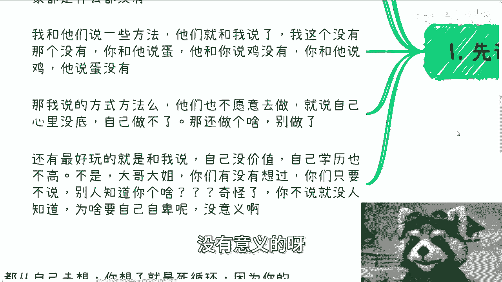
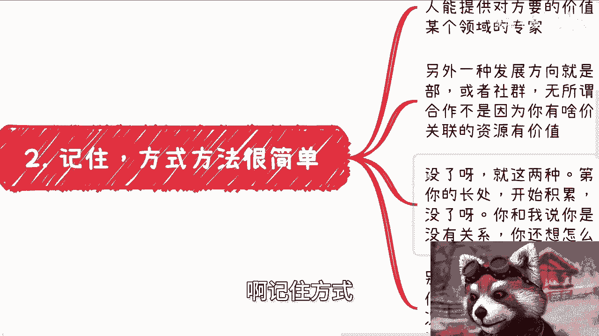

# 怎么解决自己什么都没有的问题 - P1 - 赏味不足 - BV1uM4m1f7ne

啊大家好，咳咳咳，我靠，我昨天晚上发烧38。5，我本来想昨天晚上更新的，我后来想想算了，更新不动了，今天来更新呃，首先是这样子的啊，我们今天来讲的呢，是解决这个自己什么都没有的问题对吧。

呃我先说这么几个事啊，首先呢最近废话文学越来越多，呃就是说普通人没有学历，没有资源，什么都做不了，那你要我说对吧，没有资源，那你去找啊，你妈每天在网上说废话，他妈能有资源嘛，对不对，另外学历这事吧。

你放到2024年就别去说了，你有学历，你能有什么资源吗，你学历跟这个有因果关系吗，也没有，你学历能变现吗。

也不能，那你不是搞笑吗，对吧，就这种屁话不要去讲啊，你也不要去听啊，然后呢我来说说这个沟通之前的准备啊，我跟你讲，人就是这样子的，很多人包括以前的我，你他就会用大家都是普通人。

大家都什么都没有这种东西来PUA自己啊。

然后呢我跟他们说一些方法，他们就跟我说了，我这个也没有，那个也没有，你跟他说你要有蛋，他跟你说我鸡没有啊，你跟他说有鸡，你他说给你蛋蛋没有啊，那我说然后呢我说的方式方法呢，他也不愿意去做啊。

就说心里没底，自己做不了，那我跟你讲，还他妈做个啥，做个锤子，你妈别做，对不对，你就是什么都不愿意干，然后你想得到什么可能吗，啊你看看他妈中国社会是这个样子吗，啊还有最好玩的是什么呢，说自己没有价值。

自己学历也不高，我跟你讲，大哥啊，大姐你有没有想过一个问题啊，你学历高不高，你有没有价值，你只要不说，或者来说你只要有过包装，别人知道吗，别人知道个锤子啊，啊你只要不说别人知道啥，我我你知道吗。

我我咨询的时候，我跟他们说，我说你们他妈出去社交，你们他妈把学历贴你脑门上吗，对不对，谁关心啊，你你只要明白，你只要不说，就没人知道为什么你要自己自卑呢，没有意义的呀对吧。

那我跟我，我还是那句话，我告诉你们啊，就是我不管你们到底是因为什么原因对吧，你但凡想的多，但凡怎么样，但凡觉得自卑，但凡觉得怎么样，但但凡就是说各种各样的问题。

你只要不愿意去做，你只要做不了，我跟你讲，你就是炮灰，你就不要挣扎，有什么好挣扎的呢。

对不对，啊记住方式方法很简单。

你比如说一个人做商业，他无非往后发展就两种，一种是你个人能提供对方想要的价值，那么你可能是个技术专家或者某个领域的专家，那当然记住啊，这个地方专家不是说你一定有什么好，很了不起的东西。

只不过就是让别人觉得你是个专家就行了，你懂吗，啊记住啊啊然后另外一种方向呢，就是你提供了一个平台，比如说俱乐部啊或者社群啊啊，无所谓叫什么无所谓啊，那么简单来讲。

就说别人跟你的合作并不是因为你有什么价值，而是你组织的这个平台或者你关联的资源，有价值没了呀，就这两种啊，你你二选一呀，你要么就二选二对吧，你一个都选，你一个都不想选，那你做个屁啊，对不对。

那我们就来说第一种，你有吗，你有的话，你现在就去发挥你的长处，开始积累关系，对不对，那你要是跟我说，你什么都不会，你要没有，那么只有第二种啊，没了啊，你还想怎么样呢，对啊，你跟我说，你是个普通人。

家里也没有资源，也没有关系，你一也不选，二也不选，你想怎么样，哎我奇了怪了是吧，你别跟我谈价值观，你知道吗，就是什么这种算不算骗人或者怎么样的，我跟你这么说，我们作为啥都没有的普通人。

你觉得我们有的选吗，哎我也奇了怪了，我们是没得选啊，你们有没有想过你，你们太把自己当个人了，我们有选择的余地吗，没有啊对吧，也就是说我们能做的只有这些东西，我们还能做什么呢，更何况你积累资源和关系。

你不借力打力，你怎么积累是吧，然后第三你说你什么都没有，你也可以什么都有啊对吧，你记住所有的合作都是以合作的关系呃来的，别搞了半天，就是说你搞什么自己导师啊，或者搞什么自己公司的人，那就别搞了。

你什么意思啊，就是你拉的单，你拉来的单子导师是决定不了做不做的，你导师还要看学校的情况，也得收到受到学校的监管，甚至还要给学校分润对吧，你公司的人就更别去搞了，你都有劳务合同在这里面，你谈什么业务呢。

老板只会觉得你心思不在工作上，你懂吗哦，所以你要借力打力的那种利，都是独立业务，独立的公司以及你认识的人，至少他是有拍板权的，你比如说你今天认识两个做医疗的，两个做软件开发的，两个金融的。

两个数字经济的，你下次再出去再认识别人，在社交授，你就说啊，你说我是做医疗的，做软件开发的，做金融的，做数字经济的，怎么了呢，怎么了呢，对不对，那我们作为什么都没有的普通人，我们能怎么办呢。

我们只还不是只能借力打力，然后跟别人说，我们有这个东西，别人感兴趣了，我们再跟他继续聊对吧，如果如果有机会，你能让大家合作起来对吧，那同时自己在里面掺和一部分不就好了吗，那我就问吧，否则你怎么起步呢。

你怎么从零起步呢，你不要跟我讲，你现在是什么学历，你也不要跟我讲，你出去留不留学，你自己仔细想想，看你今天什么学历跟你留不留学，跟你做什么专做什么专业，跟我们说的，你能不能做商业，能不能赚钱。

有因果关系吗，没有的呀，你浪费这么3年五年出去之后回来，你还是面临这些问题呀对吧，你仔细想想是不是嘛，你还是要从零起步的呀，那你怎么起步呢，你总不可能说啊，因为我手上有一个硕士学历啊。

我就不用借力打力了，还是什么都没有呀，你有啥，是吗，你仔细想想是怎么回事啊，然后第四就是什么呢。

就别想，我给你讲，想了就是死循环，没什么好想的，你说你别什么都从自己去想，你想了肯定是死循环，因为你的确什么都没有，我也的确什么都没有，可而且我们也没有别人看得上的价值，为什么，因为我们没有社会地位。

没有政治地位，你去想它干嘛呢对吧，但是没有关系啊，大家在社会上面靠的就是朋友，你没有不代表你身边认识的人，他们相互之间没有啊，对不对，你他们相互之间可能有合作，有有商业价值，有利用价值对吧，如果没有。

你就当多认识个朋友，有什么不好呢，你为什么一定要从你自己角度出发呢，那当然你自己是需要多判断判断，别乱拉单子，因为拉的单子有些牛头不对马嘴的对吧，比如说有些人，他就是要数字经济的这个解决方案。

你给他拉了一个什么土木的对吧，那当然是没有什么意义的啊，也容易引起反感，所以我也一直都说嘛，就说你都要去了解了解乙方是做什么的，然后才能去跟甲方谈对吧，那简单来讲就是说你没法自然的去跟别人聊。

去和别人无中生有，你自己唯唯诺诺，担心这担心，那我跟你讲，那你就别做了对吧，你就当一个普普通普通人，就虚度一辈子不就好了吗，你指你想什么呢，你想那些有的没的，你又改变不了，你除了自我那个内耗有什么用呢。

对吧，你也别去抱怨自己什么都没有，因为大部分人自己都没有，你不是现在没有，我告诉你以后也没有，为什么，因为你迈不出第一步对吧，你非要问为什么，我告诉你为什么，因为社会就是这样子的。

整个人类社会运作就是这个样子，你为什么要问为什么对吧，就像我告诉你，90%的财富掌握在5%的人手里，为什么呢，那你告诉我为什么对吧，那我还想说呢，那为什么那么多人那么多老百姓炮炮灰呢。

为什么这么多创业者作为炮灰呢，你们有没有想过为什么呢，一样的呀，你不要去纠结他为什么，因为不是你能思考得出来的，就算你思考得出来也没有价值，你改变的了吗，改变不了，你唯一能做的是什么，是先强大自己。

然后再去改变，你自己都活不了，改变个屁对吧，好那就这么着啊，嗯然后职业规划，商业规划啊，然后股权嗯，合同啊，然后什么股份啊，包括商业啊，包括其他的，你们手上有什么牌。

希望通过我的视角能帮你们更好的去看的好吧，你们也可以整理好问题。

