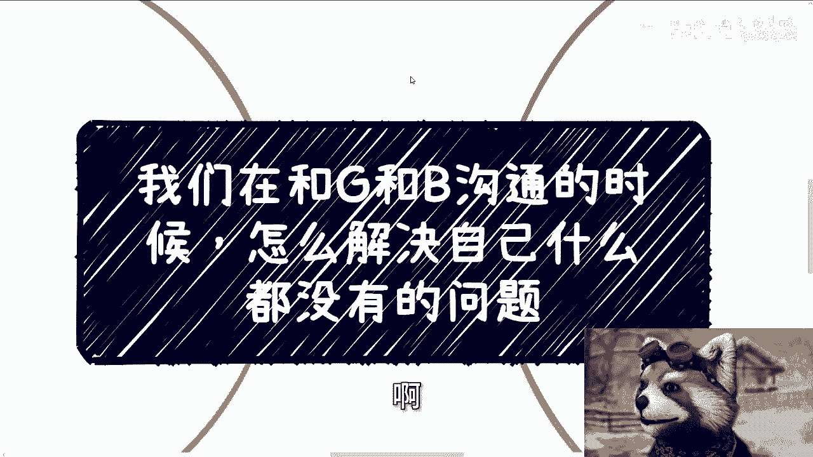
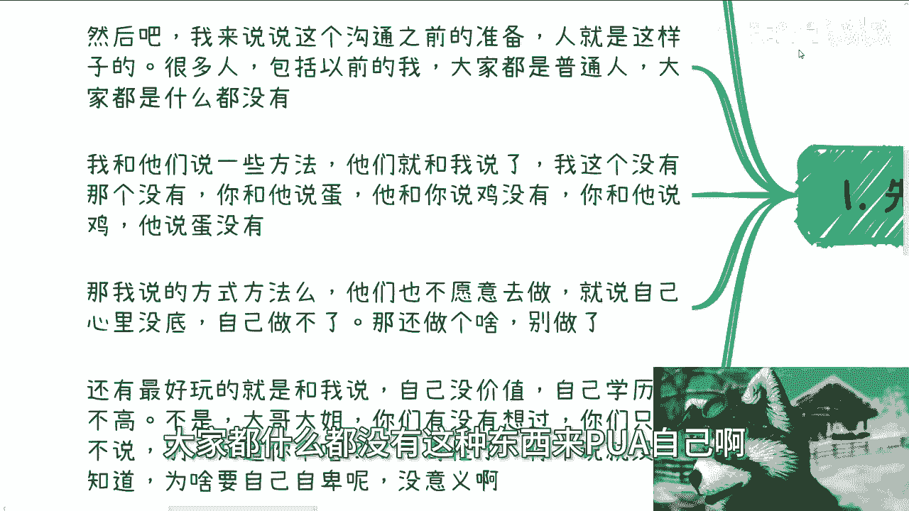

# 课程 P1：如何从零开始构建个人价值与资源网络 🚀

在本节课中，我们将探讨一个核心问题：当感觉自己“一无所有”时，如何通过正确的思维和行动，从零开始构建个人价值与资源网络。我们将摒弃无用的自我设限，聚焦于切实可行的路径。

## 破除自我设限的迷思

上一节我们明确了课程目标，本节中我们来看看需要首先破除哪些常见的思维误区。

许多人常以“没有学历”、“没有资源”作为无法行动的借口。这种思维是自我设限。在当下环境中，学历与能否获取资源、实现价值**没有直接的因果关系**。学历本身难以直接变现。

关键在于行动。如果只是空想而不行动，结果必然一无所获。社会不会因个人的空想而改变。

## 构建个人价值的两条核心路径

在清除了思维障碍后，我们来看看具体可行的行动方向。一个人要在商业或社交中立足，其发展路径可归结为两种核心模式。

以下是两种核心的发展方向：

1.  **成为价值提供者**：你个人能提供他人所需的价值，例如成为某个领域的技术专家或意见领袖。这里的“专家”并非指拥有惊天动地的才能，而是**能让外界感知到你在特定领域的专业性与价值**。
2.  **成为资源连接者**：你搭建一个平台（如社群、俱乐部）或成为关键节点，让他人之间的合作因你而促成。此时，合作的基础不是你个人的技能，而是**你所能连接和调动的资源网络的价值**。

对于自认“普通”的起步者，若不具备突出的个人技能（路径一），那么主动构建资源网络（路径二）是更为现实和有效的起点。

## 从零起步的关键策略：“借力打力”

既然选择了构建资源网络的路径，那么具体该如何操作呢？本节将介绍核心策略：“借力打力”。

作为起步者，我们没有现成的资源。因此，策略是“借力打力”，即整合他人资源，创造合作机会。

具体方法是：广泛结识不同行业（如医疗、软件开发、金融）中拥有业务决策权的人士。在后续社交中，你可以介绍自己“涉足”这些领域。当他人对某个机会感兴趣时，你再连接相应的资源方。

这个过程的核心是促成合作，并从中找到自己的参与角色。**独立决策权**是选择合作对象的关键，应避免与受制于机构（如学校导师、受劳动合同严格约束的员工）的人进行此类商业合作，因其缺乏灵活性与决策权。

## 行动指南与心态调整

掌握了核心策略后，我们还需要注意具体行动中的方法和心态。以下是行动中需要牢记的要点：

*   **停止内耗式空想**：从“我什么都没有”的自身角度思考，只会陷入死循环。应该转向思考“我认识的人拥有什么”。
*   **为连接负责**：在引荐合作前，需基本了解双方业务，确保需求匹配，避免牛头不对马嘴的介绍，损害信誉。
*   **接受起步状态**：追问“为什么我什么都没有”没有意义。社会资源分布不均是一种现实状态。能改变现状的不是抱怨，而是行动。
*   **迈出第一步**：如果因担心失败而永远不敢尝试，那就只能接受现状。改变始于行动的第一步。

## 总结与后续

本节课中我们一起学习了如何摆脱“一无所有”的心态，并找到了两条切实可行的路径：成为专家或成为连接者。对于大多数起步者，“借力打力”地构建资源网络是更实际的起点。关键在于停止自我设限，转向外部连接，并通过促成他人合作来创造自身价值。

记住，**真正的起点不是你拥有什么，而是你开始如何行动和连接**。

关于具体的职业规划、商业规划、股权合同等问题，可以将你的具体情况和问题梳理清晰，以便进行更具针对性的探讨。