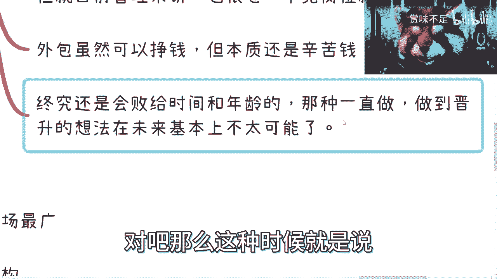
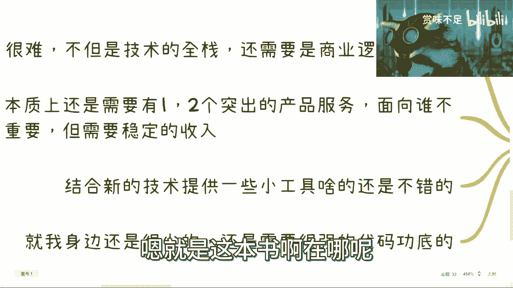
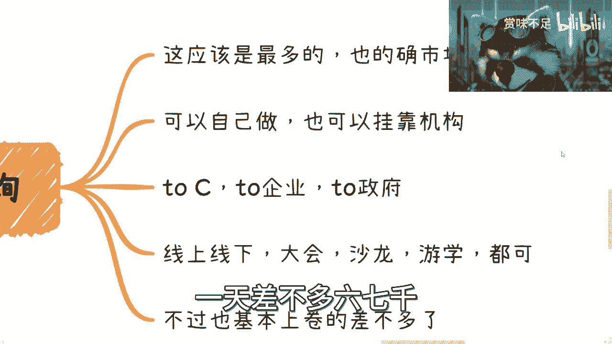

# 总结下开发人员的职业发展 - P1 - 赏味不足 - BV1914y1f7Zd

好啊大家好啊，我来给大家汇报一下，今天真的是忙了一天，刚回来，先说一下吧。

先说一下，是这样子的啊，就是我先跟大家说，应小伙伴要求呢，我单独做一期开发人员的这个职业发展啊，因为之前也有些小伙伴让我这个说做一下呃，第二呢就是我买了一台台式机啊，回头就可以给大家直播游戏了。

因为我现在这个电脑实在是卡的不行，就玩玩可以直播，肯定是卡成狗啊，然后本期呢要感谢清华大学出版社，提供了代码大学这本书啊，这个回头我待会去给大家介绍一下呃，同样的我跟大家介交代下今天聊的事啊。

其实今天的话我是撮合了，一个就两家都做了十几年的机构，然后这两家呢相互之前也不认识，那么他们今天聊下来呢，就发现两边都就非常的互补啊，不管是就我们也吃不直白一点吧，这不管是那个呃政府补贴啊。

还是说是渠道啊，还是说招生啊，还是说是这个证书的组合都非常的贴切啊，那具体我就不方便讲了啊，但是这个这个今天这个饺子怎么说呢，我给他们介绍，我觉得是属于非常非常非常，大家三赢的这么一个状态。

好吧。

嗯然后也有小伙伴私信我说啊，这个现在对于未来很迷茫对吧。

怎么样，我跟你们讲啊，呃所有事情都是一步步走的对吧，你看我今天我我走到今天对吧。

大家都觉得啊这个陈老师不上班是吧，每天吃喝玩乐是吧。

就走到今天也真的就都是一步步走的，就是当中呢也有天时地利人和，但这个事情怎么说呢，就是看吧啊再走一步看一步吧，OK那么正式来说啊。

就本期讲的话是开发人员的这个职业发展啊，首先呢我觉得是这样子的。

这个开发呢其实能走的路呢，我觉得其实不是那么多啊，我这边列了一些一个是技术专精对吧，就有一种打游戏的感觉是吧，技术专精啊，就技术点满嗯，但是在我看来呢这种也比较少，而且中就国内的这个土地呢就30岁。

35岁对吧，总归有这种这种歧视存在啊，这一方面，第二方面呢也有很多人以前做这种职业管理啊，叫做技术开局转职管理啊，这种呢我觉得其实至少比第一条好啊，但是前面这两条呢基本上也都是35岁。

30岁要被优化掉的啊，大概率啊，我不能说完全啊，第三个呢就是主业加兼职的这种外包，这种呢现在是大部分人在做的方向，但是我跟你们讲啊，我这个地方我可以跟你们断言啊，就是今年开始往后。

你们会接到的外包单子越来越少啊，你们自己看吧，一定是越来越少的，嗯第四个呢是独立开发者，独立开发者呢这个我后面会单独说的，嗯我身边也有，但是蛮难的啊，说实话蛮难的，这个门槛蛮高的，嗯这个呢是做的最多的。

就培训咨询啊，包括全职的这种咨询师也是蛮多的，但是怎么说呢，就是在我看来啊，单纯的咨询培训的红利期早就已经过了啊，待会我会给你们举例子，你们估计会震惊的啊，然后诶我我我我我图了啊，然后这个职业服务啊。

技术创业，这个我后面也会说的，还有最后一条就直接转行，直接转行，说实话也也蛮多的。

为什么呢，因为被迫无奈是吧啊，被迫无奈。

那我觉得这个是一个，那第二个呢就是这个那个我们分开来说啊，就说这个技术专精，说他妈的给你们，待会儿要弄一个东西，像这样呃技术专精转职管理和兼职外包对吧。

这个这个我列了一下，第一呢就是我觉得吧这个事呢，因为现在市场已经很卷了，不管你是全职做技术，全职做管理还是全职呃，全职以及兼职方式做外包，我刚刚已经说了，就是现在这个情况呢。

就是以后单子可能只会越来越少啊，别问我为什么，反正就这么一个点啊，这是第一点，第二点呢，就是说很多人以前会觉得，转管理是个不错的方式，因为我跟你们说，10年前十几年前对吧，培训机构都是非常呃推崇啊。

去做这个职业发展的，但是呢职业发展这个东西呢，其实在当下我跟你们说的很清楚，就是我在以前的所有视频里面也说的很清楚，就是当下往后的这个时间点啊，所有的职业发展，职业规划都是BULSHIT啊，都是扯淡。

为什么，因为当下的整个市整个大局势非常的不好，好非常不好，然后在这种大学生下面，就是你们有能有工作就不错了，能有收入就不错了，不要去想任何职业发展，职业规划没有意义的，你知道吗，就所有人啊，包括我在内。

我觉得大部分的人没有能力去预测未来，所以说就是说在如此大局势下面，我们能做的是什么，就是一积累人脉，积累关系，二在这两三年里面，尽可能的尽可能的去布局啊，尽可能去布局，三就是说走一步看一步啊。

随时随地做调整，一定要明白这一点，千万千万千万别用以前10年，20年的经验和这种路线历史来参考，以前的20年已经不复存在了，我明确跟你们讲啊，不复存在了，这是第一个，第二个呢接下来呢竞争一样会很激烈啊。

但是虽然如此说啊，但是我个人来讲呢，我还是偏向于大家转管理的，毕竟啊这个转管理呢它也是一种非技术的锻炼，因为你说在企业里面得不到商业上的锻炼吧，是的，但是你总总比一点锻炼都没有来的好吧对吧。

而且另外一方面呢，就目前的这个管理来讲呢，也很卷啊，也很卷，目前呃毕竟你想嘛整个金字塔往上，无论是行业也好，还是说公司也好，其实整个金字大厂上它的整个管理岗，就manager的这种岗位本来就不多对吧。

你总不能说啊，大家都manager，那都manager，哈哈哈啊，谁干活，是不是，那么还有呢就是这个外包啊，外包虽然能挣钱，但是我跟你们讲啊，一呢未来单子我跟你们说只会越来越少，二呢在我看来。

外包本质还是辛苦钱，你知道吗，就是呃我觉得大家是这样子的，只要有一个嗯这个核心的价值点啊，什么意思呢，就是说我们做副业去做创业也好，你们兼职做副业也好，好花了大精力在副业上也好啊，我们的核心是什么。

我们的核心是要单位时间内产出的，这个叫什么单位，是单位时间里面赚的钱更多，你明白吧，你别就是说啊这个这个驴老师说了，要做副业对吧，要做全职，要做那个什么呃，创业对吧，要怎么样啊，你别到时候对吧。

这个什么呃算下来一笔账啊，然后什么时薪啊对吧，月薪啊，周兴啊，都还没没你打工高，我跟你讲，但凡没有你打工搞的，你你要赚赚钱，这个做做补做做补贴对吧，做做什么什么什么零花钱，那无所谓啊。

但凡你说这个东西呃，以后想什么长远做，想赚大钱的，不可能啊，别想了啊，所以我跟你讲，所有的事情都是要有一个准备的啊，都都是要有个过渡的，你现在可能比如说打了两三份兼职的工啊，你觉得呃这个钱不错啊。

比如说你一个月有个5万10万的，你觉得不错，但是我跟你讲，你最终要的是什么，要的是你能够躺平，你躺平也能赚对吧，我也明确跟你们讲，你就像我现在有非常多的课在外面，我只录一次，后面我就再也不工作了对吧。

他们每招一个人，我我生我会得到15%，就这么简单对吧，我觉得你说我付出劳动了，付出了，但是我要的就是性价比高，而且这只是我其中的一个plan，我现在可能有十几个排练并行，就这么个情况对吧。

所以对我来讲没有必要上班，实在是太浪费时间了是吧，这是第一个啊，还有一个呢就是说你本身做这个专利，就是做这个技术也好，管理也好，你最终还是会败给时间跟年龄的，就我可以很明确跟你讲啊，就是这种做。

你是不可，就说白了你是不太可能一直做到退休的，对不对，那你既然不可能做到退休，你也不可能说在这个当中就就财富自由，那么其实最终你还是会去想办法，还要去找赚钱的路子嘛对吧，那么这种时候就说你在未来。

就是你单纯做着做这三个，你单纯呃未来要再去找一些别的方式，一旦走到社会当中，一旦做商业化，你会发现你是没有任何优势的，但是到那个时候你说我在准备起来再去学起来。

唉不太可能啊，不太可能好三，独立开发者啊，独立开发者呢就是我刚刚说的就是很难啊，说实话很难，因为什么呢，因为他不但要技术的全站，还需要商业逻辑的全占呃，因为独立开发者就是本质上啊。

就是你说白了就是你既要做产品，你要做运营，也要做做商务嘛对吧，当然有很多人，我这边给你们举几个例子，就是可以不是那种那种那种纯线下商务的，有什么方式呢，比如说啊你需要有一两个突出的产品服务，什么意思呢。

也就是说你必须在技术上得要蛮牛逼的啊，要蛮牛逼的，你必须要做出一些突出产品服务，这些产品服务不足以，能够让你有一个稳定的月收入的啊，一定要明白，而这个时候你就会问你说按照我做这个产品，为什么别人会来用。

那么这个就看你的产品的价值啊，就是说就是说虽然你不做，但不做那种特别的运营或者销售啊，但是你需要找到那些这种小范围的，就有需求的地方，比如说给SARS做做服增增值服务啊对吧，给云服务做的增值服务啊。

做做监控啊都可以啊，但是你的技术得过关得到位啊，否则别人是不会付钱的对吧，那这是第二点，第三点呢就是说结合一些新的技术，提供一些小工具，你比如说GPT啊对吧，比如说那个那个那个那个那个。

这个区块链啊对吧，包括以前元宇宙啊对吧，AR比R啊，其实你都可以做，对外包括就是像我以前最早是做安卓，IOS的时候也是一样的，就是你可以在上面开发一些小工具啊，都可以赚钱。

你要知道像以前的小游戏2048对吧，或者别的，其实在这种就早期的时候赚钱蛮蛮快的啊，蛮快的，然后这是一个，然后还有一个呢，就是说呃，我为什么说独立开发在我身边蛮少的呢。

是因为他的综合能力要求还是非常突出的哦，真的是非常突出的，就是否则的话你想嘛你要是是一个中等吧，偏上水平的，你要去做一些产品出来，你单纯靠自己的运营，靠自己的这种这种知道吗。

地技术上的这种销售我觉得是很难的，你很难卖出去，你你你你一个月可能对吧，这都都吃不到，吃不到吃不饱饭是吧啊，就是还需要这个很强的这个代码功底啊，就这你不但要相当于你不但要做一个项目。

你还得把它产品化对吧，而且你还得就是说有些这种宣传的套路啊，宣传的路子，好，那么OK那么接下来我就给大家正好嘛，就给大家来介绍一下这个就是这本书啊，在哪呢。

我看一下在这啊啊代码大学，清华大学出版社呢给我这本书也有一周了，哎其实我我是翻了好久了，给我一周了，然后呢就是说这个书呢有800多页，其实蛮厚的，但是呢我跟你们讲啊，其实这个代码大全这这这个怎么说呢。

这个名字取的不是那么的贴切啊，我待会跟你们说一下，就是我花了一个礼拜呢，反正就看了一下，我觉得呢就是说它是一本什么呢，它是一本，就是说所有我觉得，不管你是一个开发还是个架构，你都是需要去看待这本书哦。

我觉得是有有必要的，然后诶哦然后是二，二的话呢你们看啊，就是第二个呢，就这本书里面每一个都会都会有个赠品，这个赠品呢其实更像什么呢，更像一个就是说呃，代码大学里面的这个浓缩版的一个精华，你们可以看到。

就这里面比如说我随便给大家，我是之前给大家随便列了一页啊，你们可以看看，那就比如说这个啊，这个你们会看到，就比如说它每一个地方什么变量名啊对吧，或者说是什么测试啊，或者架构啊，这种语法糖啊。

它每个地方都会有个清单，这个清单你们可以看到，比如说比如说是什么呢，比如说命名规范，注意事项对吧，特定类型注意事项对吧，然后这个命名规范有哪些，这个需要呃，那个那个去去检测的对吧，然后短名称对吧等等等。

他这个怎么说呢，就是说这个代码大全，它更像一个就是针对于每一个你只要写代码，这个当中都会涉及到的一些规范，或者一些一些经验的总结啊，他不是说他不是说像大家觉得啊，我这个在里面对吧，就是什么代码都有对吧。

因为因为其实本质上，你今天写什么代码并不重要，重要的是你的规范让别人觉得舒不舒服对吧，你的写法让别人觉得舒不舒服，规不规范，你要做的该做的整个命名啊，包括测试啊，单元测试啊等等等。

你该做的是不是都做了啊，这个是一个别人来判断你这个啊技术本身啊，到底就是扎不扎实的这么一个点，然后在这个地方我给你们就是录了一些呃。

就是拍了一些这个详细目录啊，就比如说啊你们看啊，就是比如说软件架构的设计啊，可以工作的类啊，高质量子程序啊，防御式编程啊，就是它里面呢会拿一些，比如说java或者C的这种例子。

甚至Python的例子来做，但是你说它不可能涉及到每个语言嘛，对吧，你每个语言没有必要，但是其实你们看了之后呢，就出雷旁通啊，我觉得就是他更就像我刚刚说的，它更像一个什么呢，就是说从只要你写代码的人。

不管任何方向啊，然后给你打到一个真正的一个说诶，应该这个代码应该怎么去写啊，因为毕竟嘛我们说写代码这个东西啊，就是呃你要从能执行的角度来讲，很多代码都能执行，但是为什么很多代码会被别人说要重构啊。

要很这个代码写的很烂啊对吧，这个代码一看这个人就不咋地啊对吧，就是因为就说里面有非常多的这种细节，我们是需要去了解的哦，你单纯说现在有很多人出来，什么写一些应用对吧，写写的虽然好好看是可以用。

但是被别人就觉得哎这个人也就是写写应用，打打补丁对吧，修修bug，这样是不行的啊，你是很难往下走的啊，那么我在这个地方，也就是在列了一个具体的例子，比如说第20章对吧，它软件质量概述里面他也写了。

就是说那个检查清单对吧，质量保证啊，然后你比如说是否确定了该项目质量特性啊，对吧，是否这个质量达到质量标准了，是否考虑过相互制约，相互促进啊等等等啊，然后他还有更多的资源，在那个清华大学的网盘上面。

所以呢就是每一章啊，它每一章就是包括我们刚刚说的那个，那个工作的累啊，高质量子辰子辰需要防御是编程啊，它每一章呢都会有更多的这个资源啊，包括就是说也会有更多的这种参考的这种东西，好吧嗯。

我在这地方也直白点讲，因为我是第一次往这个视频里面去加这么一个，怎么说呢，购买清单对吧，我不知道这个到时候这个视频发出来，购买清单长什么样子，反正大家可以看看哦，那没有没有的话，回头再跟我讲。

我也第一次用，我也没用过，好吧，那么这个是三啊，让我们回到四啊，四呢培训咨询啊，咨询啊，我跟你讲这事呢是这样子的啊，首先这应该是最多的，也的确是市场上最广的，但是我也跟你们讲。

这也的确是市场上就是最最参差不齐的啊，你可以找到很多人很烂很烂啊，但他要求很高很高，嗯在这个地方呢我有一点跟大家说明白啊，就是培训咨询这个东西呢，在国内啊它有一个呃潜规则，什么叫潜规则呢。

就是做技术培训跟技术咨询的报价是报不上去，你但凡报价要报上去，只有宏观类的啊，我给你们举个例子吧，嗯在上海曾经有过那种两三个小时两个小时吧，宏观宏观类的培训，差不多一场要25万30万啊。

啊也正常啊也正常，你们看看这多赚钱是不是多赚钱啊，我反正是赚不到这钱啊，那这是第一个，第二个呢你可以自己做，你也可以挂靠企业，挂靠机构啊，第三个呢你做的时候呢，你得去区分，因为你的产品包。

比如说你跟我一样，比如说是一个人做的对吧，那么你也得区分你的产品包，你到底去C做什么，Q企业做什么，要求政府做什么，你都得包装好啊，不是一视同仁的，没这么简单的，而且我跟你们说的很清楚。

这种事情呢中国14亿人做的人很多很多，你们要想明白，为什么这个事情挪到轮到你们头上，不轮到别人头上对吧，那么当然包括线上线下大会沙龙游学啊，什么都可以，不过当下说实话啊，这市场的蛋糕也卷的差不多了。

那当然我也欢迎你们过来跟我卷对吧，跟我卷，就比如说你们来做一些数字经济啊对吧，区块链啊对吧，相关的啊，但是说实话啊，大概率你们卷不过我啊，毫无疑问，不要说你们卷不过我也没几个人卷得过我是吧。

嗯然后呢咨询这个东西呢，我也给你们举个例子啊，就是早年大概20113141415，那个时候咨询很赚钱，你知道怎么赚钱，你知道多么多么赚钱啊，就是企业是以天为单位跟咨询公司签的合同啊。

然后一签都是签三个月签半年的，然后每天啊按天付费，一天差不多六七千。

你算算看啊，你们算算看好多多赚钱啊，多赚钱。

当然现在是不可能的，别想了哎呀别想了啊，第五个就是技术服务啊，技术产品的创业，这个呢我跟你们说啊，这地方说的很清楚啊，就是这跟你们最近有很多人私信我啊，包括咨询，我也是一样的。

我在这个地方再跟你们重申一下啊，首先技术服务技术产品创业这些其实很重，这些不是非常重要啊，就不是P0，不是优先级零的啊，优优先级零的是什么呢，是是包装运营以及销售，一定要记住，这是你们的重点啊。

这是第一点，第二点是你们不管今天做什么，比如说你们来问我跨境电商怎么样对吧，你们比如说来问我什么做做什么怎么怎么样啊，我跟你们讲的很清楚了，你们所有考虑问题怎么考虑的，不是你们做什么，而是你们告诉我。

凭什么你们能卖得出去，凭什么别人来买你们的，凭什么你们能赚到钱，你们就回答我这三个点，你们但凡回答不了不足，明白吗啊别来问我说哎跨境电商好不好，这个行业能不能好不好，跟我们没有关系，我说的很清楚了。

你们明白吗，就是好，这个行业好也好不好也好，只跟你们的包装运营以及销售，说白了跟甲方的关系如何，但凡这三个东西都没有，你跟我说，现在这就是一个红海市场，跟你们也没关系，但凡你们这三个都有。

就算是西洋市场，你们也能赚到钱，就这么简单，好吧啊啊，再次感谢这个清华大学出版社提供的，这个这本书啊，回头那我也可以考虑啊，我也可以考虑一下，给你们讲一下，就是我现在做的业务，因为这样的话你们也可以呃。

知道怎么跟我合作是吧啊。

至于怎么走到现在的唉，没啥好说的是吧，就苦也是真的苦行吧。

