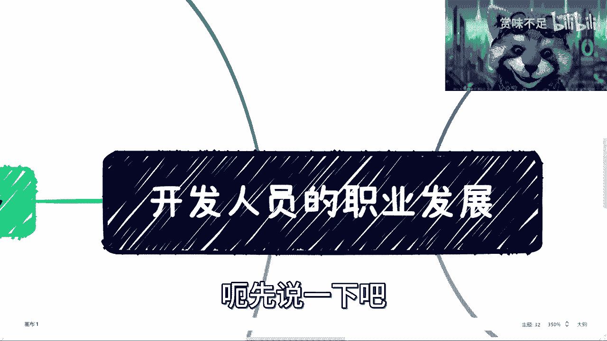
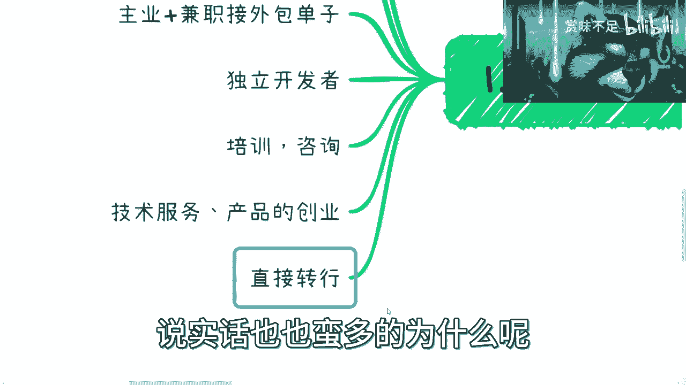
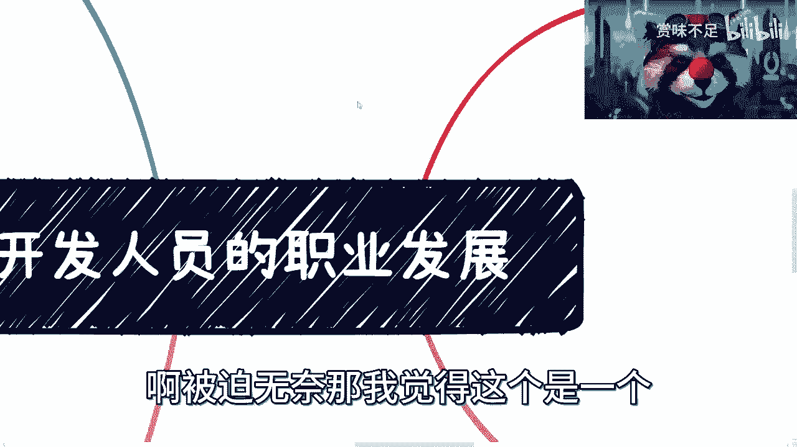
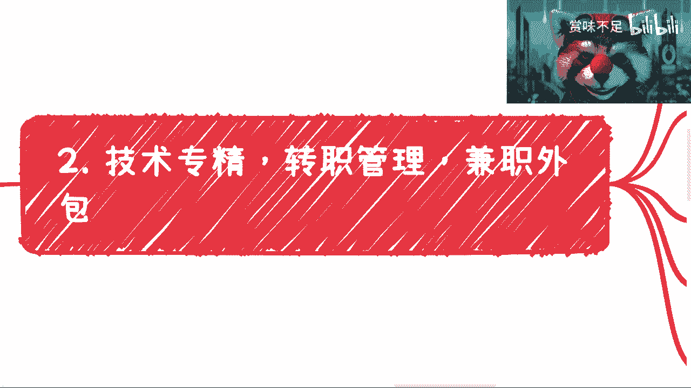
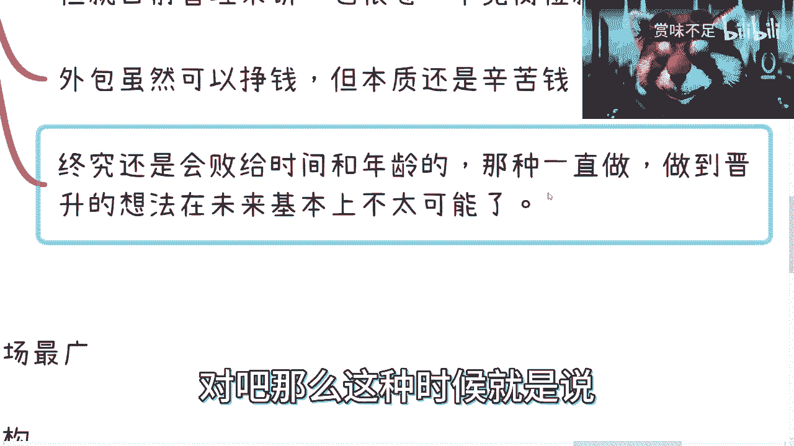
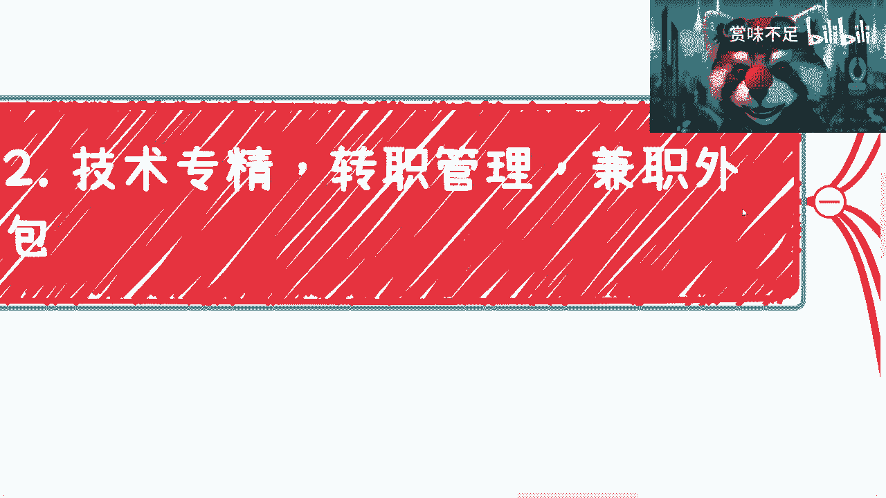
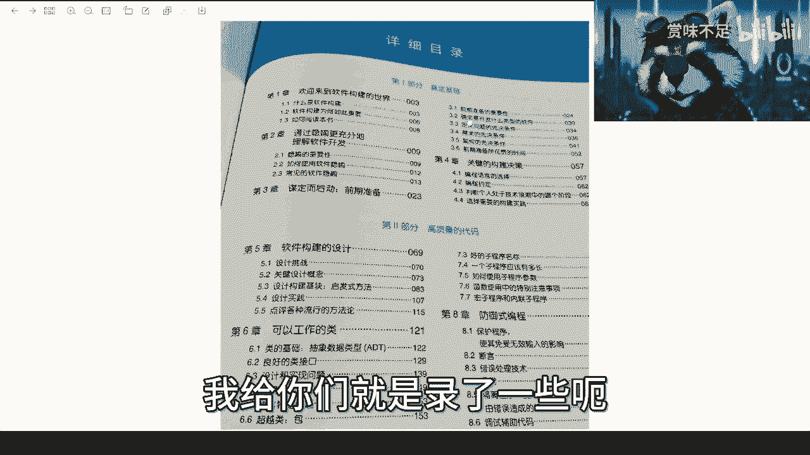
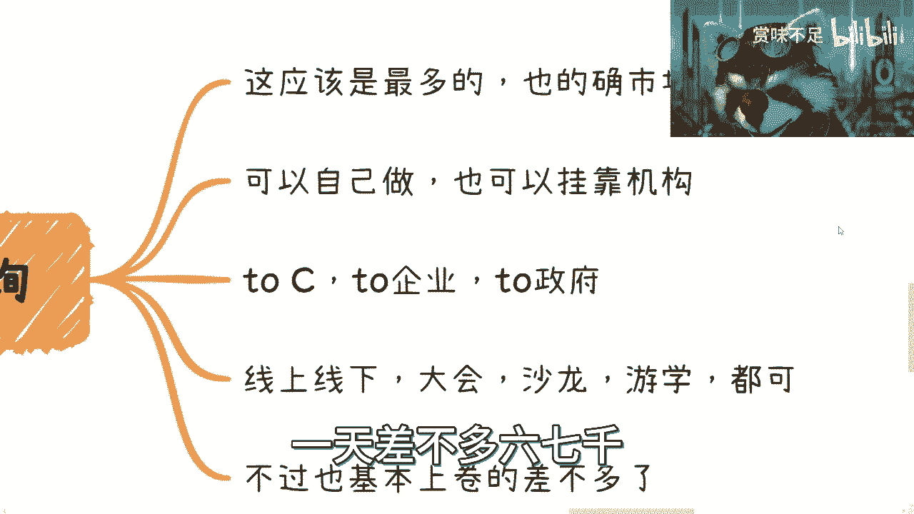
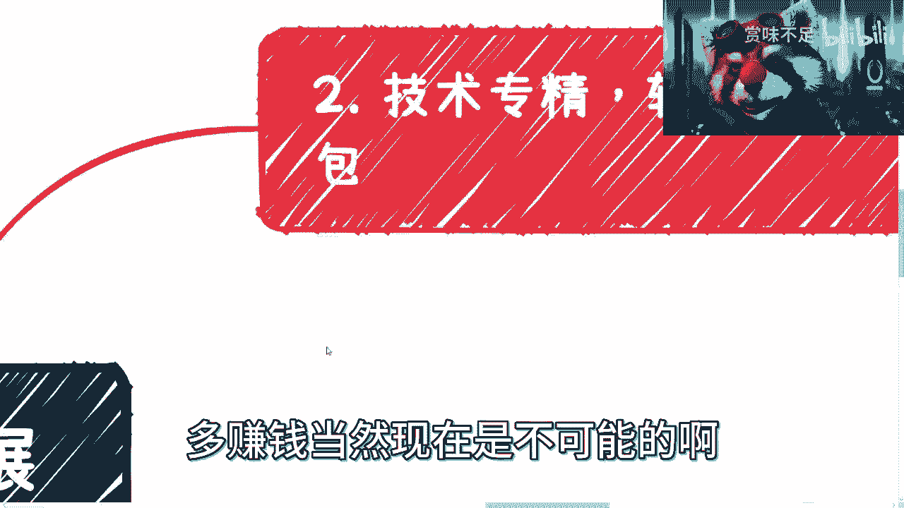

# 开发人员职业发展指南 - P1 📈

在本节课中，我们将系统性地探讨开发人员常见的职业发展路径。课程将涵盖从技术深耕到多元化发展的多种选择，并分析其现状与未来趋势，旨在为初入行业或处于迷茫期的开发者提供清晰的参考。

## 概述：开发人员的多元路径

开发人员的职业道路并非单一。首先，我们需要认识到，在国内环境下，单纯依赖技术或管理岗位可能会面临年龄相关的挑战。以下是几种常见的职业发展方向。

开发人员能选择的路径其实并不算多。我在此列出一些：
*   **技术专精**：类似于游戏中点满技能树。但在国内环境下，普遍存在30岁、35岁的年龄歧视。
*   **技术转管理**：从技术岗位转向管理岗位。这条路径通常比单纯做技术要好，但前两条路径（技术专精和技术转管理）的员工在30岁、35岁时大概率会被优化掉。
*   **主业加兼职外包**：这是目前大部分人在做的方向。但我可以断言，从今年开始往后，能接到的外包单子会越来越少。
*   **独立开发者**：这条路门槛很高，我后面会单独说明。我身边也有这样的人，但说实话很难。
*   **培训与咨询**：这是目前从业人数最多的方向。但在我看来，单纯的咨询培训红利期早已过去。
*   **技术创业**：提供技术服务或开发技术产品进行创业，这个我后面也会详细说明。
*   **直接转行**：直接转行的人说实话也很多，通常是迫于无奈。

## 路径一：技术、管理与外包 🔧

上一节我们概述了多种路径，本节中我们来看看技术专精、技术转管理以及兼职外包这三种常见选择的具体情况。

关于技术专精、技术转管理和兼职外包，我有以下几点分析。

以下是具体的分析要点：
1.  **市场现状**：当前市场已经非常内卷。无论你是全职做技术、全职做管理，还是以主业加兼职的方式做外包，未来的外包单子都只会越来越少。
2.  **职业规划的局限性**：很多人曾认为转管理是不错的发展方向。但在当下及未来的时间点，所有传统的职业发展和规划都可能失去意义。因为整体大环境不佳，预测未来变得极其困难。我们能做的是：积累人脉；在未来两三年内尽可能布局；保持灵活，随时调整。
3.  **转管理的相对优势**：尽管如此，我个人仍偏向于建议大家转向管理岗位。这毕竟是一种非技术能力的锻炼，总比完全没有锻炼要好。但需要注意的是，管理岗位本身也很卷，且金字塔顶端的岗位数量有限。
4.  **外包的本质**：外包虽然能挣钱，但本质是辛苦钱。做副业或创业的核心，是追求单位时间内产出价值的提升，即**时薪**的增长。如果最终算下来，你的时薪还没有打工高，那么它只能作为零花钱补贴，难以长远发展。
5.  **长远挑战**：无论是做技术还是管理，最终都可能面临时间和年龄的挑战，不太可能一直做到退休。如果未来需要寻找新的商业化路径，你会发现仅凭技术或管理经验，在社会竞争中并无优势，届时再学习准备为时已晚。

## 路径二：独立开发者 🚀

在讨论了公司体系内的常见路径后，我们来看看更具挑战性的方向：成为一名独立开发者。

独立开发者这条路很难，因为它不仅要求技术上的全栈能力，还需要商业逻辑上的全栈思维。本质上，你需要同时扮演产品、运营和商务的角色。

以下是成为独立开发者可行的几种方式：
*   **打造突出产品服务**：你必须在技术上足够出色，能开发出具有突出价值的产品或服务。这些产品需要能为你带来稳定的月收入。关键在于找到小范围的精准需求，例如为SaaS产品提供增值服务，或为云服务开发监控工具。
*   **结合新技术开发小工具**：你可以结合新兴技术（如GPT、区块链、AR/VR）开发小工具或应用。在技术浪潮早期，这类产品往往有快速获利的机会，例如早年流行的小游戏2048。
*   **综合能力要求高**：独立开发者要求非常突出的综合能力。如果只是中等偏上水平，很难单纯依靠自己的运营和销售将产品卖出去。你需要强大的代码功底，不仅能把项目做出来，还要能将其产品化，并掌握一定的宣传方法。

## 工具推荐：《代码大全》📚

在追求任何发展路径时，扎实的技术根基都至关重要。接下来，我为大家介绍一本能帮助所有开发者夯实基础、写出高质量代码的书籍。

我想借此机会介绍一本由清华大学出版社提供的书——《代码大全》。这本书有800多页，内容非常扎实。

以下是关于这本书的几个要点：
1.  **书籍定位**：这本书的名字“代码大全”可能不太贴切。它更像是一本面向所有开发者和架构师的**代码编写规范与最佳实践指南**。无论你从事哪个开发方向，都有必要阅读。
2.  **核心价值**：书中为每个关键环节提供了检查清单。例如，在命名规范、测试、架构设计等方面，都有详细的注意事项列表。它总结的是编写高质量代码的通用经验和规范，而非特定技术的代码集合。
3.  **内容涵盖**：书中涵盖了软件架构设计、类的设计、高质量子程序、防御式编程等内容，并辅以Java、C或Python等语言的例子。其目的是让你融会贯通，理解“代码应该怎么写”。
4.  **质量导向**：代码能运行只是最低标准。为什么很多代码会被要求重构或被评价为“烂”？正是因为缺乏这些细节的考量。例如，书中“软件质量概述”一章就提供了详细的质量保证检查清单。

## 路径三：培训与咨询 🎓

除了在企业内发展和独立开发，培训与咨询是市场上可见度最高、从业者最多的路径之一。本节我们来深入分析这个领域。

培训与咨询的确是市场上最广泛的方向，但也是从业人员水平最参差不齐的领域。

关于培训与咨询，需要了解以下几点：
*   **报价潜规则**：在国内，纯技术类培训和咨询的报价很难提升。能报上高价的通常是宏观类、战略类的培训。例如在上海，一场两小时的宏观类培训，报价可达25万到30万。
*   **运作形式**：你可以选择独立运作，也可以挂靠企业或机构。
*   **产品包装**：你需要区分并包装针对不同客户（个人C端、企业B端、政府G端）的产品包，不能一视同仁。
*   **市场竞争**：中国有14亿人口，做这行的人非常多。你需要思考，机会为什么轮到你而不是别人。
*   **形式多样**：包括线上线下大会、沙龙、游学等。但当下市场的蛋糕也基本被分食得差不多了。
*   **过往红利**：早年（如2013-2015年），企业咨询非常赚钱，企业常按天与咨询公司签合同，一签就是三个月或半年，每天费用可达六七千元。但现在这种机会几乎没有了。

## 路径四：技术创业 💡

最后，我们来探讨最具挑战性也最具潜力的路径：技术创业，即通过提供技术服务或开发技术产品进行创业。

关于技术创业或技术产品创业，我需要重申几个关键点，这也是最近很多人私信咨询我的问题。

以下是技术创业的核心要点：
1.  **优先级排序**：技术、服务或产品本身**不是**最优先级的。优先级最高的是**包装、运营以及销售**能力。这是重点中的重点。
2.  **核心问题**：无论你想进入哪个领域（例如跨境电商），你考虑问题的出发点不应该是“这个行业好不好”。你应该问自己三个问题：**凭什么你能卖出去？凭什么别人来买你的？凭什么你能赚到钱？** 你必须能清晰回答这三个问题。
3.  **市场与你的关系**：一个行业是“红海”还是“蓝海”，与你的成败没有必然关系。如果你的包装、运营、销售能力强，与客户关系好，即使在红海市场也能赚钱。反之，即使在蓝海市场，你也可能一无所获。

## 总结与展望

本节课中，我们一起系统学习了开发人员的七种主要职业发展路径：
1.  **技术专精**与**技术转管理**：是常见的企业内路径，但需警惕年龄挑战和市场内卷。
2.  **兼职外包**：可作为过渡或补充，但非长久之计，且未来机会可能收缩。
3.  **独立开发者**：对技术、产品、商业综合能力要求极高，是条难而正确的路。
4.  **培训与咨询**：市场广阔但竞争激烈，需打造差异化优势并理解市场规则。
5.  **技术创业**：成败关键在于商业能力（包装、运营、销售），而非单纯的技术优势。
6.  **直接转行**：是部分人迫于现实的无奈选择。

无论选择哪条路，持续学习（如通过《代码大全》夯实基础）、积累人脉、并保持对市场的敏锐度和灵活性，都是应对未来不确定性的关键。职业发展没有标准答案，适合自己的，并能持续创造价值的，就是好路径。