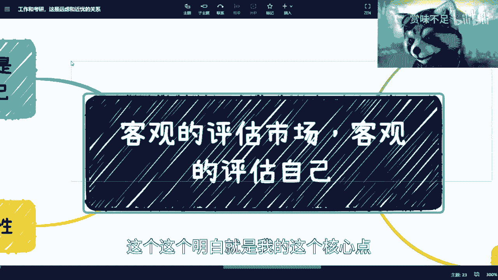
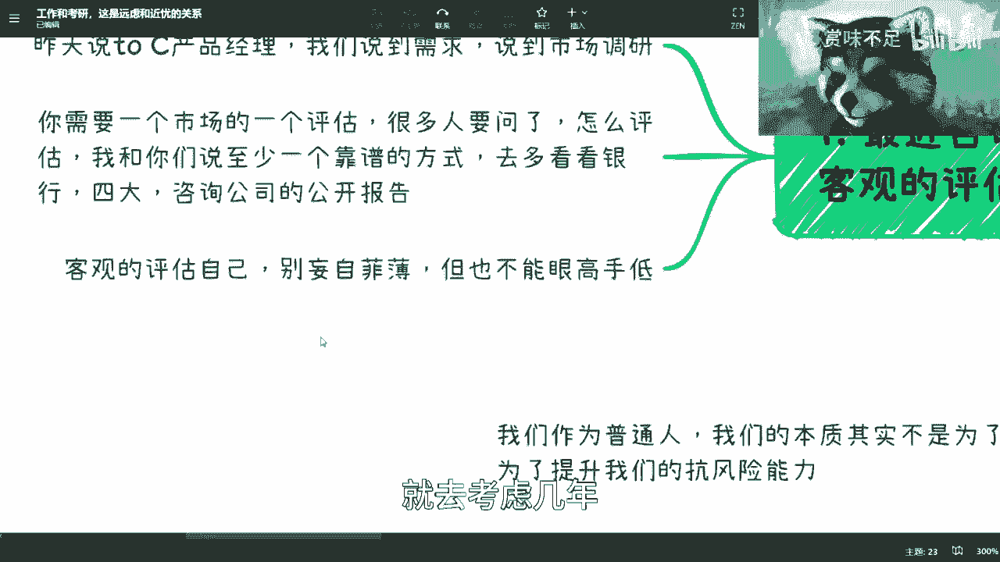

# 总结补充章--客观的评估市场-客观的评估自己-然后做选择---P1---赏味不足---BV1r84y

在本节课中，我们将一起学习如何客观地评估外部市场环境与自身条件，并基于此做出关于职业发展（如工作、考研）的长期战略选择。核心在于建立清晰的自我认知和战略思维，而非纠结于短期波动。

## 核心原则：客观评估市场与自我

上一节我们探讨了职业选择中的常见困惑，本节中我们来看看决策的基础——客观评估。

第一个核心点是必须客观地评估市场，并客观地评估自己。相对而言，客观地评估自己比客观地评估市场更为重要。

第二个需要再次强调的点是关于考研与工作的选择。

其核心很简单。左上角的标题是“工作与考研，远虑与近忧”。核心在于，如果你认为自己是一个乐于折腾、敢于从零开始的人，那么这两年适合你去折腾。无需过分在意手中现有的牌或资源。你可以从 **0 到 1** 开始尝试。等到几年后，当明确的红利期或发展周期来临时，再去实现从 **1 到 100** 的跨越。

如果你觉得自己折腾不了，那就不要折腾。你可以选择考研、考公或其他路径，并坚持下去。不必过度担心失业或被裁员等问题。整体方向很简单：要么选择一条路走到黑，即使中途换工作也坚持在这个方向上；要么选择一份工作作为基本收入保障，同时将主要精力用于折腾副业或创业，让未来的收入大头来源于此。

你需要在两者中做出选择。在当下环境中，无需过度纠结所谓的“热门专业”或“方向”，其意义并不大。当前的影响是全局性的，并非只针对互联网或土木等特定行业。

有些伙伴可能已经明白，我的核心观点在于，无论如何，你必须拥有一技之长。并且，这一技之长需要你看到其背后的**商业模式核心**，而非仅仅看到表面现象。

## 如何客观评估市场？🔍

上一节我们明确了评估的重要性，本节中我们来看看具体如何评估市场。

首先，以产品经理为例（感谢大家的指正，昨天提到的“to c产品经理”表述不严谨）。无论是做需求分析还是市场调研，你都需要进行客观评估。

一个非常可靠的方法是，多去查阅各大银行、咨询公司以及“四大”会计师事务所发布的公开报告。这些报告的数据，无论外界如何质疑其真实性，其可靠程度远高于你在B站或其他小平台上获取的信息，也比你花费数万元从某些不靠谱渠道购买的数据要可靠。这是第一点。

第二点是，任何行业都有这类年度或季度报告，只是你平时没有养成查阅的习惯。了解整个市场非常简单，就是阅读这些报告。

例如，你想了解就业市场，可以调取前三年的应届生就业报告、GDP数据、行业投资总额、公司亏损情况等。这些都有公开报告，虽然可能是脱敏数据，但你一定要去看。我认为没有比这更靠谱的方式了。线下找人咨询当然可以，但要找到对你有价值的人，需要量变引起质变，这并非每个人都能做到。

## 如何客观评估自己？🤔

评估了外部环境后，更关键的一步是向内看，客观地评估自己。

不要妄自菲薄，但眼高手低的情况也很常见。你需要客观评价自己，不要因为当前行情不好，就过度担忧某个专业能否就业等问题。我回答问题时，总是强调“你能不能做成，取决于你自己”。学历重不重要也是如此。即使这两三年稳定，那两三年后呢？你就不活了吗？我希望大家能培养一种思维方式，即考虑未来几年，而不仅仅是眼前。

为什么我倾向于建议大家在有一份主业保障基本收入的同时，去尝试“折腾”呢？本质上，是因为我们未来的抗风险能力普遍较差（家里有矿的除外）。我们做很多事情，制定Plan A, Plan B, Plan C，本质上不全是为了赚钱（能赚钱当然是你厉害），更是为了提升我们的**抗风险能力**。

当下最难的有两类人：一是当前时间点前后一两年的应届生；二是上有老下有小的打工者或创业者。因为大多数人的工作模式是线性的，一份工作失业了再找下一份。但你是否想过，如果失业后长时间找不到工作怎么办？总不能临时再去开滴滴或摆摊，那时就来不及了。人活在世上，总有不可预测的风云，因此必须建立抗风险能力。随着年龄增长，你的抗风险能力需要更强，因为你不再是一个人，还有家庭和责任。

## 自我评估的四个维度 📝

理解了抗风险的重要性后，我们可以从以下几个维度进行更细致的自我评估。

以下是进行自我评估时需要关注的四个关键分支：

1.  **思维模式**
    *   **跟随主流型**：如果容易相信他人，跟随大部队意见（例如，大家都说某个项目赚钱，你也认为能赚钱），那么你可能更适合稳定打工。
    *   **质疑验证型**：如果习惯质疑并亲自验证，但关键是要有**强大的行动力**，不能只停留在嘴上。这类人适合去折腾。

2.  **性格与改变意愿**
    *   性格内向或外向并非绝对重要，这只是一种行为方式。重要的是不要自我设限。你需要评估的是自己**能否以及是否有决心改变**不满意的现状，而不是简单地给自己贴标签。

3.  **发展策略**
    *   **猥琐发育**：有一份稳定主业保证收入，业余时间尝试其他事情，但注意控制投入（时间、资金），避免亏损。
    *   **全力折腾**：暂时不找工作，设定一个期限（如一年）全身心投入尝试，失败后再考虑工作。
    *   **求稳发育**：如果自认不能折腾，就直接找工作、考公等，一份不行再换下一份。这条路相对稳定，但也并非绝对稳妥。

4.  **商业思维与脸皮**
    *   商业思维很重要，但核心判断标准之一是看你**脸皮够不够厚**。在商业实战和沟通中，仅有思维不够，还需要执行和推进的能力。

最终，选择取决于你想要什么。不要看别人要什么，要看自己。

*   如果你追求**高抗风险性**，那么在做任何事时都应倾向于轻资产模式，不投入过多时间和资金。
*   如果你就是为了**赚钱**，且自信有能力、也能承受“以小博大”带来的风险，那就可以选择更具冒险性的路径。

没有放之四海而皆准的“万金油”方法，需要每个人自行评估。

## 长期视角与战略定力 ⏳

完成了客观评估，我们最后要建立一个至关重要的观念：用长期视角看待问题。

关于考研与工作的焦虑，在我看来没有必要。请记住一点：把所有事情的时间线拉长。你当下非常看重的学历，如果把时间线拉到毕业后5年、10年，除非是顶级学历，否则对你而言，它的价值会大大降低。你当下花费大量时间和精力去追求的东西，在长周期看可能意义有限。除非它能带来质变（例如从普通本科进入世界顶尖藤校），否则顺其自然即可。努力了，结果如何就接受，不要过度纠结。

不仅考研和工作，当下纠结的任何事情（如恋爱、买房），只要把时间线拉长，意义都会减弱。我们希望所做的每件事都能对个人形成**积累**，而不是东一榔头西一棒子。否则，5年、10年后，你和应届生相比，除了零散的工作经验，并无核心优势，缺乏传承性和核心竞争力，最终容易被淘汰。

因此，当下很多事情，在自身努力范围内顺其自然即可，不必强求。只要时间线足够长，当下的困扰大多不是问题。关键在于，一开始就要想清楚自己的性格评估和发展方向。过程中可以微调，但**大战略要对**。

**战术上的勤奋，无法掩盖战略上的错误**。以我为例，我的大战略是走政府、企业咨询与技术服务的路。战术上，今天懒散、明天勤奋、后天与某个客户闹翻，这些都没关系，因为只是战术问题。但大战略必须保持一贯。战略若频繁变动，尤其是在看不清局势时变动，伤害很大。

与其花大量时间、金钱（比如花费数千数万元参加无谓的培训）去纠结，不如静下心来，花一两周或一个月时间，认真总结自己活到现在的经验、优势和特点。每个人都有自己的特点，不可能一无所有。总结之后，再结合对市场大方向的了解，去思考自己到底适合哪个方向。这就好像，如果你从未听说过“咨询”或“航天员”这类职业，你根本不会将其纳入考虑范围。所以，前期广泛的了解也很重要。

这也是为什么我回答问题时，并不特别关心具体方向或专业。因为我看到身边无论是天才、普通人还是辍学打工者，最终依靠的都是自己的**专业知识**和**一技之长**，而非仅仅依靠一张文凭或某个节点的光环。

## 总结

本节课中我们一起学习了如何做出明智的职业与人生选择。

1.  **核心基础**：必须**客观评估市场**与**客观评估自己**，后者更为关键。
2.  **评估方法**：通过阅读权威机构的**公开报告**来了解市场；通过分析**思维模式、性格、发展策略、商业思维**四个维度来评估自己。
3.  **决策逻辑**：在“稳定主业+副业折腾”与“一条路走到黑”之间做出符合自身特质的战略选择，核心目的是提升**抗风险能力**。
4.  **关键心态**：建立**长期视角**，拉长5-10年的时间线来看待当下选择，减少无谓焦虑。
5.  **行动准则**：确保**大战略正确**并保持定力，允许战术上的灵活调整。将精力用于自我总结和持续积累**一技之长**，而非纠结于短期标签或盲目跟随。

最终，你的道路取决于清晰的自我认知和坚定的战略执行。