# 总结补充章——客观的评估市场，客观的评估自己，然后做选择 - P1 - 赏味不足 - BV1r84y1g7gs

好啊大家好啊，我今天哎呀。

这两天事情太多了，最近呢就聊了一下，然后我我几个朋友呢，从就是就是他们就在杭州啊。

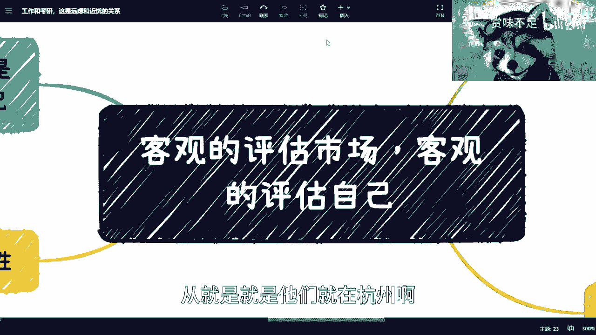

在其他地方也被动辞职啊，被动辞职啊，当然了，整体还好吧，我觉得然后我今天中午也去找了一位嗯前辈吧，就是年因为年纪也比较大了，然后就聊了一下，就是这个他对未来的一些看法和一些想法。

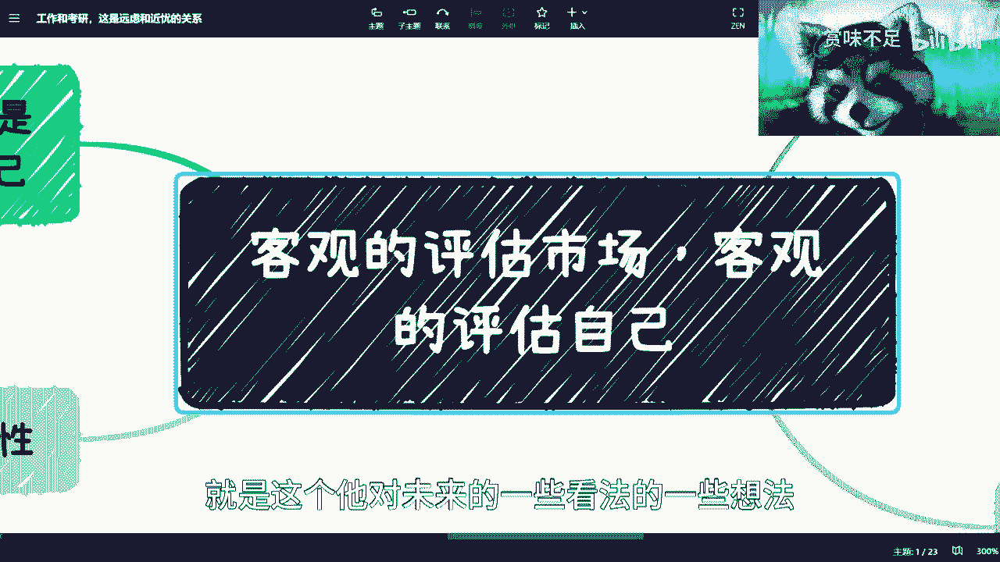

反正我也一，我也是要到处各处验证嘛。

给出验证就是说很多的一些方向啊，包括一些想法，对不对嘛，然后最近在跟就是大家的这个沟通当中啊，我觉得还是那个问题，就是说我还是想想单独再出个简单视频好吧，大家再看一下，就是说我这里面你们看啊。

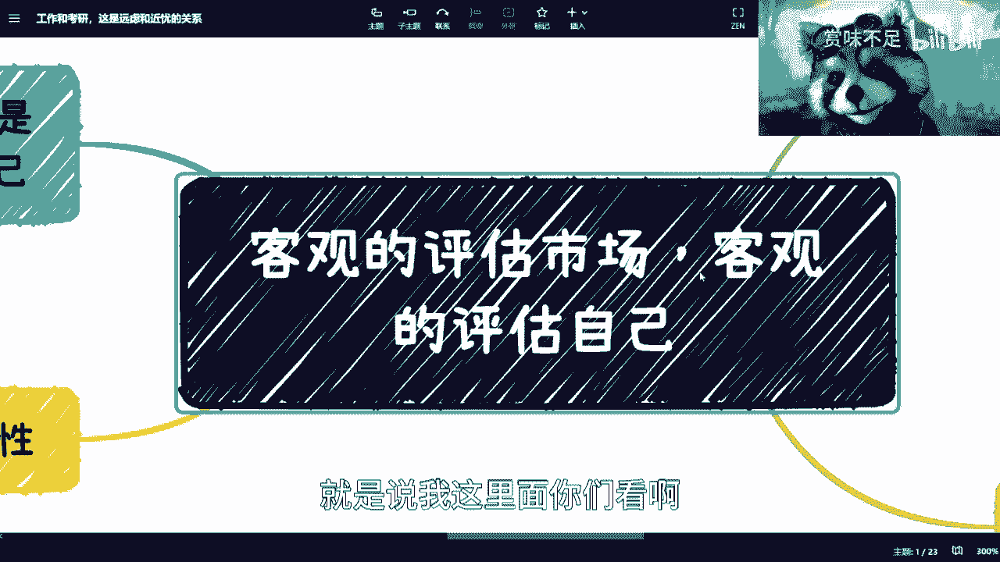

就是第一个就是说核心，就是我觉得得要客观的评估市场，客观的评估自己，我觉得相对来讲啊。

客观的评估自己，比客观的评估市场还要来得重要，你知道吗，这是第一个。

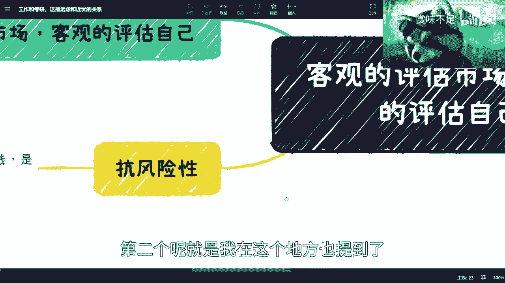

第二个呢就是我在这个地方也提到了，就是包括考研跟工作的这个事情，我可能在想再提一下好吧。

再提一下，反正呢我觉得核心是什么呢，核心就是很简单，就是你看啊，我这边左上左上角这个标题，叫做工作与考研对吧，远虑与近忧。

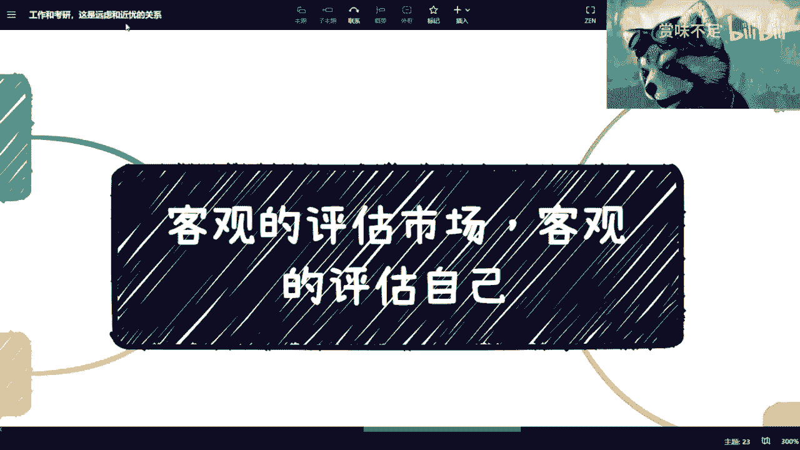

对不对，就我跟你们讲核心是什么呢，就是你要觉得你是一个折腾的人，那你就去折腾，你知道吗，就是这两年适合你折腾啊，就你不用管你手上有没有牌，有没有什么资源，这不重要，你所谓折腾就是从0~1的。

对你就去折腾，然后呢等到几年后，如果就是有红利期，我可以明确告诉大家，有红利期，肯定是有红利期的，那肯定是有发展周期的，那么你们再去做1~100对吧，但凡你们觉得折腾不了的，那你们就别折腾，那就做啊。

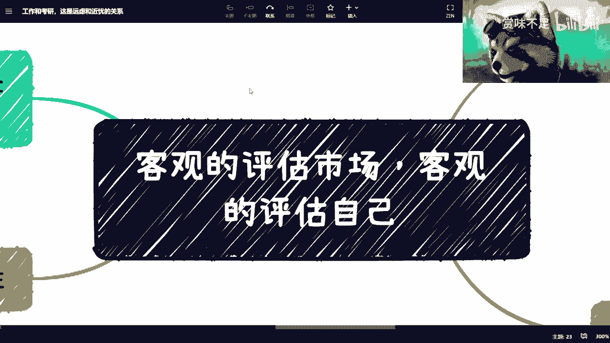

你考研也好，考公也好，怎么样也好，你就做，你也别去担心，说啊，我这个要比如说要这么这么做，做了一段时间说失业了，或者或者跟我朋友一样被动辞职了，怎么办，你别去想了，就是其实整个方向很简单。

你要么就是一条路往后走，就走到走到黑对吧，就这条路当中你辞职也好，被动辞职也好，你就不停的换工作，你就你就停着一条路走走到黑，你要么就是选择一条路，是这条路怎么样都无所谓对吧，你就当有个工作。

然后剩下的你是去折腾的对吧，就是说你未来的收入大头是在折腾上面的，那你无非就是二选一，你知道吗，就是别去，不真的在当下这个情况，你们不用太去，真的不用太去关心，说所谓的专业和所谓的方向。

其实没有什么太大的意义啊。

没有什么太大意义，就这个事情影响面是整个面上面的，又不是说只有互联网或者只有土木。

或者只有什么都没有区别的啊，当然我觉得就是说有些小伙伴啊，就是还是能够这个，因为我很多话也没法很明着说嘛。

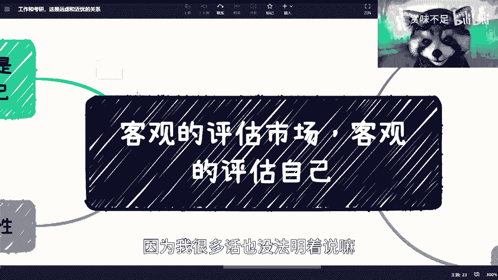

对吧，这个这个有些小伙伴我觉得还是能够这个的。

这个这么明白，就是说我的这个核心点到核心点就在于说，无论怎么样，反正你有一技之长，而且这个一技之长呢，是要去看到它的商业模式的核心，而不是你比如说像我妈前两天对吧，跟我说啊，我看到人家都在做直播。

我要去做，我说你要去做，你要制作能赚钱，中国14亿人都赚钱了，那么谁亏钱啊对吧，或者说我说那那那那谁来买这个单，你整个经济经就是整个经济流通金融，左边跟右边是要平衡的，我说你这么出招的话，那怎么滴啊啊。

中国14亿人全部去割割海外是吧，哈哈你这么不科学啊，我说是不是你，我说你只看到人家做直播，你根本就不知道人家背后有多少的，这个这个供应链管理，包括品控，包括包括人家的这个这个这个叫什么商业。

企业的这种合作，包括嗯企业啊，企业啊，子公司啊对吧，包括财务啊等等等，我说你这个都不知道哦，你就看到人家赚钱就要赚钱了是吧，我跟你们讲，我妈这种就属于什么对市场毫无评估啊。

对对自己反正也毫无评估都没评估啊。

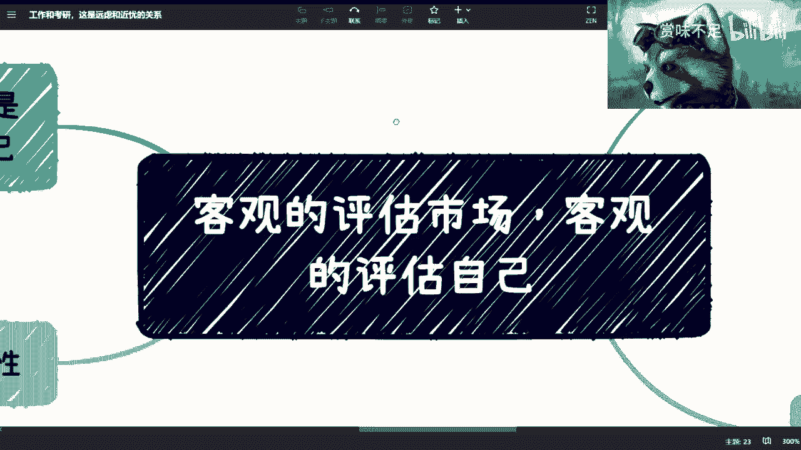

那么首先来说啊，我们这两天说到那个产品经理对吧，我说to c的啊，这个感谢大家对我的鞭策啊，我觉得是我不严谨啊，昨天说哈哈TC产品经理啊，抱歉啊，我这个昨天太激动了是吧，昨天没午饭没吃，心情不好对吧。

我说我们说到需求，说到市场调研，就是你们要做的任何事情的时候，你们也要去做对吧，然后呢我跟你说啊，很多人在问他说我怎么去做这个评估对吧，我告诉你们很靠谱的一个方法啊，你们多去看看银行，各银行各咨询公司。

包括四大的公开的报告，你明白吧，就是你不要再问我怎么搜了啊，我还要教你们怎么搜索吗，难道啊我跟你们说，你们去看一下，哎呀我突然忘了，对对对对对，我答应你们，这两天要把这个图的文件都发到每一个。

每一个视频下面，我靠你们稍等啊，我我我在我的这个task list上面记一下哈，把脑图分享到B站，哎呦我去真的，我跟你们讲这些脑子是不行对吧，就是我跟你们说，这种公开报告很多很多哦，很沟通都是PDF的。

那么我跟你们讲，这种公司公开报告有什么好处呢，第一就是说不管怎么样啊，银行咨询公司或其他像四大这么给出来的，报告的数据，他只要敢给对吧，那不管说这个数据公开层面，有很多人质疑说啊，这个数据有可能造假。

有可能怎么样对吧，不管怎么样，这种公开数据，总比你在任何这种B站或者其他的小小平台，各个平台上面所拿到的数据靠谱吧对吧，总比你们花了两三万，别人阿猫阿狗给了你们个数据靠谱吧对吧，首先是第一点。

第二点是任何的行业，我跟你们说都会有这种报告的，比如说年度报告，季度报告都有的，你们都可以去看，只是你们平时不看，没这个习惯，但是我跟你们说，怎么去看整个市场太简单了，你就看报告，所有报告都有对吧。

你比如说你说我想看市场，市场怎么看呢，那很简单啊，你把前年前3年的，比如说整个应届生啊，就业啊对吧，金融的这个机呃，我最近gt说多了说多了对吧，那个GDP啊对吧，各个各个各个东西。

你把它全部调出来都有报告的对吧，包括就是说这个投资相关的，每一年到底投资了多少啊对吧，或者各个公司亏损多少啊，都有的，只不过就是说他给出来的呢，可能会会是一些就脱敏的数据，但是你们一定要去看。

而且我不认为啊，就是我从来不认为说有比这种更靠谱的方式，因为你哪怕线下去找人找你，你要达到真正找到对你有价值的人，你可能一定就像我之前说过，你一定要有个量变到质变。

但这个事情的话也的确不是每个人都能做到的，对吧好，然后呢，还有一点呢就是你得客观的评估自己对吧，就是说你不要妄自菲薄，我跟你们说，我最近就真的聊下来，我觉得就是说妄自菲薄当然也很多啊。

这么眼高手低的也很多，你知道吗，就是就是我跟你们讲，我还是良心，就是我我还是这个这个不够刚，你知道吗，就我真的也聊了蛮多的人啊，就是眼高手低，但是呢我也不好意思打击人家对吧，我说你们眼高手低是吧。

但是呢就是说客观还是那句话，你客观的去评价，你不要就觉得比如说哎呀现在长行情不好啊，现在选什么专业啊，选这个能不能就业对吧，怎么样怎么样没，其实你看我回答你们，我我从来都是跟你们说，你们能不能搞。

是看你们自己的，为什么，包括我跟你们说，学历重不重要，也是一样的，就是你就算这3年稳定，或者这两年稳定又怎么样呢，而你两年后3年后不活了吗，是还是这么说是吧，我就不明白了，你真的是。

你就不能稍微就是就是就是我，我我是很想为你们就是往后再去考虑几年对吧，或者说我希望大家在学习这个思维方式的时候，就去考虑几年，而不是说只看着眼前的是吧。

其实没有意义的啊，然后呢我觉得嗯这个就是为什么我们说啊。

我们刚刚说啊，就是这个串行的方式，就是你不停的找工作对吧，要么就是说你你这个工作呢，你就不要当太当他收回事，反正就是个收入。

剩下的你你就想办法出去折腾对吧，为什么我会比较偏向于后者呢，是因为本质上来讲。

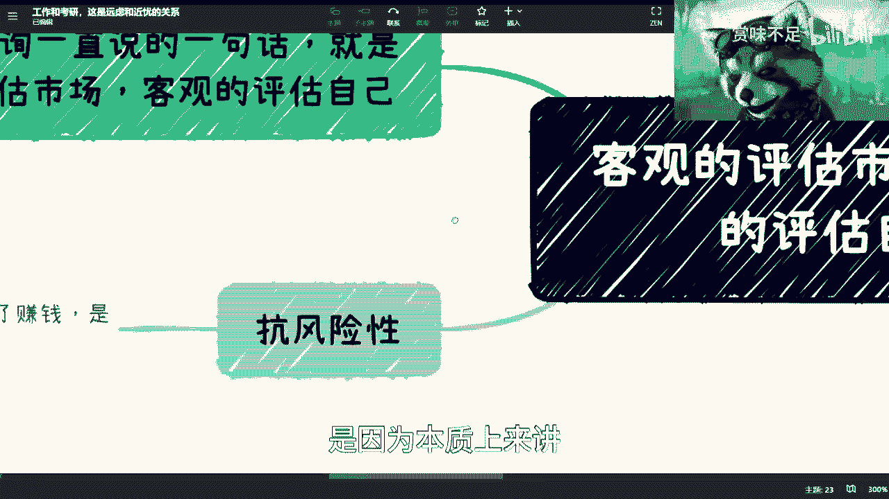

我觉得往后，我们其实是整个抗风险能力是很差的，当然你要家里有矿，我另外一回事，就像之前还有人跟我说过，我家里五套房是吧，那那我说那算了，当我没没说哈哈是吧，那我说你作为普通人对吧。

我说本质我们去做很多东西，我跟你们讲就是plan a plan b plan c对吧，C a b c d f g，我说本质不是我们要去为了赚钱，真不是为了赚钱，就是你要能赚钱，我跟你们说，你是你牛逼啊。

你牛逼，但是很多时候不真不是为了赚钱，只是为了去提抗，提升我们抗风险能力，因为我最近跟很多人说，我说当下这个情况最难的有两类人，你们知道吗，第一类人就是整个这个时间点的前后。

比如说一呃112年或者两三年的应届生对吧，第二种最难的是什么，就是上有老下有小的那种，就是说打工人或者上有老下有小的那种，这个创业者就是最难的，为什么，因为大部分的人就像我们刚刚说的。

他是一个创新的工作方式对吧，就是说我就是一间一个东西，我可能失业了，我就再去找工作，但是我就问你们吧，你们有没有想过，如果失业了，这个找不到工作怎么办对吧，那你总不能说啊，我找不到工作。

我到时候再去卖卖那个这么跑滴滴对吧，再去摆摊所有事情，你到时候做就来不及了，你知道吗啊所以我才说抗风险性嘛，因为人活在世界上面，都有这不可预测风云的对吧，你说你说谁知道明天会发生什么对吧。

谁知道你别人我不说了，你说我对吧，你谁谁知道我能不能看到明天太阳是吧，哈哈啊，那我跟你们讲，很多时候都是这样子的。

就是你得有抗风险性对吧，你你你包括就是说我不说辞职吧，包括就是说你万一哪天跟我以前，跟我上上周一样的交流来对吧。

你说动不了啊，在家啊，然后呢，你说我这个这个可能急着急着下个月有房，房租对吧，或者房贷或者怎么样的，然后呢就又没有什么存款。

那我就问你们，你这抗风险性怎么搞对吧，而且随着你年龄的增长，你抗风险性一定要更高。

因为你不单单是你一个人啊对吧，你还有你的家庭。

你还有你的上面的父母对吧，可能还有爷爷奶奶，外公外婆，是不是就这个才是个那个问题。

好那好，那我跟你们说，你们来看看，我给你们列了这个分支啊，这分支我觉得还蛮重要的，第一点呢就是思维模式啊，你如果觉得你是属于别人一看就信的对吧，跟随大大部队主流的啊，我不管你信不信。

反正你是跟随大部队主流的，比如大部分大部队说啊，这个人是个，你也觉得他对吧，大部队说好，这个队能赚钱哈，你也觉得能赚钱对吧，那那你如果觉得是这类人呢，我跟你说啊，你啊反正就是还是还是打打工啊，打打工啊。

第二呢你觉得你是会质疑的对吧，什么都会去亲自看看，去验证的，但是呢千万不要停留在嘴上，你要去行动的，行动力要强啊，你明白行动力要强，那么我觉得你是可以折腾的对吧，你得自我评估啊对吧，第二呢就是性格对吧。

你说内向外向，我跟你们说啊，我觉得性格内向外向，这件事情并并不是特别重要，因为性格本身就是它只是一种方式嘛，但是我跟你们说，你们不要PUA自己，就是我发现啊，有很多人是这样子的，就是他会跟我聊。

就所有的人跟我聊，不是B站上，就外面所有的人跟我聊时候都这样子的，就是那个陈老师，我觉得我这个人啊怎么样怎么样，我说我说你们做事情能不能别先把自己框死，你知道吧，就是你们觉得怎么样怎么样怎么样。

但这个事情能不能改，就是你们要去评估的事能不能改变，你知道吗，别说哦，我比如说我就是一个跟随大部队的，然后每天在那边念100遍好，我就是跟随大部队的对吧，你要去评估的是你能不能改变。

你有没有这个决心对吧，你如果来说觉得你没有决心，OK那那那那那那那就这样吧，就这样吧，然后呢最主要是你这个发育对吧，你比如说你可以选择猥琐发育对吧，那猥琐发育就是我说的，就是说你现在这个这个叫什么。

就是有一份主业对吧，保证你稳定收入的，剩下的你在旁边旁边空下来，时间多搞搞对吧，搞这个搞那个都可以，但不要把不要不要就是把自己的钱亏进去，对不对，第二种呢就是不猥琐的对吧，不猥琐就是索性对吧。

你觉得我我也不想找工作，我就出来浪对吧，给自己，比如说你设定个deadline，你说我我呃设定一年对吧，我这一年里面折腾折腾不了，我再去工作，那也行，那也行，那第三种就是你索性不发育不发育。

就像就像我说的，我说你们你们如果觉得自己不能折腾，那你就直接找工作对吧，找了不行，你就再找下一份对啊，考公啊对吧，或者怎么样啊，反正你们就求我妈也别选，选择这么多嘛对吧，你说稳不稳，我告诉你们。

反正也不稳，但相对稳吧，相对稳，最后呢商业思维对吧，我之前已经有一期讲过了，你们可以再去看啊，但是我觉得核心你们怎么判断呢，你就看你脸皮厚不厚啊，我就告诉你就看你脸皮厚不厚。

因为商业在整个商业的战场过程当中，沟通过程当中，不是说仅仅你有思维就够的，你还需要看你脸皮厚不厚啊，你要自己想清楚，我跟你说好吧，然后呢我跟你说，就是最终呢就看你自己要什么，因为有很多人就会问这种问题。

就是说啊你看啊我做这个东西做的很牛逼，但是有些人说我我摆摊对吧，我我一个月赚多少钱对吧，那有些人说呢，我这个这给出去折腾了对吧，我做了多少事情对吧，有些人呢就说哎你看啊，我在这公司里面一直往上走对吧。

就也很稳定的啊，我赚了多少钱，但是呢其实本质上是什么呢，看你自己要什么。

你你不要看别人要什么，对不对，你看你自己要什么对吧，那你你看往这里看啊。

你说我想要抗风险，放抗风险，请各哈哈抗风险风险性高一点对吧。

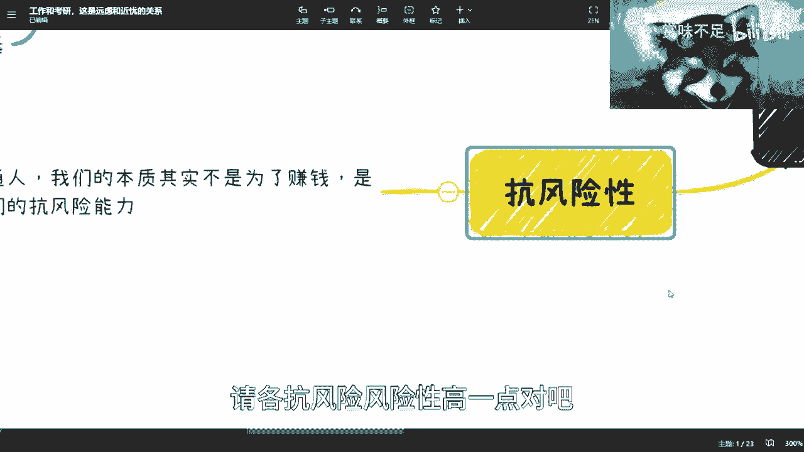

那那也行对吧。

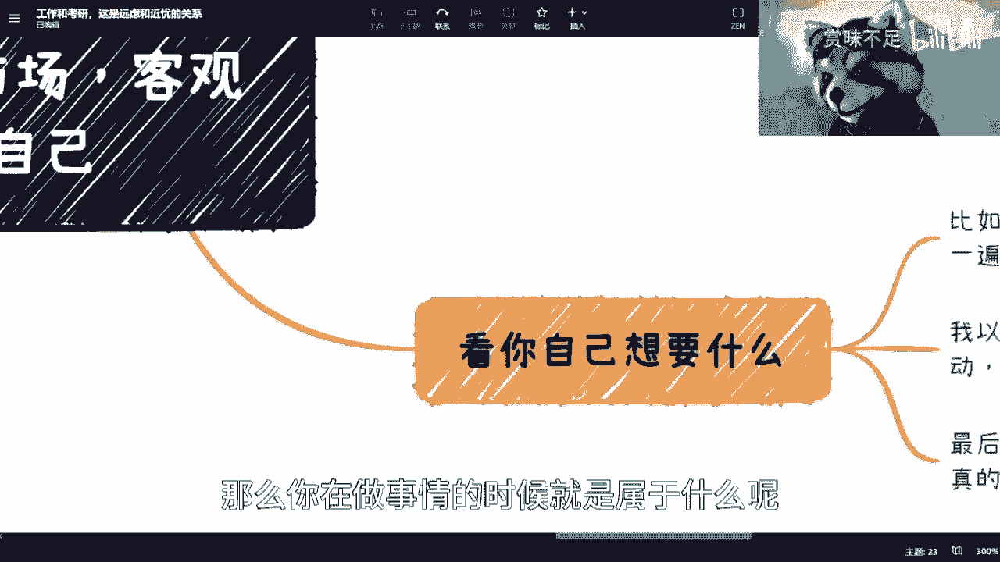

那么你在做事情的时候就是属于什么呢，就是所有的这个别的道路去走的时候，全部走轻资产，自己不要投入太多时间，也不要投入太多的这个金资金对吧，那么你再去做，那你说我要是不是为了抗风险性，我就是为了赚钱的啊。

我就是觉得我能力蛮强的对吧，我我也是我也承受得了，就是以小博大之后所所所出现的风险，那也没问题啊，那你就以小博大嘛对吧，我觉得就是说这个事儿得要看你们自己，每个人要去评估的，他哪里有一个万金油的方法好。

写在那边好，就这么方法对吧，大家就这么走，唉这个不存在的嘛，你说是吧啊啊那么我说啊，你比如说我对吧，我刚刚跟你们说，我不是去写那个task了吗对吧，你看我每周其实都会有我的任务列表对吧。

然后呢我每天都会去review1遍，看看我任务列表里面还有哪些没有做对吧，然后我每周会去订下周的任务列表对吧，这个东西还是那句话嘛，又没人催我对吧啊也没也没有人管我对吧，有合作方更不会来管我了是吧。

那那我也得做啊对吧，为什么，因为因为我得生存啊，我得去赚钱啊，是不是啊，那我觉得真实一点嘛，对吧，这是第一个，第二个呢就是我以前其实也有很多人跟我说，找不到人沟通对吧，我跟你们讲，我这么做的。

我就是到处找咖啡馆，我跟你们说啊，就真的就到到处找我，我我是抬头一看望，抬头望天，两眼一抹黑，什么都不知道啊，然后我就去找咖啡馆，然后我就跟跟人家聊聊了嘛，我意思就是说我要组织活动啊。

你们给我个场地对吧，然后呢我就到网上去各个地方去散散步对吧，然后做做做就就一直做嘛，就每周都坚持做嘛，那我能怎么办呢对吧，就像就像你们问我的，我是一个普通人，我能怎么办，我也想问问你们，你知道吗。

我也想问所有人对吧，我能怎么办呢，那没办法是吧，然后最后呢我还想再说一下，就考研跟工作这个事儿，你知道吗，这个事儿呢我觉得大家的确都很焦虑，但是在我看来这个事没有什么好焦虑的，为什么呢。

因为你们就记住一点，就是所有的事情啊，就是你一定要把这个时间线时间线放长，你知道吗，什么叫时间线放长，老时间线放长，什么叫时间线放长呢，就是你现在比如说看重你的学历对吧，没问题的。

但是你一旦把你的时间放长，就是我还是我那句话，你又不是活5年就不活了，你说是吧，你但凡把你毕业后10年的这个时间线，我不说长10年在时间线放进来，你如果不是一个顶级的学历，对你来讲，这个东西就是张废纸。

没有任何意义的，你知道吗，就是就是你们明白我什么意思吗，就是说你当下花大精力大时间，你知道吗，在这个上面花费了大量的这种这种东西，在可能5年后10年后，他就是张纸，但是你回过头你一定要把时间线放长来来。

从就是第三方的一个客观的角度去看待它，也就是说当他5年后，10年后就是像废纸的时候，你当下没有意义去关注这么多时间，精力在这上面，顺其自然就那样了对吧，你努力了，你比如就这样了，你不要再去想说。

唉我可能这个不行或者那个不行，我一定要达到那个level对吧，没有意义，你除非跟我说，你能达到质变对吧，什么叫质变，就比如说你现在是一个一本，你跟我说你花两年去藤校可以啊，没问题去呗对吧。

但是你们现在跟我说的是什么，都是我本科本科去读了个研对吧，然后选了个数对吧，那你读了个研，选了个数，在我看来，其实都是5年后10年后没有没有用的东西，你明白吗啊，那当然这个也看你做事情对吧。

你说你说我如果想去读APHD，然后留校做老师的，那没毛病对吧，你要是说我想去考公的，那也没毛病，但是我觉得大部分人不是往这方面走啊，对吧啊，大部分人觉得我找工作很重要啊，不好意思。

我可以告诉你们5年后10年后找工作没卵用啊，我就明确告诉你们没卵用啊，这第一点第二点是什么呢，就是就是你当下的任何事情，任何纠结的事情啊，就是我跟你们讲什么意思呢，就是因为最近聊的时候呢。

也不仅仅只是聊到工作跟那个考研嘛对吧，还有呢会纠结，就说当下，比如说谈恋爱啊，买房子啊，就各种各样的事情，我跟你们说啊，纠结任何的事情，你只要把时间线放长都没有意义，你知道吗，因为所有的事情啊。

我就是你在做的时候，我们是希望说你做的这些事情呢，对你个人是有积累的，而不是东打一枪，西打一枪，因为你就这么想嘛，你东打一枪，西打一枪，5年后10年后你跟应届生，请问有什么区别。

区别就在于你有很多工作经验，但是你这些工作经验对你来讲，你是就是他是没有传承性的，你都是东打一枪，西打一枪，那这个东西有什么用呢对吧，那你最后你说你只能被优化掉，没有办法的，因为你没有没有核心竞争力。

你没有价值对吧，所以说呢就是你会发现你当下就是很多事情呢，你就顺其自然哦，你就就是说就是在自己的努力范围内，能做就做，不能做，咱不强求，你知道吗，因为你你只要把时间线拉的足够长，拉到5年，拉到10年。

当下所有事情都不是事儿，那都不是事儿，所以就不用太去想他，我为什么跟你们说，就是说你们一开始就想好，就是说你的自己的这个性格评估啊，包括你人啊到底是怎么样的一个发展方向，因为你在当中做微调是可以的。

但是你大战略要对呀对吧，所以就是说我那句话为什么这么说，就是你战略上的错误，而不是战略上的错误哦，就是那个你战术上的勤奋，是没有办法掩盖战略上的错误的，你们一定要明白这句话，你知道吗。

就是说战术上你随便怎么样对吧，就是这个战术好和不好没有关系的对吧，你就拿我现在呃，你就拿拿我来讲对吧，你说我我是专这么现在给这个政府啊，企业做咨询，做技术，技术服务，做培训的对吧，好哥哥。

这个大战略上面我永远是走这条路的，但是但这个战术上面，你说哎有可能今天我懒了对吧，我不做事啊，明天我可能勤奋一下对吧，后天我可能跟这个企业，或者跟这个政政府闹翻了对吧，怎么样，这都没有关系。

因为这只是战术上的错误或正确，但是你大战略上面你得要保持一致，你知道吗，就是你们在做任何事情的时候，战略上面不能老是变啊，因为你战略上面一直变，对你来讲这个很伤。

而且大概率你是看不清楚局势的情况下再去变，你知道吗，所以说我觉得就这个事情，你一定要就是说就是说你与其纠结，那你比如说你与其把时间把金钱，因为我看到还有很多人花了这么几几几，几千块钱。

几万块钱这么这么培训的，你知道吧，我觉得这真没有必要啊，就是你花大精力和大金钱，在这种纠结这种事情上面，你还不如静下心花一周，花两周花一个月对吧，你自己去想去总结你活到现在的一些经验。

活到经活到现在的一些优势，活到现在自己到底有哪些东西，你不能说你什么都没有啊，我跟你讲，每个人都有特点的，不可能什么都没有的，对不对，那你总结出来之后，你要去想，就说唉我到底做做哪个方面，那当然了。

大战略你可能也得稍微了解一下，所以我这才我我才跟你们说嘛，就是说你们一开始就得去看很多东西啊，然后去了解就说大概率啊，就是整个市场上面每一个人大概有哪些方向，或者这么样子，然后你再去做对吧。

这就好像这个，比如说你们从来就没听到过培训和咨询，你们可能从来就没听到过什么什么什么，什么航天员对吧，那你可能在这么想破脑袋也想不出有这个岗位，对不对。

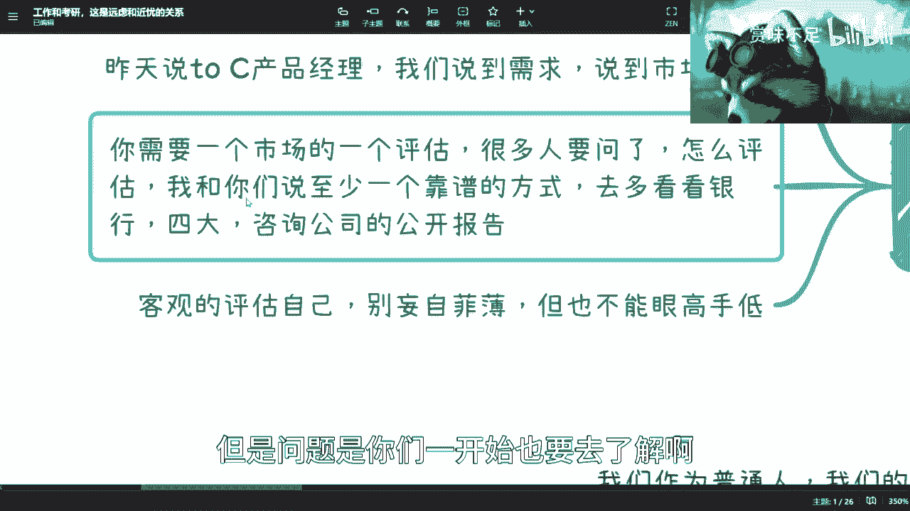

但是问题是你们一开始也要去了解啊，所以我就觉得就是说就是说你们会发现，我真的跟你们回答的时候呢，我我真的是不关心啊，我真的是不关心什么方向啊，专业啊，这样子，因为反正在我身边我看到的对吧。

这个呃呃叫什么，就是这就是天才的对吧，或者说普通的，或者说是这个辍学打工的对吧，怎么样的，反正就是基本上最后还是靠他自己的一些这个，专业知识啊，和一些这个这个一技之长，而不是说拿着一张纸，拿着一个雪莉。

拿着某一个节点的东西到处晃，到处晃没有用。

你知道吗，行就这么着吧，好吧。