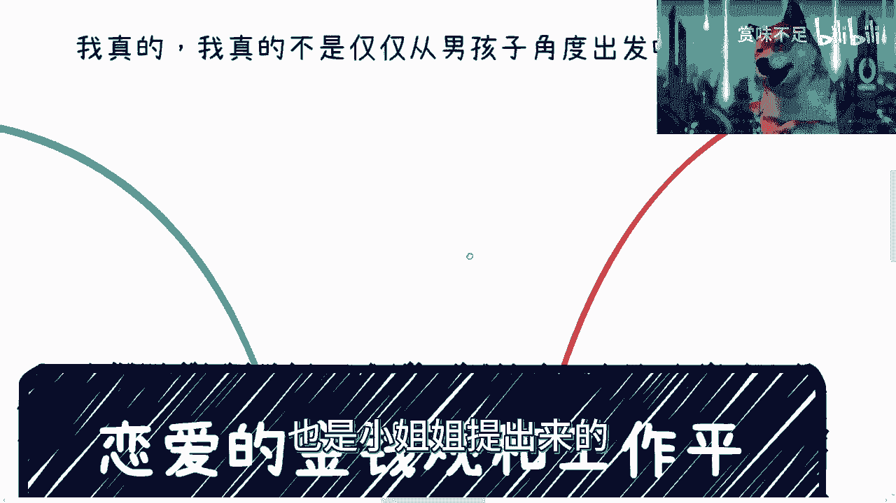
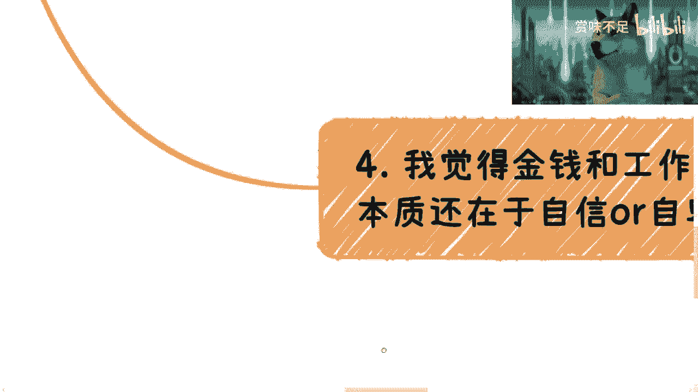

# 恋爱中的金钱观与工作平衡 - 课程01 💰⚖️

在本节课中，我们将探讨恋爱关系中两个至关重要的议题：金钱观与工作平衡。我们将从双方的角度出发，分析如何建立健康的财务观念，并找到工作与生活之间的和谐点。

---

上一节我们介绍了本课程的主题，本节中我们来看看讨论这些议题前必须明确的一个核心前提。

**核心前提**：本次讨论并非仅从单一性别视角出发，而是力求站在恋爱双方的共同立场上进行客观分析。理解彼此的立场是建立共识的第一步。

---

明确了前提后，我们首先聚焦于“金钱观”这一核心议题。金钱观是双方价值观的重要组成部分，直接影响关系的稳定与和谐。

以下是关于恋爱中金钱观的一些关键思考点：

*   **消费习惯**：双方的消费模式是相似还是互补？例如，一方倾向于储蓄，另一方偏好即时享受。
*   **财务目标**：是否有共同的短期或长期财务目标？如旅行、购房或投资计划。
*   **经济责任**：如何分担共同生活的开销？比例是**50/50**、按收入比例，还是有其他约定？
*   **债务情况**：是否了解并接纳彼此现有的债务（如学生贷款、信用卡债务）？
*   **金钱与情感**：是否会将金钱付出（如礼物、约会开销）与情感深度直接挂钩？

---

讨论完金钱观，我们自然过渡到与之紧密相关的另一个话题：工作与生活的平衡。在现代生活中，工作压力常常会渗透到亲密关系中，如何管理这种压力至关重要。

以下是维持工作与恋爱平衡的几个实用建议：

*   **设定界限**：明确工作与私人时间的分界线。例如，约定下班后某段时间为“无手机工作打扰”的专属相处时间。
*   **有效沟通**：主动分享工作中的成就与压力，使用“我感到……”（I feel…）的句式表达感受，而非一味抱怨。
*   **计划优质时间**：提前规划约会或共同活动，确保即使忙碌，也能拥有有意义的共处时光。
*   **互相支持**：理解对方的事业追求，在关键时刻给予鼓励和实际支持。
*   **定期检查**：像开“家庭会议”一样，定期聊聊彼此在平衡工作与关系上的感受，及时调整。

---

本节课中我们一起学习了恋爱关系中金钱观与工作平衡的重要性。我们从双方立场出发，列举了分析金钱观的具体维度，并提供了维护工作与生活平衡的实践方法。建立开放的沟通渠道和对彼此处境的深刻理解，是处理好这两个议题的基础。在接下来的课程中，我们将继续深入探讨关系中的其他关键方面。