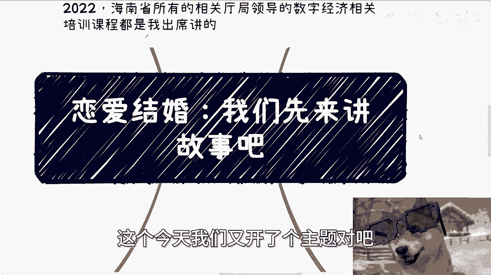
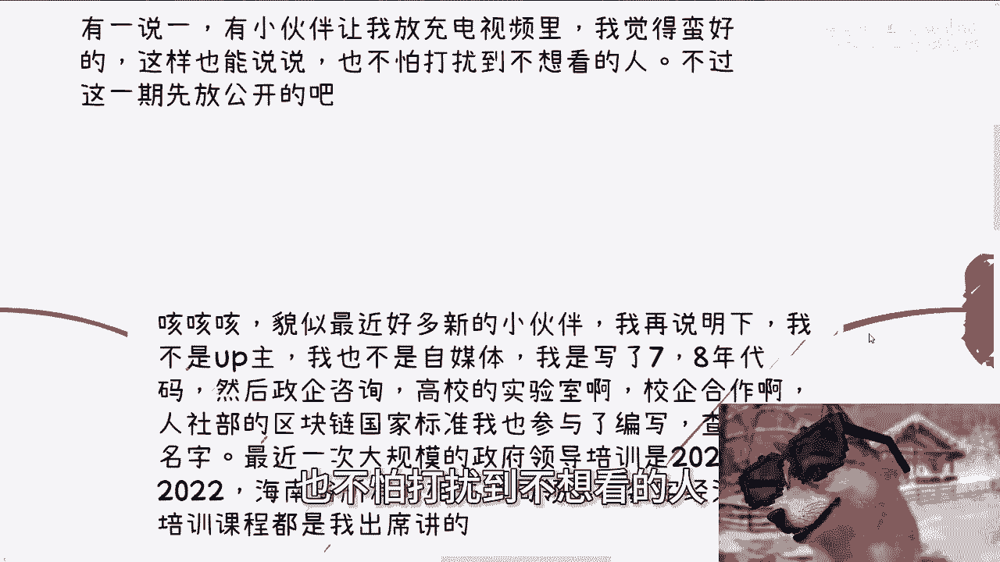
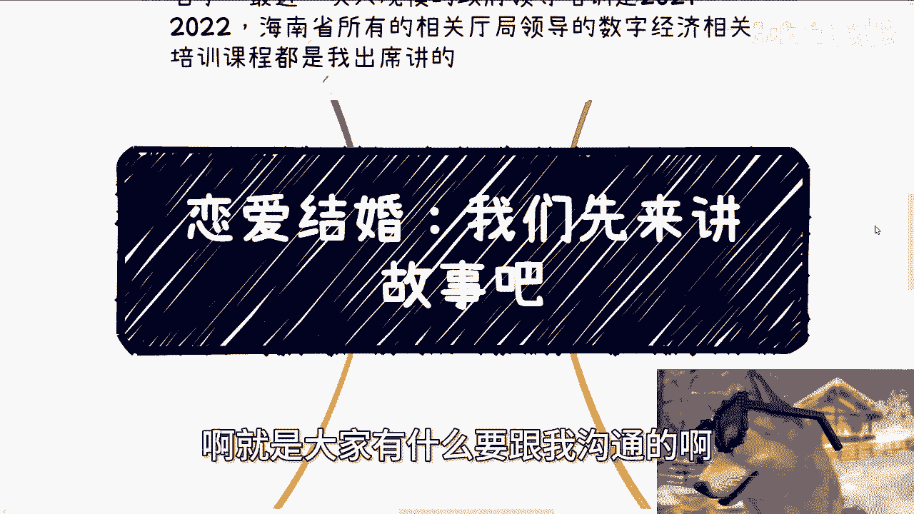
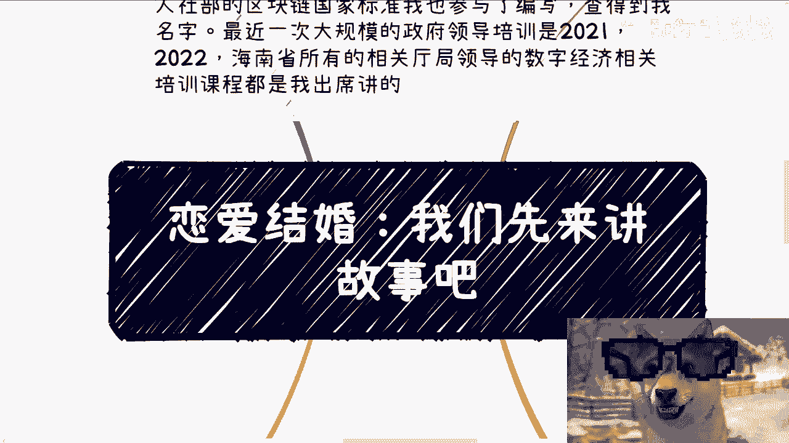
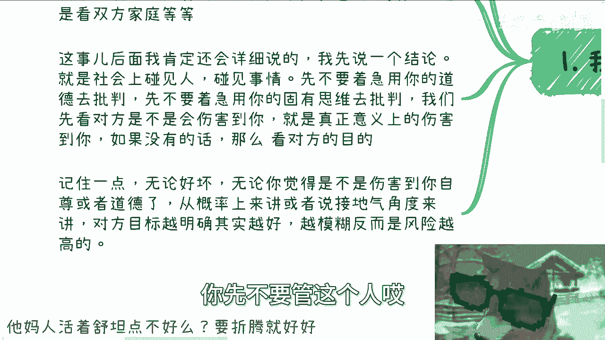
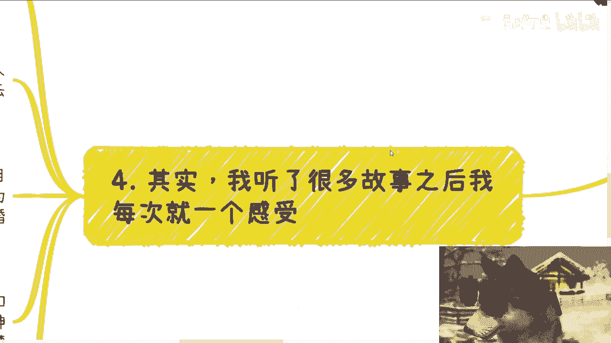

# 恋爱结婚：我们先讲故事开个场 - P1 - 赏味不足 - BV14jtoeiEoS

啊大家好啊，这个今天我们又开了个主题对吧。

呃为什么啊，就因为之前小伙伴呢其实也跟我谈过很多啊，其实私信里面是有很多的，但是我就没怎么说啊，他在那跟我讲说放这个充电视频里面，哎其实我觉得也蛮好的啊，这样呢就是有些东西呢也能说啊。

也不怕呃打扰到不想看的人对吧。

不过这一期呢我觉得先放公开里面啊，嗯我以前其实开过有一个对吧，我说这个人活着不能只有工作，不能只有赚钱对吧，还有这个恋爱对吧，还有结婚，但我觉得要么就是正式一点啊，就是把这个内容都总结下来。

后面要是有任何的相关的这个扩展。

我就都放在这个专辑里面好吧，首先啊我得有一点啊，就貌似最近很多新的小伙伴啊，有关注过来啊，我再说明一下，我不是一个up主啊，我也不是自媒体啊，我就是个纯粹的牛马打工人啊，打了七到8年的工啊。

写了七到8年的代码，然后呢就是开始做了一些政企咨询啊，高校的实验室啊，校企合作啊，产业学院啊对吧，人设人社部的这个区块链国家标准，我也参与了，反正你们标准里面也查的到我的名字啊。

那最后一次大规模给政府领导培训呢，是2021年2022年啊，海南省所有的相关的听取领导里面的，这个数字经济，跟以前那个数字资产相关的啊，培训课程也都是我出席讲的啊，这些就是海南省政府的呃。

对外宣传的网站上也都查得到，好吧啊，反正我想表达什么意思呢，我想表达的两点，第一呢就是说呃所有的相关实践经验我都有啊，失败经验我也都有，第二呢就是啊我我既然不是一个up主，所以我就不会去知道吗。

跪舔客户对吧啊。

就是大家有什么要跟我沟通的啊，咱们就有一有有啥讲啥啊，不要试图用那个道德观，或者用所谓的这个怎么说呢，啊我关注你了，我怎么样了，来绑架我，不好意思啊，我我我我没兴趣啊。

呃那么首先啊我们今天先来讲故事啊，我先讲个大前提啊，就是很多人啊被PUA之后，我们一直说的象牙塔跟楚门的世界，这种束缚呢已经比较多了，但是说白了本质上是思考方式的问题。

但是思考方式并不是只会影响你工作和赚钱的，思考方式是会影响所有的行为对吧，然而呢其实你在商业当中和你去，比如说找一些对象的过程当中啊，本质都是一样的，因为你你你归根结底都是跟人接触嘛，有什么区别呢。

对不对啊，这就比如平时私信我啊，一些感情的小伙伴呢其实也不少啊，只是我不太说，那比如呢有的人问我是不是要看对方资产啊，比如说要要不要看双方的家庭啊，我跟你这么讲啊，这些事后面我肯定再会详细再说的。

我今天就不展开了，我先说一个结论，就是你们在社会上碰到人，碰见事情，你先不要着急，用你的道德观去判批判，先不要着急用你的固有的思维去批判，为什么，因为你一旦用你的，被PUA的这种思维去批判的时候。

你等于已经自我束缚了，就是你一定要我们以前叫什么叫空杯心态对吧，叫叫叫放开，就是你一定要以完全一个空白的一个一个状态，客观的状态去看待一件事情，然后我们再来在里面去判断好，在里面分析啊，你说哪些是对的。

哪些是错的，哪些是传统意义上对，哪些是传统意义上错，对吧，你才能看到更多的东西，你一上来就把他批判，卧槽他妈，我不看了啊，这个这这这种人这种人不行的，那你在干嘛，你等于在拒绝更多的可能性，对不对。

那怪谁呢，对吧，这就好像什么你知道吗，这就好像以貌取人，以表面，我们一直说就说以你以，对吧，你表面在看待别人，对不对，好那么我们再来说啊，就是说啊啊所以说啊我觉得是这样子的，就是我们看对方了。

是不是会伤害到你，以及是不是真正意义上的，比如说肉体上啊对吧，或者说就是就是这种物理上伤害到你，那如果没有的话，那么我们先我们再来看对方的这个目的对吧，那记住一点，就是说无论好坏。

也无论你觉得是不是伤害到你的自尊了，或者道德了，从概率角度来讲啊，你碰到一个人，咱不管赚钱还是谈恋爱对吧，就是说你从接地气角度来讲，从概率角度来讲，只要对方的目标越明确，而且他越不遮掩，其实就是越好的。

你先不要管这个人唉。

好还是不好，对不对，那么越模糊反而风险就是越高的，你就永远记住这一点。

整个社会上都是这个样子的哦，那么举个例子啊，你比如说2024年对吧，你说现在你用我话来讲啊，都他妈2024年了，又不是旧社会，我觉得一切都是可以摊开来讲的，对不对，怎么不能摊开来讲呢，哎我奇了怪了哦。

摊开来讲犯法了吗，没有啊，我们讨论讨论嘛，对不对啊，那么我觉得只要你情我愿，其实都是可以接受的，那当然啊，有些红线你不要去踩嘛，对不对啊，那么你比如说我之前跟一个博士聊发展的时候，我也跟他提到过。

我说你真的碰到一个人，你要上来跟你说，我就是个捞男啊，比如说我跟你们聊，我跟你们谈恋爱对吧，我说我就是个捞男，我就是个捞女，有什么呢，有什么问题呢，哎我这这就是我诉求呀，对不对，我跟你说。

我他妈一个月就要30万，你爱给不给，你不给嘛，不给了，对不对，就从本质上来讲，就是说你要愿意给钱，我能满足你的一些需求和情绪价值，那你情我愿，大家相互都是OK的，然后你你愿意给我这个钱对吧。

我也愿意满足你的一些某某一些需求，或者情绪价值，那么这个事情本身来讲有什么问题呢，怎么了呢，对不对哦，那么如果有一个人上来就跟你说，他要找，我也觉得没什么呀，怎么了呢，你要愿意就愿意不愿意拉倒。

有我觉得有什么不好呢，而且大家双方都不浪费时间，而且也可以非常自然的，你去要求各种检查报告啊对吧，或者体检啊，或者各个东西怎么了呢对吧，你就你就好像今天你跟一个人去这个谈合作，他上来就跟你说。

不要我不谈感情的。

我只谈钱对吧，你你要跟我合作，我就要拿利益最大化，我就要拿最高最高的利润也没什么不好呀，你要觉得不行，那就不合作嘛，对不对，就以上这些对吧，都是一样的，所以其实你会发现商业合作也是一个道理，怕就怕什么。

怕就怕一开始说的各种都是好话，各种都是画饼迷魂药啊，一缓吗，哦你很好看，哎，一会嘛哎呀你以为你人很好，一会嘛哦因为我要觉得门当户对，那结果对方到底要什么，你就不知道，这不就都都是都是风险吗对吧。

那有的人要说了，他说爱创伤感情就是很模糊朦胧的，很模糊的啊，他说你说的啊太直白对吧，就没有神秘感，说哎我说大哥大姐记住一点啊，朦胧模糊，那是一时的，你上头那也叫一时的，你那一辈子上不了头的啊啊你明白吗。

就是你要觉得追求刺激，你要爽，可能就是那么一瞬间，你这这辈子不可能爽一辈子的，对不对，所以说你时间一长，你所谓的那些不直白的东西那就不存在了，而你活你得活一辈子吧对吧，你后面的日子还长呢，对不对。

所以说本质上还是明白一点。

你否则坑了自己，还要害害周围的人，何必呢，对吗好，那么既然我们说讲故事啊，那我们来讲故事对吧啊，你先说我几个朋友啊，我觉得他妈的这个事情都一样，就抽象出来呢，我觉得都一模一样，他妈感觉这些男的。

女的都是一个模子里刻出来的，就是他们给我的说法是什么呢，就是恋爱的时候呢啥毛病都没有，那当然了，从我的角度来讲，并不是啥毛病都没有，而是情人眼里出西施的这个滤镜，那么结婚之后呢，就开始他妈的啊。

这里事情那里事情，但是啊我觉得哎也也也的确啊，你也不能说你也不能说就是就是没事情，也的确是他妈有事情，比如说啊你说出去旅游啊，那一个人做攻略吧，另外一个人就要说哎呀，你怎么不跟我商量啊对吧。

那你找他商量吧，另外一个人就要说了，哎呀太麻烦了，你怎么什么都要找我商量啊，哼对不对啊，那你比如说安排的满了吧对吧，到处都玩玩吧，他就要说了，哎呀出去玩怎么这么累呀啊你要安排不满吧。

他就要说哎呀出去玩了对吧，真没劲对吧，还待在旅馆里面，那他妈你到底想干嘛，对吧啊，那包括还有他们就是说呃这个孩子还小嘛，找阿姨的，你说这种事情有什么好怎么说呢，有有有什么好矛盾的。

你要找就找不找拉倒对吧，你要找找什么样子，你两个人商量好，或者跟你们家里商量好，你不找对吧，那你就安排好对吧，两个人怎么安排，还是还是还是你爸妈丈母娘对吧，怎么来弄那一句话的事嘛。

啊你找的话大概什么要求你们商量来，但是呢你你们知道吗，就他们啊大大部分情况是什么，就是你问他要找吗，回答都是哎没问题的呀，你找呀有啥要有啥要求吗，没有的啊，你就看着来吧对吧，等找到了好。

他开始跟你逼逼了，啊啊啊，这个阿姨这里不好，那里不好，长得太丑，年龄太大，没有相关经验，那早干嘛去了，对吧，但是我跟你们讲啊，有一说一啊，以上这些例子在我看来算好的了，为什么。

因为他对你没有造成实质性伤害啊，对不对啊。

第四其实啊我听了这么多故事之后，我每次就是一个感觉，我真的就一个感觉，就是他妈的人活着舒坦一点不好吗，干嘛要折腾呢，你折腾你，你折腾别人，折腾自己干嘛呢，对不对，你要折腾你有目的性的折腾，你不要作对吧。

你用上海话来讲什么作对吧，作sot来对吧，你做什么东西呢，你作天作地做的自己不舒服，别人也不舒服，我就不明白这些人做的这怎么说呢，这个做到脑子里怎么想的，你是太有钱了呢，还是说已经他妈的啊。

这个没没有追求了对吧，还是日子过得太舒服了，我都搞不懂啊，这就是跟企业里面一些领导是一样的，就是没有需求，制造需求，没有困难，制造困难，然后然后呃他们你们你们很多人问我，你你看你们很多人问我钱去哪了。

我告诉你们，钱就是这样被折腾没的，你明白吗，就是因为整个社会从上到下，各个层面都他妈有这种人，就是明明没事情，他非要给你跟开始跟你搞，对吧，那么作为第一期呢，我觉得我还要说一下。

就如一里面写的思维方式决定一切，那么很多人在读书做业务其实是不知道目的的，对吧啊，那么谈婚呃，谈婚论嫁，恋爱就更是了，你问他为什么恋爱啊，家里催的，那为啥结婚啊，家里催呢，那怎么不跟你家里谈呢。

不跟你家里结婚呢，你干嘛搞个屁啊，对不对啊，以前吧就说找个有钱的啊，找个门当户对的，找个好看的啊，或者找个潜力股对吧，我跟你们这么讲，你依我现在对整个社会的理解啊，我每次都会他们跟他们说，我说哎呀。

你先赚钱，先保证自己的，怎么说呢，就是有钱才是你自己，不管是面向面对你的对象，还是面面对你的对象的家庭，还是面对你的老板，还是面对你的客户，你都是有底气的对吧，这是一方面，另外一方面是单身保平安。

为什么你要我说发展到2024年，满地都是精神病，满地都是变态，满地都是牛鬼蛇神，分得清吗，你分不清啊，对不对，急啥，啊你要，而且你要我说大部分人，我们以后就是你们这么想吧，你们在学校里面。

其实你们都处于一个level1的这么一个等级等，未来你们多多少少总有些人能够往上走的中，总有些人能够接触到更高的圈子，更高的一些一些商业合作伙伴，更更优秀的人，你着急谈什么东西啊，对不对。

我我我之前跟他们咨询的时候，我其实就问他们一个问题，我说你先想明白一件事情，如果你现在谈了一个人，你跟他结婚对吧，你如果想明白了，你要为什么要结，为什么要谈，那没问题，那如果你没想明白。

我就问你一个问题，如果5年后10年后，你碰到一些非常优秀的，年轻貌美的对吧，或者非常帅的，有钱的，也跟你两情相悦的，你怎么弄，我就问你，你你你现在怎么选，对吧你有这个定力吗，我不信我，我死活都是不信。

为什么，因为这是人人的本性对吧，那当然啊也不是说不谈不结婚，我还是那句话，你就跟你出去折腾，要不有很多人问我要不要创业，要不要说辞职去做事情也是一样的，你想明白就好了，你活明白，你自己清楚你要什么。

你能承担对应的风险，那你就去，对不对，不就好了吗，对吧，哎否则其实我想不明白大家为什么要去谈，要去截你，你你干嘛呢，对当然啊，你要说我就是对吧，想想活在当下，我就是想就是说啊让自己呃有这种怎么说呢。

愉悦感对吧，或者怎么样子，没问题啊，没问题啊，你只要想明白你要什么就行，你不要过多的期望，你不要到时候就说哎呀他好像对我不好，哎呀他怎么不关心我，大哥，你要的越多，谁让你要这么多的，你凭什么要这么多。

你有什么资格要这么多啊，哎奇了怪了，对不对啊，所以说我觉得就是说你要想明白你就去做哦，否则其实我就想不明白你们为什么要去谈，为什么要去解对吧，那很多人给我的答案就是好像说哦，哦设定好的程序啊。

我他妈到20了对吧，22了，25了，必须弹了，必须结了，怎么啦，不弹不切出bug了啊，不谈不结怎么了，这个这个这这这你你要你要你，你你要被这个社会开除，社会挤压，那么奇了怪了。

对不对，啊有一说一啊，我觉得这件事情跟创业是差不多的，就是你要我统一来讲是什么，真的啊，就是说就叫做你回过头来你就会发现你不折腾，你可能还能过得舒服一点，你可能还能有点财富，你一折腾啊。

过得嘛又不开心啊，钱嘛又浪费掉啊，我我我反正是不明白就是活着是干嘛的，因为我告诉你们人，你随着年纪增长，一定是越来越自私的，没有办法的，因为他不自私，他活不下去，你知道吗，他不支持他就要抑郁。

他不支持就要就要进宛平南路600号，你怎么办呢，对吧哦，而且本身你年龄越大，也是活的越明白的啊，那当然了，就是很多人也会说嘛，他说啊，那我们年轻时候的吧，就要去折腾啊，就要就要去疯，就要去浪。

我跟你讲啊，这些逻辑都没错，但是你风不风，浪不浪，也要看资本，你明白吗，你要看你家庭是不是有没有这个底气，以及整个这个社会土壤，有没有给你们这么一个机会，但现在来看就是难了，对吧好吧。

那反正就是后面反正我看着吧啊，有些内容嘛我就放在公开的，有些内容内容呢我就放在充电，我也没想好到底哪些内容放啊，先先这么着吧啊先这么着吧，反正这个有需求，我总归会尽量满足，大家好吧啊行，那就这么着吧。

然后那个职业规划啊，就工作上面商业规划就你们副业啊赚钱啊，对吧啊，股权分配啊相关的呃，那当然啦这个感情上也行了对吧，但是感情上我说实话呵呵聊都可以啊，我最多就是一个情绪价值，因为不管你们找我还是找别人。

没人给的出解决方案的，因为最终感情这种东西都是你们自己解决的，那那那那我们能解决啥呀，哈哈是吧啊好吧，那有相关的这个这个这个这个问题的，或者怎么呃那个情况的，你们可以整理好个人的问题跟个人的相关背景。

好吧。

