# 恋爱结婚-我们先讲故事开个场---P1---赏味不足---BV14jtoeiEoS

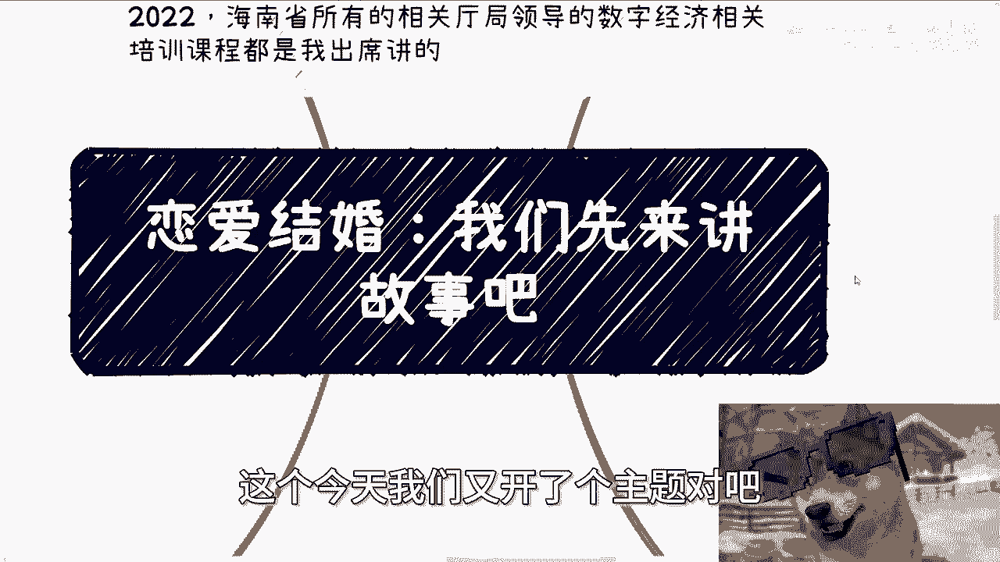

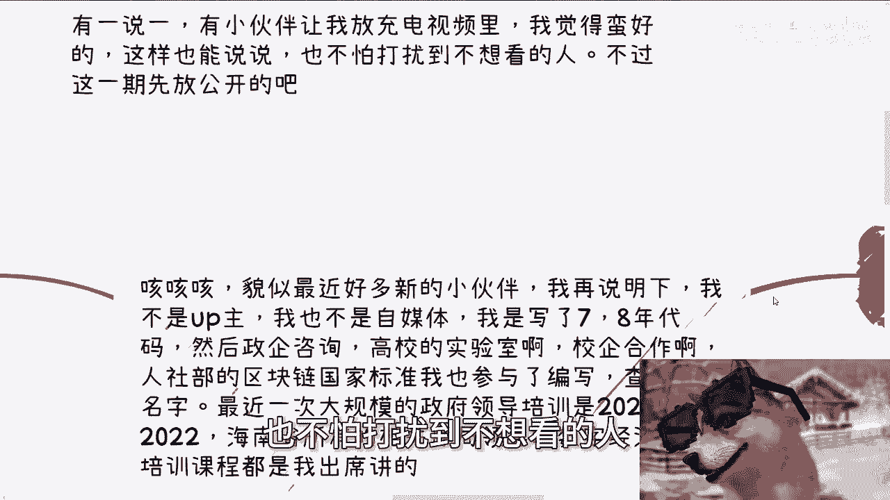

在本节课中，我们将探讨一个核心观点：思维方式不仅影响你的工作和赚钱能力，也深刻影响着你的恋爱与婚姻关系。我们将通过故事和分析，帮助你建立更客观、更清晰的思考框架，避免被固有观念束缚，从而做出更明智的人生选择。

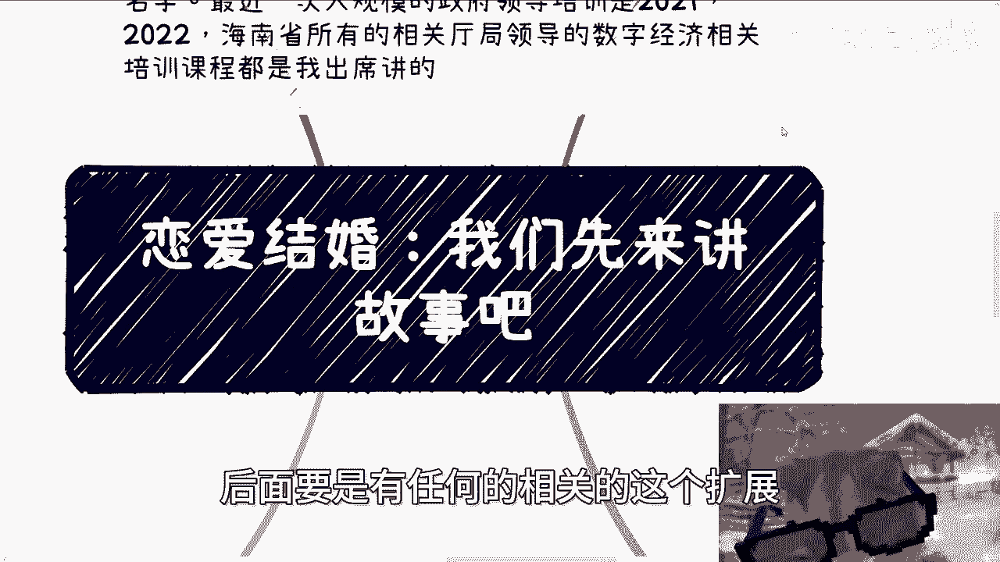

## 课程背景与个人说明 📝

首先需要说明，我并非职业自媒体人或UP主。我是一名拥有七到八年编程经验的从业者，后续从事过政企咨询、高校实验室合作、产业学院建设等工作，并参与了人社部区块链国家标准的制定。我也曾为政府领导提供数字经济相关的培训。

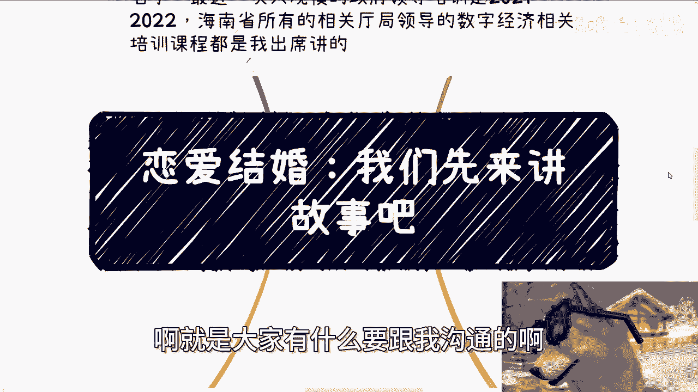

我想表达两点：第一，我拥有丰富的实践与失败经验；第二，我不以流量为导向，因此沟通时讲究直接坦诚。我们之间的交流应基于事实和逻辑，而非道德绑架或情感绑架。

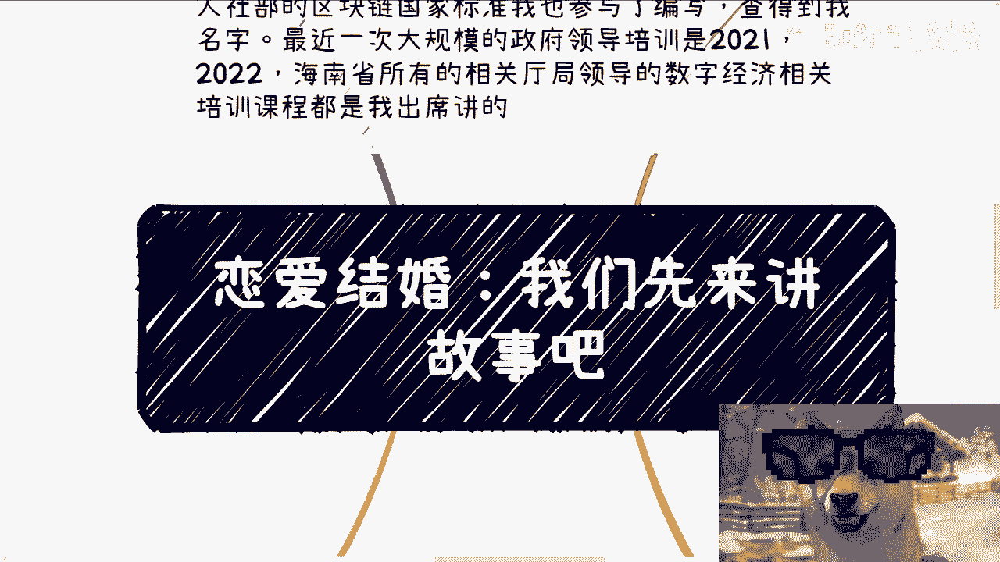

## 核心思维方式：空杯心态与目标明确性 🔍

上一节我们介绍了课程背景，本节中我们来看看处理人际关系（包括恋爱与商业合作）时最关键的思维方式。

很多人长期处于“象牙塔”或“楚门的世界”中，思维方式被束缚。这种束缚的本质是习惯于用预设的道德观和固有思维去评判事物。一旦开始评判，就等于自我设限，拒绝了更多的可能性。

正确的做法是保持“空杯心态”：以完全空白、客观的状态去看待一个人或一件事，然后再进行分析和判断。这能帮助你看到更多本质。

在与人接触时，无论目的是赚钱还是恋爱，请记住一个核心原则：**目标越明确、越不遮掩，风险反而越低；目标越模糊，风险越高。**

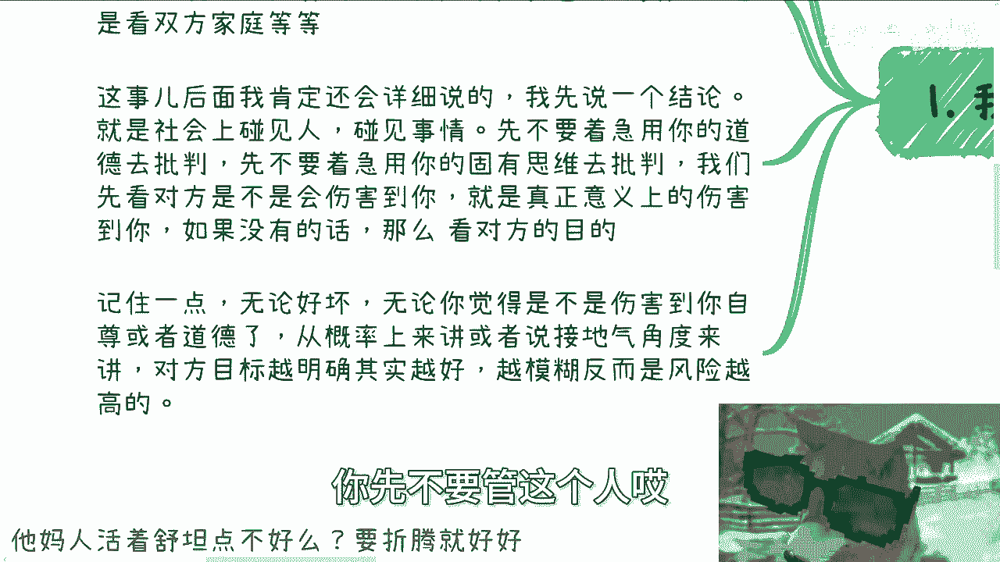

这个原则可以用一个简单的公式来理解：
**关系风险 ∝ 1 / 目标明确度**
（关系风险与目标明确度成反比）

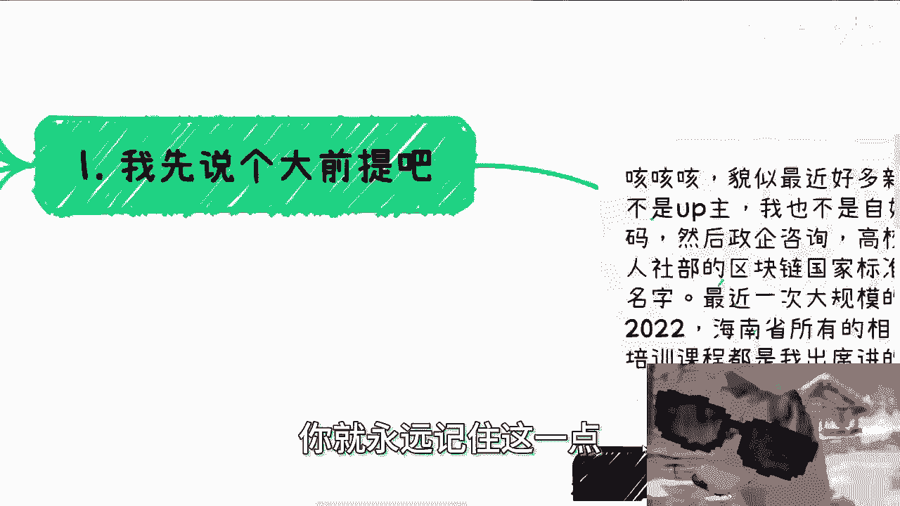

## 直白沟通的价值：以商业逻辑类比 💼

理解了空杯心态和明确性原则后，我们来看看它在实际中如何应用。

在当今社会，一切都可以摊开来讲。只要不触碰法律和道德红线，且双方自愿，明确的诉求本身并无问题。

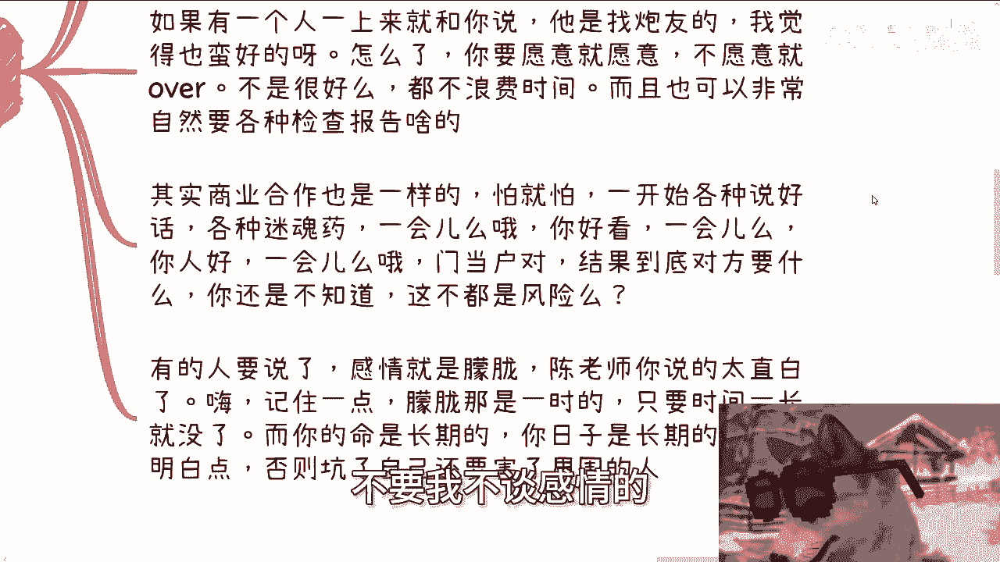

例如，在商业合作中，对方直接说“我只谈利益，我要利润最大化”，这并不可怕，你可以据此决定是否合作。可怕的是对方满口好话、不断画饼，真实目的却模糊不清，这会带来巨大风险。

恋爱同理。如果有人直接表明“我是捞男/捞女，我就是要钱”，这反而清晰。双方可以基于此明确交换条件（如金钱与情绪价值），并自然地要求进行体检等核查。这比那些以“感觉”、“门当户对”为名，实则目标模糊的关系更高效、风险更低。

模糊和朦胧带来的刺激是一时的，但生活是长期的。追求一时的“上头”，可能换来长期的痛苦。

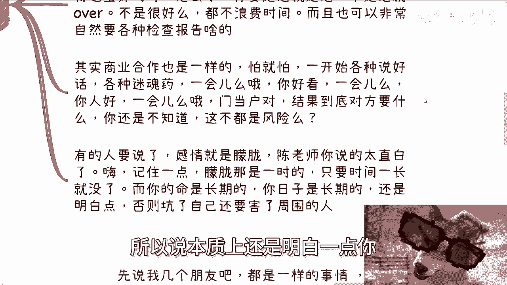

## 现实故事：模糊需求导致的内部消耗 🌀

理论需要结合实际。下面我们通过几个朋友的真实故事，来看看模糊的思维方式在婚姻中造成的具体问题。

以下是几个常见的、因目标或需求不明确而导致矛盾的例子：

*   **旅行安排**：一人做攻略，另一人抱怨“不与我商量”；与之商量，又抱怨“太麻烦”。行程满则嫌累，行程空则嫌无聊。
*   **雇佣保姆**：事前询问都说“没问题，你看着办”，找到后却开始挑剔外貌、年龄、经验。

这些例子还算好的，因为它们未造成实质性伤害。但其本质是“没有需求，制造需求；没有困难，制造困难”，这种内部消耗极大地降低了生活质量和幸福感。

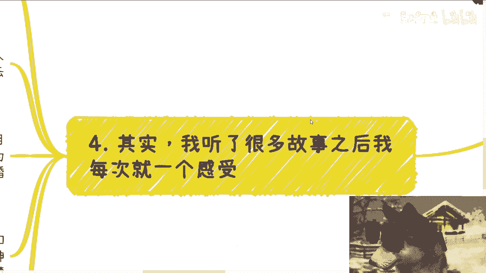

这就像企业里的一些领导，通过“折腾”来体现存在感，结果就是资源（包括金钱、时间和情感）被无谓地浪费。许多人的钱就是这样“折腾”没的。

## 自我审视：你恋爱或结婚的目的到底是什么？❓

通过上面的故事，我们看到模糊思维带来的消耗。那么，如何从根本上避免这个问题？答案是从一开始就想清楚自己的目的。

很多人在读书、工作时就缺乏明确目的，在恋爱结婚问题上更是如此。

以下是常见的、未经深思的动机，请自我对照：

*   为什么恋爱？—— 家里催的。
*   为什么结婚？—— 家里催的。
*   为什么找这个人？—— 对方有钱/好看/是潜力股/门当户对。

如果你正处于一段关系或考虑进入一段关系，请认真思考这个问题：**如果五年或十年后，你遇到了更优秀、更与你两情相悦的人，你会如何选择？** 如果你对现在的选择没有坚定的答案，说明你并未真正想清楚。

这并非鼓励大家不恋爱不结婚，而是强调“想明白”的重要性。就像创业一样，只要你想清楚了目标，并能承担相应风险，那就去做。

关键在于管理预期。如果你只想“活在当下”获取愉悦感，那就不要额外索取过多的关心和承诺。你的期望应与你的投入和选择相匹配。

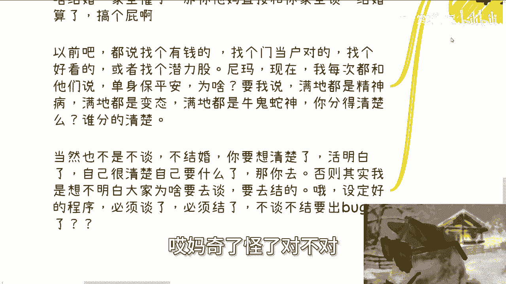

## 总结与建议 🎯

本节课中我们一起学习了思维方式对恋爱婚姻的决定性影响。

**核心总结如下：**
1.  **摒弃预判，保持空杯心态**：先客观观察，后分析判断，避免自我设限。
2.  **追求目标明确性**：无论是他人还是自己，明确的目标和直白的沟通能显著降低风险。记住公式：**关系风险 ∝ 1 / 目标明确度**。
3.  **警惕内部消耗**：模糊的需求和“作”的行为会无谓地消耗情感与资源，让所有人都不舒服。
4.  **务必想清楚自己的目的**：不要像执行预设程序一样因为年龄或社会压力而行动。一切选择都应基于清醒的自我认知和风险评估。
5.  **优先保障自身基础**：在复杂的社会环境中，拥有独立的经济能力（`financial_independence = true`）是面对任何关系（伴侣、家庭、老板）的底气。在未想清楚或未遇到合适的人之前，“单身保平安”是一个理性选择。

人随着年纪增长，往往会活得更明白，也更需要关注自身的舒适与可持续性。在做出人生重大决定前，请务必先理清自己的思维。

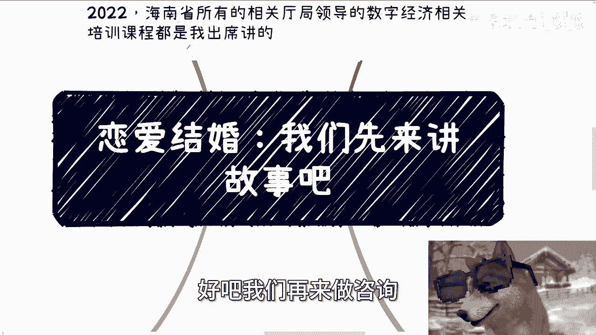

---
**后续说明**：关于职业规划、副业赚钱、股权分配等话题，我会继续分享。感情问题虽然复杂，且最终解决方案在于你自己，但我可以提供逻辑分析和情绪价值。如有具体问题，请整理好个人情况和背景后再进行交流。