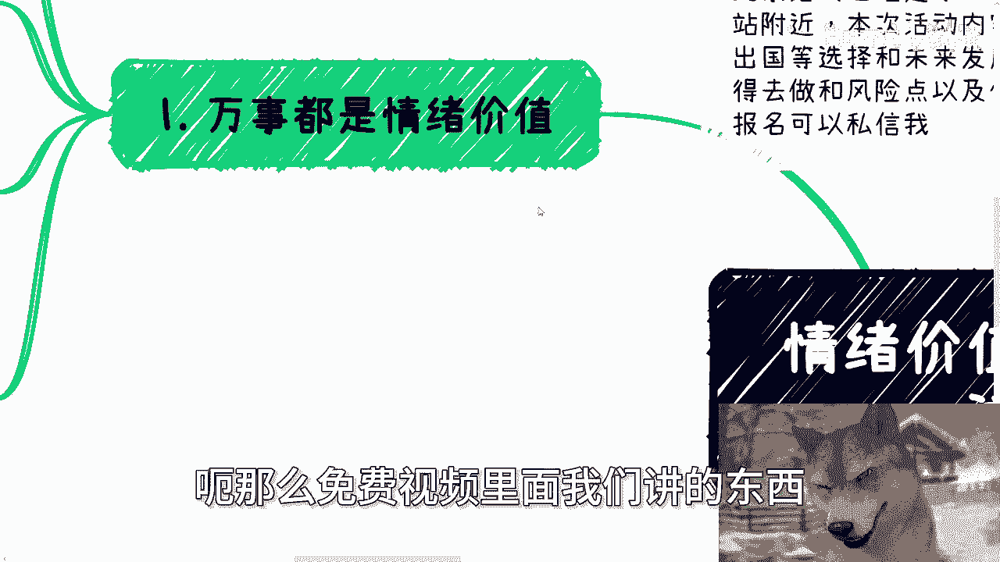
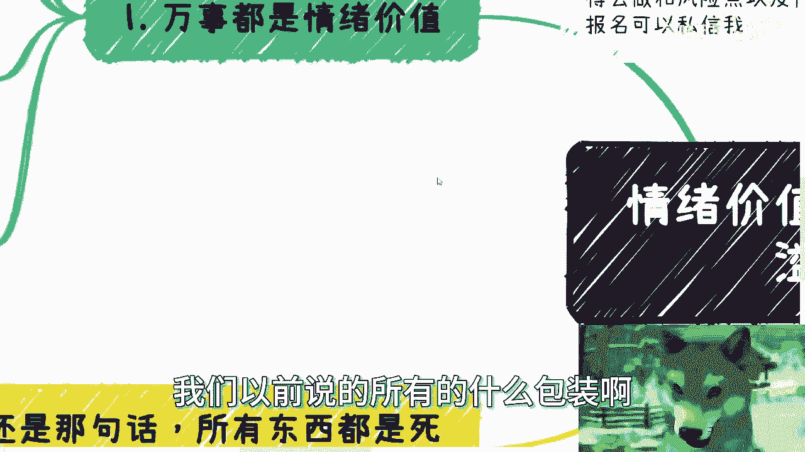
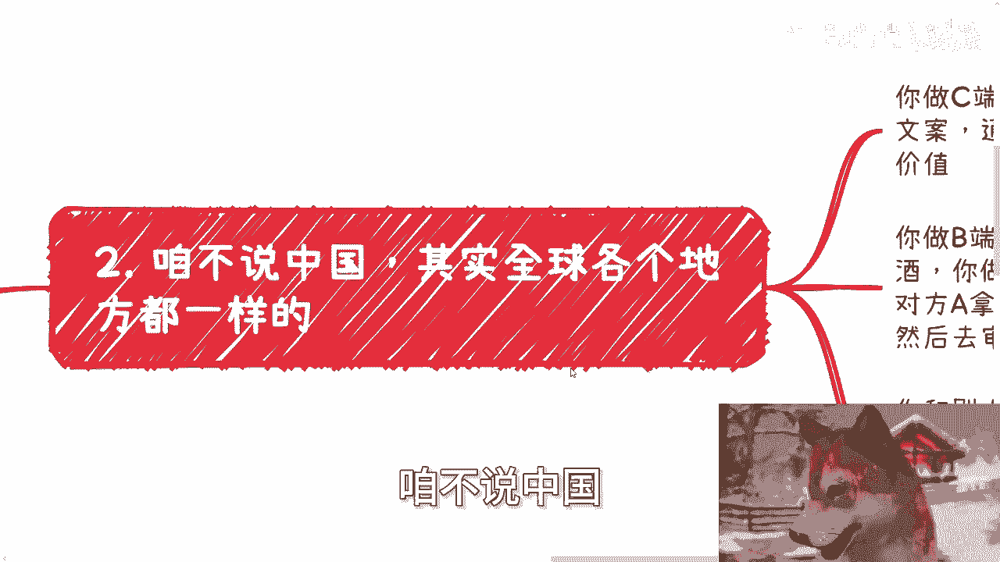
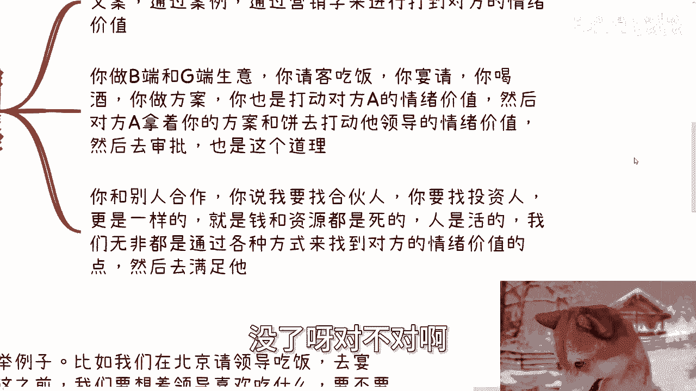
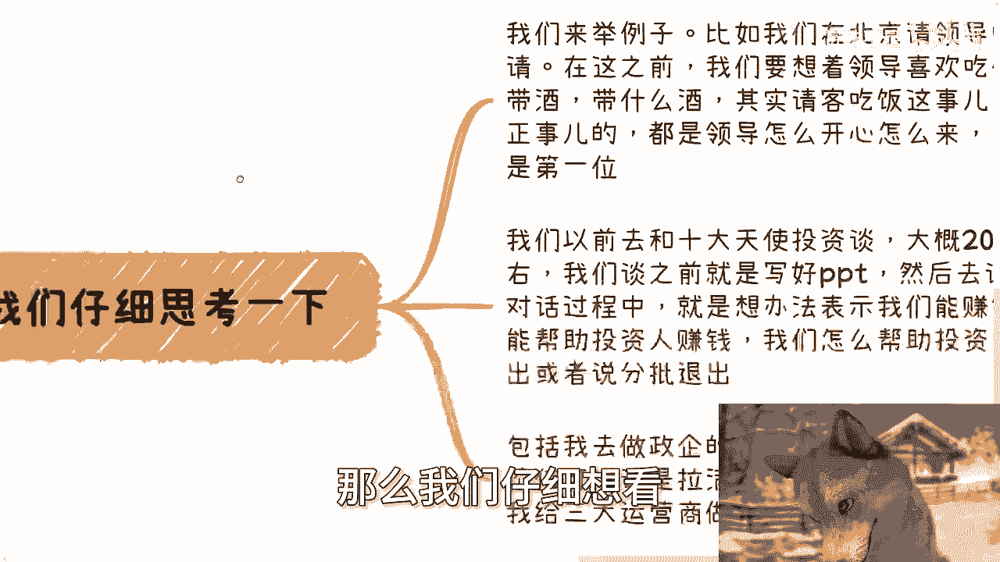

# 情绪价值其实就是溢价空间 - P1 - 赏味不足 - BV1jm42137qW

好啊呃，我正好再录一个跟免费视频对应的。

这么一个视频啊，叫做情绪价值本身其实就是溢价空间啊，就是溢价空间。

首先啊那个北京活动已经定了好吧，本月28号下午在东直门地铁站附近呃，本次活动内容呢反正大致一个呢跟上次一样的，就私企啊，国央企啊，外企出国这些offer的一些选择跟未来的一些发展。

那另外一个呢就是说从个人角度来讲，我跟你们讲一下跨境电商啊，还有自媒体它是否还值得去做额和风险点，因为这个东西也是个人跟我提到最多的呃，然后还有就是低空经济啊，知识的一些普及好吧，然后了解详情跟报名的。

你们可以私信我啊，额那么免费视频里面我们讲的东西。

我就不再重复了啊，那么首先第一点呢，其实万事都是情绪价值呃，因为之前啊就是所有的这个咨询当中呢，其实都多多少少啊谈到过这个情绪价值的东西，但是谈到的时候呢，其实大家我说实话啊，我是觉得其实大家都明白。

但是呢可能就是差我去跟他们提那么一点，就是在你们心里面其实懂你们都懂的，但是但凡我不提，或者没有人给你们提呢，你们可能哎就就就感觉，就是这两个东西没法划等号，把它连接起来，什么意思啊。

就是你包括就是说啊很多人跟我聊的时候呢，他就说啊他说啊这个情绪价值怎么样怎么样，不好对吧，或者他看不起这个东西，然后呢我就跟他说，我说你仔细想想看，我说你未来只要想赚钱，我不管你的客户是谁。

其实是不是都是满足他们的情绪价值，就是你今天比如说跟政府去合作，你今天跟政府下面的一些基层对吧，先跟他对接，那你想想看啊，你他为什么要帮你去申报，他为什么要给你信息，不还是因为你满足了他的情绪价值。

而他的领导为什么最终愿意批这么一个项目，也还不是因为这个基层员工，满足了这个这个领导的兴趣价值，对不对，那无非就是无限的一层一层去满足情绪价值，那那还能有啥呢，对吧啊，那么我们一直说啊说呃人际关系啊。

积累人脉，投其所好所好，你仔细想想，看这一切的一切的背后，它其实就是情绪价值是还有什么别的呢，没了对吧，他只不过就是说因为每个人的出身不一样，每个人的这个这个生长空呃，成长空间不一样。

每个人的目前的屁股不一样，他情绪的定位不一样，满足感不同，对不对，那你比如跟企业谈生意，跟政府领导吃饭，包括你在企业里面的晋升对吧，就是就是在打工啊，包括你找别人合作，无非是满足对方情绪价值。

那么有的人要钱，有的人要名，有的人什么都要，对不对，那那还能有什么呢，哦那有的人嗯这个时候啊，这个时候啊可能有些小伙伴就要说，他说那不是的啊，他说他说呃，那按照我们之前一直说的，这个人要钱，对不对，好。

那你仔细想想看啊，这个人要钱，他为什么要你的钱呢，他别人的钱不能要吗，对不对，那如果今天有十个人给他送10万块钱，他为什么要你呢，那他们还不是因为你满足他的情绪价值吗，对不对啊，那很多事情做的时候啊。

并不是只有成功跟不成功的同样的事，别人谈可能利润是10万，你去谈利润可能就是30万，但本质上你跟别人跟谈了之后，交付的东西是一样的，那为什么价格会不一样呢，是因为满足了不同的情绪价值。

如果情绪价值是有level划分的话，那相当于是不同的这个level对吧，不同的级别，那么我们反过来想啊，你要没有情绪价值，那么就没有溢价空间，这就是我们说的两者其实是对等的，没有情绪价值。

那哪来的空间呢，对不对，你想想看啊，你说满足甲方是，那如果满仅仅满足需求，我今天让你给我个软件，这个软件就20万对吧，你告诉我你成本多少，成本20万好，那我就付20万，那怎么会有溢价空间呢。

对你来讲就是平进平出。

那你还怎么赚钱，对不对，我们以前说的所有的什么包装啊对吧。

包括背书啊，title啊，头衔啊，不都是情绪价值吗，没有区别的啊，第二我就这么说啊，咱不说中国全球都一个吊样子。

你做C端生意，你拉动了C端的情绪，你TCH到了他的情绪，你怎么TCH到的，你通过海报，通过文案，通过案例，通过营销学对吧，通过市场来打动对方的情绪价值，我不管你通过什么方式，很多很多对吧。

线上你可以通过这些线下，你可以通过会销直销分销各种各样的销对吧，多了去了，你做弊端跟计算生意，你请客吃饭，你宴请你喝酒，你做方案，你也是打动对方A的情绪，然后对方A再拿着你的方案跟丙去打动领导。

情绪价值，你仔细想想看啊，A去汇报A去跟领导沟通的时候怎么滴啊，他总总不能是个僵尸脸吧对吧，他汇报他文字怎么写，总要里面得要添油加醋吧对吧，得得要里面绘声绘色吧，那你仔细想想看，他不将失联，要添油加醋。

要绘声绘色，绘声绘色怎么来的，不还是因为你打动了，打到了他的情绪价值吗，啊否则他为什么在他领导这边会会他怎他，他或者说他又怎么拿什么东西去打倒，打到他领导的情绪价值呢，没有的呀，啊你跟别人合作。

你说我要找合伙人，我要找投资人更是一样了，就是钱跟资源其实都是死的对吧，很简单，今天比如说这个私募基金十个亿，这十个亿怎么花都是花，他为什么花到你你身上不给我呢，对不对。

那这个就取决于你跟他是怎么怎么沟通，我跟他怎么沟通，人是活的，我们无非都是通过各种方式，来找到对方的情绪价值点，然后满足他没了呀没了呀。

对不对哦，所以说就说你们大家啊，包括到现在为止，我们说赚钱也好，怎么样也好，你们要记住一点，就是赚钱是目的，但是过程当中，这个情绪价值，跟我们说的很多软性技能是很重要的对吧。

你赚钱你可以认为是个硬性技能，你会赚钱，但是你怎么赚到这个钱，这怎么让利润更得更高，这个就是软性技能啊，对吧啊，那么我们仔细想看。

我们举个例子，比如说我在领呃，我我当年在北京请领导吃饭对吧，在这之前我要想着领导喜欢吃什么啊，要不要带酒，因为领导一般不喜欢现场买对吧，你你要不要带带什么酒，那其实请客吃饭这个事情我就这么跟你们讲。

尤其跟领导请客吃饭，基本上是不谈正事的，你不能谈正事的，正事没人跟你谈的对吧，奥特曼，你见到过他妈领导跟你谈正事的啊，我妈去，你妈搞笑了，都是领导下的小弟跟你谈正事的，你明白吗。

领导都是来啊指点指点江山的啊，否则他妈怎么叫领导呢，对不对啊，那么你说说的难听点，就是领导怎么开心怎么来啊，让领导怎么安心怎么来，因为你们要记住，中国永远是政治安全第一位，对不对啊。

那么我们以前呢包括去十天，那个十大天使投资谈也是的，大概2019年20年左右，我们谈之前就写好PPT，然后去谈，但是真正谈的过程当中，其实PPT根本没人看啊，说白了我们的对话。

我我不关心投资人到底说什么，我无非给他的说法都是说诶，第一我们是能赚钱的，我们有现金流，第二我们怎么会帮助你们，就帮助投资人去赚钱，第三我们怎么更好的帮助你们，投资人尽早的或者分批的退出。

从而得到利润大概几倍的利润，对不对，那为什么，因为这个是他们的情绪价值啊，啊那么包括我去做政企咨询，哎呦卧槽这个事情我之前跟你们讲过啊，我我不知道有这个还有没有小伙伴不知道，我在跟你们提一下。

就是我我记得很清楚，2020年年底啊，我给我去北京，给三大运营商做做那个政企的咨询，当时做的是那个呃区块链跟那个元宇宙的哎呦，你们是不知道我为什么呢，因为那个培训是三天的啊，那个咨询师三天的，然后呢。

他们要求就是说必须要有一天半的实操啊，然后我说我写代码已经很久没写了，你让我去实操实操，我也不懒得做，我就找了个合作方，你知道吗，替我一起去，那就是说我1。5天，他1。5天嘛对吧，一共三天。

然后呢培训就咨询了，当天啊，我他妈记得很清楚，我早上在那边打战神啊，还是在打那个鬼泣妈打，反正打的很开心啊，卧槽，你们是不是知道，到中午我们的合作方就打电话过来，他说陈老师不行，他说对方领导表示要退款。

他说这个东西不能这做的一点都不开心，他说你们的人很不专业，我说不可能啊，我说我找的人他妈的这啊，就是我说技术做了15年都是CTO级别，而且我说我共事过的怎么可能不行啊对吧，他说不行，领导就说不行。

他说你现在给我过来，然后卧槽，我当时真的就是直接中午就订好机票，然后晚上飞过去对吧，就就下午飞过去嘛，然后第二天一早我去啊，然后我最终通过我把这个case拉回来，但是我跟你们说，做政企咨询做了这么多年。

我从13年开始做，做到现在陆陆续续这么多年，我很清楚，尤其是政企的咨询打的就他妈是个情绪价值，别的都不重要，为什么，因为下面的人听不懂啊，你们明白吗，就这就是个悖论，因为下面的人但凡听得懂。

他不会花这个钱来做咨询的，对不对，那你想想看，你你要让听不懂的人能听得懂，或者怎么样能听下去，怎么打怎么做，你只能把他们的情绪价值拉满，就是我说的什么什么呃，你的那个台风要好，你的沟通要好对吧。

你的你的案例要好，你要让他们就是说通过各种各样的一些，一些一些怎么说呢，就是就是对方能听得懂的东西跟他们去讲，你不能真正的用干货跟他们去讲，因为他们听不懂啊对吧，你就像你就像我们跟小学生去解释数学。

你肯定是绘声绘色，让他们明白，你不能上来他妈的跟他讲高等数学吧。

对不对，一个道理呀，哦虽然你觉得，我他妈是讲的干货，但是对方不买账啊，对方是甲方，你们明白吗，哦所以还是那句话，就是你你做的业务越多啊，你最终就会明白所有的东西都是死的，他给谁都是给。

而我们要做的就是想办法让他给我们，但是为什么他要给我们，就是因为我们要摸到他的情绪价值，对不对。

一样的呀，对吧，你包括你包括你们很多人对吧，跟我说他陈老师我们赚钱对吧，是你觉得跟我讲赚钱没有错，但是问题是，你怎么就是我关心的是怎么确定的赚钱，以及我关心的是怎么性价比高的赚钱对吧。

这个是我永远关注这两个点对吧，那么你仔细想想看，你跟我讲一个东西，比如说啊你跟我讲一个东西，说唉我一单利润可能就那么几十块钱对吧，或者怎么样子，那我肯定不会错啊，我为什么去做呢对吧。

包括我也直白的跟你们讲，有很多人呃让我给你们带货对吧，就就让我给你们卖东西或者怎么样子，我都不卖的，但是我也咱也实事求是来讲，你要是利润打的足够高，你跟我说他妈陈老师，你卖出去一单啊，卖出去一单。

我他妈给你10万，那我也卖了，对不对，但问题没有啊对吧，所以你们到现在看到现在为止，你们没有看到过我接过任何商单，没有看到过我在里面在视频当中插过任何广告，为什么，因为我觉得不值得啊，对不对。

另外一方面就是他们没有达到我的情绪价值，我的情绪价值里面不单单是要看钱，我还得看这个东西合不合适，你不能按阿狗东西我都来带啊对吧，那每个人不一样，那有的人可能只看钱，他不像我就说还多元化的去判断。

他可能就是说觉得哎呦，我他妈有钱就赚，他妈不赚对吧，那可惜我不是这种人啊，对吧啊，所以我是觉得唉就是嗯你们你们，你们就是再往下想一层，你们就会明白，就这个东西其实蛮重要的，真的蛮重要嗯，行好吧。

那就这么着吧，然后那个活动好吧，咨询报名，你们继续私信我，然后呃剩下的话就呃职业规划，商业规划，股权期权啊，商业计划书白皮书，包括你们现在日常工作当中，你们可能做了哪些业务，或者正好有跟人跟谁有合作啊。

或者你们自己有些什么未来的规划呃，你们希望通过跟我的沟通啊，给我一些个人背景更详细的问题，那么希望通过我的一些认知啊，跟一些对于市场的了解，给你们一些更接地气的建议跟规划。

那么你们可以决定好对应的背景跟问题，我们再来做咨询，好吧行啊，就这么着吧，我跟你们讲，明天他妈一早八点钟要去杭州。

