# 课程 P1：理解情绪价值与溢价空间 💰

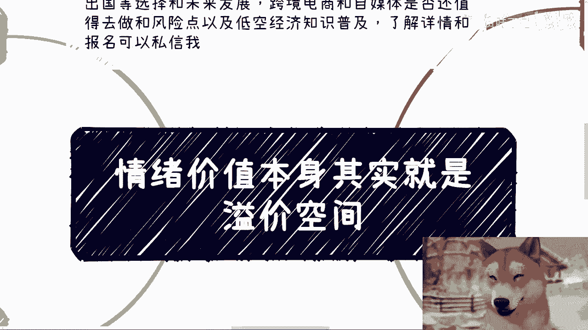

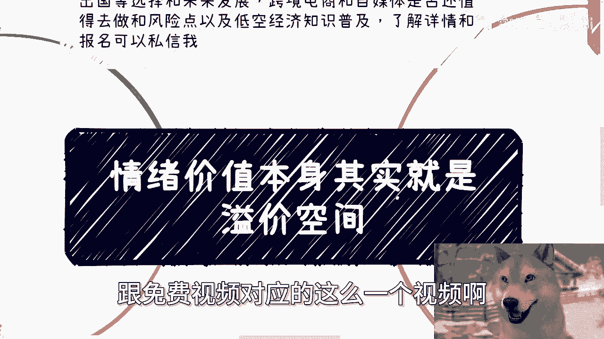

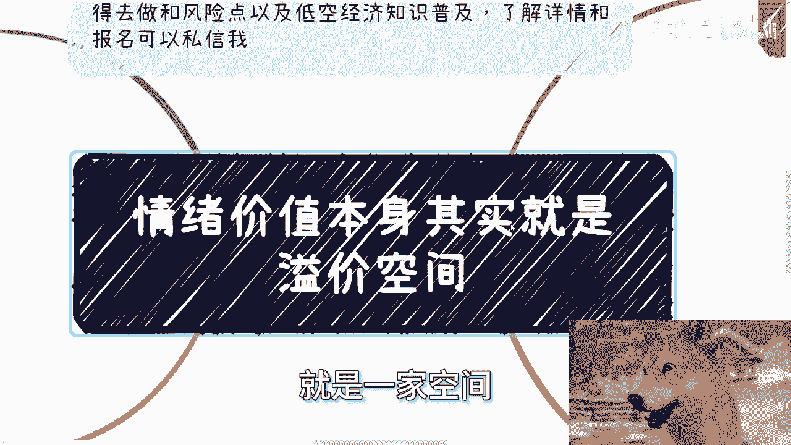

在本节课中，我们将深入探讨“情绪价值”这一核心概念，并阐明它如何直接等同于商业活动中的“溢价空间”。我们将通过多个实例，帮助你理解为什么满足他人的情绪需求是创造超额利润的关键。

## 概述：什么是情绪价值？

情绪价值，简而言之，就是通过满足他人的情感、心理或社交需求而创造的价值。它超越了产品或服务本身的功能性，触及了人的感受、认同感和欲望。

上一节我们概述了课程主题，本节中我们来看看情绪价值的普遍性。

## 第一节：万事皆情绪价值

在所有的商业咨询与交易中，情绪价值都无处不在。许多人可能隐约明白这个概念，但需要被点明才能将其与商业成功明确联系起来。

很多人谈论情绪价值时，可能轻视它。但仔细思考，未来无论客户是谁，赚钱的本质都是满足他们的情绪价值。

例如，与政府合作时，基层工作人员为何愿意提供帮助？领导为何批准项目？正是因为你在不同层面上满足了他们的情绪价值（如被尊重、获得认可、感觉安全等）。我们常说的人际关系、人脉积累、投其所好，其底层逻辑都是提供情绪价值。

每个人的背景、立场和需求不同，因此情绪价值的定位和满足方式也不同。有人求财，有人求名，有人两者都要。关键在于识别并满足它。

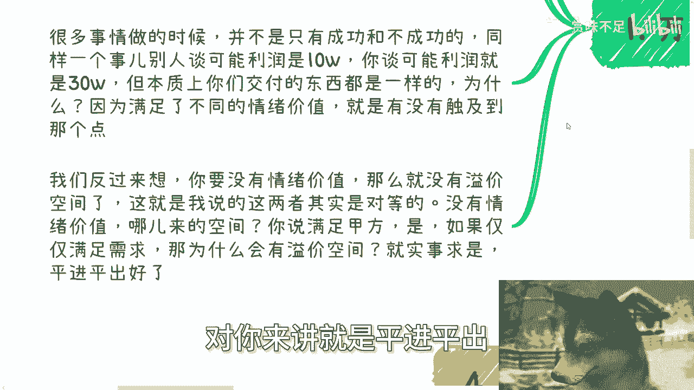

## 第二节：情绪价值创造溢价空间

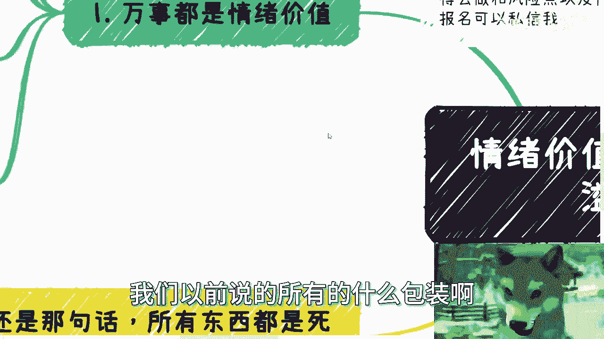

如果没有情绪价值，就没有溢价空间，两者是对等的。

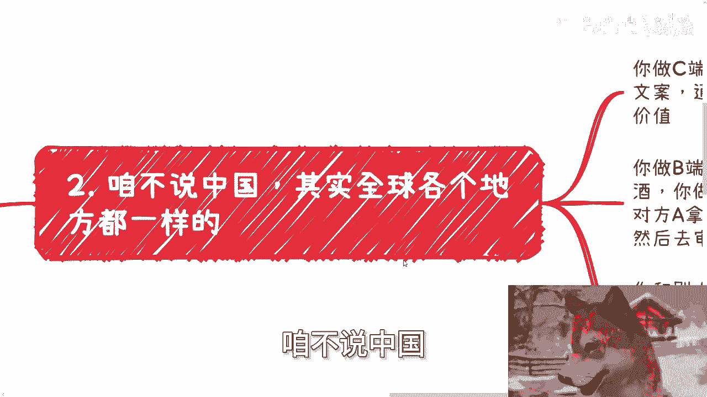

试想，如果仅仅满足甲方的功能需求：一个软件成本20万，甲方就付20万。这对你而言是平进平出，没有利润空间。

我们常说的包装、背书、头衔，本质上都是在构建情绪价值。它们让同样的产品或服务，在客户心中变得“更值钱”。

以下是情绪价值在不同商业场景中的作用：

*   **C端生意**：通过海报、文案、案例、营销活动来触动消费者的情绪，促使他们购买。
*   **B端/G端生意**：通过请客吃饭、方案汇报、沟通技巧来打动决策链上每一个人的情绪。A向领导汇报时，需要将你的方案“绘声绘色”地描述，这本身就是传递情绪价值的过程。
*   **寻找合伙人/投资人**：资金和资源是“死”的，为何选择你而非他人？这取决于你如何沟通，如何满足对方对项目前景、团队信任或个人成就感的情绪需求。

赚钱是目的（硬技能），而通过情绪价值实现更高利润则是过程（软技能）。

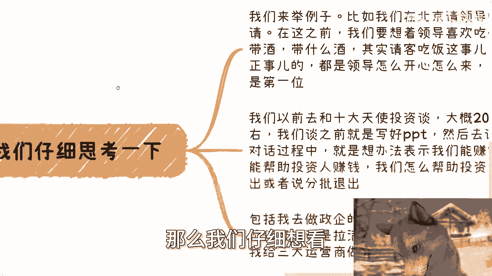

上一节我们理解了情绪价值的普遍性，本节中我们通过具体案例来看看它是如何运作的。

## 第三节：实战案例解析

以下是几个具体场景，展示了情绪价值的核心作用：

**案例一：与领导沟通**
当年在北京请领导吃饭，核心不在于谈正事（正事由下属沟通），而在于让领导感到安心、受尊重和愉悦。在中国，政治安全常是领导的第一情绪需求。因此，安排让对方舒适、放心的场合和话题至关重要。

**案例二：与投资人沟通**
与顶级天使投资人会谈时，准备的PPT可能没人细看。对话的核心是传递三点情绪价值：1. 证明我们能赚钱（满足其对财务回报的渴望）；2. 说明我们将如何帮助投资人赚钱（满足其职业成就感）；3. 阐述清晰的退出路径（满足其对确定性和安全感的追求）。

**案例三：政企咨询培训**
2020年底为三大运营商做区块链与元宇宙咨询。合作的技术专家虽专业，但因未能调动学员（甲方）的情绪，导致甲方不满要求退款。我紧急飞往现场，通过调整讲述方式——用更生动、易懂的案例代替深奥的技术干货，将课程氛围拉回正轨。政企咨询常面临“听得懂的人不会买，买的人听不懂”的悖论，因此，**台风、沟通技巧、案例的吸引力**等情绪价值要素，往往比纯干货更重要。

**案例四：个人合作选择**
许多人找我合作或带货，我通常拒绝。因为我的决策不仅看利润（钱），还要看项目是否合适、是否符合我的个人品牌定位。这本身就是我的“情绪价值”决策点：我需要感到事情值得、匹配。而有些人可能只看重金钱回报，这体现了每个人情绪价值需求的差异性。

## 总结与行动指南

本节课中我们一起学习了情绪价值的核心地位及其与溢价空间的等价关系。

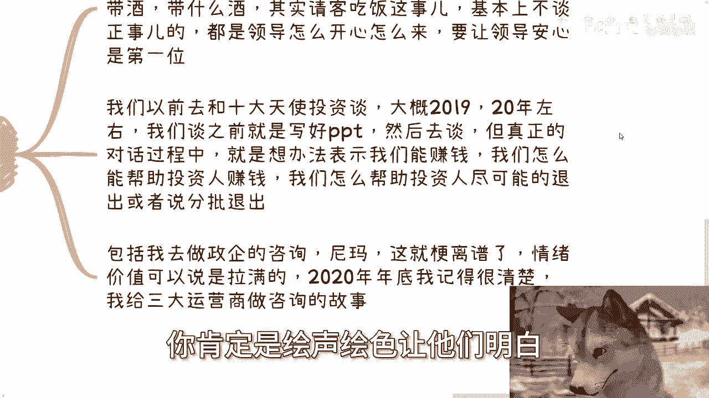

**核心公式可以概括为：**
**溢价空间 ≈ 被满足的情绪价值**

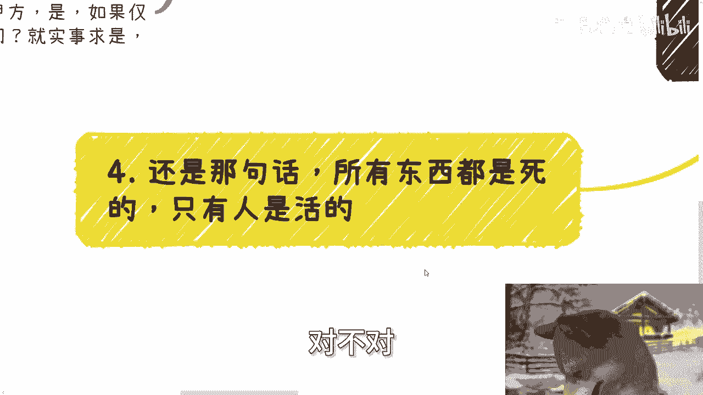

要创造利润，就必须找到并满足客户、伙伴或上级的特定情绪需求。无论是To C还是To B，无论是打工晋升还是创业融资，这一逻辑普遍适用。

**行动建议：**
1.  **转换视角**：在每次商业互动前，先思考“对方的情绪价值点可能是什么？”
2.  **超越功能**：不要只停留在满足合同列出的功能需求，思考如何让对方在过程中感觉更良好、更受重视、更安全或更有面子。
3.  **个性化满足**：认识到不同对象（政府领导、企业高管、消费者）的情绪价值需求截然不同，需量身定制策略。

记住，资源总是流向能更好满足其持有者情绪价值的人。提升你识别和提供情绪价值的能力，就是在拓宽你的溢价空间和财富通道。

---

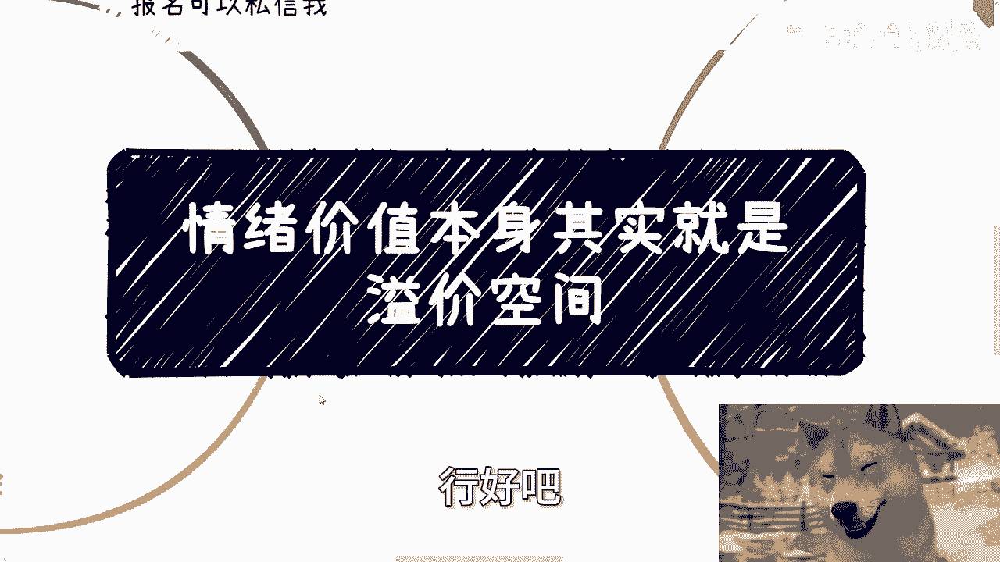

**附：活动与咨询信息**
北京线下活动已定于本月28日下午，在东直门地铁站附近举行。内容涵盖：
*   私企、国央企、外企及出国发展的选择与规划。
*   跨境电商、自媒体的现状分析与风险点解读。
*   低空经济相关知识普及。

了解详情或报名请私信。

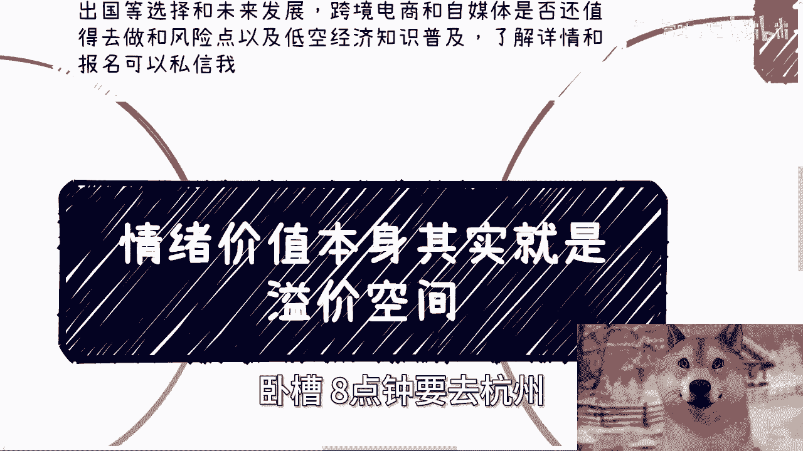

此外，如需进行一对一的职业规划、商业规划、股权期权、商业计划书等咨询，请梳理好个人背景与具体问题后，再行预约。希望通过我的市场认知，为你提供接地气的建议。