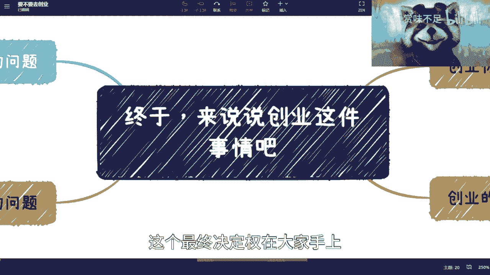
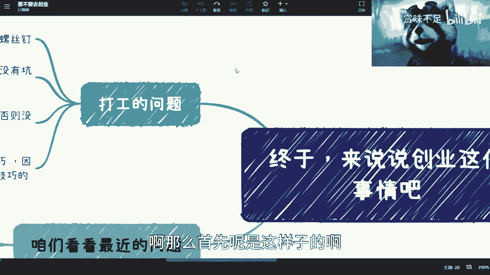
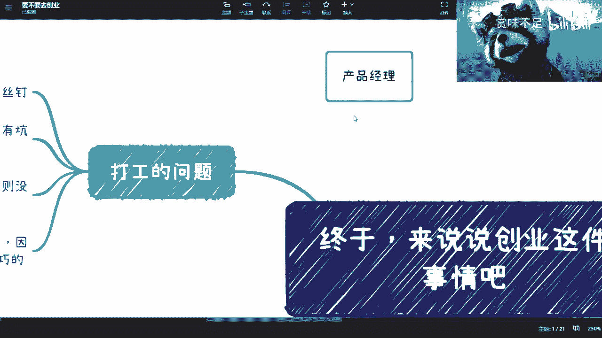
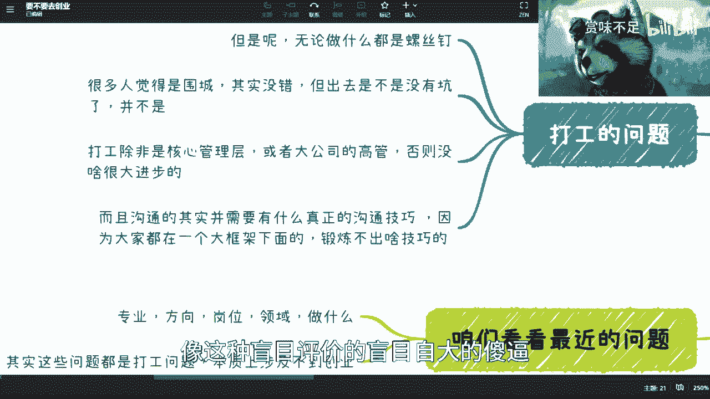
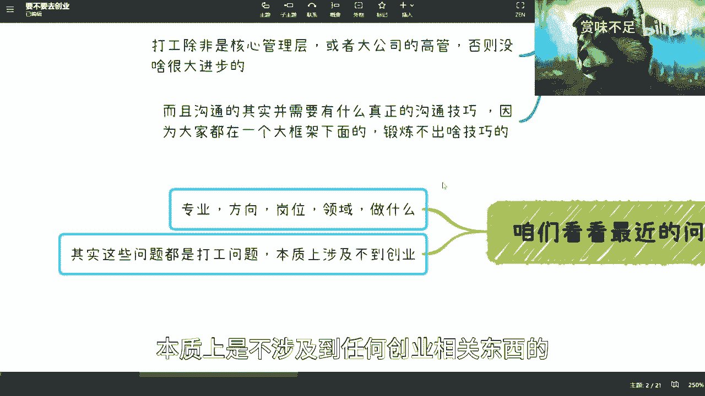
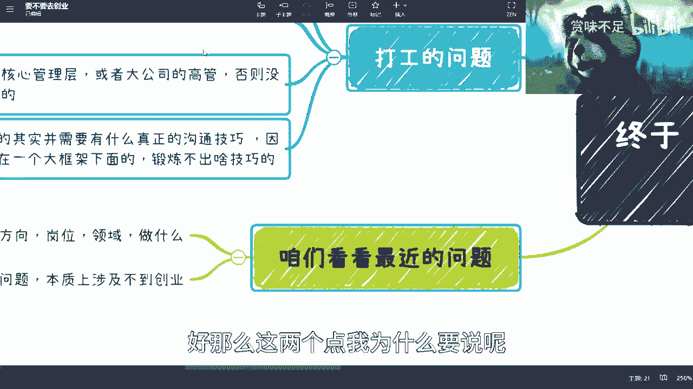
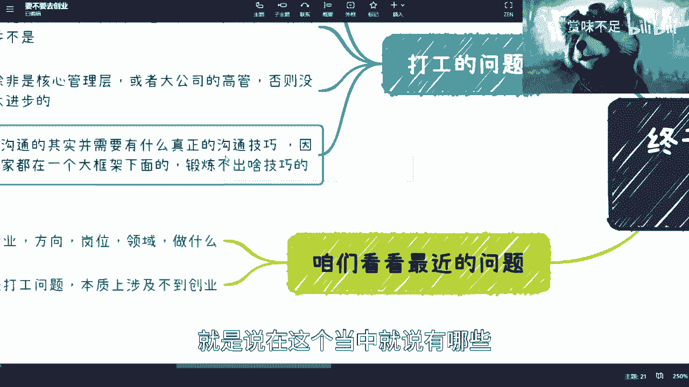
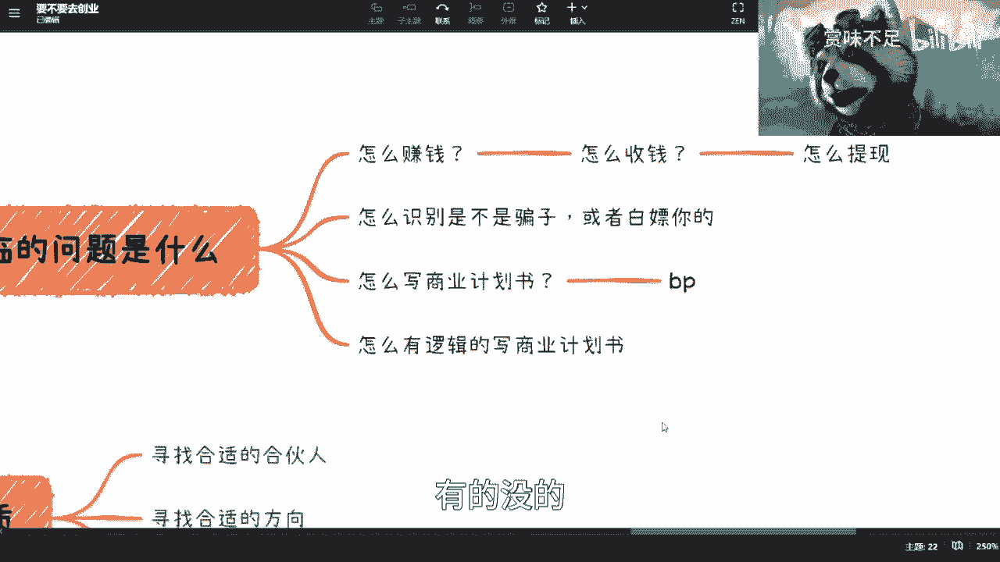
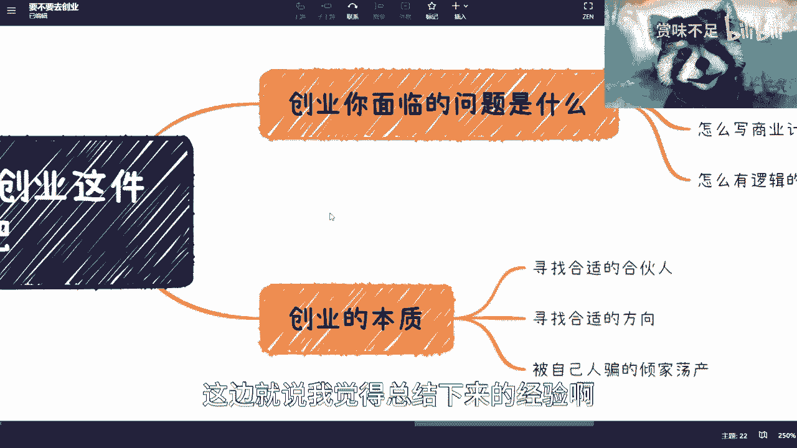
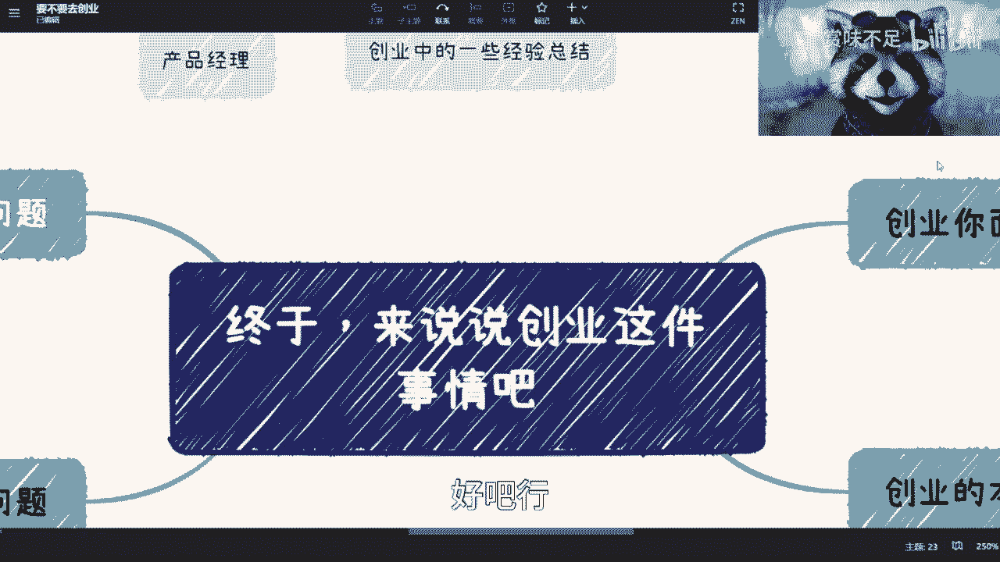

# 想创业的朋友，看过来 - P1 - 赏味不足 - BV12L411Q74t

好啊finally finally，finally，我们诶诶诶诶啊。

我们终于要来讲创业这件事情了啊，因为最近这个沟通啊，我看了一下这网上的这个大家的这个反馈啊，我相信啊除了就业跟考研以外啊，也有一些小伙伴是想要去创业的啊，包括我前两天去b站见的。

就之前听我区块链的那个课，他在算我学生嘛对吧，然后就也说要创业，其实我对吧，就是只能客观的说啊，这个最终决定权在大家手上。

啊那么首先呢是这样子的啊。

就是我们先来说啊，就是说创业这件事情啊，你怎么判断你合不合适啊，或者说你怎么去这个这个在一开始啊就去想，就说我是不是啊这个要去做对吧。

那么你现在看啊，首先打工对吧，我这个地方我写了对吧，你打工的问题，打工的问题是什么呢，就是说首先啊第一点诶，等一下我看啊，首先无论做什么，你都是一个螺丝钉，你要明白。

就是说因为以前啊就是b站一开始我做的，我我发视频的时候，有人其实问过我的意思是什么呢，就是说他想的意思是说唉，我想在这个公司里面做啊，不管做什么，比如开发啊，呃这个这个产品啊，或者其他销售啊对吧。

他说我想对这个行业能有所了解啊，但是我跟你们讲，从本质上而言啊，你们只要是在公司里面里面做，你们其实对这个行业是不会有太多了解的，就你们了解更多的是一个很小很小的点，而且这个点完全不不足以支撑啊。

你们对就是说啊行业啊，包括来说，就是我们说水下那80%的东西，很难去了解，而且这跟你做的时间没有关系，你知道吗，因为有些人会觉得说哎我是不是做了个，比如说8年10年我就很了解，也不是你知道吗。

这个就是最最怎么说呢，就是说很有可能啊，比如说你现在工作1年啊，我这么跟你讲，你不信啊，你也不听我的啊，你说这个左左左耳朵进右耳朵出来，你知道吧，但是呢你很有可能到8年10年的时候，你就悟了啊。

你就领悟了对吧，就就麒麟臂打通任督二脉了是吧，但是问题是你到那个时候领悟了就难了，你知道吗，所以其实就是说本质上啊就是都是这样子的啊，呃第二个呢其实很多人呢也觉得是围城，我跟你们讲，这也没错。

因为这两天也都在说嘛，就国企啊想出来的吧，外面人想进去啊，呃但是呢你说有没有坑啊，啊这个事情是这样子的，就是有很多人也会觉得他说他说我要去跳槽啊，我现在这公司怎么怎么不好对吧，就是各种各样不好。

他能跟你说100种不好的理由，但是我跟你讲啊，你但凡时间做得长了，你你听我一句啊，你你就会发现其实到哪都是坑，你知道吗，就到哪都是坑你，你没有区别的啊，那么我跟你讲，只有一种可能性，不是肯是什么呢。

就是你自己去做对吧，因为你就算自己去做，你是坑没问题啊，你就当交学费了对吧，但是你到别的地方打工，你说这坑对吧，算谁的呢啊，这第二点第三点呢就是说打工本身啊，就是除非你是非常非性核心的管理层。

或者来说类似于像bt这种level或者a w s啊，google啊，重要的高管，我给你们定个e吧，高管基本上是什么意思啊，就是p9 及以上啊，必须p9 g以上，p8 是没有用的啊。

p8 只不过是一个小工具人啊，否则没啥大很大进步，为什么呢，因为你很多是在公司内部的，你了解不到外面的东西，你你感觉你是在做项目，其实你会发现我们说啊，就是假设现在一个项目是从0~1。

因为你项目总归是有授权的，你总该有商务对接的，你这项目不可能天上掉下来的对吧，你就算说你今天是一个这个朋友，介绍给马爸爸的，那那你也要去了解里面的逻辑，为什么这个朋友要介绍给马爸，马爸爸对吧。

那为什么马爸爸要去接这个case对吧，你都得去了解的，但是从本质上来讲啊，我们说你只要不呃，你只要不是说啊非常核心的这种管理管理层啊，你对这种逻辑是不了解的，所以说你会发现在整个从上而下。

从0~100的过程当中，你可能只做了当中的就是说执行层啊对吧，团队管理层啊这一块，但这一块占比其实很小很小，而且这一块东西跟商业没有任何关系，跟商业逻辑也没有任何关系。

你接触到最多的还是技术层面的东西对吧好，那么这个是第三点，第四点呢就是说也有很多人会说，他说哎你看开发对吧，测试啊，这个没有叫什么，就是锻炼不了很多的这个沟通技巧啊，他说我做个产品。

哎呀我跟你们讲，哎呦，这个事情我真的忘了，产品叫我后面，我后面得跟你们讲一期产品经理，哎，我发现现在大家对产就真的互联网后面来的。

这个很多很多人啊，就是对对很多东西了解真的是越来越来。

我觉得这个教育没跟上，你知道吗，就是呃有可能就会说，他说他说那个做产品经理啊，做项目经理啊，做销售啊，做运营啊，市场啊，他说是能够有这个呃提升沟通技巧能力的啊，然后呢他说这个就是锻炼了，我跟你们讲。

你锻炼个屁啊，你锻炼个屁，为什么呢，因为你要明白你所谓锻炼的人，你都是在一个大框架下面的，你明白吗，什么意思呢，就是说你们都是为别人打工的，你们也都没有利益冲突，你们也都是不需要每个月去想自己。

到底这笔钱哪里来的，你们都是拿工资的对吧，那对于不你们都是同一个屁股的人，你跟我说沟通你沟通什么技巧啊对吧，而且更何况啊我觉得更何况更好笑的是什么呢，就有些人比如说比如说他是p8 对吧。

然后面对p7 的，或者有些人是t3。2的对吧，然后面面对t t3。1的人，哎他就会觉得哎我过渡机很牛逼啊，为什么，因为我说了，人家都都觉得有道理啊，那不是屁话吗对吧，那为什么有道理啊。

你有本事出来看看你有没有道理是吧，唉我跟你们说，真的就是嗯我为什么说最重要的是什么，我为什么一直说，最重要的是对自己要有认知对吧，对行业要人要有客观的认知，对自己要有客观认知，要有正确的评价。

你知道吧，像这种盲目评价的盲目自大的就啊很多啊。

我跟你们讲还真别说哎还有很多啊，那首先这只这一个啊，第二个呢我们来看b站，最近我沟通下来最多的问题啊，就是我到底选什么专业，我到底选什么方向，我到底选什么岗位，我到底选什么领域，我到底做什么，对吧啊。

好好这个这个东西我跟你们讲啊，你们所有的评论和私信我都回复了啊，我都回复了，我没有啊，当然我也有好像112条没有回复的，但是那个我实在是也不想回复，因为问题本身就就我都不知道这问的是什么啊。

然后呢我可以说除了那么两三条一两条以外，我都回来啊，没我都认真回来啊，然后呢，我说这些问题咱们就是各自case by case再来说啊，然后呢但是问题是什么呢，就是说你所有的这些问题都是集中在。

你要去打工，你要去应聘的这么一件事情上面，本质上你们一定要记住啊，所有你们思考的东西，本质上是不涉及到任何创业相关东西的。

你知道啊，好那么这两个点我为什么要说呢。

是因为你们参照这些东西去自我评估一下，你觉得你们是不是这样的啊，你们是不是这样的，就是说在这个当中就说有哪些。

你们觉得哎自己是欠缺的，有哪些是，比如说啊可能自己对自己认识比较清楚的，但是啊不管啊这两者里面哪一条，你们认识清楚也好，认识不清楚也好，都跟创业没半毛钱关系，好那么我们说右边。

你现在如果创业，我先不说现在整个大经济形势的问题啊，你如果要去创业，你面临的问题是什么呢，那我们来看啊，首先你怎么赚钱对吧，因为你以前是不用担心钱怎么来的对吧，你每个月拿工资。

就好像钱钱是从天上飘下来一样的啊，你千万别跟我说，你付出了努力，你拿到了这份工资，不好意思，我跟你说啊，本质上钱是怎么来的，但是大部分的工作岗位他不是走通了商业逻辑，他只是为了走通了这个商业逻辑之后。

下来干活的，你知道吗，所以说本质上的确啊，在这个叫做呃，你付出的努力跟公司给的工资，其实本质上的确不成正比啊，咱有一说一啊，因为这件事情我还是那句话，你们可以不认可，但是你们但凡自己去创业了。

你们自己去想想看就知道了，对吧好，然后这是第一个，第二个是什么呢，就是说哎你发现你怎么赚钱之后，你要想办法怎么收钱，什么意思呢，没有因为发工资是发到你银行卡的，你你怎么收钱呢，你想想看，如果你去创业。

你要去注册公司，对不对，公司要要有财务打理吧对吧，要记账吧啊要要去那个报税吧对吧，要去干嘛吧对吧，然后你这个事情你要想清楚啊，怎么说对吧，什么类型，对不对好，那么接下来还有问题，你钱到你账对啊。

到公司账了，你怎么提现，因为公司账你是不能直接用的，那你是怎么来用呢，对吧，你知道吗，你不知道对吧，好那么三个啊，这已经是我觉得已经很头大了，三个头大了，对不对，第二个你得明白你怎么去识别是不是骗子。

因为你以前在公司里面打工的时候，大家是不是骗子不重要，因为大家就是屁股来决定脑袋的，我们只是来拿工资的，who care，骗不骗对吧，但是问题是你现在出如果要去创业，我不管你是那个全职创业还是兼职创业。

这并不重要啊，重要的是你怎么去识别这个骗子，这个骗子有可能骗你钱，也可能骗你id，也可能骗你，可能这团队技术对吧，都有可能啊，第二个啊，然后就说要么就白嫖你对吧，因为现在这个行业里面白嫖的太多了啊。

白嫖太多了嗯，第三个呢就是说你一定会去写个东西，叫商业计划书啊，这个东西呢就是就是我以前一直说bp啊，有很多人也不知道我说bp什么意思对吧，就深渊计划说商业计划书呢，这个东西呢你一定会去里面会涉及到。

比如说呃投入产出比啊，你的团队，你的产品的逻辑，你的盈利逻辑，你的营销逻辑，市场逻辑，运营逻辑，以及你的啊这个盈利逻辑对吧啊，就一开始我说的就是盈利逻辑，然后是最后一个是什么。

就是那个那个那个融资方案对吧，你都会有啊，那么但是问题是什么呢，就是你别听啊，说唉这个里面是特别些模块，你要把这些模块写的合理啊，我不说你说合不合理对吧，至少比如说资方啊，或者其他人觉得合不合理。

这也是一个非常重要的事情啊，或者说也是个非常难的事情，那么最后一个就是说，你怎么去有逻辑的去写出这个商业计划书，因为我发现真的我就说教育真的是，就是现在近2年啊，很多商业计划就写出来，就是就毫无逻辑性。

你知道吗，就是那种就是说看上去啊学历都很高对吧，m i t的，然后什么都是都是硕士对吧，然后写出来的东西就他妈的对吧，就是我就想跟他们说一句话，你要么就好好去骗钱对吧，你你别别来搞这些，有的没的。

你该去骗去骗吧啊别别来什么。

有不用逻辑呢，不需要逻辑啊，然后那个那个诶我看了多少时间了对吧。

然后呢就是商业本质啊，创业的本质对吧，那创业这里面呢呃其实啊回头我会再出一期。

就关于创业，这边就是说我觉得总结下来的经验啊。

这创业的本质呢我觉得是什么呢，就是第一呢你你其实一开始做的时候，你其实会去想什么呢，你想做一番大事业啊，也有可能呢，你觉得就是说你只想做一些这个，四两拨千斤的事情对吧。

或者说你已经幻想梦想去纳斯达克敲钟了对吧，都有可能啊，但是呢我跟你们讲啊，你你但凡做的时间长了，你就会明白，其实你最终只要确定两件事情或两件事，取其一就可以了，一是什么呢，你要么就找到合适的合伙人。

什么意思呢，就是你们今天是扫地也好，还是去做医疗也好，还是去做做煎饼摊呃，这个这个这个这个煎饼果子也好，不重要，重要的是你得找到合适的人，因为你会发现你找到合适的人之后，其实做什么都无所谓，你知道吗。

因为大家他们能补足你的短板，他们能去就是寻找，就你们几个人在一起，能够寻找到商业合适的商业模式，而做什么，只不过是往这个商业模式里面去填而已啊，就是你们一定要明白，就是就是一旦商业模式是通的啊。

或者说你们已经验证过的模式，往里面填什么都无所谓啊，今天可以填元宇宙，明天可以填chat gbt对吧，后天后天可以填这个这个这个这个这个叫什么，就是a i g c对吧，都无所谓啊，就是你会发现都一样嗯。

第二点呢就是说如果你没有找到合适的人对吧，好也也可以啊，也可以，也不是说不行啊，那你就去找到合适的方向，所谓合适的方向是什么呢，就是说对你来讲如虎添翼，对你来讲。

你能够以比比你打工高的投入产出比来做事情，那简单来讲就是说你可以比如说啊，花一个小时或几个小时赚，你可能以前一个月或者一半年的钱对吧，那当然咱稳不稳定，先不说，因为创业这件事情本来就没有稳定不稳定的嘛。

对吧呃但是不管怎么样，就是一旦这个方向你觉得很合适，或者你看准了啊，比如说他现在是一个潜伏期，马上后面有红利期对吧，在后面有有爆发期对吧，那你看准了，那么其实你找谁也都一样啊，其实找谁都一样。

当然这个里面你还是得要去分啊，就是说这个人适不适合这个可不可信对吧啊，那么其本质大部分的本质是什么呢，最后一点就是被自己人骗得倾家荡产，当然啊你们一定要看那个看清楚这个叫什么，就是重点啊。

这个重点不是倾家荡产，也不是骗的，倾家荡产是自己的啊，一定要明白这个重点在这个地方，因为你一旦创业之后，我不还是我那句话，就不管你全职兼职啊，你会发现最终坑你的一定是你自己人，这个自己人是什么意思呢。

就是你认为的自己人啊，不一定是你的confounder，就不一定是你的合伙人，也不一定是你的员工，有可能是你的亲人啊，也有可能是你的合作方啊，有可能是你供应链的上下游，但是呢有一个共同特点。

就是在他坑你之前，你觉得他是一个自己人啊，所以说在这个地方，我一定跟你们讲一句话是什么呢，就是说如果啊你们碰到一个合伙人，或者碰到一个就是说创业者啊，他跟你说啊，动不动就跟你讲啊，这个是自己人对吧。

这个什么关系很好的对吧，这个什么比如说就像什么我啊，我北京有四套四合院对吧，怎么样，我跟你讲，但凡说这种话的，远远离就远离就可以了啊，你就是就我这么说吧，就说我是不指望他给你赚钱啊。

但是呢就是他会把你坑的，但坑多惨，咱不说吧，就坑你可以把你坑的，就是哎对吧，有一就是只能哭爹喊哭。

天喊地来，我只能说啊好吧。

ok然后基本上就这样好吧，你们结合这四点呢，我觉得你们可以去判断一下啊，不要脑子发热就去创业了啊，尤其是当下这么一个情况，你当下我跟你讲啊。

当下还没到底了啊，还没到底了啊，这就很多人以为当时已经到底了啊，有很多人还问我说明年怎么样，我跟他们说明后年更难啊。

还没到底啊，所以不要冲动啊，不要冲动，那个呃我后面补充两个，一个就是说产品经理啊，我会跟大家大概说一下，就产品经理的这个这个理解啊，我觉得很多人对产品经理理解好像太过片面，第二个就是我刚说的。

就是说那个创业中的一些一些一些经验总结吧，对吧，我到时候我跟大家，我给大家总结一下吧，大家要是真的要去做梦，也可以啊，也可以，我我我支持。

好吧行，你就这么着吧。

