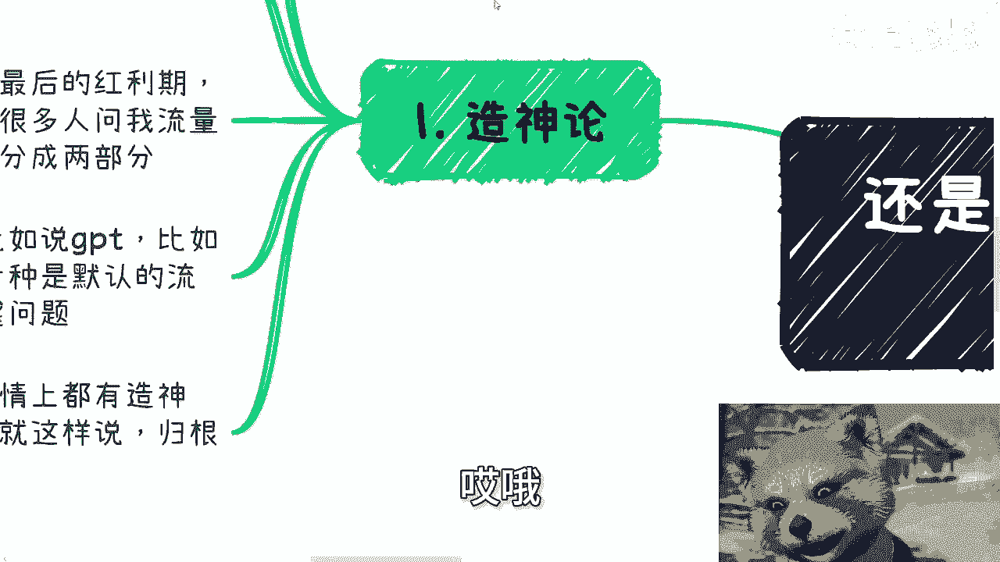
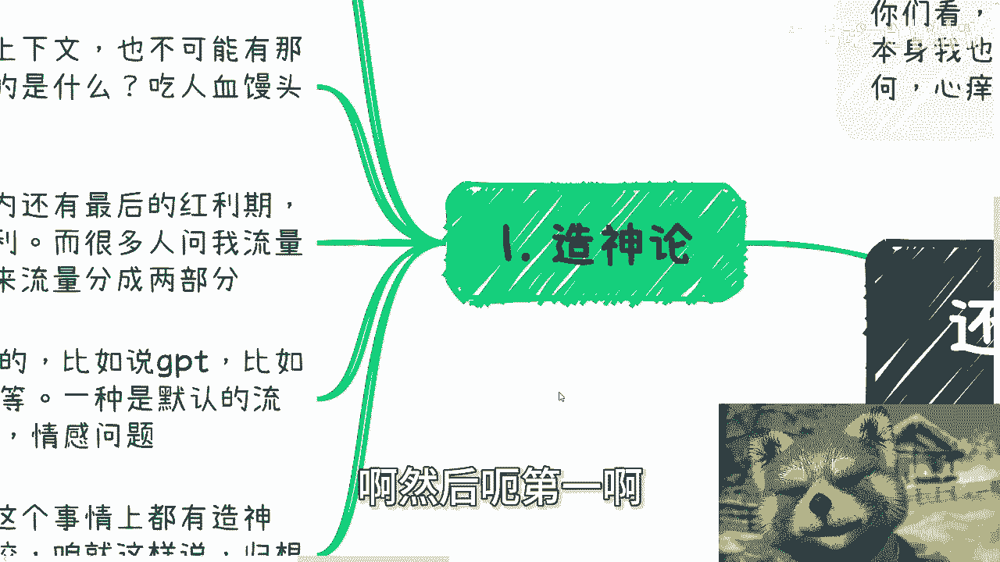
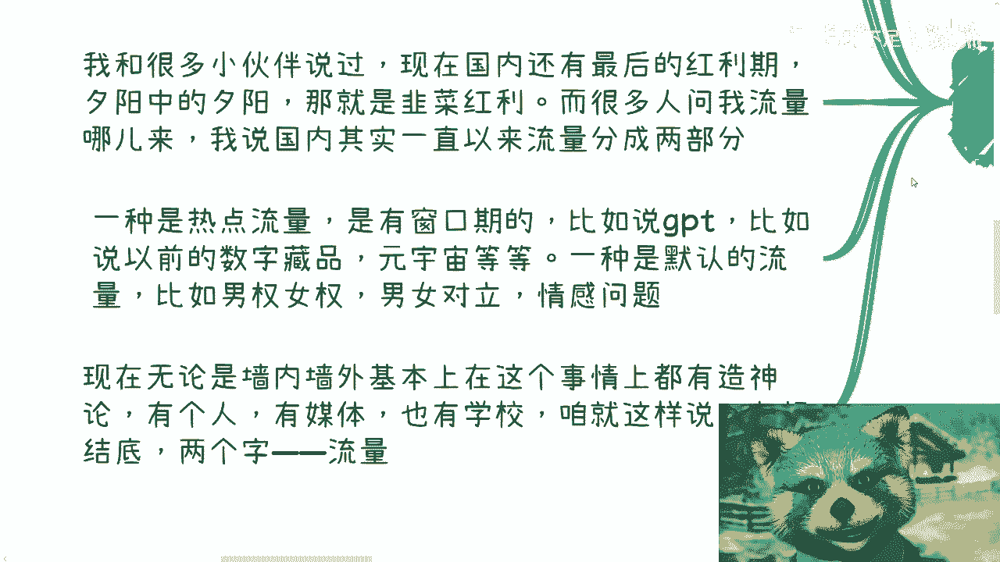
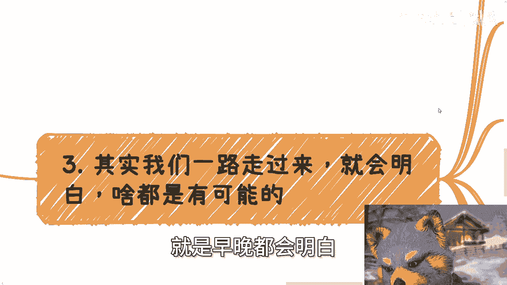
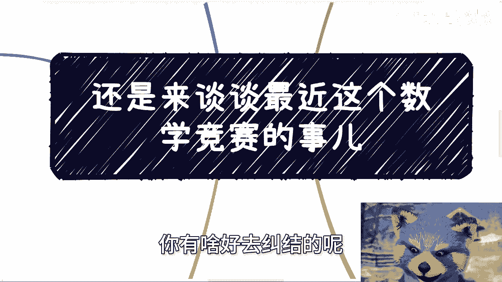
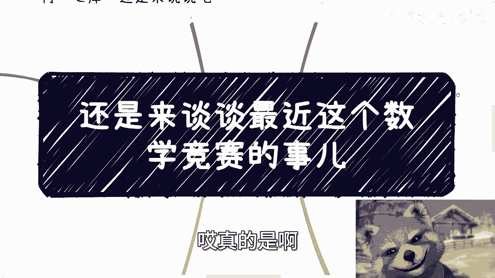

# 想来想去还是聊聊数学竞赛这个事儿吧 - P1 - 赏味不足 - BV1iZ421M77b

啊好啊，大家好啊，呃其实我不是很想讲这个事啊，但是唉耐不住对吧，心痒啊，还是想讲啊，额但是呢你们看啊对吧，名字我也不想提啊，我都不想蹭啊，这事本身我也不想讨论，也没有真相啊，没啥好评论的，呃。

但是奈何呢，我觉得这个我也想跟大家分享分享对吧，我的想法啊，额首先呢深圳活动已经定了好吧，就是下周啊30号下午，然后本次活动呢，完全按照数字经济大会的这个规模去做的，呃，邀请了很多嘉宾。

然后做了很多这个接地气的主题啊，然后这个优惠票的话，差不多就是到下周122223吧，下周二三就关掉了好吧，然后大家反正这个趁便宜的时候，可以多买一点啊，呃然后详情跟报名可以继续私信我啊。

诶哦原来我没写完吗。

这个X码哎无所谓吧，先这么说吧，啊然后呃第一啊我们先来说这个灶神论啊。

呃本来呢我这个主题呢是想写那个叫什么，当时当年在歌坛对吧，还是有光明骑士的，后来想想算了，呃不一定有多少人能明白啊，当年诺兰三部曲里面对吧，蝙蝠侠背锅，让哥谭的光明骑士继续活着啊，咱就说那个上下文啊。

目的是什么，那是因为在那个城市啊，在那个环境，在那个上下文，他是需要信仰的，是需要神啊，是需要就是说希望去支撑下去，但现在这个社会，你说当下这社会再怎么样再怎么样，他自然没有这个上下文啊。

也不可能有那么黑暗的环境，那么造神的目的是什么呢，那目的只有一个啊，为了吃吃人血馒头以及男女对立，那我们再往下讲啊，为了吃人血馒头跟馒男女对立的目的是什么，为了流量啊，那流量最终目的是什么，赚钱啊。

没了啊，那这个核心就这个，我跟很多小伙伴说过，我说现在国内呢还有最后的红利期啊，夕阳中的夕阳，那就是韭菜红利，我我我觉得很多人可能对吧，不不愉快啊，心里不痛快啊，这个陈老师说这个韭菜红利是吧。

那问题是咱就客观这么说嘛，对吧，你你咱别的不说啊，你按照国家来讲啊，按照国，国家批那个那个那个那个公开的数据来讲对吧，包括这个中国的这个人均收入啊，包括就是说中国这个本硕博的比例啊。

包括中国出过国的比例，你们自己去看啊，我就不想讲了，你们自己去看，你说就这种数据拿出来啊，你你你你们自己去看，看完之后你们自己应该就能评价的了对吧，就是中国大部分的这些人，他哪来的分辨能力。

没有分辨能力，对不对，呃，所以说流量才能产生了，如果来说大家啊很多人都有分辨能力，那他妈一眼假的东西，那切那大家还有什么好争的呢，对不对啊，那么呃很多人呢就问我，他说流量哪流流量哪来的吧。

啊我就跟你们讲一种就分两种，一种是热点流量，它是有窗口期的，你比如说AI，比如说GPT，比如说以前的数字藏品元宇宙呃，当年的ARVR，物联网等等等，它都是有双口窗口期的，还有一种是什么呢，就默认的流量。

那默认流量是什么啊，比如说男权女权啦，男女对立了情感问题啦，对不对啊，我以前就跟他们讲过，我说我说你们要是不知道流量在哪，你们就去讲情感，为什么，因为你们讲的对不对，鬼他妈关心啊，你讲的对也好不对也好。

下面的人总归会吵起来，吵起来你就有流量，对不对，我说这这这不就是天然的东西吗，对不对啊，你要做不了，我只能说你的三观不允许你做，以及你的道德观，道德观不允许你做，对不对，那不代表你不能做啊。

有什么门槛呢，没有门槛啊，那么现在无论是墙内还是墙外啊，基本上我觉得在数学竞赛这个事上啊，都有造神论，有个人造神，有媒体造声，也有学校造神啊，你们自己去看，我也不想多讲啊，咱就这么说啊。

归根结底这两个字都是为了流量啊，那么首先我先客观的说一下啊。

我说这事核心里面无非三个角色啊，阿里大厂A对吧，老师成年人B啊，以及当当事人未成年人C是吧啊，那我们就拿代号来讲，当然啊很多人在说自证不自证的时候呢，就是我们说要不要这个剖剖腹对吧，看看去看看几碗粉啊。

我早就我之前在去年的时候，我就说过了，自证这个事情在这个时代是毫无意义的，哎没什么好自证的，你自证出来真和假，没有人关心，因为大家都是来吃瓜的，呵呵有who care呢，对不对啊，但问题来了。

自证他的确不提倡，但是问题是舆论发酵到今天的这一刻啊，我们就说成年人B跟所谓的大厂A，他是有不可避免的责任的，对不对啊，那那否则叫什么大厂，叫什么成年人，你妈滚吧，对不对，你有什么资格在这啊。

无论作为前辈，还是作为这个这个这个所谓的大厂啊，作为这个事的密切的这个关联者，都是有责任跟义务的，至少在我看来是这样的对吧，因为别的咱就不管他什么真跟假，Who care，对不对，不不关心啊。

我们就拿这三个来讲，对不对，你你是是不是这个道理啊，然而呢啊当然啊我们没有必要去细究细节，因为不知道真相，细究了都是阴谋论对吧，你们阴谋论可以看多了，我就不讲了，有啥好讲的呢对吧。

但是有些事实我们不能忽略，比如说啊某大厂A啊，去年就拿着外卖小哥啊，说什么数学竞赛对吧，要参加怎么样怎么样，这个事情呢在网上也是有证据的啊，嗯对吧，也是这个故意拿来营销的啊，这个是有证据的。

那大家可以去看看啊，自己做的营销这事吧，我觉得怪不得别人啊。

至于后面怎么想，各这个公说公有理，婆说婆有理，我就不想去说他了啊。

那么第三其实我们一路走过来呢，就会都会额，就是早晚都会明白。

就什么都是有可能的，你打个比方吧，你说一个成绩，一些照片，几个营销最终受害者是谁呢，对啊你从我们外界来讲根本没法判断，你总不能那这这么来讲吧，就像我们以前碰到很多时候啊，碰到一些事情，比如说人死了对吧。

那有的人上来就说人死为大啊，这句话对不对对，人死为大是什么意思，意思是你不要再去攻击他，你不要再去抹黑他，你不要再去故意的用那个，用这么一个死者的东西来营销，但是你不能说因为这个人死了，所以他是对的。

他没有因果关系，对不对，所以说你不能因为性别是男或者是女，就说她是受害者，你也不能因为说这个人未成年就是受害者，你更不能因为说啊去年阿里在那边作啊，这次做大了被媒体放大了，阿里是受害者，对不对。

你没有这个因果关系，因为这些事情，他都不是一个能够将因果关系成立的，这么一个事情啊，因为很多事情太复杂，你就拿我们以前我给你们举个例子，以前小伙伴的例子啊，年轻的时候谁有任何机会都不想放过我。

这之前有个合作方啊，有个小姑娘啊，他就是不放过任何一个活动啊，任何一个出场的机会，为的是什么，为了提升自己的知名度，为了让自己接到更多的case，对不对，结果呢啊当然啊，我不是说举这个个例啊。

你们但凡到社会上，你们就会知道这种事情比比皆是啊，结果呢某一次活动啊，这个活动方呢把他对外的这个头衔啊，在媒体pr的时候，就在媒体宣发的时候呢，夸的很大，那么你一旦跨的很大，有了传播性之后。

那么好巧不好啊，好巧不巧啊，那么被我合作方的那个老板看到了，投资人看到了对吧好，那最后当然闹得不愉快了啊，那么我那个合作方就离职了好，那么我们就拿这个事来讲啊，你说谁是受害者活，你从活动方角度来讲。

活动方会觉得他妈的你们这帮玻璃心宣传一下，怎么了呢啊你有本事告我啊，我他妈违反老宣传法了，媒体法了还怎么说嘞，对不对，你又不少块肉，我他妈给你们宣传，你们他妈还说我不好啊，你们这帮狗对吧啊好。

那我合作方当事人怎么会觉得呢，他肯定会觉得哎呀，你夸大了，作为一个媒体，你夸他，你也不提前跟我讲啊，你也不跟我打个招呼，就宣传，你明显故意害我对吧，那他自然是最冤枉的那个，但是你敢说他没有一点责任吗。

对吧啊啊，他对外没有一点夸大吗，他去活动本身不就是一种夸大的诉求吗，一种扩大影响力的诉求吗，那说白了你追求影响力的时候没有风险，你很开心，有风险了，怎么滴啊，就说自己冤枉对吧，你你这个逻辑也不成立啊。

啊然后合作方的老板跟投资人他妈就更气了啊，就说我我那个合作方，工作不好好做啊，自己的事他妈不好好做出去，他妈瞎浪啊，还要喧宾夺主啊，你给我滚啊，那他们又觉得他们是受害者对吧，那那问问题就来了。

你你自己你们自己看看，你从事情本身来讲，你你说谁是受害者，对不对，就或者说有没有所谓的单纯的受害者啊，那么第四，那么就像我说的，这个就是个黑镜式的一个社会实验啊，其实我相信大家也看了不少了。

你要吵来吵去，这背后是什么，只有流量，那流量背后是什么，是基的利益者，那当然积的利益者是谁，我们不知道啊，那么这些吵来吵去的人呢，看似都有自己的信仰，但无非都是别人的工具人对吧，那其实就如我之前说的。

如果真的要抵制6996007，那最好的方式就是大家都不要接受，你不就抵制了吗，那自然就很容易解决，但问题在于这种事情不可能发生啊，对这不是我说什么团结不团结的问题。

就是这种属于你说大家清一色站在一条队列啊，然后说都不接受，他不可能就人是不可能这样去统一的，尤其是在这种就是所谓的这个，这个主要核心矛盾，并不是什么太大矛盾的情况下面，你不像以前这个改革开放对吧。

或额也不叫改革开放，就抗日战争对吧，或者说是以前这个长征，你说这个矛盾它主要矛盾非常的明显，那那不一样，那你说现在996007，那那甚至有些人都不是，都不觉得990007是问题，那你让他怎么抵制呢对吧。

那更何况既得利益者会拿钱来诱惑，那当然啊，我不是说我就一定就是好像和事佬对吧，是一个中立态度，只不过我希望就是说大家碰到任何事情，你们都要明白，让子弹飞一会儿啊，也要也要明白。

事情永远不会是表面上这么简单，你不管是你们以后跳槽啊对吧，还是说这个商业上赚钱啊，还是说这个家里面啊等等等啊，就都不是这么简单的啊，一方面呢就是我觉得让子弹飞一会儿的，主要的点是说啊。

你可以让自己冷静下来，你不要就是头脑一发热对吧，一上头啊，3分钟热度就他妈干啊，然后另外一方面呢，事本身飞一会儿之后呢，才会有更多的信仰，而信息让你去判断着急，当下一时半会儿本身没什么太大作用啊。

而且更何况很多事根本就没有结果，或者说根本就没有真实的结果，那就更没有必要去纠结了对吧。

你断舍离就好了嘛，就说白了这事不在我们控制范围当中，你有啥好去纠结的呢。

对吧嗯，你包括有很多人也让我评价这个评价，那个我从来不评价，为什么，因为我的理由很简单啊，评价了我能赚钱吗，我又不能赚钱，我去评价他干什么，你说我要去攻击他吗，我攻击他，我他妈我又不赚钱。

我攻击他干什么对吧，当然了，也不能说我赚钱了就一定攻击他，对吧啊，那那不是就没有理由啊对吧，你在网上吵来吵去干嘛呢，没有意义啊，啊更何况现在大部分人就是怎么说呢，就是这种呃自己没有判断力。

就像我一开始说的，你说这两天私信还有很搞笑的来问我，他说陈老师，我我我想去个国企啊，这个怎么样怎么样，我就问他，我说我说去可以啊，能转正吗啊，能可以的，我就问他，那可以的，可以的。

有合同吗啊有的我只有实习合同，那可以个屁呀，可以呀，我他妈也不明白了哦，怎么滴啊，别人跟你讲，企业跟你讲可以，你就可以呀，哎真的呵，我只想说啊，如果社会如此啊，如就是社会真的像你们想的那样这么可信啊。

各地方都想你们想的那样这么可信，今天经济就不会这么差啊，经济今天大家就不会这么困难，我还是那句话啊，切哎真的是啊。

行吧啊，那就这么着吧，我不评价这个事啊，呃深圳活动好吧，30号下午啊，然后那个我这个免费也不是免费啊，就优惠票没几天了好吧，大家要报名抓紧啊，然后的话那个啊职业规划，商业规划啊，股权期权呃。

分润分红好吧，呃商业计划书白皮书啊，包括你们手上有什么牌，没有什么牌呃，你们希望通过我的视角，通过我的一些这个经济，对于国内的这个经济状况的认知，给你们一些更贴近于呃社会层面。

更接近于地区的一些建议和规划的话，那么你们可以整理好问题和个人的背景好吧，我们再来做咨询啊。