# 课程名称：数学竞赛事件背后的流量逻辑与舆论分析 - P1

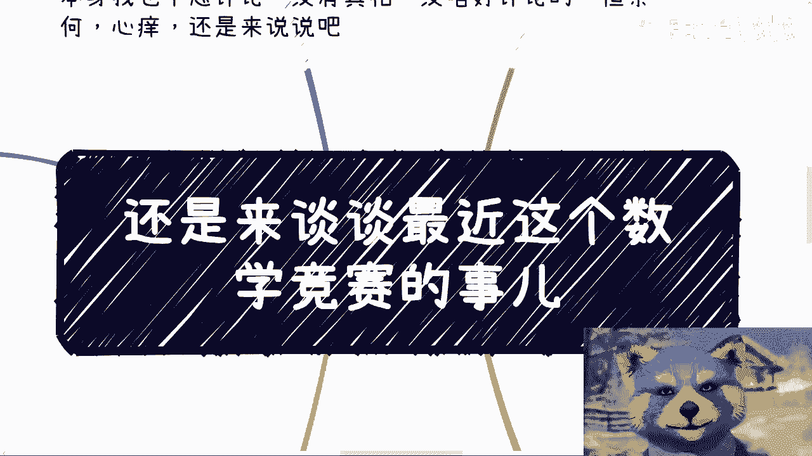

## 概述 📖

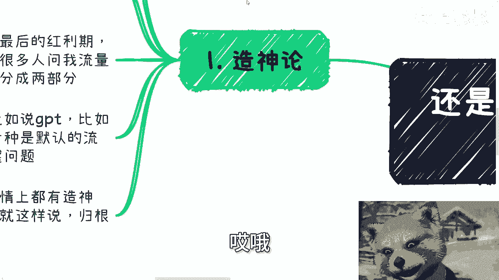

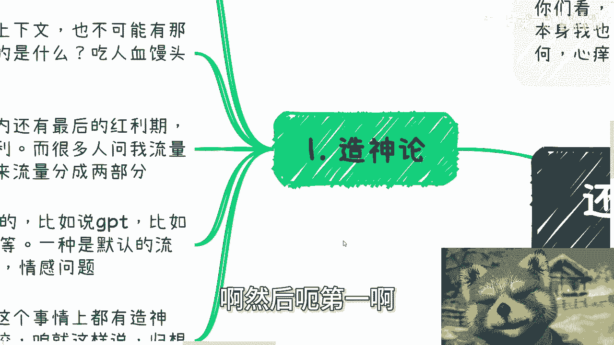

在本节课中，我们将要学习如何分析近期数学竞赛相关舆论事件的本质。我们将抛开事件的具体细节与个人立场，从“造神论”、流量经济、责任归属和社会复杂性等多个维度，剖析此类公共事件背后的核心驱动逻辑与普遍规律。课程旨在帮助初学者建立更理性、更结构化的网络信息分析框架。

***

## 一、 造神论的目的与本质 🏛️

上一节我们概述了课程目标，本节中我们来看看“造神论”这一现象。

“造神”行为的目的并非为了树立信仰或希望。在当前社会环境下，其核心目的只有一个：通过制造对立（如男女对立）和消费热点（吃“人血馒头”）来获取流量。流量的最终目的是变现赚钱。

这个逻辑链条可以总结为以下公式：
**造神 → 制造对立/消费热点 → 获取流量 → 变现赚钱**

国内互联网仍存在“韭菜红利”，即大量用户缺乏信息分辨能力。根据国家公开的人均收入、受教育程度等数据，可以推断大部分网民不具备深度分辨信息真伪的能力。缺乏分辨能力是流量得以滋生的土壤。

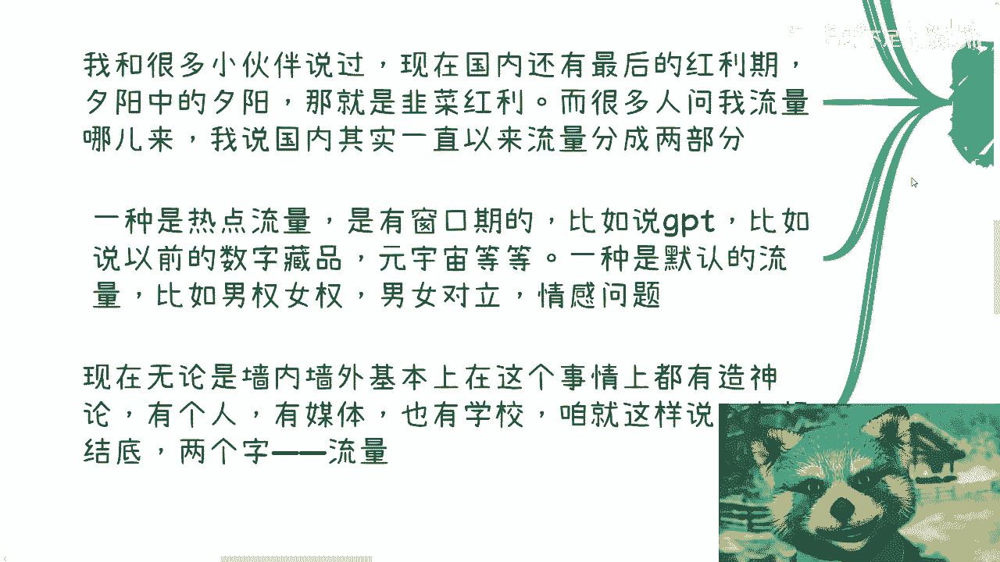

流量主要分为两种：
以下是两种主要流量类型的介绍：
1.  **热点流量**：具有窗口期，如AI、GPT、元宇宙等风口话题。
2.  **默认流量**：永恒存在的社会议题，如情感问题、男女权对立。讨论这些话题极易引发争吵，从而天然地产生流量。

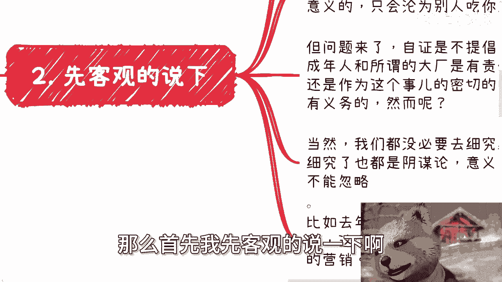

***

## 二、 事件中的角色与责任归属 ⚖️

理解了流量的本质后，我们来看看具体事件中的角色。

我们可以将事件中的核心角色简化为三个代号：
*   **A**：代表大型企业或平台。
*   **B**：代表成年教师或指导者。
*   **C**：代表未成年人当事人。

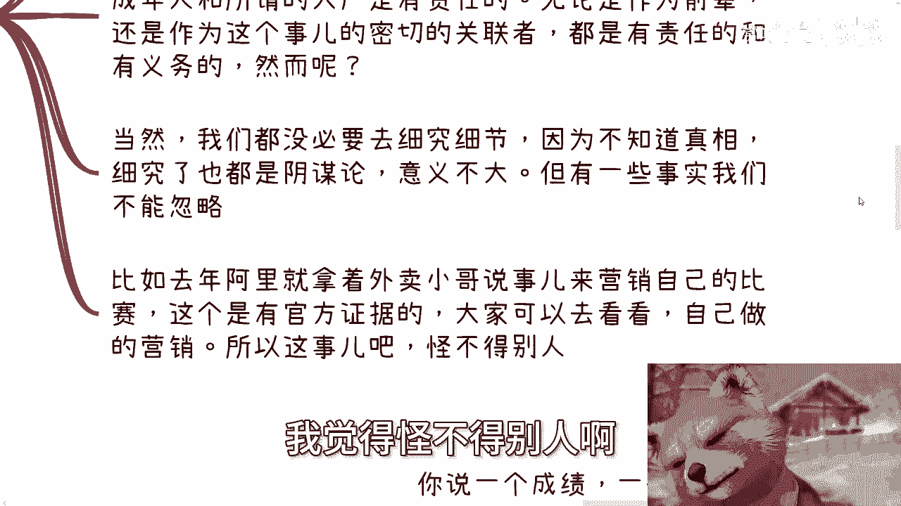

关于“自证”，在这个时代往往没有意义，因为围观者大多只关心话题本身而非真相。然而，当舆论发酵到一定程度时，成年角色**B**和企业**A**负有不可避免的责任。无论真相如何，作为关联方和更有社会资源的个体与组织，他们理应承担起回应和厘清的责任。

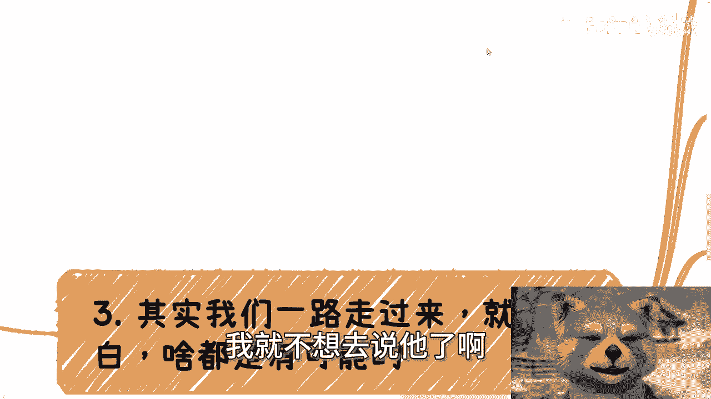

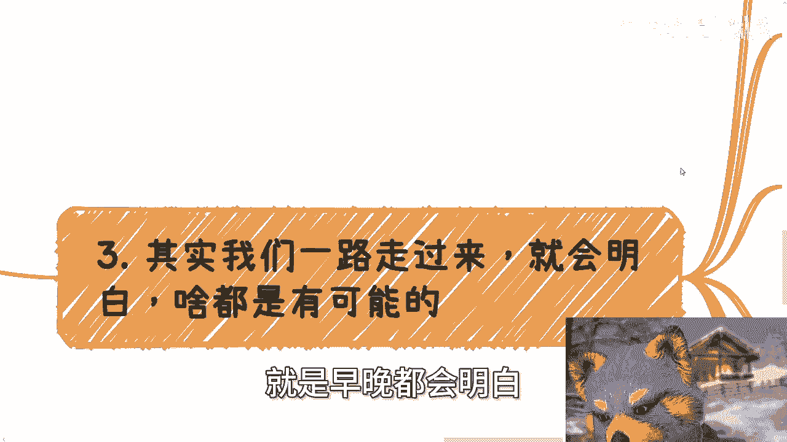

一些不能忽略的事实是，例如企业**A**在过去曾利用类似事件（如“外卖小哥参加数学竞赛”）进行营销。这种将个体事件用于品牌宣传的行为，本身就为后续的舆论风波埋下了伏笔。

***

## 三、 受害者的复杂性与“黑镜”实验 🎭

上一节我们讨论了各方的责任，本节中我们来看看“受害者”身份的复杂性。

在复杂事件中，很难界定单一的、纯粹的“受害者”。许多因果关系并不成立，例如：不能因为当事人未成年或性别就认定其是受害者；也不能因为企业曾有过不当营销，就认定其在当前事件中是受害者。

现实社会中的案例比比皆是。例如，某人为了提升知名度频繁参加活动，主办方在宣传时夸大了其头衔，导致其雇主不满，最终当事人离职。在这个链条中，活动方、当事人、雇主都觉得自己受到了损害，但各方也都有自己的诉求和行为责任。

整个事件就像一个“黑镜”式的社会实验。舆论场中的争吵，背后真正的赢家是流量和其既得利益者。参与争吵的个体，看似在捍卫某种观点，实则可能成为了他人获取流量的“工具人”。

***

## 四、 理性应对：让子弹飞一会儿 🕊️

面对此类纷繁复杂的舆论事件，我们应该如何应对？

核心方法是“让子弹飞一会儿”。这包含两层含义：
1.  **个人层面**：让自己冷静下来，避免被3分钟热度冲昏头脑，做出不理智的判断或行为。
2.  **事件层面**：等待更多信息浮出水面。时间会带来更全面的视角和更丰富的事实依据，有助于做出更准确的判断。

许多事件本身就没有明确的结果或真相。对于超出我们控制范围、且无法通过个人行动改变的事情，最好的态度是“断舍离”——不过度纠结和投入情绪。评价或攻击一个与自己利益无关的事件，通常没有实际意义。

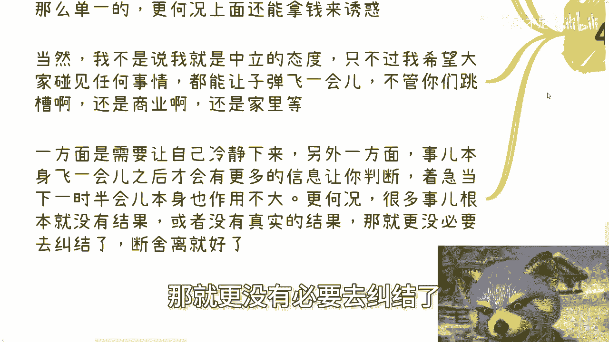

社会运行的复杂性远超表面所见。无论是职场、商业还是家庭事务，其内在逻辑都盘根错节。保持独立思考，对信息保持审慎，是应对信息爆炸时代的基本素养。

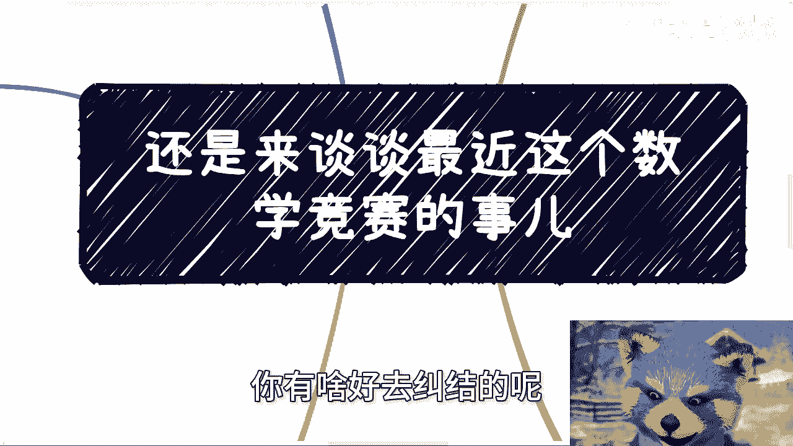

***

## 总结 📝

本节课中我们一起学习了如何解构类似数学竞赛这样的热点舆论事件。
我们分析了“造神”背后的流量变现逻辑，探讨了事件中各角色的责任，认识到“受害者”身份的复杂性，并最终提出了“让子弹飞一会儿”的理性应对策略。
关键在于理解：**舆论场的核心驱动力往往是流量与经济利益，而非简单的对错真相**。培养独立判断能力，在信息洪流中保持冷静与清醒，是更为重要的课题。

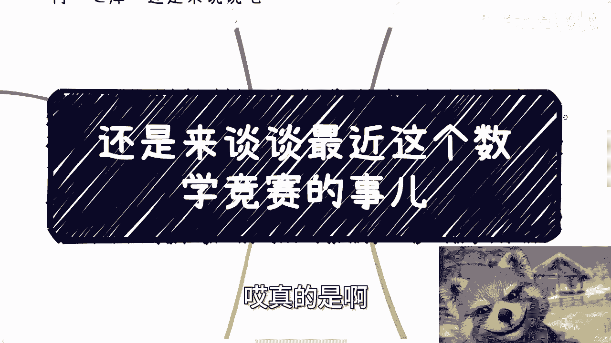

***

> **附：其他信息**
> 深圳线下活动定于本月30号下午举行，活动规模与主题均经过精心设计。优惠购票通道将于下周二左右关闭。
> 如需进行职业规划、商业咨询（涉及股权、商业计划书等），或希望获得基于宏观及区域经济状况的个人发展建议，请整理好个人背景与具体问题后再行预约咨询。