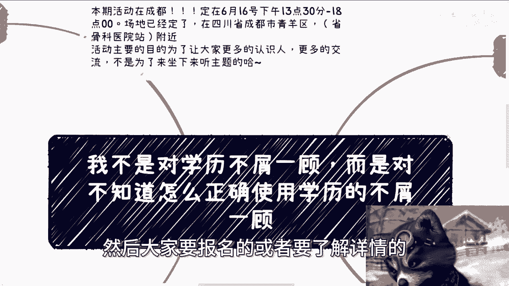
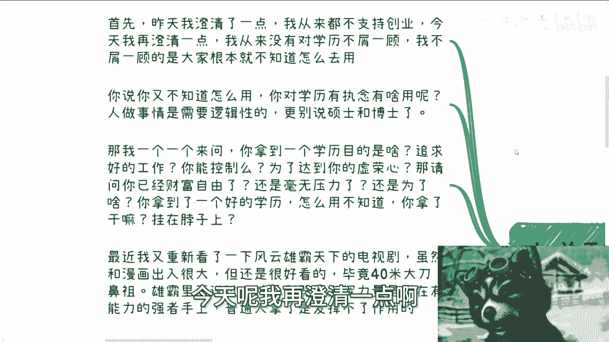
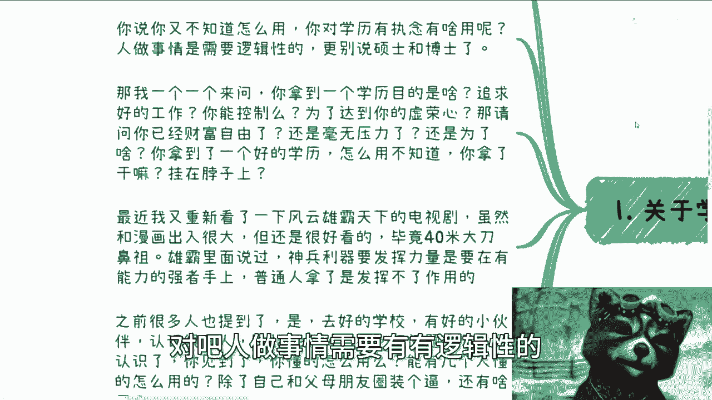
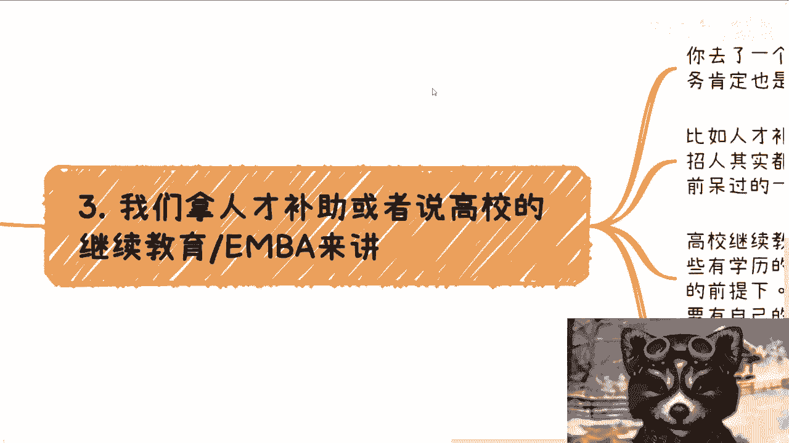
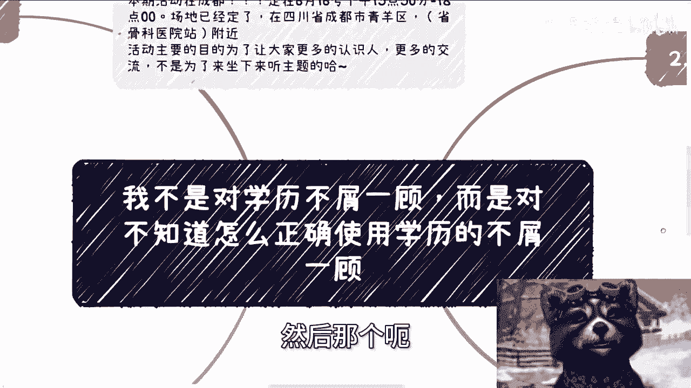

# 课程01：如何正确使用学历，而非仅仅获取它 🎓


在本节课中，我们将探讨一个核心观点：学历本身并非目标，关键在于如何有效地利用它。我们将分析对学历的常见误解，并提供一系列将学历转化为实际价值的实用方法。





上一节我们澄清了关于创业的误解，本节中我们来看看关于学历的另一个关键认知。



## 核心观点：学历是工具，而非装饰


我并非对学历本身不屑一顾，而是对不知道如何正确使用学历的态度不屑一顾。原因很简单：如果你不知道如何使用学历，考取它有何意义？难道只是为了挂在头上“游街”吗？

获取学历需要有明确的目的和逻辑。许多人花费大量时间获得高学历，却不知其用途，这本质上是对自身时间和价值的不尊重。

## 为何“仅获取学历”思路存在问题


以下是几个关键问题，揭示了单纯追求学历而不思考其应用的局限性：


1.  **目的模糊**：许多人获取学历的目的是追求好工作。但好工作与高学历之间并非直接的因果关系，且求职结果往往不可控。
2.  **价值错位**：如果获取学历是为了满足个人或父母的虚荣心，那么需要自问：这帮助你实现财务自由或减轻生活压力了吗？如果没有，其实际价值何在？
3.  **能力脱节**：正如电视剧《风云雄霸天下》中的比喻：神兵利器需在强者手中才能发挥威力。高学历就像利器，若持有者缺乏相应的社会能力（如社交、理解客户需求、项目交付），则无法发挥其真正作用。
    *   **公式**：`学历的实际价值 = 学历本身 × 应用能力`
4.  **路径未知**：许多高学历者对社会多样化的价值实现路径缺乏了解。他们可能只知道“找工作”这一条路，而不知道学历可以用于咨询、站台、资源整合等更广阔的领域。

上一节我们指出了问题所在，本节中我们来看看如何将学历转化为实际优势。

## 正确使用学历的实用方法 💡

学历在特定场景下能成为强大的“增值杠杆”，但前提是使用者具备相应的实践能力。以下是几种有效的应用途径。


### 1. 在专业领域内形成“降维打击”


在商业咨询等行业，博士学历结合商业能力可形成显著优势。
*   **场景**：当与能力相当的非博士竞争者争夺项目时，博士学历通常能带来更高的信任度和报酬。
*   **前提**：必须补齐商业社交、客户需求洞察、项目交付等社会能力短板。
*   **代码逻辑**：
    ```python
    if 具备商业实践能力 == True:
        学历优势 = "显著放大"
        竞争力 = "降维打击"
    else:
        学历优势 = "难以发挥"
        竞争力 = "可能脱节"
    ```



### 2. 利用政策与商业机会“套现”价值

高学历是获取多种现实资源的重要凭证。
*   **人才补贴**：各地政府对高精尖企业招聘高学历人才有补贴政策。你可以利用自己的学历，为自己或引荐他人申请这类补贴。
*   **知识付费与站台**：
    *   **高校兼职**：许多学校招聘兼职讲师，学历是重要筛选条件。
    *   **项目站台**：为创业公司的融资计划书或项目背书，直接获取服务费。研究型、实业型项目尤其需要高学历背景的专家站台。
    *   **出版合作**：以专业背景与出版社或作者合作，参与相关领域书籍的编写，为自己增加出版物背书。

### 3. 构建高价值社交网络

名校环境提供了高质量的社交起点，但关键在于“如何使用”。
*   **有效社交**：不应停留在“认识很多人”的层面，而应思考：这些人是谁？能带来什么资源或合作？如何建立互惠关系？
*   **借力打力**：从大学早期就开始有意识地利用学校平台和校友网络，接触项目、积累经验，将学历作为社交的“信用初始值”。

## 两类高学历者的分化

观察现实，高学历群体往往出现两极分化：
1.  **困惑求职者**：仅聚焦于如何找到一份工作，对未来发展感到迷茫。
2.  **价值开拓者**：很早就开始利用学历和学校资源进行社交、参与项目、整合资源，懂得“借力打力”。

后者才是真正发挥学历价值的人才。


## 总结与行动建议

本节课我们一起学习了学历的正确打开方式。核心在于转变思维：**学历不是终点，而是帮助你撬动更多资源的杠杆**。


**总结要点**：
*   明确获取学历的目的，并将其与提升实际应用能力相结合。
*   主动探索学历在政策补贴、商业合作、知识变现等领域的应用场景。
*   将校园社交网络转化为可持续的资源网络，而非简单的人脉名单。
*   尊重自己的时间和付出，最大化学历带来的增值效果。



**行动建议**：审视你手中的学历，它不应只是简历上的一行字或朋友圈的炫耀。思考如何将它与你独特的技能、兴趣和资源结合，创造出属于自己的、不可替代的价值路径。


---
**附：活动与咨询信息**
*   **成都线下活动**：6月16日 13:30-18:00，青羊区附近。详情请私信咨询。
*   **个人咨询**：提供职业规划、商业规划、合同股权、商业计划书等领域的接地气建议。请整理好个人背景与具体问题后联系。注：咨询旨在提供视角与建议，无法替代个人行动，追求“不劳而获”或“瞬间质变”者请勿扰。