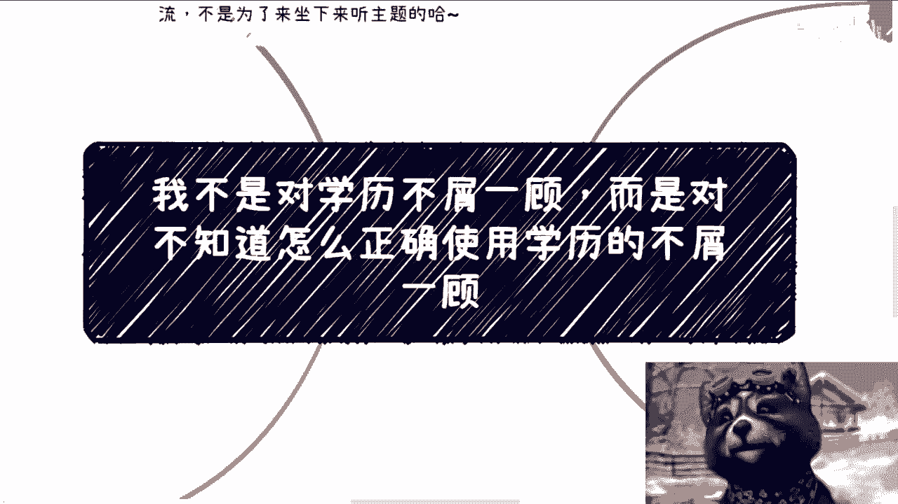
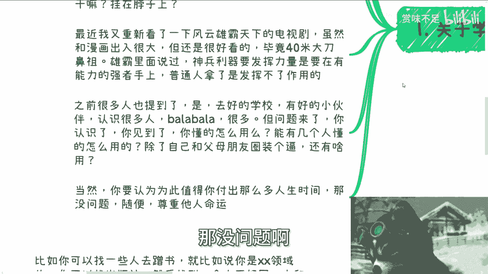
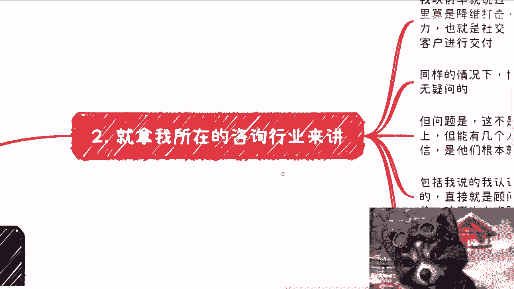
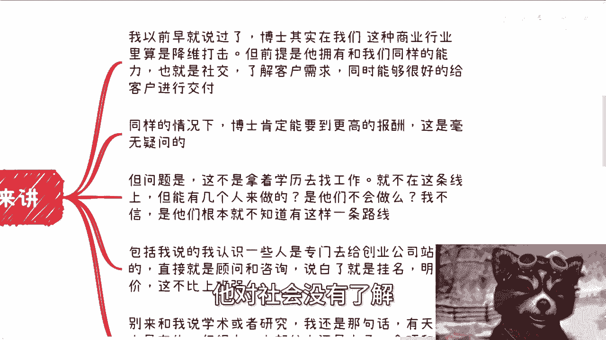
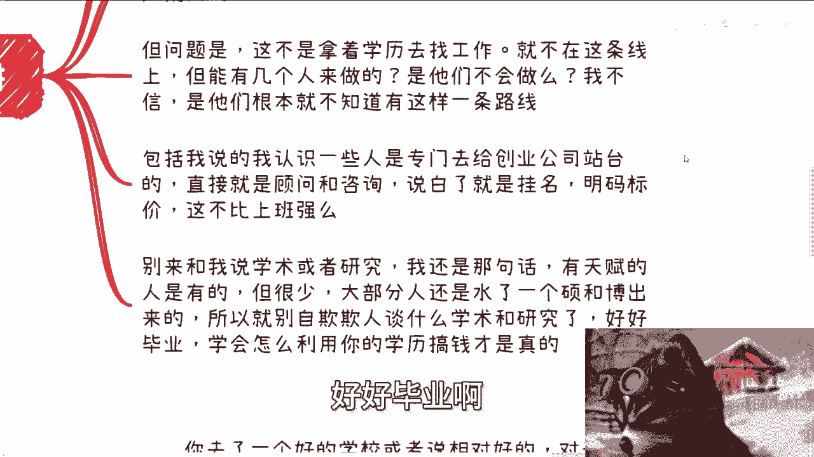

# 我不是对学历不屑一顾，是对不知道怎么正确使用学历的不屑一顾 - P1 - 赏味不足 - BV1Uz421h7YV

好大家好，今天我们来讲的呢就是昨天因为澄清了对吧，昨天我澄清了这个创业的事情啊，今天我们继续来澄清一个东西啊。

就是我呢没有对学历不屑一顾啊，我是对大家不知道怎么正确的使用学历，不屑一顾啊，因为什么呢，因为很简单，你说你不知道这个学历怎么用。

那你考出来干嘛呢，挂头上游街吗，嗯啊然后我顺便先提啊，这个活动定在了本月16号啊，16号下午01：30到六点好吧，在成都啊，在成都在青阳区神谷坑医院附近好吧，然后大家要报名的或者要了解详情的。

你们可以继续私信我啊，首先第一啊关于这个学历的执念啊，首先啊我昨天澄清了一点对吧，我从来都是不支持创业的，今天呢我再澄清一点啊。

就是我刚刚说的啊，我不重复了，你说你又不知道怎么用啊，你对学历执念有啥用呢，我也不明白对吧，你你就基本上我这99。9%，9999的人，他不知道怎么用，你你你干嘛呢对吧，人做事情是要有有逻辑性的。

你更别说硕士跟博士了，那我一个个来问啊，你拿到学历目的是什么，追求好的工作吗，那问题是有因果关系吗，你追求不到呀，你能控制吗，你不能控制呀对吧，那为了达到你的虚荣心吗，还是为了达到你爸妈的虚荣心。

那请问你财务自由了吗，你没有还是毫无毫无压力，那如果你既没有财务自由，也很有压力，那图啥呢啊你你你把你的学历挂你脑门上，你能没有压力啦对吧，就是我我我其实到现在为止我就不明白。

就大家的这个这个逻辑是什么对吧，你拿到一个好的学历。

那不知道怎么用，你拿来干嘛呢，游街啊，那最近我又重新看了一下风云雄霸天下啊，这个电视剧虽然呢跟漫画出入很大啊，但还是很好看的啊，毕竟是40米大刀鼻祖啊，那雄霸在里面有说过啊，他说神兵利器要发挥其力量啊。

需要在有能力的强者手上啊，什么普通人拿了是发挥不了作用的，什么意思呢，意思就是说之前很多人也提到了啊，说是啊去好的学校有好多小伙伴认识很多人，巴拉巴拉巴拉啊，跟我提了一大堆。

去9851去清清华北大的优势没有错，问题来了，我敢打赌说这些话的人，你说友好的小伙伴，我问小伙伴怎么用，认识很多人，认识谁呢，有什么干嘛呢，接下来能给你带来什么呢，对吧，你不要说这种空话呀对吧。

你认识了你见到了你，你你有了这么一个环境，请问你懂得怎么用啊，啊能有几个人懂的对吧，我还是那句话啊，你们有一个高的学历，除了你跟你父母朋友圈装个逼，还能干嘛呢，还能干嘛呢，没了，那当然你要是个人认为啊。

为此付出了这么多人生的时间是值得的，那没问题啊。

随便啊，这个尊重他人命运，你啊你爱咋地咋地啊，那么我们来举个例子啊。

你就拿我所在的咨询行业来讲，我自我以前早就说过了，博士这种学历啊，在我们这种商业行业里面算是降维打击，我客观的说啊，真的降维打击，但是这个降维打击有个前提是什么，就是他得拥有跟我们同样的能力，包括社交。

包括了解客户的需求，包括能够很好的给客客户进行交付，而大部分的本硕博的人，他对社会没有了解。

所以说这块能力他是欠缺的，但是如果他能弥补上来，那么他就是降维打击，同样的情况下面，同样的能力上面，比如说我跟一个博士啊，去去去争一个甲方的case，那肯定要博士啊，不要我啊，我我是我是个垃圾对吧。

那毫无疑问啊，而且博士一定能要到更高的报酬，这点我也可以给你们就是打保票啊，但问题是什么呢，这不是拿着学历去找工作，也就是说就不在这条线上，他就不在工作这条线线上，但能有几个人来做呢。

你你说是因为这些博士不会做吗，我觉得不是的啊，当然他们对他们跟社会可能有一定脱节，但是经过一定时间的磨练，他一定是能够跟我们一样的，但是本质上是大部分的在学校里面人，他他妈压根就不知道有这样一条路。

包括我说的啊，我认识的一些人是专门去给创业公司站台的，直接就是顾问和咨询啊，就就说白了就是挂名嘛，在PPT上面放自己的这个头像啊，明码标价，那我就问嘛，这不比上班强吗对吧，那当然啊我接触下来呢。

那也有一部分这个硕博的人呢，他非常神奇啊，他就迷迷之清高啊，迷之自信，就就觉得呢就是说啊你问他缺钱吗，缺的你问他为什么不赚钱吗，他说我我有我有我有情，我有节操啊，然后呢你问他那要做什么呢。

他一天到晚就跟你说，我要做学术做研究啊，那我也不知道我我我我也不知道大家图啥对吧，大家是财务，就是我不明白，在这种经济环境和这种就是嗯就是就是未来，相对来讲啊，对大家来讲就是抗风险性比较低的情况。

下面竟然还有人不要赚钱啊，然后竟然还是不是财务自由的情况，下面说不要赚钱，我也是比较离谱的啊，那么呃我这边也就说了，别来跟我说什么学术或者研究，我还是那句话，有天赋的人是有的。

但很少大部分人还是水了个硕，或者说水了个博出来的啊，然后呢我觉得你就别自欺欺人，谈什么学术跟研究了，好好毕业啊。

好好毕业，然后学会怎么利用你的学历搞钱才是真的呃，别的有意义不了，有什么意义呢对吧。

包括就是我觉得这些这些硕博出来的人啊，就真的就是就特别的幼稚跟单纯啊，说的好听点叫善良啊，说的不好听点就是幼稚跟单纯，就是那种就是说你跟他谈任何东西啊，他就会跟你讲啊，我这个朋友啊，我这个导师对吧。

怎么样怎么样，我问他，我说那你有任何的依据吗对吧，对对方有任何保障吗，哦我觉得他们都是好人，我觉得这些保障都OK的，哼唉我还是那句话啊，如果来说社会上的人或者地球上的人。

都像你们啊或者那些硕博而认为就是如此的啊，傻白甜的话，那人类不会发展到今天这个样子的啊，那么第三我们再拿人才补助补助。

或者说高校的这种基于教育NBA来讲啊，比如说你去了一个好的学校或者是相对好的啊，那么对于做这种业务呢肯定也是有很大帮助的，比如说人才补助啊，我跟你们讲啊，各地方政府对于一些高精尖的企业。

尤其是创业的招人，其实都是有补贴的啊，本硕博分别有多少，他是有档次的啊，档位的，那之前我至少我之前待过一些城市，都是有的那一样的呀，那如果来说你有个不错的学历，那你完全能够去薅这笔补贴啊，对不对。

你把你同学都薅过来嘛，那薅这笔补贴有有不香吗对吧，你高校继续教育跟ENBA这种，其实相对也是更认一些有学历的人啊，当然我指的是那种就是说上去做嘉宾，做讲师的话对吧，那当然就如我说的。

前提是同等这个能力之下啊，也就是说你没有我，比如说你没有我的这部分能力，你单纯拿出个学历没有用的，没人会认你的啊，你需要有自己的一套解决方案，你需要有自己的一套就是说话术，有自己的一套背书。

跟有自己的一套的这个头衔对吧，你还我我还是要强调一点啊，只不过记住啊，这些学历对你来讲是只不过有帮助，不是说产生什么质变哦，也就是说你有你懂得利用，那就是最好的，你有你不懂得利用，那你就是啊。

我我我就很不客气的就这么说对吧，第四其他用的地方太多了啊，你比如说你可以找一些人去蹭书啊，打个比方，你在某某，你是某某某专业的，你可以找个出版社，然后找让这个出版社呢帮你找一个。

正好在写你这个相关领域的这个书的一个人，然后呢你可以去跟他对接啊，你说你能不能蹭个一张，蹭个两张，那么这样的话呢，你既能够给自己带来一个比较好的，这个出版物的这个背书啊，又能够更好的去利用你这个学历。

跟别人套近乎对吧，你比如说给一些项目的这个项目计融资计划书，去站台，一般站就用我们刚刚说的，一般站台有两种方式，一种就是我这样的啊，用案例用title去站台的，另外一种就直接用学历去赚钱的。

有的呀不是没有呀，很多的呀，对不对，因为你每个项目的切入点不一样，有的项目就是做实业的，有的项目就是做做做这种软件项目的，有的项目就是做做科研研究的都有啊，各种各样的人都要啊对吧，站台就直接给服务费。

简单面料，然后就是各种学校其实都会有兼职老师，你们也可以去了解一下啊，会有跟那种正式老师一样的编号啊，只不过是兼职的，那这种其实也是个不错的差事，因为基本上他一上可能就是两三个月，三四个月啊。

然后比如说一个礼拜上个一天或两天，那么这种学校招募额如果走这种学校的招募啊，其实就很吃学历，就他会让你填个表格，会很吃学历啊，当然我也说过啊，其实对方大部分情况除了学校以外啊，对方也不会去验证。

但是你有没有想过，如果今天你没有对吧，那么你是可以去画个饼去忽悠一下，也无所谓，问题不大啊，但如果你真的有，比如说你也的确花了这么多的时间，付出了这么多的努力，你的确有一个不错的学历。

那难道不应该把这个学历发挥到，最大的增值效果吗，你不应该把他的这个价值最大化吗，对吧，否则干嘛呢，还是我那句话挂挂头上吗。

而去游街吗，对不对，就是我觉得非常离谱的是什么，就是我就这么说，我到现在我觉得我到现在碰到这么多人，有两类人两，比如说两类人都是那种98521，或者说是那种海外比较好的学历的人啊。

这两类人有一个就是两极分化的，一个一个一个一个现象，就一类人呢就是那种就是说我就要找工作啊，我我就纠结这个工作得怎么找对吧，我也不知道接下来怎么发展，还有一类人呢就是那种大一开始。

甚至就是可能大一大二开始，就已经懂得用自己的这个学历，或者用自己的这个学校已经出去开始社交，然后认识各种各样的人对吧，然后开始做各种各样的项目，或者接触各种各样的东西，就他们很懂得去借力打力。

那这种我觉得才是真正的所谓的人才对吧，而不是说就去那边说啊，卧槽我他妈的要去搞个学历啊，我我我要读好书对吧，我我要我要怎么样怎么样，那我就不明白了，你干嘛呢，挂头上对吧，我我我真的，我我觉得有时候啊。

就是你们如果仅仅是卷一个学历，然后去这个找个工作，我觉得甚至你们是对学你们对自己的不尊重，对自己时间跟价值的不尊重，那更别说对学历的不尊重对吧，真的就很是神奇啊。

行吧啊，然后那个呃成都啊。

成都活动6月16号好吧，下午01：30到六点钟好吧，你们要报名的或者咨询的啊，或者说知道详情的，你们可以再私信我，然后职业规划商业规划啊，然后呃合同期权股权啊，商业计划书啊，白皮书啊，分红分润啊。

包括你们手上有什么牌，你们没有什么牌的啊，你们希望通过我的一些视角，能给你们更多的一些这个接地气的建议的话，那么你们也可以整理好，个人的背景跟问题列表啊，然后我们再来做咨询啊，那么同样的我再补充一句。

就是呃但凡啊想通过这个咨询啊，什么产生质变的啊，或者说但凡想通过这个咨询对吧，不劳而获的啊，那么你们就别来找我了。

